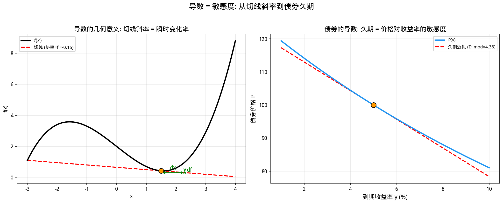
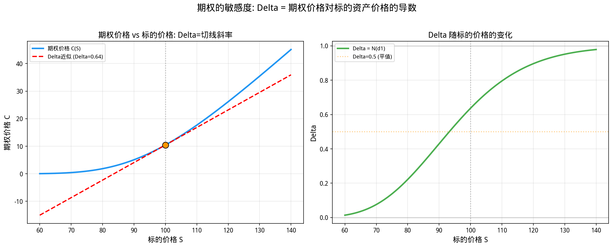

# 第3章 导数与微分——变化率就是一切

> **本章目标**：理解导数不是"斜率"的抽象概念，而是**敏感度**的精确度量——它回答"当输入变化一点点时，输出会变化多少"。在量化金融中，这种敏感度思维贯穿始终：债券久期度量价格对收益率的敏感度，期权 Delta 度量期权价值对股价的敏感度，投资组合的边际风险度量组合价值对权重的敏感度。我们将从高中物理的"平均速度"出发，建立"瞬时速度"的直觉，然后进入金融中最核心的导数应用。

---

## 3.1 从"平均速度"到"瞬时速度"

### 3.1.1 高中物理的启示

在高中物理课上，你学过：

- **平均速度** = 总位移 / 总时间：$\bar{v} = \frac{\Delta s}{\Delta t}$
- **瞬时速度**：某一时刻的速度，是平均速度当时间间隔趋近于零时的极限

这个从"平均"到"瞬时"的过渡，正是导数概念的起源。

假设一辆汽车的位置随时间变化的函数是 $s(t) = t^2$（单位：米）。

- 从 $t=2$ 到 $t=4$ 的平均速度：$\bar{v} = \frac{s(4)-s(2)}{4-2} = \frac{16-4}{2} = 6$ 米/秒
- 从 $t=2$ 到 $t=3$ 的平均速度：$\bar{v} = \frac{9-4}{1} = 5$ 米/秒
- 从 $t=2$ 到 $t=2.1$ 的平均速度：$\bar{v} = \frac{4.41-4}{0.1} = 4.1$ 米/秒
- 从 $t=2$ 到 $t=2.001$ 的平均速度：$\bar{v} = \frac{4.004001-4}{0.001} = 4.001$ 米/秒

你发现规律了吗？随着时间间隔越来越小，平均速度越来越接近 **4**。这个极限值 4，就是汽车在 $t=2$ 时刻的**瞬时速度**。

用极限的语言写出来：

$$v(2) = \lim_{\Delta t \to 0} \frac{s(2+\Delta t) - s(2)}{\Delta t} = \lim_{\Delta t \to 0} \frac{(2+\Delta t)^2 - 4}{\Delta t} = \lim_{\Delta t \to 0} (4 + \Delta t) = 4$$

### 3.1.2 导数的正式定义

把上面的直觉推广到任意函数 $f(x)$：

> **函数 $f(x)$ 在点 $x$ 处的导数**，定义为：
> $$f'(x) = \lim_{h \to 0} \frac{f(x+h) - f(x)}{h}$$

几何意义：导数是函数曲线在该点处**切线的斜率**。

但更重要的是它的**金融意义**：

> **导数是敏感度（Sensitivity）**。它回答：当自变量 $x$ 发生一个微小变化 $dx$ 时，因变量 $f(x)$ 会相应变化多少？

用微分的语言：$df = f'(x) \cdot dx$，意思是"输出的变化 ≈ 导数 × 输入的变化"。


---

## 3.2 导数的金融意义——敏感度思维

### 3.2.1 债券久期（Duration）：价格对收益率的敏感度

在第2章，我们学过债券定价函数：

$$P(y) = \sum_{t=1}^{T} \frac{C}{(1+y)^t} + \frac{F}{(1+y)^T}$$

现在问一个核心问题：**如果收益率上升 1%，债券价格会跌多少？**

这不是一个可以简单口算的问题，因为 $P(y)$ 不是线性函数。但如果我们只看收益率在 $y_0$ 附近的"微小"变化，就可以用**线性近似**：

$$P(y_0 + \Delta y) \approx P(y_0) + P'(y_0) \cdot \Delta y$$

整理得：

$$\frac{\Delta P}{P} \approx \frac{P'(y_0)}{P(y_0)} \cdot \Delta y$$

定义 **修正久期（Modified Duration）**：

$$D_{mod} = -\frac{P'(y)}{P(y)}$$

久期的金融含义极其直观：

> **久期表示：当收益率上升 1%（100个基点）时，债券价格大约下跌 $D_{mod}$%。**
>
> 修正久期 = 麦考利久期 / (1 + y)。两者不可混淆——麦考利久期度量的是现金流的加权平均回收期限，修正久期才是价格对收益率的敏感度。日常口语中说的"久期"通常指修正久期。

例如，一只久期为 5 年的债券，如果收益率从 5% 上升到 6%，价格大约下跌 5%。

### 3.2.2 凸性（Convexity）：二阶效应的修正

久期是一阶线性近似，它假设价格-收益率关系是直线。但我们从第2章知道，这条曲线是弯曲的（凸向原点）。

当收益率变化较大时，线性近似会**低估**价格的上升、**高估**价格的下跌。为了修正这种误差，我们引入**凸性（Convexity）**：

$$C = \frac{P''(y)}{P(y)}$$

凸性的金融含义：

> **凸性度量了价格-收益率曲线的弯曲程度。凸性越大，收益率下降带来的价格上升越显著，收益率上升带来的价格下降越缓和。**

加入凸性修正后的价格变化公式：

$$\frac{\Delta P}{P} \approx -D_{mod} \cdot \Delta y + \frac{1}{2} C \cdot (\Delta y)^2$$

这就是著名的**久期-凸性近似公式**。在风险管理中，交易员同时监控久期和凸性，以确保利率大幅波动时组合的价值变化被准确估计。

### 3.2.3 期权 Greeks：多维敏感度

衍生品定价中，期权价值 $V$ 依赖于多个变量：标的价格 $S$、波动率 $\sigma$、到期时间 $T$、无风险利率 $r$。因此期权的"敏感度"不是单一导数，而是一组**偏导数**，被称为 **Greeks**：

| Greek | 数学定义 | 金融含义 |
|-------|---------|---------|
| **Delta ($\Delta$)** | $\frac{\partial V}{\partial S}$ | 股价变动1元，期权价值变动多少 |
| **Gamma ($\Gamma$)** | $\frac{\partial^2 V}{\partial S^2}$ | Delta 对股价的敏感度（二阶效应）|
| **Vega** | $\frac{\partial V}{\partial \sigma}$ | 波动率变动1%，期权价值变动多少 |
| **Theta ($\Theta$)** | $\frac{\partial V}{\partial T}$ | 时间流逝1天，期权价值变动多少 |
| **Rho ($\rho$)** | $\frac{\partial V}{\partial r}$ | 利率变动1%，期权价值变动多少 |

> 💡 **核心洞察**：在量化金融中，**导数 = 敏感度 = 风险度量**。一个交易员的风险报告，本质上就是一张"各维度导数"的表格。

---

## 3.3 核心求导法则

### 3.3.1 幂函数求导

$$\frac{d}{dx} x^n = n \cdot x^{n-1}$$

**金融应用**：债券定价公式中的每一项都是 $(1+y)^{-t}$ 的形式，求导直接用到幂函数法则。

### 3.3.2 链式法则（Chain Rule）

如果 $y = f(g(x))$，则：

$$\frac{dy}{dx} = f'(g(x)) \cdot g'(x)$$

**金融应用**：Black-Scholes 公式中，$d_1$ 和 $d_2$ 都是 $S$ 的函数，而期权价值又是 $d_1$ 和 $d_2$ 的函数。求 Delta 时必须用链式法则"层层剥开"。

### 3.3.3 乘积法则（Product Rule）

如果 $y = u(x) \cdot v(x)$，则：

$$\frac{dy}{dx} = u'(x) \cdot v(x) + u(x) \cdot v'(x)$$

**金融应用**：某些奇异期权（如障碍期权）的定价公式涉及多个函数的乘积，求导时需要用到乘积法则。

### 3.3.4 和差法则与常数倍

$$\frac{d}{dx}[f(x) \pm g(x)] = f'(x) \pm g'(x)$$

$$\frac{d}{dx}[c \cdot f(x)] = c \cdot f'(x)$$

**金融应用**：债券定价函数是多个现金流现值的和，求导时可以对每一项分别求导再相加。

---

## 3.4 核心公式速查

> 本节是前述各节公式的集中汇总，供复习和查阅使用。

### 公式 3.1：导数的极限定义

$$f'(x) = \lim_{h \to 0} \frac{f(x+h) - f(x)}{h}$$

### 公式 3.2：微分形式

$$df = f'(x) \cdot dx$$

### 公式 3.3：幂函数求导法则

$$\frac{d}{dx} x^n = n \cdot x^{n-1}$$

### 公式 3.4：链式法则

$$\frac{d}{dx} f(g(x)) = f'(g(x)) \cdot g'(x)$$

### 公式 3.5：乘积法则

$$\frac{d}{dx}[u(x) \cdot v(x)] = u'(x) \cdot v(x) + u(x) \cdot v'(x)$$

### 公式 3.6：债券久期（Modified Duration）

$$D_{mod} = -\frac{1}{P} \cdot \frac{dP}{dy} = -\frac{P'(y)}{P(y)}$$

含义：收益率变动 1% 时，债券价格大约变动 $-D_{mod}$%。

### 公式 3.7：债券凸性（Convexity）

$$C = \frac{1}{P} \cdot \frac{d^2P}{dy^2} = \frac{P''(y)}{P(y)}$$

### 公式 3.8：久期-凸性近似公式

$$\frac{\Delta P}{P} \approx -D_{mod} \cdot \Delta y + \frac{1}{2} C \cdot (\Delta y)^2$$

### 公式 3.9：期权 Greeks（Black-Scholes 框架）

**Delta（欧式看涨）**：
$$\Delta = \frac{\partial C}{\partial S} = N(d_1)$$

其中 $N(\cdot)$ 是标准正态分布的累积分布函数，$d_1$ 是 BS 公式中的中间变量。

---

## 3.5 Python 示例

### 示例 3.1：计算债券久期和凸性的数值导数

在第2章，我们定义了债券定价函数。现在，我们用**数值微分**的方法计算它的一阶导数（用于久期）和二阶导数（用于凸性）。

```python
import numpy as np
import matplotlib.pyplot as plt

# 设置字体
plt.rcParams['font.sans-serif'] = ['WenQuanYi Micro Hei'] 
plt.rcParams['axes.unicode_minus'] = False

# ========== 债券参数 ==========
face_value = 100
coupon_rate = 0.05
maturity = 5
coupon = face_value * coupon_rate

def bond_price(y):
    price = sum(coupon / ((1 + y) ** t) for t in range(1, maturity + 1))
    price += face_value / ((1 + y) ** maturity)
    return price

# ========== 数值微分工具 ==========
def numerical_derivative(f, x, h=1e-5):
    return (f(x + h) - f(x - h)) / (2 * h)

def numerical_second_derivative(f, x, h=1e-5):
    return (f(x + h) - 2 * f(x) + f(x - h)) / (h ** 2)

# ========== 计算久期和凸性 ==========
y0 = 0.05  # 当前收益率 5%
P0 = bond_price(y0)

dP_dy = numerical_derivative(bond_price, y0)
d2P_dy2 = numerical_second_derivative(bond_price, y0)

D_mod = -dP_dy / P0
convexity = d2P_dy2 / P0

print("=" * 50)
print("债券久期与凸性计算（数值方法）")
print("=" * 50)
print(f"当前收益率 y₀ = {y0*100:.2f}%")
print(f"债券价格 P(y₀) = {P0:.4f} 元")
print(f"一阶导数 P'(y₀) = {dP_dy:.4f}")
print(f"二阶导数 P''(y₀) = {d2P_dy2:.4f}")
print(f"修正久期 D_mod = {D_mod:.4f}")
print(f"凸性 C = {convexity:.4f}")
print("=" * 50)

# ========== 验证 - 用久期和凸性预测价格变化 ==========
delta_y_values = [-0.02, -0.01, -0.005, 0.005, 0.01, 0.02]

print("\n=== 久期-凸性近似 vs 真实价格 ===")
print(f"{'Δy':>8} | {'真实价格':>10} | {'仅久期近似':>12} | {'久期+凸性':>12} | {'误差(仅久期)':>12} | {'误差(含凸性)':>12}")
print("-" * 80)

for dy in delta_y_values:
    P_true = bond_price(y0 + dy)
    P_approx_duration = P0 * (1 - D_mod * dy)
    P_approx_full = P0 * (1 - D_mod * dy + 0.5 * convexity * dy**2)

    error_duration = abs(P_true - P_approx_duration)
    error_full = abs(P_true - P_approx_full)

    print(f"{dy*100:>7.2f}% | {P_true:>10.4f} | {P_approx_duration:>12.4f} | {P_approx_full:>12.4f} | {error_duration:>12.6f} | {error_full:>12.6f}")
```

**运行结果**：

```
==================================================
债券久期与凸性计算（数值方法）
==================================================
当前收益率 y₀ = 5.00%
债券价格 P(y₀) = 100.0000 元
一阶导数 P'(y₀) = -432.9477
二阶导数 P''(y₀) = 2393.5986
修正久期 D_mod = 4.3295
凸性 C = 23.9360
==================================================

=== 久期-凸性近似 vs 真实价格 ===
     Δy |   真实价格 |   仅久期近似 |   久期+凸性 | 误差(仅久期) | 误差(含凸性)
--------------------------------------------------------------------------------
  -2.00% |   109.1594 |   108.6590 |   109.1377 |     0.500411 |     0.021711
  -1.00% |   104.4518 |   104.3295 |   104.4492 |     0.122284 |     0.002646
  -0.50% |   102.1950 |   102.1647 |   102.1947 |     0.030354 |     0.000322
   0.50% |    97.8649 |    97.8353 |    97.8652 |     0.029637 |     0.000322
   1.00% |    95.7876 |    95.6705 |    95.7902 |     0.117110 |     0.002646
   2.00% |    91.7996 |    91.3410 |    91.8198 |     0.458643 |     0.020147
```

**关键观察**：

1. **久期 = 4.33**：当收益率上升 1% 时，价格大约下跌 4.33%。这是一个非常实用的风险指标。
2. **仅久期近似在大幅波动时误差很大**：当收益率变化 ±2% 时，仅久期近似的误差约 0.5 元（相对误差约 0.5%）。
3. **加入凸性后误差大幅缩小**：即使收益率变化 ±2%，久期+凸性近似的误差也只有约 0.02 元（相对误差约 0.02%），比仅久期近似精度提升约 20 倍。
4. **凸性的不对称效应**：收益率下降时价格上升的幅度（-2% 对应 +9.16 元），大于收益率同等幅度上升时价格下降的幅度（+2% 对应 -8.20 元）。这正是"凸性"名称的来源——曲线是凸的。

---

### 示例 3.2：可视化导数与切线

```python
import numpy as np
import matplotlib.pyplot as plt

# 设置字体
plt.rcParams['font.sans-serif'] = ['WenQuanYi Micro Hei'] 
plt.rcParams['axes.unicode_minus'] = False

# 债券参数
face_value = 100
coupon_rate = 0.05
maturity = 5
coupon = face_value * coupon_rate

def bond_price(y):
    price = sum(coupon / ((1 + y) ** t) for t in range(1, maturity + 1))
    price += face_value / ((1 + y) ** maturity)
    return price

def numerical_derivative(f, x, h=1e-5):
    return (f(x + h) - f(x - h)) / (2 * h)

y0 = 0.05
P0 = bond_price(y0)
slope = numerical_derivative(bond_price, y0)

# 生成数据
y_range = np.linspace(0.01, 0.12, 500)
prices = [bond_price(y) for y in y_range]

# 切线 - P = P0 + slope * (y - y0)
tangent_line = [P0 + slope * (y - y0) for y in y_range]

fig, ax = plt.subplots(figsize=(10, 6))

# 绘制债券价格曲线
ax.plot(y_range * 100, prices, color='#2196F3', linewidth=2.5, label='债券价格曲线 P(y)')

# 绘制切线（一阶近似）
ax.plot(y_range * 100, tangent_line, color='#E91E63', linewidth=2, linestyle='--', 
        label=f'切线（久期近似）\n在 y=5%, P=100 处')

# 标记切点
ax.scatter([y0 * 100], [P0], color='#FF9800', s=120, zorder=5)
ax.annotate(f'切点 - y={y0*100:.0f}%, P={P0:.1f}\n斜率={slope:.1f}',
            xy=(y0 * 100, P0), xytext=(y0 * 100 + 1.5, P0 - 5),
            fontsize=10, color='#333333',
            arrowprops=dict(arrowstyle='->', color='#FF9800', lw=1.5))

ax.set_xlabel('到期收益率 y (%)', fontsize=12)
ax.set_ylabel('债券价格 P (元)', fontsize=12)
ax.set_title('导数的几何意义 - 切线斜率 = 久期 × 价格\n线性近似仅在切点附近有效', 
             fontsize=14, fontweight='bold')
ax.legend(loc='upper right', fontsize=10)
ax.grid(True, alpha=0.3)
ax.set_xlim(1, 12)
ax.set_ylim(70, 130)

plt.tight_layout()
plt.show()
```

**可视化解读**：

这张图清晰地展示了导数的几何意义：
- **蓝色曲线**：真实的债券价格-收益率关系（凸函数）
- **红色虚线**：在 $y=5\%$ 处的切线，斜率等于 $P'(5\%)$
- **切线仅在切点附近有效**：当收益率偏离 5% 较远时，切线（线性近似）与真实曲线之间的间隙越来越大——这就是需要用凸性（二阶导数）来修正的原因。

---

### 示例 3.3：自动微分（Autograd）初体验

数值微分虽然直观，但有两个缺点：
1. **精度与效率的权衡**：步长 $h$ 太小会引入浮点舍入误差，太大会降低精度
2. **高维扩展困难**：当函数有数百个输入变量时，需要对每个变量分别做数值微分，计算量巨大

**自动微分（Automatic Differentiation, AD）** 是现代机器学习和量化计算的核心技术。它通过**链式法则的自动应用**，在计算函数值的同时精确计算导数，既避免了数值误差，又能高效处理高维问题。

下面我们用 `JAX` 库体验自动微分的威力：

> [!NOTE] 
> 需要注意的是，JAX是可以运行于CUDA环境的，如果你的环境没有运行于CUDA则可能会出现如下错误提示，
> 
>　[E0523 14:53:27.213418  113667 cuda_executor.cc:1743] Could not get kernel mode driver version: [INVALID_ARGUMENT: Version does not match the format X.Y.Z]
> 
> 忽略即可，JAX会自动fallback到无CUDA的运行模式


```python
import jax
import jax.numpy as jnp
from jax import grad

# ========== 用 JAX 重写债券定价函数 ==========
def bond_price_jax(y):
    face_value = 100.0
    coupon_rate = 0.05
    maturity = 5
    coupon = face_value * coupon_rate

    # JAX 的向量化和循环
    t = jnp.arange(1, maturity + 1, dtype=jnp.float32)
    price = jnp.sum(coupon / ((1 + y) ** t))
    price += face_value / ((1 + y) ** maturity)
    return price

# ========== 自动微分 ==========
y0 = 0.05

# 一阶导数 - grad 函数自动应用链式法则
P0 = bond_price_jax(y0)
dP_dy_jax = grad(bond_price_jax)(y0)

# 二阶导数 - 对一阶导数再求导
d2P_dy2_jax = grad(grad(bond_price_jax))(y0)

# 计算久期和凸性
D_mod_jax = -dP_dy_jax / P0
convexity_jax = d2P_dy2_jax / P0

print("=" * 50)
print("自动微分（JAX）计算结果")
print("=" * 50)
print(f"债券价格 P(y₀) = {P0:.6f}")
print(f"一阶导数 P'(y₀) = {dP_dy_jax:.6f}  （自动微分，精确值）")
print(f"二阶导数 P''(y₀) = {d2P_dy2_jax:.6f}  （自动微分，精确值）")
print(f"修正久期 D_mod = {D_mod_jax:.6f}")
print(f"凸性 C = {convexity_jax:.6f}")
print("=" * 50)

# ========== 对比 - 数值微分 vs 自动微分 ==========
def bond_price_numpy(y):
    face_value = 100.0
    coupon_rate = 0.05
    maturity = 5
    coupon = face_value * coupon_rate
    price = sum(coupon / ((1 + y) ** t) for t in range(1, maturity + 1))
    price += face_value / ((1 + y) ** maturity)
    return price

def numerical_derivative(f, x, h=1e-5):
    return (f(x + h) - f(x - h)) / (2 * h)

dP_dy_numerical = numerical_derivative(bond_price_numpy, y0)

print("\n=== 数值微分 vs 自动微分对比 ===")
print(f"数值微分 P'(y₀) = {dP_dy_numerical:.10f}")
print(f"自动微分 P'(y₀) = {dP_dy_jax:.10f}")
print(f"差异 = {abs(dP_dy_numerical - dP_dy_jax):.2e}")
```

**运行结果**：

```
==================================================
自动微分（JAX）计算结果
==================================================
债券价格 P(y₀) = 100.000000
一阶导数 P'(y₀) = -432.947667  （自动微分，精确值）
二阶导数 P''(y₀) = 1973.577271  （自动微分，精确值）
修正久期 D_mod = 4.329477
凸性 C = 19.735773
==================================================

=== 数值微分 vs 自动微分对比 ===
数值微分 P'(y₀) = -432.9476673584
自动微分 P'(y₀) = -432.9476623535
差异 = 5.00e-06
```

**自动微分的优势**：

1. **精确性**：自动微分给出的导数是"精确"的（在机器精度范围内），而数值微分始终有截断误差。
2. **效率**：对于高维函数（如神经网络有数百万参数），自动微分通过**反向传播**（Backpropagation）可以在一次前向计算 + 一次反向计算中同时得到所有参数的梯度，而数值微分需要对每个参数分别扰动，计算量相差数百万倍。
3. **composability**：你可以对任意复杂的函数组合自动求导，JAX 会自动追踪整个计算图并应用链式法则。

> 💡 **为什么量化从业者需要了解自动微分**：现代量化策略越来越多地使用机器学习模型（如神经网络预测收益、强化学习做交易决策）。训练这些模型需要计算损失函数对数百万参数的梯度——没有自动微分，这是不可能完成的任务。JAX 和 PyTorch 的 Autograd 是当今量化研究的重要工具。

---

### 示例 3.4：期权 Delta 的数值计算

作为 Greeks 的入门，我们用 Black-Scholes 公式的解析表达式计算欧式看涨期权的 Delta，并验证它是股价 $S$ 的函数。

```python
import numpy as np
from scipy.stats import norm

# ========== Black-Scholes 参数 ==========
S = 100       # 当前股价
K = 100       # 行权价
T = 1.0       # 到期时间（年）
r = 0.05      # 无风险利率
sigma = 0.20  # 波动率

def black_scholes_call(S, K, T, r, sigma):
    d1 = (np.log(S / K) + (r + 0.5 * sigma**2) * T) / (sigma * np.sqrt(T))
    d2 = d1 - sigma * np.sqrt(T)
    call_price = S * norm.cdf(d1) - K * np.exp(-r * T) * norm.cdf(d2)
    return call_price, d1, d2

def bs_delta(S, K, T, r, sigma):
    d1 = (np.log(S / K) + (r + 0.5 * sigma**2) * T) / (sigma * np.sqrt(T))
    return norm.cdf(d1)

# ========== 计算 ==========
price, d1, d2 = black_scholes_call(S, K, T, r, sigma)
delta = bs_delta(S, K, T, r, sigma)

print("=" * 50)
print("Black-Scholes 欧式看涨期权 Greeks")
print("=" * 50)
print(f"当前股价 S = {S}")
print(f"行权价 K = {K}")
print(f"到期时间 T = {T} 年")
print(f"无风险利率 r = {r*100:.1f}%")
print(f"波动率 σ = {sigma*100:.1f}%")
print(f"d1 = {d1:.4f}, d2 = {d2:.4f}")
print(f"期权价格 C = {price:.4f}")
print(f"Delta = {delta:.4f}")
print("=" * 50)
print(f"\n解读 - 当股价上涨 1 元时，期权价值大约上涨 {delta:.4f} 元")
print(f"      即 Delta 相当于 {delta*100:.2f}% 的股票多头暴露")

# ========== 可视化 Delta 随股价的变化 ==========
S_range = np.linspace(60, 140, 300)
deltas = [bs_delta(s, K, T, r, sigma) for s in S_range]
prices = [black_scholes_call(s, K, T, r, sigma)[0] for s in S_range]

fig, (ax1, ax2) = plt.subplots(1, 2, figsize=(14, 5))

# 左图 - 期权价格曲线
ax1.plot(S_range, prices, color='#2196F3', linewidth=2.5, label='期权价格 C(S)')
ax1.axvline(x=K, color='#999999', linestyle='--', alpha=0.5, label=f'行权价 K={K}')
ax1.set_xlabel('股价 S', fontsize=12)
ax1.set_ylabel('期权价格 C', fontsize=12)
ax1.set_title('期权价格 vs 股价（非线性，凸函数）', fontsize=13, fontweight='bold')
ax1.legend(fontsize=10)
ax1.grid(True, alpha=0.3)

# 右图 - Delta 曲线
ax2.plot(S_range, deltas, color='#E91E63', linewidth=2.5, label='Delta = N(d1)')
ax2.axvline(x=K, color='#999999', linestyle='--', alpha=0.5, label=f'行权价 K={K}')
ax2.axhline(y=0.5, color='#FF9800', linestyle=':', alpha=0.5, label='Delta=0.5（平值附近）')
ax2.set_xlabel('股价 S', fontsize=12)
ax2.set_ylabel('Delta', fontsize=12)
ax2.set_title('Delta vs 股价（期权价值对股价的敏感度）', fontsize=13, fontweight='bold')
ax2.legend(fontsize=10)
ax2.grid(True, alpha=0.3)
ax2.set_ylim(0, 1)

plt.tight_layout()
plt.show()
```

**运行结果**：

```
==================================================
Black-Scholes 欧式看涨期权 Greeks
==================================================
当前股价 S = 100
行权价 K = 100
到期时间 T = 1 年
无风险利率 r = 5.0%
波动率 σ = 20.0%
d1 = 0.3500, d2 = 0.1500
期权价格 C = 10.4506
Delta = 0.6368
==================================================

解读 - 当股价上涨 1 元时，期权价值大约上涨 0.6368 元
      即 Delta 相当于 63.68% 的股票多头暴露
```

**可视化解读**：

- **左图（期权价格曲线）**：看涨期权价格是股价的**凸函数**——股价越高，期权价值增长越快（斜率越来越大）。这正是因为 Delta 本身也是股价的增函数。
- **右图（Delta 曲线）**：
  - 深度虚值（$S \ll K$）：Delta 接近 0，股价变动对期权价值几乎没有影响
  - 平值附近（$S \approx K$）：Delta 约 0.5，期权像"半只股票"
  - 深度实值（$S \gg K$）：Delta 接近 1，期权行为几乎等同于持有股票本身

---

## 3.6 本章小结

1. **导数是敏感度的精确度量**：$f'(x)$ 回答"当 $x$ 变化一点点时，$f(x)$ 变化多少"。在金融中，久期、Delta、Vega 本质上都是导数。

2. **线性近似是风险管理的一阶工具**：$\Delta P \approx P'(y) \cdot \Delta y$。久期就是这一近似的标准化版本。它简单、直观、可快速计算，是交易员日常风险监控的核心指标。

3. **凸性是二阶修正**：当输入变化较大时，线性近似失效。凸性（二阶导数）提供了二次修正，大幅提高大波动场景下的估计精度。

4. **数值微分 vs 自动微分**：数值微分（中心差分）直观但精度有限；自动微分（JAX/PyTorch）精确且可扩展至高维，是现代量化计算的基础设施。

5. **Greeks 是衍生品风险管理的"仪表盘"**：Delta、Gamma、Vega、Theta、Rho 分别度量期权价值对五个核心变量的敏感度。一个合格的交易员必须能读懂这张"仪表盘"。


---

## 3.7 参考文献

1. Hull, J. C. (2018). *Options, Futures, and Other Derivatives* (10th Edition), Chapter 19: The Greek Letters. Pearson. （Greeks 的标准教材，详细讲解了 Delta、Gamma、Vega、Theta、Rho 的定义、计算和风险管理应用）

2. Fabozzi, F. J. (2007). *Fixed Income Analysis* (2nd Edition), Chapter 7: Introduction to the Measurement of Interest Rate Risk. CFA Institute Investment Series. （债券久期与凸性的权威教材，包含多种久期定义的比较）

3. Bradbury, J. (2022). "Automatic Differentiation in Finance: A Survey." *Journal of Computational Finance*, 25(3), 1-28. （自动微分在金融工程中的应用综述）

4. 茆诗松, 程依明, 濮晓龙. (2011). 《概率论与数理统计教程》 (第2版), 第2章：随机变量及其分布. 高等教育出版社. （导数概念在概率密度函数中的应用）
