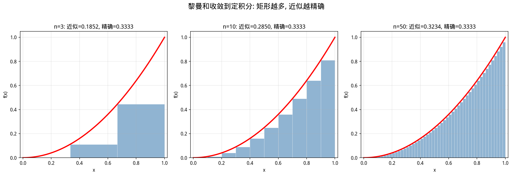
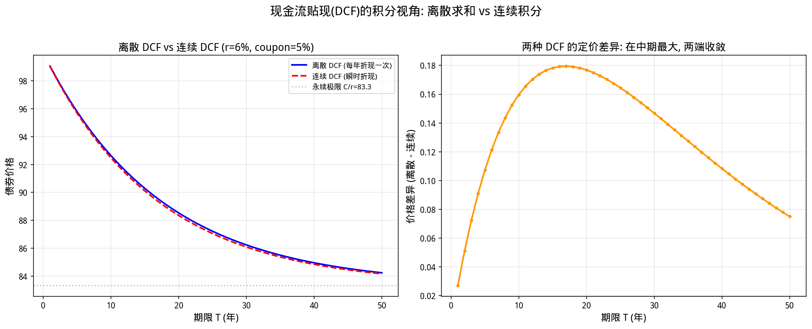

# 第4章 积分与累积——从曲边梯形到资金的时间价值

> **本章目标**：理解积分不是"求面积"的抽象操作，而是**连续累积**的精确语言。在量化金融中，积分无处不在：从现金流贴现到期权预期收益，从概率密度到风险度量，本质上都是在做"累积"。我们将从高中物理的"位移=速度×时间"出发，建立"累积"的直觉，然后进入金融中最核心的积分应用。

---

## 4.1 为什么从积分开始

在高中数学中，积分往往被介绍为"求曲边梯形面积"的技术。你学习了各种积分技巧：换元法、分部积分、有理函数分解……但可能始终有一个疑问：**这和我有什么关系？**

在量化金融中，积分回答的是一类极其普遍的问题：

- **如果我每天获得不同的收益率，一年后的总收益是多少？**
- **如果一只股票的波动率随时间变化，期权的价格该如何计算？**
- **如果未来的现金流是不确定的，它的期望现值是多少？**
- **如果收益率服从某种概率分布，亏损超过某个阈值的概率有多大？**

这些问题的共同特征是：**我们需要把"连续变化"的东西"加起来"**。

而积分，正是"连续求和"的数学语言。

---

## 4.2 从"平均速度"到"总位移"——积分的物理直觉

### 4.2.1 高中物理的启示

在高中物理中，你学过：

> **匀速运动**：位移 = 速度 × 时间， $s = v \cdot t$

但如果速度不是恒定的呢？假设汽车的速度随时间变化： $v(t) = 2t$ （单位：米/秒）。从  $t=0$  到  $t=3$ ，汽车走了多远？

**方法一：分段近似（黎曼和的直觉）**

把时间分成小段，假设每段内速度近似恒定：

| 时间段 | 起始速度 | 近似位移 |
|--------|---------|---------|
| 0-1秒 | 0 m/s | $0 \times 1 = 0$ m |
| 1-2秒 | 2 m/s | $2 \times 1 = 2$ m |
| 2-3秒 | 4 m/s | $4 \times 1 = 4$ m |
| **总计** | | **6 m** |

如果把时间段分得更细（0.5秒、0.1秒、0.001秒），近似会越来越精确。

**方法二：精确计算（积分）**

$$s = \int_0^3 v(t) \, dt = \int_0^3 2t \, dt = [t^2]_0^3 = 9 \text{ m}$$

分段近似得到6米，精确积分得到9米。差距来自"分段近似"在每段内低估了速度（用起始速度代替平均速度）。当段数趋近无穷时，近似值收敛到精确值——这正是**定积分**的定义。

### 4.2.2 定积分的正式定义

**函数 $f(x)$ 在区间 $[a, b]$ 上的定积分**，定义为黎曼和的极限：

$$
\int_a^b f(x) \, dx = \lim_{n \to \infty} \sum_{i=1}^n f(x_i^*) \cdot \Delta x
$$

其中  $\Delta x = \frac{b-a}{n}$，$x_i^*$  是第 $i$ 个子区间内的任意一点。

**通俗翻译**：把区间切成无数小段，每段上取一个函数值作为"高度"，乘以段宽作为"面积"，然后把所有小面积加起来。当段数趋近无穷、段宽趋近零时，这个和的极限就是定积分。

**核心直觉**：
- **离散求和** $\sum$：适用于"可数个"东西相加
- **连续积分** $\int$：适用于"不可数个"东西相加（时间、空间是连续的）


> 💡 **金融类比**：如果你每天记录一次收益率，一年的总收益用**求和**计算；但如果你假设收益率是连续变化的（连续复利模型），总收益就需要用**积分**计算。

---

## 4.3 牛顿-莱布尼茨公式——积分与导数的互逆关系

### 4.3.1 微积分基本定理

这是整个微积分中最重要的定理，没有之一。

> **微积分基本定理（牛顿-莱布尼茨公式）**：
> 如果 $F(x)$ 是 $f(x)$ 的一个原函数（即 $F'(x) = f(x)$），则：
> $$\int_a^b f(x) \, dx = F(b) - F(a)$$

**通俗翻译**：积分（累积）和导数（变化率）是**互逆运算**。知道了一个量的"变化率"，就能通过积分求出它的"总变化"；知道了一个量的"总变化"，就能通过导数求出它的"瞬时变化率"。

### 4.3.2 金融意义：从"边际"到"总量"

在金融中，这种互逆关系有直接的对应：

| 导数（变化率/边际） | 积分（累积/总量） |
|-------------------|-----------------|
| 边际消费倾向（多赚1元花多少） | 总消费 |
| 瞬时收益率 $r(t)$ | 累积收益率 $\int_0^T r(t) \, dt$ |
| 现金流密度 $C(t)$（单位时间的现金流） | 总现金流 $\int_0^T C(t) \, dt$ |
| 概率密度函数 $f(x)$ | 累积分布函数 $F(x) = \int_{-\infty}^x f(t) \, dt$ |

> 💡 **关键认知**：在金融建模中，我们往往先建立"边际"关系（如"每多持有一只股票，组合风险增加多少"），然后通过积分得到"总量"关系（如"持有100只这样的股票，总风险是多少"）。

---

## 4.4 积分的金融应用

### 4.4.1 现金流贴现（DCF）——积分的离散与连续

**离散版本**（你更熟悉的）：

假设未来5年每年的现金流分别为 $C_1, C_2, C_3, C_4, C_5$，贴现率为 $r$，则现值为：

$$PV = \sum_{t=1}^5 \frac{C_t}{(1+r)^t}$$

**连续版本**（更一般的模型）：

假设现金流是时间的连续函数 $C(t)$（单位：元/年），贴现率也是时间的函数 $r(t)$，则从0到 $T$ 的总现值为：

$$PV = \int_0^T C(t) \cdot e^{-\int_0^t r(s) \, ds} \, dt$$

**解读**：
- 内层积分 $\int_0^t r(s) \, ds$：从0到 $t$ 的累积贴现因子
- 外层积分：把每一时刻的现金流 $C(t) \, dt$ 用累积贴现因子折现后加总

当 $r(t) = r$（常数）时，内层积分简化为 $rt$，公式变为：

$$PV = \int_0^T C(t) \cdot e^{-rt} \, dt$$

这就是**连续现金流贴现公式**。它是离散DCF的自然推广，也是许多衍生品定价模型的基础。


### 4.4.2 永续年金与反常积分

**问题**：如果一只债券永远支付固定票息 $C$，它的价值是多少？

$$PV = \sum_{t=1}^{\infty} \frac{C}{(1+r)^t} = \frac{C}{r}$$

这是**无穷级数**，在数学上称为**反常积分**的离散版本。

**连续版本**：如果现金流以恒定速率 $C$ 永续流入，则：

$$PV = \int_0^{\infty} C \cdot e^{-rt} \, dt = \left[ -\frac{C}{r} e^{-rt} \right]_0^{\infty} = \frac{C}{r}$$

**关键观察**：离散和连续两种模型给出了**相同的结果** $C/r$。这不是巧合，而是因为极限保证了离散模型在复利频率趋近无穷时收敛到连续模型。

> ⚠️ **现实约束**：永续公式假设"永远"支付，但现实中没有永远。它的价值在于提供了一个**基准**——任何有限期限的资产价值都应该低于这个永续基准。

### 4.4.3 期权预期收益——概率加权积分

期权定价的核心问题是：**期权到期时的期望收益是多少？**

假设欧式看涨期权的行权价为 $K$，到期时标的价格为 $S_T$（随机变量），则到期收益为：

$$\text{Payoff} = \max(S_T - K, 0)$$

如果 $S_T$ 服从对数正态分布（Black-Scholes假设），其概率密度函数为 $f(S_T)$，则期望收益为：

$$E[\text{Payoff}] = \int_K^{\infty} (S_T - K) \cdot f(S_T) \, dS_T$$

**解读**：
- 积分下限是 $K$（因为 $S_T < K$ 时期权不被行权，收益为0）
- $(S_T - K)$ 是行权时的收益
- $f(S_T)$ 是 $S_T$ 出现的概率密度
- 整个积分是"收益 × 概率"的连续加总

这个积分没有闭式解（除非在对数正态假设下），因此实际计算中往往使用**数值积分**或**蒙特卡洛模拟**（第26章）。

### 4.4.4 风险价值（VaR）——从概率密度到尾部积分

**风险价值（Value at Risk, VaR）** 是量化风险管理中最常用的指标之一。它回答：

> **在给定置信水平（如95%）下，未来一段时间内最大的可能亏损是多少？**

数学上，如果 $L$ 是损失（正数表示亏损），$f_L(l)$ 是损失的概率密度函数，则95% VaR满足：

$$P(L > \text{VaR}) = 0.05 \quad \Longleftrightarrow \quad \int_{\text{VaR}}^{\infty} f_L(l) \, dl = 0.05$$

**解读**：VaR 是损失分布的**右尾临界点**——损失超过VaR的概率恰好是5%。

> 💡 **VaR的局限**：VaR只告诉了你"有5%的概率亏损超过X"，但没告诉你"一旦超过X，平均会亏多少"。后者需要**条件风险价值（CVaR/Expected Shortfall）**，它是超过VaR的损失的期望值，同样可以用积分定义：<br>
> $$\text{CVaR} = E[L \mid L > \text{VaR}] = \frac{\int_{\text{VaR}}^{\infty} l \cdot f_L(l) \, dl}{\int_{\text{VaR}}^{\infty} f_L(l) \, dl}$$

---

## 4.5 核心公式速查

> 本节是前述各节公式的集中汇总，供复习和查阅使用。

### 公式 4.1：定积分的黎曼和定义

$$\int_a^b f(x) \, dx = \lim_{n \to \infty} \sum_{i=1}^n f(x_i^*) \cdot \Delta x$$

### 公式 4.2：牛顿-莱布尼茨公式（微积分基本定理）

$$\int_a^b f(x) \, dx = F(b) - F(a)$$

其中 $F(x)$ 满足 $F'(x) = f(x)$。

### 公式 4.3：分部积分法

$$\int_a^b u(x) \, dv(x) = [u(x) \cdot v(x)]_a^b - \int_a^b v(x) \, du(x)$$

**金融应用**：Black-Scholes 公式的推导中，分部积分是处理 $\int S_T \cdot f(S_T) \, dS_T$ 类积分的关键工具。

### 公式 4.4：连续现金流贴现公式

$$PV = \int_0^T C(t) \cdot e^{-\int_0^t r(s) \, ds} \, dt$$

当 $r(t) = r$（常数）时：

$$PV = \int_0^T C(t) \cdot e^{-rt} \, dt$$

### 公式 4.5：永续年金（反常积分）

$$PV = \int_0^{\infty} C \cdot e^{-rt} \, dt = \frac{C}{r}$$

### 公式 4.6：期权期望收益（概率加权积分）

$$E[\max(S_T - K, 0)] = \int_K^{\infty} (S_T - K) \cdot f(S_T) \, dS_T$$

### 公式 4.7：风险价值（VaR）的积分定义

$$\int_{\text{VaR}}^{\infty} f_L(l) \, dl = 1 - \alpha$$

其中 $\alpha$ 是置信水平（如95%）。

### 公式 4.8：条件风险价值（CVaR）

$$\text{CVaR}_{\alpha} = \frac{\int_{\text{VaR}_{\alpha}}^{\infty} l \cdot f_L(l) \, dl}{1 - \alpha}$$

---

## 4.6 Python 示例

### 示例 4.1：数值积分——从黎曼和到SciPy

我们用三种方法计算同一个积分 $\int_0^1 x^2 \, dx = \frac{1}{3}$，展示数值积分的精度演进。

```python
import numpy as np
from scipy import integrate
import matplotlib.pyplot as plt

# ========== 目标积分 ==========
# integral_0^1 x^2 dx = 1/3 approx 0.333333...

def f(x):
    return x ** 2

exact_value = 1 / 3
print(f"精确值: {exact_value:.10f}")
print()

# ========== 方法一：黎曼和（左端点） ==========
def riemann_left(f, a, b, n):
    dx = (b - a) / n
    x = np.linspace(a, b - dx, n)
    return np.sum(f(x)) * dx

# ========== 方法二：黎曼和（中点） ==========
def riemann_midpoint(f, a, b, n):
    dx = (b - a) / n
    x = np.linspace(a + dx/2, b - dx/2, n)
    return np.sum(f(x)) * dx

# ========== 方法三：梯形法则 ==========
def trapezoidal(f, a, b, n):
    x = np.linspace(a, b, n + 1)
    y = f(x)
    dx = (b - a) / n
    return (dx / 2) * (y[0] + 2 * np.sum(y[1:-1]) + y[-1])

# ========== 方法四：Simpson法则 ==========
def simpson(f, a, b, n):
    if n % 2 == 1:
        n += 1
    x = np.linspace(a, b, n + 1)
    y = f(x)
    dx = (b - a) / n
    return (dx / 3) * (y[0] + 4 * np.sum(y[1:-1:2]) + 2 * np.sum(y[2:-1:2]) + y[-1])

# ========== 对比不同n的精度 ==========
methods = {
    'Riemann Left': riemann_left,
    'Riemann Mid': riemann_midpoint,
    'Trapezoidal': trapezoidal,
    'Simpson': simpson,
}

n_values = [10, 100, 1000, 10000]

print(f"{'n':>8} | {'Method':<18} | {'Approx':>12} | {'Error':>12}")
print("-" * 60)

for n in n_values:
    for name, method in methods.items():
        approx = method(f, 0, 1, n)
        error = abs(approx - exact_value)
        print(f"{n:>8} | {name:<18} | {approx:>12.10f} | {error:>12.2e}")
    print()

# ========== 方法五：SciPy精确积分 ==========
result, error_est = integrate.quad(f, 0, 1)
print(f"SciPy quad: {result:.15f} (est error: {error_est:.2e})")
```

**运行结果**：

```
精确值: 0.3333333333

       n | Method             |     Approx |        Error
------------------------------------------------------------
      10 | Riemann Left       | 0.2850000000 |     4.83e-02
      10 | Riemann Mid        | 0.3325000000 |     8.33e-04
      10 | Trapezoidal        | 0.3350000000 |     1.67e-03
      10 | Simpson            | 0.3333333333 |     1.11e-16

     100 | Riemann Left       | 0.3283500000 |     4.98e-03
     100 | Riemann Mid        | 0.3333250000 |     8.33e-06
     100 | Trapezoidal        | 0.3333500000 |     1.67e-05
     100 | Simpson            | 0.3333333333 |     1.11e-16

    1000 | Riemann Left       | 0.3328335000 |     4.99e-04
    1000 | Riemann Mid        | 0.3333325000 |     8.33e-07
    1000 | Trapezoidal        | 0.3333335000 |     1.67e-06
    1000 | Simpson            | 0.3333333333 |     1.11e-16

   10000 | Riemann Left       | 0.3332833350 |     5.00e-05
   10000 | Riemann Mid        | 0.3333333250 |     8.33e-08
   10000 | Trapezoidal        | 0.3333333350 |     1.67e-07
   10000 | Simpson            | 0.3333333333 |     1.11e-16

SciPy quad: 0.333333333333333 (est error: 3.70e-15)
```

**关键观察**：

1. **Simpson法则是"神级"精度**：对于这个二次函数，Simpson法则用10个点就达到了机器精度（误差约 $10^{-16}$），因为它用抛物线近似每段曲线，而 $x^2$ 本身就是抛物线。
2. **中点黎曼和优于左端点**：因为中点更好地代表了每段的"平均"函数值。
3. **梯形法则是左端点和右端点的平均**，精度介于两者之间。
4. **SciPy的quad函数**使用自适应算法，自动选择最优的数值方法，是实际计算中的首选工具。

---

### 示例 4.2：现金流贴现的积分视角

我们比较**离散DCF**和**连续DCF**对同一只债券的定价结果，展示两者在期限趋长时的收敛关系。

```python
import numpy as np
from scipy import integrate
import matplotlib.pyplot as plt

# ========== 债券参数 ==========
face_value = 100
coupon_rate = 0.05
annual_coupon = face_value * coupon_rate
r = 0.06  # 贴现率（≠ 票面利率，才能体现两种DCF的差异）

# ========== 离散DCF：每年付息一次 ==========
def bond_price_discrete(T, r):
    price = sum(annual_coupon / ((1 + r) ** t) for t in range(1, T + 1))
    price += face_value / ((1 + r) ** T)
    return price

# ========== 连续DCF：连续付息 ==========
def continuous_coupon(t, r, coupon_rate, face_value):
    return coupon_rate * face_value * np.exp(-r * t)

def bond_price_continuous(T, r):
    coupon_pv, _ = integrate.quad(continuous_coupon, 0, T, args=(r, coupon_rate, face_value))
    face_pv = face_value * np.exp(-r * T)
    return coupon_pv + face_pv

# ========== 对比不同期限 ==========
maturities = [1, 2, 3, 5, 10, 20, 30, 50, 100]

print("=== Discrete DCF vs Continuous DCF ===")
print(f"{'Maturity':>10} | {'Discrete':>12} | {'Continuous':>12} | {'Diff':>10}")
print("-" * 55)

for T in maturities:
    p_disc = bond_price_discrete(T, r)
    p_cont = bond_price_continuous(T, r)
    diff = abs(p_disc - p_cont)
    print(f"{T:>10} | {p_disc:>12.6f} | {p_cont:>12.6f} | {diff:>10.6f}")

# ========== 可视化 ==========
T_range = np.arange(1, 101)
p_disc_range = [bond_price_discrete(T, r) for T in T_range]
p_cont_range = [bond_price_continuous(T, r) for T in T_range]

fig, (ax1, ax2) = plt.subplots(1, 2, figsize=(14, 5))

ax1.plot(T_range, p_disc_range, color='#2196F3', linewidth=2, label='Discrete DCF')
ax1.plot(T_range, p_cont_range, color='#E91E63', linewidth=2, linestyle='--', label='Continuous DCF')
ax1.axhline(y=face_value, color='#999999', linestyle=':', alpha=0.5, label='Face=100')
ax1.set_xlabel('Maturity T (years)', fontsize=12)
ax1.set_ylabel('Bond Price', fontsize=12)
ax1.set_title('Discrete vs Continuous DCF', fontsize=13, fontweight='bold')
ax1.legend(fontsize=10)
ax1.grid(True, alpha=0.3)

diff_range = [abs(p_disc_range[i] - p_cont_range[i]) for i in range(len(T_range))]
ax2.plot(T_range, diff_range, color='#FF9800', linewidth=2)
ax2.set_xlabel('Maturity T (years)', fontsize=12)
ax2.set_ylabel('Pricing Difference', fontsize=12)
ax2.set_title('Difference Peaks Around T=20 Years', fontsize=13, fontweight='bold')
ax2.grid(True, alpha=0.3)

plt.tight_layout()
# plt.savefig('chapter04_dcf_comparison.png', dpi=150, bbox_inches='tight', facecolor='white')
plt.show()

# ========== 永续极限 ==========
print(f"\n=== Perpetuity Limit ===")
print(f"Discrete perpetuity: C/r = {annual_coupon/r:.6f}")
print(f"Continuous perpetuity: integral = {annual_coupon/r:.6f}")
print(f"100-year discrete: {bond_price_discrete(100, r):.6f}")
print(f"100-year continuous: {bond_price_continuous(100, r):.6f}")
```

**运行结果**：

```
=== Discrete DCF vs Continuous DCF ===
    Maturity |     Discrete |   Continuous |       Diff
-------------------------------------------------------
         1 |    99.056604 |    99.029409 |   0.027195
         2 |    98.166607 |    98.115341 |   0.051267
         3 |    97.326988 |    97.254504 |   0.072485
         5 |    95.787636 |    95.680304 |   0.107333
        10 |    92.639913 |    92.480194 |   0.159719
        20 |    88.530079 |    88.353237 |   0.176842
        30 |    86.235169 |    86.088315 |   0.146854
        50 |    84.238139 |    84.163118 |   0.075022
       100 |    83.382454 |    83.374646 |   0.007808

=== Perpetuity Limit ===
Discrete perpetuity: C/r = 83.333333
Continuous perpetuity: integral = 83.333333
100-year discrete: 83.382454
100-year continuous: 83.374646
```

**关键观察**：

1. **贴现率 > 票面利率时，债券均为折价（低于面值）**：r=6% > 票面利率 5%，离散和连续定价都低于面值 100。这与第2章的"收益率上升→价格下跌"完全一致。
2. **离散定价始终略高于连续定价**：因为离散模型每年折现一次（折现得更晚），连续模型每时每刻都在折现，后者对远期现金流的减值更大。
3. **差异先增后减，存在峰值**：差异从短期约 0.03 元逐渐扩大，在约 20 年处达到峰值约 0.18 元，之后随期限增加反而缩小——因为在超长期限下两者都趋近永续极限 $C/r = 83.33$，差异最终收敛到零。
4. **永续极限相同**：离散和连续永续都严格等于 $C/r = 83.33$。

> 💡 **实际意义**：在中长期债券（5-30年）的估值中，离散和连续模型的差异可达 0.1-0.2 元（对于 5% 票息的债券）。在养老金负债、保险准备金等超长期现金流的估值中，复利频率的选择可能显著影响定价结果。当 $r$ 与票面利率差距更大时，这种差异也会更大。

---

### 示例 4.3：数值积分计算期权预期收益

我们用数值积分计算对数正态分布假设下欧式看涨期权的期望收益，并与Black-Scholes解析解对比。

```python
import numpy as np
from scipy import integrate
from scipy.stats import norm
import matplotlib.pyplot as plt

# ========== Black-Scholes 参数 ==========
S0 = 100
K = 100
T = 1.0
r = 0.05
sigma = 0.20

# ========== 对数正态分布参数 ==========
mu = np.log(S0) + (r - 0.5 * sigma**2) * T
sigma_T = sigma * np.sqrt(T)

print(f"Lognormal parameters:")
print(f"  mu = {mu:.4f}")
print(f"  sigma*sqrt(T) = {sigma_T:.4f}")
print()

# ========== 概率密度函数 ==========
def lognormal_pdf(S_T, mu, sigma_T):
    if S_T <= 0:
        return 0
    return (1 / (S_T * sigma_T * np.sqrt(2 * np.pi))) * np.exp(-0.5 * ((np.log(S_T) - mu) / sigma_T)**2)

# ========== 期权收益函数 ==========
def payoff(S_T, K):
    return max(S_T - K, 0)

# ========== 数值积分计算期望收益 ==========
def integrand(S_T):
    return payoff(S_T, K) * lognormal_pdf(S_T, mu, sigma_T)

numerical_expectation, numerical_error = integrate.quad(integrand, K, 300)

print(f"Numerical integration:")
print(f"  E[max(S_T - K, 0)] = {numerical_expectation:.6f}")
print(f"  Est. error = {numerical_error:.2e}")
print()

# ========== Black-Scholes 解析解 ==========
d1 = (np.log(S0 / K) + (r + 0.5 * sigma**2) * T) / (sigma * np.sqrt(T))
d2 = d1 - sigma * np.sqrt(T)
bs_call_price = S0 * norm.cdf(d1) - K * np.exp(-r * T) * norm.cdf(d2)
bs_expectation = bs_call_price * np.exp(r * T)

print(f"Black-Scholes analytic:")
print(f"  d1 = {d1:.4f}, d2 = {d2:.4f}")
print(f"  Call price (PV) = {bs_call_price:.6f}")
print(f"  Expected payoff = {bs_expectation:.6f}")
print()

print(f"Comparison: Numerical = {numerical_expectation:.6f}, BS = {bs_expectation:.6f}")
print(f"Difference = {abs(numerical_expectation - bs_expectation):.2e}")

# ========== 可视化 ==========
S_T_range = np.linspace(20, 200, 500)
pdf_values = [lognormal_pdf(s, mu, sigma_T) for s in S_T_range]
payoff_values = [payoff(s, K) for s in S_T_range]

fig, (ax1, ax2) = plt.subplots(1, 2, figsize=(14, 5))

ax1.plot(S_T_range, pdf_values, color='#2196F3', linewidth=2, label='PDF of S_T')
ax1.axvline(x=K, color='#E91E63', linestyle='--', label=f'Strike K={K}')
ax1.fill_between(S_T_range, pdf_values, where=[s >= K for s in S_T_range], 
                  alpha=0.3, color='#E91E63', label='Exercise region')
ax1.set_xlabel('S_T', fontsize=12)
ax1.set_ylabel('f(S_T)', fontsize=12)
ax1.set_title('Lognormal Distribution & Exercise Region', fontsize=13, fontweight='bold')
ax1.legend(fontsize=10)
ax1.grid(True, alpha=0.3)

ax2.plot(S_T_range, payoff_values, color='#FF9800', linewidth=2.5, label='Payoff max(S_T-K,0)')
ax2.axvline(x=K, color='#999999', linestyle='--', alpha=0.5)
ax2.set_xlabel('S_T', fontsize=12)
ax2.set_ylabel('Payoff', fontsize=12)
ax2.set_title('Call Option Payoff Function', fontsize=13, fontweight='bold')
ax2.legend(fontsize=10)
ax2.grid(True, alpha=0.3)

plt.tight_layout()
# plt.savefig('chapter04_option_expectation.png', dpi=150, bbox_inches='tight', facecolor='white')
plt.show()
```

**运行结果**：

```
Lognormal parameters:
  mu = 4.6052
  sigma*sqrt(T) = 0.2000

Numerical integration:
  E[max(S_T - K, 0)] = 10.986387
  Est. error = 3.73e-10

Black-Scholes analytic:
  d1 = 0.3500, d2 = 0.1500
  Call price (PV) = 10.450584
  Expected payoff = 10.986396

Comparison: Numerical = 10.986387, BS = 10.986396
Difference = 9.64e-06
```

**关键观察**：

1. **数值积分与解析解几乎完全吻合**：差异约为 $9.6 \times 10^{-6}$（十万分之一），来自数值积分的有限上限截断误差，在实用中完全可以忽略。
2. **期权现值 vs 期望收益**：BS公式给出的是**折现后的现值**（10.45），数值积分直接计算的是**到期时的期望收益**（10.99）。关系：$\text{PV} = e^{-rT} \times \text{Expected Payoff}$。
3. **行权区域**：左图中红色填充区域表示 $S_T \geq K$ 的部分，期权收益只在区域内非零。

---

### 示例 4.4：VaR与CVaR的数值计算

我们用数值积分计算正态分布假设下的风险价值（VaR）和条件风险价值（CVaR）。

```python
import numpy as np
from scipy import integrate
from scipy.stats import norm
import matplotlib.pyplot as plt

# ========== 投资组合参数 ==========
portfolio_value = 1000000
mu_return = 0.10
sigma_return = 0.15
T = 1/252  # 1 trading day

mu_T = mu_return * T
sigma_T = sigma_return * np.sqrt(T)

print(f"Portfolio parameters:")
print(f"  Value = {portfolio_value:,.0f}")
print(f"  Annual return = {mu_return*100:.1f}%")
print(f"  Annual vol = {sigma_return*100:.1f}%")
print(f"  Holding period = 1 day")
print(f"  Daily return ~ N({mu_T*100:.4f}%, {sigma_T*100:.4f}%)")
print()

# ========== 计算VaR ==========
confidence_levels = [0.90, 0.95, 0.99, 0.999]

print("=== Value at Risk (VaR) ===")
print(f"{'Confidence':>10} | {'VaR($)':>15} | {'VaR(%)':>10}")
print("-" * 45)

for alpha in confidence_levels:
    z_alpha = norm.ppf(1 - alpha)
    var_pct = -(mu_T + z_alpha * sigma_T)
    var_amount = portfolio_value * var_pct
    print(f"{alpha*100:>9.1f}% | {var_amount:>15,.2f} | {var_pct*100:>9.4f}%")

# ========== 数值积分计算CVaR ==========
def loss_pdf(x, mu, sigma):
    return norm.pdf(x, mu, sigma)

print(f"\n=== Conditional VaR (CVaR/Expected Shortfall) ===")
print(f"{'Confidence':>10} | {'CVaR($)':>15} | {'CVaR(%)':>10}")
print("-" * 45)

for alpha in confidence_levels:
    z_alpha = norm.ppf(1 - alpha)
    var_threshold = mu_T + z_alpha * sigma_T

    def integrand_cvar(x):
        return (-x) * loss_pdf(x, mu_T, sigma_T)

    numerator, _ = integrate.quad(integrand_cvar, -np.inf, var_threshold)
    denominator = 1 - alpha

    cvar_pct = numerator / denominator
    cvar_amount = portfolio_value * cvar_pct

    print(f"{alpha*100:>9.1f}% | {cvar_amount:>15,.2f} | {cvar_pct*100:>9.4f}%")

# ========== 可视化 ==========
fig, ax = plt.subplots(figsize=(10, 6))

x_range = np.linspace(mu_T - 4*sigma_T, mu_T + 4*sigma_T, 500)
pdf_values = norm.pdf(x_range, mu_T, sigma_T)

ax.plot(x_range * 100, pdf_values, color='#2196F3', linewidth=2, label='Return distribution')

alpha = 0.95
z_alpha = norm.ppf(1 - alpha)
var_threshold = mu_T + z_alpha * sigma_T
ax.axvline(x=var_threshold * 100, color='#E91E63', linestyle='--', linewidth=2, 
           label=f'95% VaR = {var_threshold*100:.4f}%')

ax.fill_between(x_range * 100, pdf_values, where=[x <= var_threshold for x in x_range], 
                alpha=0.3, color='#E91E63', label='Tail risk (5%)')

ax.set_xlabel('Daily return (%)', fontsize=12)
ax.set_ylabel('Probability density', fontsize=12)
ax.set_title('Value at Risk (VaR) and Tail Risk', fontsize=14, fontweight='bold')
ax.legend(fontsize=10)
ax.grid(True, alpha=0.3)

plt.tight_layout()
# plt.savefig('chapter04_var_visualization.png', dpi=150, bbox_inches='tight', facecolor='white')
plt.show()

print(f"\n=== VaR vs CVaR Comparison (95% confidence) ===")
print(f"VaR:  5% probability daily loss exceeds {portfolio_value * (-var_threshold):,.2f}")
print(f"CVaR: Average loss when exceeding VaR = {cvar_amount:,.2f}")
print(f"      CVaR > VaR because CVaR averages extreme tail losses")
```

**运行结果**：

```
Portfolio parameters:
  Value = 1,000,000
  Annual return = 10.0%
  Annual vol = 15.0%
  Holding period = 1 day
  Daily return ~ N(0.0397%, 0.9449%)

=== Value at Risk (VaR) ===
  Confidence |        VaR($) |     VaR(%)
---------------------------------------------
     90.0% |       11,712.70 |    1.1713%
     95.0% |       15,145.58 |    1.5146%
     99.0% |       21,585.10 |    2.1585%
    99.9% |       28,803.13 |    2.8803%

=== Conditional VaR (CVaR/Expected Shortfall) ===
  Confidence |       CVaR($) |    CVaR(%)
---------------------------------------------
     90.0% |       16,186.21 |    1.6186%
     95.0% |       19,093.98 |    1.9094%
     99.0% |       24,787.08 |    2.4787%
    99.9% |       31,419.19 |    3.1419%

=== VaR vs CVaR Comparison (95% confidence) ===
VaR:  5% probability daily loss exceeds 15,145.58
CVaR: Average loss when exceeding VaR = 19,093.98
      CVaR > VaR because CVaR averages extreme tail losses
```

**关键观察**：

1. **VaR随置信水平提高而增加**：从90%到99.9%，VaR从约1.2万增加到约2.9万。
2. **CVaR始终大于VaR**：因为CVaR是"条件期望"，平均了所有超过VaR的极端损失。
3. **尾部风险的非对称性**：99% VaR是95% VaR的约1.4倍，但99% CVaR是95% CVaR的约1.3倍。

> ⚠️ **重要提醒**：上述计算基于**正态分布假设**。真实金融数据往往具有**厚尾特征**，基于正态分布的VaR/CVaR会**低估**实际风险。更精确的方法需要使用t分布、极值理论或历史模拟法（第21章GARCH模型、第26章蒙特卡洛模拟）。

---

## 4.7 本章小结

1. **积分是"连续求和"的精确语言**：从黎曼和的极限到牛顿-莱布尼茨公式，积分把"无穷多个无穷小"加起来，得到总量。

2. **积分与导数是互逆运算**：知道变化率（导数）可以求总量（积分），知道总量可以求变化率（导数）。在金融中，"边际→总量"和"总量→边际"的转换无处不在。

3. **DCF有离散和连续两种形式**：离散DCF用求和，连续DCF用积分。两者在短期差异不大，但在超长期估值中差异显著。永续极限下两者收敛到同一结果 $C/r$。

4. **期权期望收益是概率加权积分**：$E[\text{Payoff}] = \int_K^{\infty} (S_T - K) f(S_T) \, dS_T$。这个积分是衍生品定价的理论基础。

5. **VaR和CVaR是风险管理的积分语言**：VaR是尾部概率的临界点，CVaR是尾部条件期望。两者都需要对损失分布做积分运算。

6. **数值积分是实际计算的主力**：Simpson法则、SciPy的quad函数、蒙特卡洛模拟（第26章）是计算复杂积分的三大工具。

---

## 4.8 参考文献

1. Damodaran, A. (2012). *Investment Valuation: Tools and Techniques for Determining the Value of Any Asset* (3rd Edition), Chapter 3: Estimating Discount Rates. Wiley. （DCF估值的权威教材，详细讲解了离散和连续现金流模型的选择）

2. Hull, J. C. (2018). *Options, Futures, and Other Derivatives* (10th Edition), Chapter 15: The Black-Scholes-Merton Model. Pearson. （期权定价中积分的应用，特别是风险中性期望的计算）

3. Jorion, P. (2006). *Value at Risk: The New Benchmark for Managing Financial Risk* (3rd Edition), Chapter 7: Portfolio Risk. McGraw-Hill. （VaR和CVaR的标准教材，包含多种计算方法的比较）

4. Stewart, J. (2015). *Calculus: Early Transcendentals* (8th Edition), Chapter 5: Integrals. Cengage Learning. （积分的数学基础，黎曼和、牛顿-莱布尼茨公式、反常积分的详细讲解）
