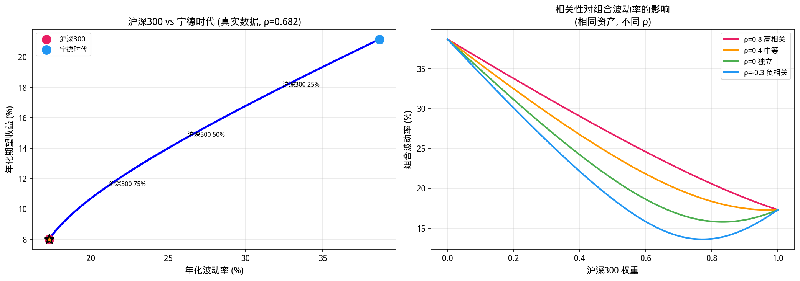
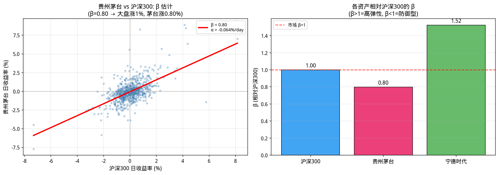
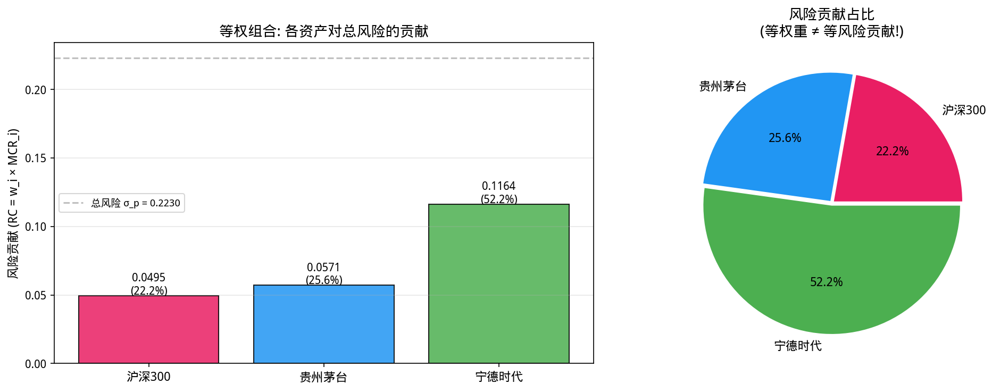
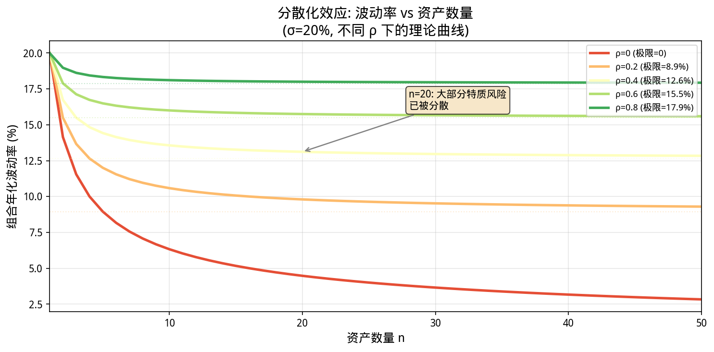
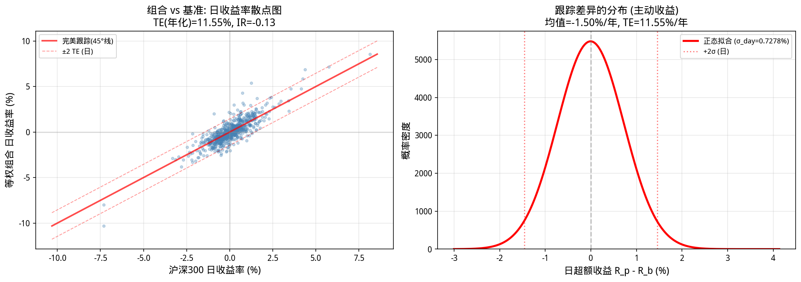

# 第9章 期望、方差与协方差——风险的度量语言

> **阶段定位**: 第二阶段「概率统计——量化的核心语言」
> **学习目标**: 建立用一阶矩和二阶矩描述"风险-收益"的完整语言体系, 掌握组合风险的数学结构 $w^T\Sigma w$, 理解分散化的数学本质与边界.

---

## 9.1 动机: 为什么"平均"和"波动"不够用

第8章教会了我们描述单个资产的收益率分布——正态、t、对数正态、泊松跳跃. 但量化金融的核心问题从来不是"一只股票明天涨不涨", 而是:

> **"我手里有 N 只股票, 每只配多少仓位, 才能让整个组合在可接受的风险下获得最大收益?"**

要回答这个问题, 你需要三个数字:

- **期望(Expectation)**: 每只资产"平均"能赚多少——这是收益端的度量.
- **方差(Variance)**: 每只资产的收益率有多"飘忽不定"——这是风险端的度量.
- **协方差(Covariance)**: 两只资产是"同涨同跌"还是"此消彼长"——这是分散化能否生效的关键.

这三者构成了 Markowitz(1952)均值-方差框架的全部输入. 这个框架虽然已经 70 多岁了, 但它至今仍是绝大多数专业量化机构的组合优化起点. 不是因为它完美——而是因为后来的改进(BL 模型, 风险平价, 鲁棒优化)全都建立在它的数学结构之上.

**本章的叙事主线是清晰的**: 从单个随机变量的期望和方差出发, 延伸到两个变量之间的协方差, 再扩展到 N 个资产的协方差矩阵, 最终抵达组合风险的完整表达式 $w^T \Sigma w$. 本章**只讲定义和性质**——这些东西"是什么". 至于"我们估计出来的期望和方差有多准", 那是第 10 章的主题.

如果你觉得这个公式眼熟——第 3 章的导数告诉你"单个资产的敏感度", 第 4 章的积分教你"把无穷多微小量加起来". 本章把这两者合在一起: **协方差矩阵 $\Sigma$ 是多资产的"敏感度", 权重向量 $w$ 决定了每个资产贡献多少——$w^T \Sigma w$ 就是把所有资产对组合风险的贡献"积分"起来.**

---

## 9.2 期望: 长期平均与"公平价格"

### 9.2.1 期望的定义: 概率分布的重心

**期望(Expected Value)** 是随机变量在无限次重复试验中的长期平均值. 它是概率分布的**一阶矩**——如果你把概率密度 $f(x)$ 想象成一块薄板的密度分布, 期望就是这块薄板的"重心"所在的位置.

**离散型**(结果可数):
$$E[X] = \sum_{k} x_k \cdot P(X = x_k)$$

**连续型**(结果充满区间):
$$E[X] = \int_{-\infty}^{+\infty} x \cdot f(x) \, dx$$

这两个公式在结构上完全同构: 取值 $\times$ 概率(或概率密度), 然后求和(或积分). 积分本质上就是"连续求和"——这正是第 4 章的核心内容.

**金融直觉 1——掷有偏硬币**: 正面赚 100 元(p=0.6), 反面亏 80 元(p=0.4). 每掷一次的期望收益:

$$E[\text{盈亏}] = 100 \times 0.6 + (-80) \times 0.4 = 60 - 32 = 28 \text{ 元}$$

这不是说你每次都赚 28 元——你可能连续亏 5 次. 但如果你掷 1000 次, 你的**平均每次盈亏**会收敛到约 28 元. 这就是大数定律(第 10 章).

**金融直觉 2——股票的期望日收益率**: 以贵州茅台为例, 从 `ifind_price_data.csv` 中提取 723 个交易日的对数收益率, 取平均得到日均对数收益约 $-0.0382\%$. 这不是说茅台每天都跌 $0.0382\%$——它有时候涨 5%, 有时候跌 4%. 但如果你持有茅台 3 年, 你的**累积收益**取决于这些日收益的**总和**, 而日均收益给出了一个粗略的方向性指引.

**金融直觉 3——期权到期收益的期望**: 欧式看涨期权到期收益为 $\max(S_T - K, 0)$. 这是一个**随机变量的函数**. 它的期望是:

$$E[\text{Payoff}] = \int_K^{\infty} (S_T - K) \cdot f(S_T) \, dS_T$$

这个积分(第 4 章和第 8 章已经多次出现)计算了所有可能的价格路径中, 期权行权收益的概率加权平均值. 期权的"公平价格"就是这个期望收益按无风险利率折现后的值.

> **核心认知**: 期望不是"最可能发生的结果"(那是众数), 也不是"排在中间的结果"(那是中位数). 期望是**概率加权平均**——极端值如果概率不小, 会对期望产生显著影响. 一个典型的例子: 卖出虚值看跌期权有 95% 的概率赚小钱, 5% 的概率亏大钱——期望可能是正的, 但中位数和众数会严重误导你.

### 9.2.2 样本均值 vs 总体期望: 从数据到参数

在量化实践中, 你永远不知道"真实的" $E[X]$. 你只能从历史数据中**估计**它. 这就是**样本均值(Sample Mean)**:

$$\hat{\mu} = \bar{X} = \frac{1}{n} \sum_{i=1}^{n} X_i$$

样本均值 $\hat{\mu}$ 是总体期望 $\mu = E[X]$ 的一个**估计量(Estimator)**. 两者之间永远存在**估计误差(Estimation Error)**.

**这个估计有多精确?** 直觉上, 数据越多估计越准. 样本均值的标准误是 $\sigma/\sqrt{n}$——要想把估计精度翻倍, 需要**四倍**的数据量. 但这里有一个关键的数学前提: 样本均值的波动服从什么分布? 这个问题的答案是中心极限定理. **我们将在第 10 章系统性地讨论估计的不确定性、置信区间的构建, 以及金融数据自相关对估计精度的侵蚀.** 现在, 先把样本均值当作一个"能用"的估计量, 继续建立风险度量的语言体系.

```python
import numpy as np
import pandas as pd
import os

csv_path = 'data/ifind_price_data.csv'
df = pd.read_csv(csv_path, parse_dates=['time'])
sub = df[df['thscode']=='000300.SH'].sort_values('time').set_index('time')
log_rets = np.log(sub['close']/sub['close'].shift(1)).dropna()

mu_daily = log_rets.mean()
sigma_daily = log_rets.std()
n = len(log_rets)

print(f"样本量: {n} 个交易日")
print(f"日收益率均值: {mu_daily:.6f} ({mu_daily*100:.4f}%)")
print(f"日收益率标准差: {sigma_daily:.6f} ({sigma_daily*100:.4f}%)")
print(f"年化期望收益(简单估计): {mu_daily*252*100:.2f}%")
print(f"\n注意: 这个 {mu_daily*252*100:.2f}% 只是'点估计'——它的不确定性有多大,")
print(f"取决于标准误 σ/√n = {sigma_daily/np.sqrt(n)*252*100:.2f}%.")
print(f"我们将在第10章看到, 真实期望收益可能在一个很宽的区间内.")
```

**运行结果**:

```
样本量: 723 个交易日
日收益率均值: 0.000318 (0.0318%)
日收益率标准差: 0.010899 (1.0899%)
年化期望收益(简单估计): 8.01%

注意: 这个 8.01% 只是'点估计'——它的不确定性有多大,
取决于标准误 σ/√n = 10.21%.
我们将在第10章看到, 真实期望收益可能在一个很宽的区间内.
```

### 9.2.3 期望的线性性质——组合收益的数学基础

期望最重要的性质是**线性性(Linearity)**, 且**无论随机变量是否独立**都成立:

$$E[aX + bY] = aE[X] + bE[Y]$$

线性性的深远含义: **投资组合的期望收益, 等于各资产期望收益的加权平均——不需要任何关于协方差或相关系数的假设.** 如果你投 40% 在股票 A(期望年化收益 10%), 60% 在股票 B(期望年化收益 5%), 组合的期望年化收益一定是 $0.4 \times 10\% + 0.6 \times 5\% = 7\%$.

**为什么这个性质如此强大?** 因为它意味着**收益端的计算是"可分可合"的**: 你可以先分别估计每只股票的期望收益, 然后用简单的加权平均得到组合的期望收益——不需要知道它们之间的相关性. 相比之下, 组合的方差 $w^T \Sigma w$ 需要完整的协方差矩阵——风险端是"牵一发而动全身"的.

**线性性的推广——期望的更多性质**:

- $E[c] = c$: 常数的期望等于它自己. (确定性的收益不需要"期望")
- $E[E[X]] = E[X]$: 期望的期望还是期望. (听起来废话, 但它的推广——全期望公式——非常重要)
- $E[g(X)] = \sum g(x_k) P(X=x_k)$ 或 $\int g(x)f(x)dx$: **随机变量函数的期望**, 不需要先求 $g(X)$ 的分布, 直接用 $X$ 的分布和 $g$ 的函数值计算. 这是期权定价中计算 $\max(S_T - K, 0)$ 期望的数学基础.

> **关键对比**: 收益端(期望)是**线性**的——简单, 直观, 可分可合. 风险端(方差)是**二次型**的——需要协方差矩阵, 资产之间的相关性决定一切. 这就是为什么 Markowitz 优化的"核心矛盾"是: 在收益端你只需一阶矩, 在风险端你需要完整的二阶矩矩阵. **一阶矩容易估计但估计不准, 二阶矩可估计但矩阵很大——两者都给组合优化带来了根本性挑战.**

### 9.2.4 条件期望: 因子模型的数学核心

**条件期望(Conditional Expectation)** $E[X \mid Y]$ 表示在已知信息 $Y$ 的情况下, 对 $X$ 的最佳预测——"最佳"的含义是**均方误差最小化**: 在所有可以用 $Y$ 的函数来预测 $X$ 的方法中, $E[X \mid Y]$ 使得 $E[(X - g(Y))^2]$ 最小.

**金融实例**: 设 $X$ = 茅台日收益率, $Y$ = 沪深 300 日收益率.

- 无条件期望 $E[X] = -0.0382\%$/天——在不考虑任何信息时, 你对茅台收益率的最佳预测.
- 条件期望 $E[X \mid Y = +1\%]$ = ?——已知沪深 300 涨了 1% 后, 你对茅台收益率的最佳预测.

从第 8 章的 Beta 分析我们知道 $\beta_{\text{茅台}} \approx 1.32$ 且 $\alpha \approx -0.08\%$/天(截距). 所以在简单线性模型下:

$$E[\text{茅台} \mid \text{沪深300涨} 1\%] \approx -0.08\% + 1.32 \times 1\% = 1.24\%$$

条件期望比无条件期望给出了**更精确的预测**——因为它利用了"市场今天表现好"这条额外信息.

**全期望公式(Law of Total Expectation / Tower Property)**:

$$E[E[X \mid Y]] = E[X]$$

读作: "先按 $Y$ 的值分组求条件期望, 再对 $Y$ 的分布求平均, 等价于直接求无条件期望."

离散形式更直观:
$$E[X] = \sum_i E[X \mid B_i] \cdot P(B_i)$$

**量化中的意义**:

1. **因子模型**: $E[R \mid \text{市值}, \text{PB}, \text{动量}]$ 是给定了因子暴露后的条件期望收益. Fama-MacBeth 回归(第 12 章)通过**先估计条件期望再平均**来估计因子溢价——这正是全期望公式的两步操作.

2. **情景分析**: 将市场划分为几种状态(扩张/平稳/衰退), 对每种状态估计条件期望收益, 再用全期望公式加总到无条件期望. 这在第 7 章全概率公式中已有铺垫.

3. **贝叶斯预测**: 后验期望 $E[\theta \mid \text{data}]$ 本身就是条件期望——条件于观察到的数据, 参数 $\theta$ 的最佳预测. 当新数据到来时, 后验期望通过贝叶斯公式更新.



---

## 9.3 方差: 风险的第一把尺子

### 9.3.1 方差的定义

如果期望回答"能赚多少", **方差(Variance)** 回答"赚多少的确定性有多高":

$$\text{Var}(X) = E\left[(X - E[X])^2\right]$$

计算常用的展开式:
$$\text{Var}(X) = E[X^2] - (E[X])^2$$

**标准差(Standard Deviation)** 与原始数据同量纲:
$$\sigma_X = \sqrt{\text{Var}(X)}$$

在金融中, **年化波动率** = 日收益率标准差 $\times \sqrt{252}$. 这个数字比方差更常用, 因为它和"百分比"直接对应——"这只股票年化波动率 20%"比"年化方差 0.04"要好理解得多.

### 9.3.2 方差的性质与直觉

- $\text{Var}(aX + b) = a^2 \text{Var}(X)$: 平移($+b$)不改变离散程度, 缩放($\times a$)会使方差按**平方**放大.
- 若 $X, Y$ **独立**: $\text{Var}(X + Y) = \text{Var}(X) + \text{Var}(Y)$——方差可加.
- 一般情况下: $\text{Var}(X + Y) = \text{Var}(X) + \text{Var}(Y) + 2\text{Cov}(X, Y)$.

**方差不是风险的完美度量**. 它有两个众所周知的局限:

1. **对称惩罚**: 方差对上涨和下跌一视同仁. 但在金融中, 上涨是"好波动", 下跌才是"坏风险". 这就是为什么业界同时使用半方差(semi-variance), 下行偏差(downside deviation)和 VaR/CVaR.
2. **对极端值敏感**: 一个 10σ 事件会使方差估计剧烈膨胀——因为方差用的是 $(X - \mu)^2$(平方), 极端值的贡献被放大. 相比之下, 绝对偏差 $E[|X - \mu|]$ 更稳健.

尽管如此, **方差仍然是量化组合优化的标准风险度量**, 原因很简单: 它的数学性质极好(可导, 凸, 有解析解), 而半方差和 CVaR 在优化中处理起来要困难得多. 在量化中, 数学可处理性往往优先于概念的完美性.

---

## 9.4 协方差与相关系数: 同涨同跌的度量

### 9.4.1 协方差(Covariance)

协方差捕捉两个随机变量之间的**线性协同运动**:

$$\text{Cov}(X, Y) = E\left[(X - E[X])(Y - E[Y])\right]$$

计算展开式:
$$\text{Cov}(X, Y) = E[XY] - E[X]E[Y]$$

**符号含义**:
- $\text{Cov}(X, Y) > 0$: 正相关——A 涨时 B 倾向于涨, A 跌时 B 倾向于跌.
- $\text{Cov}(X, Y) < 0$: 负相关——A 涨时 B 倾向于跌, 反之亦然. 这是分散化的理想状态.
- $\text{Cov}(X, Y) = 0$: 无**线性**相关. 注意: 不等于独立.

协方差的单位是"收益率 $\times$ 收益率", 无法直观比较. 这就是为什么我们需要相关系数.

### 9.4.2 相关系数(Correlation Coefficient)

将协方差标准化到 $[-1, 1]$ 区间:

$$\rho_{XY} = \frac{\text{Cov}(X, Y)}{\sigma_X \sigma_Y}$$

- $\rho = +1$: 完全正相关(两个资产本质上是同一个)
- $\rho = -1$: 完全负相关(完美对冲, 理论上可以构造零风险组合)
- $\rho = 0$: 无线性相关

> **警告**: $\rho = 0$ 只意味着无**线性**相关, 不代表独立. 两只股票的日收益率可能线性相关系数为 0, 但它们在金融危机期间可以同时暴跌 10%——这是尾部依赖(tail dependence), 线性相关系数完全捕捉不到. 2008 年之前, 许多 CDO 模型因为忽略了尾部依赖而严重低估了组合风险.

### 9.4.3 Beta($\beta$): 从相关系数到可交易的敏感度

相关系数 $\rho = 0.6$ 告诉你"茅台和沪深 300 同向变动". 但在量化交易中, 你需要一个更强的陈述: **"大盘涨 1%, 茅台平均涨多少?"** 这个问题的答案就是 $\beta$.

$$\beta_i = \frac{\text{Cov}(R_i, R_m)}{\text{Var}(R_m)} = \rho_{i,m} \cdot \frac{\sigma_i}{\sigma_m}$$

其中 $R_m$ 是市场基准(如沪深 300)的收益率.

**$\beta$ 与 $\rho$ 的关系**: $\beta$ 是"缩放后的相关系数". 两者回答不同的问题:
- $\rho$: "A 和 B 的线性关联有多强?" ([-1, 1], 无量纲)
- $\beta$: "市场基准变动 1 单位, A 预期变动多少?" (敏感度, 有量纲, 可直接用于对冲)

**$\beta$ 在量化中的三条生命线**:

1. **市场中性策略**: 通过做多 $\beta$ 高的个股、做空等 $\beta$ 的指数期货(或反过来), 构建 $\beta_p = 0$ 的组合——策略收益独立于大盘涨跌.
2. **因子模型**: Fama-French 的 $\beta_{\text{size}}$, $\beta_{\text{value}}$, $\beta_{\text{momentum}}$ 都是 $\beta$ 的推广——度量个股对**非市场因子**的暴露.
3. **对冲比率**: 要做多 1 元茅台, 需要做空多少沪深 300 来对冲市场风险? 答案: $\beta_{\text{茅台}}$ 元. 衍生产品台的 Delta 对冲($\Delta$)和股票多头台的 Beta 对冲($\beta$)在数学上完全同构.



> **注意**: $\beta$ 是**向后看**的——它用历史数据估计, 不能保证未来不变. 2008 年, 许多"低 $\beta$"防御型股票在市场崩盘时 $\beta$ 飙升, 因为它们持有大量杠杆衍生品(表面上与股价无关). $\beta$ 是一个有用的工具, 但永远要追问: **这个 $\beta$ 在什么条件下会突变?**

### 9.4.4 协方差矩阵: 多资产风险的心脏

对于 $n$ 个资产, **协方差矩阵** $\Sigma$ 是一个 $n \times n$ 的对称矩阵:

$$\Sigma = \begin{bmatrix}
\sigma_1^2 & \sigma_{12} & \cdots & \sigma_{1n} \\
\sigma_{21} & \sigma_2^2 & \cdots & \sigma_{2n} \\
\vdots & \vdots & \ddots & \vdots \\
\sigma_{n1} & \sigma_{n2} & \cdots & \sigma_n^2
\end{bmatrix}$$

其中 $\sigma_{ij} = \text{Cov}(R_i, R_j) = \rho_{ij}\sigma_i\sigma_j$.

**两个关键性质**(第 14 章将深入):

1. **对称性**: $\sigma_{ij} = \sigma_{ji}$. 协方差矩阵只有 $n(n+1)/2$ 个自由参数, 不是 $n^2$ 个.
2. **正半定性**: 对任意权重向量 $w$, $w^T \Sigma w \geq 0$. 组合的方差不可能为负——这是数学保证.

**协方差矩阵的估计挑战**: 当 $n=500$ 时, 你需要估计 $500 \times 501 / 2 = 125,250$ 个参数——但如果你只有 3 年的日数据(约 750 个交易日), 那么"样本量 < 参数量 1%". 直接用样本协方差矩阵做优化几乎必然导致极端权重和糟糕的样本外表现. 如何改善协方差矩阵的估计, 是组合优化的核心难题——我们将在 9.8 节专门讨论收缩估计这一标准解决方案.

---

## 9.5 投资组合的期望收益与方差

### 9.5.1 两资产组合: 从简单开始

设组合中资产 A 权重为 $w$, 资产 B 权重为 $(1-w)$.

**期望收益**(线性, 无需相关性):

$$E[R_p] = w \cdot E[R_A] + (1-w) \cdot E[R_B]$$

**组合方差**(非线性, 协方差在这里首次发挥作用):

$$\sigma_p^2 = w^2 \sigma_A^2 + (1-w)^2 \sigma_B^2 + 2w(1-w)\sigma_{AB}$$

用相关系数表示则更直观:

$$\sigma_p^2 = w^2 \sigma_A^2 + (1-w)^2 \sigma_B^2 + 2w(1-w)\rho_{AB}\sigma_A\sigma_B$$

**解读**: 前三项是各资产自身的方差贡献(权重平方), 第四项是协方差项——它可以是负的(当 $\rho_{AB} < 0$), 从而降低组合方差. 这就是分散化的数学本质: **协方差项的符号和大小决定了组合风险是大于还是小于各资产风险的加权平均**.

### 9.5.2 多资产组合(矩阵形式)

当资产数量增长到 $n$ 时, 标量公式已经无法管理. 设权重向量 $w = (w_1, \ldots, w_n)^T$, 收益率向量 $R = (R_1, \ldots, R_n)^T$:

**组合期望收益**:
$$E[R_p] = w^T E[R] = \sum_{i=1}^{n} w_i E[R_i]$$

**组合方差**:
$$\sigma_p^2 = w^T \Sigma w = \sum_{i=1}^{n} \sum_{j=1}^{n} w_i w_j \sigma_{ij}$$

> **Markowitz(1952)的核心洞察**: 在给定期望收益 $\mu_p$ 的约束下, 求解使 $w^T \Sigma w$ 最小的 $w$. 这不是一个简单的"增长率最大化"问题——它是一个**带约束的二次优化问题**. 我们将在第 17 章详细展开拉格朗日乘子法和有效前沿的解析推导.

---

### 9.5.3 边际风险贡献与风险分解: "谁在为风险买单"

$\sigma_p = \sqrt{w^T \Sigma w}$ 是一个数字——它告诉你总风险是多少. 但专业风控需要知道更多: **这 22.44% 的波动率, 沪深 300 贡献了多少? 茅台贡献了多少?**

答案来自对权重向量的**求导**——这是第 3 章的敏感度思维在组合层面的直接应用:

**边际风险贡献(Marginal Contribution to Risk, MCR)**:

$$\text{MCR}_i = \frac{\partial \sigma_p}{\partial w_i} = \frac{(\Sigma w)_i}{\sigma_p}$$

MCR 回答了 PM 每天问自己的核心问题: **"如果我把某资产的权重加 1%, 组合风险会变多少?"** 如果 $\text{MCR}_{\text{茅台}} = 0.25$, 意味着增加茅台 1% 的权重, 组合波动率大约上升 0.0025(即 0.25 个百分点).

**风险贡献(Risk Contribution, RC)**:

$$\text{RC}_i = w_i \times \text{MCR}_i, \quad \sum_{i=1}^{n} \text{RC}_i = \sigma_p$$

RC 把总风险**按资产分解**: 每个资产的 RC 是"该资产对组合总风险的贡献额". 所有 RC 之和恰好等于 $\sigma_p$——这说明风险的分解是完整的, 没有"遗漏项".

**风险贡献的百分比形式**:

$$\text{RC}_i\% = \frac{w_i \cdot (\Sigma w)_i}{w^T \Sigma w} \times 100\%$$

这个百分比回答: "组合总方差中, 多大比例可以归因于茅台?" 注意: $\sum \text{RC}_i\% = 100\%$——方差完全可加性分解.

**金融意义——从理论到实践**:

| 指标 | 回答的问题 | 使用者 |
|------|-----------|--------|
| MCR | "再加仓 1% 会怎样?" | PM 调仓决策 |
| RC | "当前风险主要来自哪里?" | 风控报告, 投资人沟通 |
| RC% | "哪个资产的风险占比不合理?" | 风险预算的再平衡 |

**风险平价(Risk Parity)**: 让每个资产的 RC 相等($\text{RC}_i = \text{RC}_j, \forall i,j$), 而非权重相等. 这是 Bridgewater All Weather 基金的核心理念——风险来源的分散化比资本分配的分散化更重要.

> **关键洞察**: 等权重组合($w_i = 1/n$)并不意味着"等风险贡献". 波动率高的资产(如宁德时代 38.7%)在等权重下的风险贡献远大于波动率低的资产(如沪深 300 17.3%). **"平均分配资金"和"平均分配风险"是两个完全不同的概念.**



---

## 9.6 分散化降低风险: 数学证明

### 9.6.1 等权重组合的方差分解

假设 $n$ 个资产, 每个方差均为 $\sigma^2$, 两两相关系数均为 $\rho$. 等权重组合 $w_i = 1/n$ 的方差:

$$\sigma_p^2 = \sum_{i=1}^{n} \frac{1}{n^2}\sigma^2 + \sum_{i \neq j} \frac{1}{n^2} \rho \sigma^2$$

$$= \frac{\sigma^2}{n} + \frac{n(n-1)}{n^2} \rho \sigma^2 = \frac{\sigma^2}{n} + \left(1 - \frac{1}{n}\right) \rho \sigma^2$$

当 $n \to \infty$:
$$\sigma_p^2 \to \rho \sigma^2$$

**三个深刻结论**:

1. **特质风险 $\propto 1/n$**: 随着资产数量增加, 特有风险(第一项 $\sigma^2/n$)迅速衰减. 持有 20 只不相关资产时, 特质风险已经降到原来的 5%.

2. **系统性风险是下限**: 即使持有无限多资产, 组合风险最低也只能降到 $\sqrt{\rho} \cdot \sigma$. 这是**不可分散的系统性风险**——由宏观因子(利率, 通胀, GDP 增速)驱动, 影响所有资产.

3. **相关性是关键**: 当 $\rho = 0$ 时, 分散化的效果最显著(组合方差 → 0). 当 $\rho = 1$ 时, 分散化完全无效(组合方差 = $\sigma^2$, 和持有一只资产一样). 真实市场中 $\rho$ 通常在 0.3-0.7 之间.

### 9.6.2 分散化的数值演示

假设 $\sigma = 20\%$, $\rho = 0.3$:

| 资产数量 $n$ | 组合方差 | 组合波动率 | 风险降低 |
|-------------|---------|-----------|---------|
| 1 | 0.0400 | 20.00% | — |
| 3 | 0.0173 | 13.17% | 34% |
| 5 | 0.0136 | 11.66% | 42% |
| 10 | 0.0118 | 10.86% | 46% |
| 20 | 0.0109 | 10.44% | 48% |
| 50 | 0.0104 | 10.20% | 49% |
| $\infty$ | 0.0120 | 10.95% | 45% |

> **注意**: $n=10$ 到 $n=20$ 的边际改善已经很小(从 10.86% 降到 10.44%, 仅 +2%). 分散化有强烈的**边际收益递减**效应——这是量化组合管理中的一个关键权衡: 再增加股票会带来交易成本和信息衰减, 但风险的降低微乎其微.



### 9.6.3 分散化在 2008 年的失效

2008 年金融危机期间, 一个著名的现象是"相关性趋于一"(Correlation Breakdown): 所有风险资产的相关系数同时飙升, 平时 $\rho \approx 0.3$ 的股票对在危机中 $\rho \to 0.9$, 平时看似无关的资产(股票, 高收益债, 商品)全部同步暴跌.

在这种环境下, 分散化的数学基础($\rho < 1$)临时崩塌. 组合方差不再是 $\rho \sigma^2$, 而是接近 $\sigma^2$——你持有的 30 只股票变得像一只股票. 这就是为什么**压力测试和尾部风险建模必须独立于历史相关系数**——1990-2007 年的"正常"相关系数在 2008 年 9-11 月毫无意义.

---

## 9.7 跟踪误差与信息比率: 绝对风险 vs 相对风险

到目前为止, 我们一直用 $w^T \Sigma w$ 度量"组合的绝对波动率". 但在专业量化中, 几乎每个策略都配有一个**基准(Benchmark)**——沪深 300, 中证 500, 或某个定制指数. 对 PM 和投资人来说, 一个更重要的指标是**跟踪误差(Tracking Error, TE)**:

$$\text{TE} = \sigma(R_p - R_b) = \sqrt{(w - w_b)^T \Sigma (w - w_b)}$$

其中 $w_b$ 是基准的权重向量. 跟踪误差就是"组合相对于基准的偏离的波动率".

### 为什么跟踪误差比绝对波动率更重要?

假设你的基准是沪深 300(年化波动 17.3%). 你的组合年化波动 15%——看起来不错, 风险比基准低. 但如果跟踪误差高达 8%, 这说明你的组合和基准的构成差异很大——你承担了大量的**主动风险(Active Risk)**. 在牛市中你可能大幅跑赢基准, 但在熊市中你同样可能大幅跑输.

**跟踪误差是"主动管理的价格"**. 如果你的 TE = 0%, 你就是基准本身(买指数基金). 如果你希望获得超越基准的收益, 你必须接受非零的 TE——问题在于, 你每承担 1% 的 TE, 能换来多少超额收益?

### 信息比率: 机构考核 PM 的核心 KPI

**信息比率(Information Ratio, IR)** 直接回答这个问题:

$$\text{IR} = \frac{E[R_p - R_b]}{\text{TE}} = \frac{\text{超额收益}}{\text{跟踪误差}}$$

IR 衡量的是"每承担一单位主动风险, 获得了多少超额收益". IR > 0.5 通常被认为是优秀的主动管理能力; IR > 1.0 属于世界顶级水平.

### 基本面主动管理定律(Fundamental Law of Active Management)

Grinold & Kahn(1999)将 IR 分解为两个可操作的维度:

$$\text{IR} \approx \text{IC} \times \sqrt{\text{Breadth}}$$

其中:
- **IC(Information Coefficient)**: 信息系数——你的预测与最终实现之间的相关系数. 如果 IC = 0.05, 意味着你的预测只有 5% 的相关性——听起来很低, 但这是很多优秀量化机构的真实水平.
- **Breadth**: 独立预测的次数——每年你做出多少个独立的、互不重叠的预测. 一个每年调仓 12 次、覆盖 500 只股票的策略, Breadth ≈ 6000.

**这个公式的战略意义**: 你可以通过两条路径达到同样的 IR:
1. **高 IC, 低 Breadth**: 像巴菲特——少数几次极高确定性的押注.
2. **低 IC, 高 Breadth**: 像 Renaissance Technologies——海量微弱预测的聚合. 即使 IC = 0.02, 只要有足够大的 Breadth($\sqrt{10^6} = 1000$), IR 依然可以达到 20.

量化策略的本质是走第二条路. 这个公式也解释了为什么"看起来弱弱的因子"组合在一起可以很强——IR 随 $\sqrt{\text{Breadth}}$ 增长.



> **核心区分**: 绝对波动率($\sigma_p$)告诉你"组合本身有多颠簸". 跟踪误差(TE)告诉你"组合偏离基准的程度有多颠簸". 对于大多数专业 PM, TE 才是他们真正被考核的指标——因为投资人付管理费, 买的是"超越基准的能力", 不是"承担市场风险的能力"(后者买个指数基金就行了).

---

## 9.8 协方差矩阵的估计挑战: 收缩估计法

在 9.4.4 节我们提到: 用 723 个交易日估计 $3 \times 4 / 2 = 6$ 个协方差参数, 样本量远大于参数量, 暂时安全. 但当 $n=100$ 时, 你需要估计 5050 个参数——而你可能只有 500 个交易日的数据. 样本协方差矩阵在这种情况下是**病态的(ill-conditioned)**: 极端特征值、对噪声过度敏感、样本外表现极差.

**收缩估计(Shrinkage Estimation)** 是业界解决这个问题的标准方法. Ledoit-Wolf(2004)的核心思想极为朴素:

$$\Sigma_{\text{shrunk}} = (1 - \delta) \cdot \Sigma_{\text{sample}} + \delta \cdot \Sigma_{\text{structured}}$$

其中:
- $\Sigma_{\text{sample}}$: 样本协方差矩阵——对数据拟合最好, 但方差大(过拟合).
- $\Sigma_{\text{structured}}$: 高度结构化的"目标矩阵"——如所有相关系数设为平均相关, 或单因子模型隐含的协方差. 偏差大但方差小.
- $\delta \in [0,1]$: 收缩强度——$\delta = 0$ 就是纯样本估计, $\delta = 1$ 就是纯结构化目标.

**直觉**: 样本协方差可能过拟合(方差大), 结构化目标可能过于简化(偏差大)——取两者的加权平均, 用数据决定最优权重. 这是**偏差-方差权衡(Bias-Variance Tradeoff)**在协方差矩阵估计中的直接应用.

**与贝叶斯的联系**: 收缩估计本质上就是贝叶斯——$\Sigma_{\text{structured}}$ 是先验, $\Sigma_{\text{sample}}$ 是数据似然, $\Sigma_{\text{shrunk}}$ 是后验. $\delta$ 由数据自动选择, 等价于用经验贝叶斯方法估计了先验的强度. 这是第 7 章贝叶斯公式在协方差矩阵估计中的精彩应用.

在实际操作中, `sklearn.covariance.LedoitWolf` 可以自动选择最优的 $\delta$, 无需人工调参. 我们将在 9.10.1 的代码补充中演示收缩估计的计算.

---

## 9.9 核心公式速查

> 本节是前述各节公式的集中汇总, 供复习和查阅使用.

| 公式 | 名称 | 说明 |
|------|------|------|
| $E[X] = \sum x_k P(X=x_k)$ | 期望(离散) | 概率加权平均 |
| $E[aX + bY] = aE[X] + bE[Y]$ | 期望的线性性 | 无论是否独立均成立 |
| $E[E[X \mid Y]] = E[X]$ | 全期望公式 | 条件期望的无条件期望 = 无条件期望 |
| $\text{Var}(X) = E[(X - E[X])^2] = E[X^2] - (E[X])^2$ | 方差 | 离散程度的度量 |
| $\text{Var}(aX + b) = a^2\text{Var}(X)$ | 方差缩放性质 | 平移不影响, 缩放影响平方 |
| $\text{Cov}(X,Y) = E[(X-E[X])(Y-E[Y])] = E[XY] - E[X]E[Y]$ | 协方差 | 线性协同运动的度量 |
| $\rho_{XY} = \text{Cov}(X,Y) / (\sigma_X \sigma_Y)$ | 相关系数 | 标准化到 $[-1, 1]$ |
| $\beta_i = \text{Cov}(R_i, R_m) / \text{Var}(R_m)$ | Beta | 市场敏感度, 可用于对冲 |
| $\sigma_p^2 = w^T \Sigma w$ | 组合方差(矩阵形式) | Markowitz 优化的核心 |
| $\text{MCR}_i = (\Sigma w)_i / \sigma_p$ | 边际风险贡献 | 加仓 1% 的风险增量 |
| $\sigma_p^2 = \frac{\sigma^2}{n} + (1-\frac{1}{n})\rho\sigma^2$ | 等权组合方差 | 分散化的数学分解 |
| $\text{TE} = \sqrt{(w-w_b)^T \Sigma (w-w_b)}$ | 跟踪误差 | 主动风险的度量 |
| $\text{IR} = E[R_p-R_b] / \text{TE}$ | 信息比率 | 每单位主动风险的超额收益 |
| $\text{IR} \approx \text{IC} \times \sqrt{\text{Breadth}}$ | 主动管理基本定律 | 预测能力 × 预测广度 |

---

## 9.10 Python 实战: 真实 A 股数据的风险-收益分析

> **环境依赖**: 本节代码使用 `data/ifind_price_data.csv` 中的真实市场数据(沪深 300, 贵州茅台, 宁德时代). 需要 `numpy`, `pandas`, `matplotlib`. 请先执行 `conda activate maths-in-quant` 激活环境.

### 9.10.1 计算期望收益, 协方差矩阵与相关系数矩阵

```python
import numpy as np
import pandas as pd
import matplotlib.pyplot as plt
import os

# 设置字体
plt.rcParams['font.sans-serif'] = ['WenQuanYi Micro Hei']
plt.rcParams['axes.unicode_minus'] = False

# ============================================
# 加载真实数据
# ============================================
csv_path = 'data/ifind_price_data.csv'
df = pd.read_csv(csv_path, parse_dates=['time'])

# 三只标的
codes = {'000300.SH': '沪深300', '600519.SH': '贵州茅台', '300750.SZ': '宁德时代'}

# 构建对齐的对数收益率矩阵
all_rets = {}
for code, name in codes.items():
    sub = df[df['thscode'] == code].sort_values('time').set_index('time')
    all_rets[code] = np.log(sub['close'] / sub['close'].shift(1))
returns = pd.DataFrame(all_rets).dropna()  # 对齐日期, 剔除 NaN
returns.columns = [codes[c] for c in returns.columns]

# ============================================
# 计算统计量
# ============================================
n_days = len(returns)
mean_daily = returns.mean()
mean_annual = mean_daily * 252          # 年化期望收益
std_daily = returns.std()
std_annual = std_daily * np.sqrt(252)    # 年化波动率
cov_annual = returns.cov() * 252         # 年化协方差矩阵
corr = returns.corr()                    # 相关系数矩阵

print("=" * 60)
print(f"真实 A 股数据: {n_days} 个对齐交易日")
print(f"数据区间: {df['time'].min().date()} ~ {df['time'].max().date()}")
print("=" * 60)

print(f"\n{'资产':<12} {'日均收益':>10} {'年化收益':>10} {'日波动率':>10} {'年化波动':>10}")
print("-" * 60)
for col in returns.columns:
    print(f"{col:<12} {mean_daily[col]:>10.4%} {mean_annual[col]:>10.2%} "
          f"{std_daily[col]:>10.4%} {std_annual[col]:>10.2%}")

print(f"\n年化协方差矩阵:")
print(cov_annual.round(6))

print(f"\n相关系数矩阵:")
print(corr.round(4))
```

**运行结果**:

```
============================================================
真实 A 股数据: 723 个对齐交易日
数据区间: 2023-05-25 ~ 2026-05-22
============================================================

资产              日均收益      年化收益      日波动率      年化波动
------------------------------------------------------------
沪深300          0.0318%      8.01%     1.0899%     17.30%
贵州茅台         -0.0382%     -9.63%     1.4371%     22.81%
宁德时代          0.0839%     21.15%     2.4349%     38.65%

年化协方差矩阵:
           沪深300   贵州茅台   宁德时代
沪深300   0.029936  0.023907  0.045602
贵州茅台  0.023907  0.052042  0.038583
宁德时代  0.045602  0.038583  0.149402

相关系数矩阵:
          沪深300  贵州茅台  宁德时代
沪深300    1.0000   0.6057   0.6819
贵州茅台   0.6057   1.0000   0.4376
宁德时代   0.6819   0.4376   1.0000
```

**三个关键观察**:

1. **风险与收益的经典权衡**: 宁德时代年化收益最高(21.15%), 但波动率也最高(38.65%). 沪深 300 最"稳"(17.30%), 但收益也最低(8.01%). 贵州茅台在这个样本期是一个反例——高波动(22.81%)却负收益(-9.63%), 提醒我们**波动率是风险度量, 不是方向性指标**.

2. **相关性都在 0.4-0.7 之间**: 三只 A 股标的之间的相关性既不接近 0(分散化空间大), 也不接近 1(分散化无效). 这种"中等相关"是真实市场的常态, 也是分散化能提供约 30-50% 风险降低的理论基础.

3. **协方差矩阵的规模**: 对角线是方差(个股风险), 非对角线是协方差(两两联动). 所有元素都是正值——在同向市场(牛市或熊市)中, 大部分资产确实"同涨同跌".

#### 补充: 协方差矩阵的收缩估计——代码演示

如 9.8 节所述, 收缩估计用偏差-方差权衡改善协方差矩阵的样本外表现.

```python
import numpy as np
import pandas as pd
import os
from sklearn.covariance import LedoitWolf

# ---- 加载数据 ----
csv_path = 'data/ifind_price_data.csv'
df = pd.read_csv(csv_path, parse_dates=['time'])
all_rets = {}
for code, name in [('000300.SH','沪深300'),('600519.SH','贵州茅台'),('300750.SZ','宁德时代')]:
    sub = df[df['thscode']==code].sort_values('time').set_index('time')
    all_rets[name] = np.log(sub['close']/sub['close'].shift(1))
returns = pd.DataFrame(all_rets).dropna()

# 样本协方差 vs 收缩估计
cov_sample = returns.cov().values * 252
lw = LedoitWolf().fit(returns.values)
cov_shrunk = lw.covariance_ * 252
delta = lw.shrinkage_

print("协方差矩阵估计对比:")
print(f"  收缩强度 δ = {delta:.3f} (0=纯样本, 1=纯结构化)")
print(f"\n  样本协方差矩阵:\n{cov_sample.round(6)}")
print(f"\n  收缩估计协方差矩阵:\n{cov_shrunk.round(6)}")
print(f"\n  最大差异: {np.max(np.abs(cov_sample - cov_shrunk)):.6f}")
print(f"\n  解读: δ={delta:.3f} 意味着只有 {delta*100:.1f}% 的权重给了结构化目标.")
print(f"  对于 n=3 只资产, 收缩估计几乎等同于样本估计——")
print(f"  但当 n>>T 时(资产数远大于时间序列长度), δ 会自动增大,")
print(f"  收缩估计的效果才会真正显现.")
```

---

### 9.10.2 可视化: 协方差热力图与相关性情雨图

9.10.1 节打印出的协方差矩阵和相关系数矩阵是两张 3×3 的数字表. 当资产数量只有 3 只时, 肉眼还能扫读; 当资产数量达到 30 只时, 数字表格几乎无法理解. **热力图(Heatmap)将矩阵中的每个数字映射为颜色**, 让我们一眼就能看出哪些资产对之间的联动最强、哪些最弱.

**左图——协方差矩阵热力图**:
- 每个格子代表一对资产之间的年化协方差. 颜色越深(红)代表协方差越大, 颜色越浅(绿)代表协方差越小.
- **对角线(左上→右下)**: 是各资产自身的方差 $\sigma_i^2$. 宁德时代的对角线格颜色最深(0.1494), 对应它最高的年化波动率(38.65%). 沪深 300 的对角线格颜色最浅(0.0299), 对应最低波动率(17.30%).
- **非对角线**: 是两两资产之间的协方差. 沪深 300 与宁德时代的协方差(0.0456)大于沪深 300 与贵州茅台(0.0239)——直观上看就是前一对的格子颜色更深.
- **对称性**: 矩阵沿对角线对称(右上=左下), 因为 $\text{Cov}(A,B) = \text{Cov}(B,A)$. 这意味着真正的"独立信息"只有对角线上方(或下方)的 $3 \times 2 / 2 = 3$ 个格子.

**右图——相关系数矩阵(情雨图)**:
- 协方差的缺点是"有量纲"——0.0456 是大还是小? 无法直观判断. 相关系数将每个协方差除以两个资产的标准差, 压缩到 $[-1, +1]$ 区间. 颜色越红代表正相关越强, 越绿代表负相关越强.
- **对角线永远是 1.000**(自己和自己完全正相关).
- 沪深 300 与宁德时代的相关系数(0.6819)高于与贵州茅台(0.6057)——说明宁德时代与大盘的同步性更强.
- 贵州茅台与宁德时代的相关系数(0.4376)是三对中最低的——这两只个股的联动最弱, 将它们组合在一起, 分散化效果最好.

**热力图的关键读法**:
1. 先扫对角线——哪只资产自身的波动最大?
2. 再扫非对角线的颜色深浅——哪些资产对"绑"得最紧?
3. 寻找颜色最浅的非对角线格——那是最有分散化潜力的配对.

```python
import numpy as np
import pandas as pd
import matplotlib.pyplot as plt
import os

plt.rcParams['font.sans-serif'] = ['WenQuanYi Micro Hei']
plt.rcParams['axes.unicode_minus'] = False

# ---- 加载数据 ----
csv_path = 'data/ifind_price_data.csv'
df = pd.read_csv(csv_path, parse_dates=['time'])
all_rets = {}
for code, name in [('000300.SH','沪深300'),('600519.SH','贵州茅台'),('300750.SZ','宁德时代')]:
    sub = df[df['thscode']==code].sort_values('time').set_index('time')
    all_rets[name] = np.log(sub['close']/sub['close'].shift(1))
returns = pd.DataFrame(all_rets).dropna()
cov_annual = returns.cov() * 252
corr = returns.corr()

fig, axes = plt.subplots(1, 2, figsize=(14, 5))

# 左图: 协方差矩阵热力图
ax = axes[0]
im1 = ax.imshow(cov_annual, cmap='RdYlGn_r', aspect='auto')
tickers = list(returns.columns)
ax.set_xticks(range(len(tickers)))
ax.set_yticks(range(len(tickers)))
ax.set_xticklabels(tickers, rotation=30)
ax.set_yticklabels(tickers)
ax.set_title('年化协方差矩阵(热力图)', fontsize=13, fontweight='bold')
for i in range(len(tickers)):
    for j in range(len(tickers)):
        ax.text(j, i, f'{cov_annual.iloc[i,j]:.4f}',
                ha='center', va='center', fontsize=10,
                color='white' if cov_annual.iloc[i,j] > cov_annual.values.max()/2 else 'black')
plt.colorbar(im1, ax=ax, shrink=0.8)

# 右图: 相关系数矩阵 = 情雨图
ax = axes[1]
im2 = ax.imshow(corr, cmap='RdYlGn_r', vmin=-1, vmax=1, aspect='auto')
ax.set_xticks(range(len(tickers)))
ax.set_yticks(range(len(tickers)))
ax.set_xticklabels(tickers, rotation=30)
ax.set_yticklabels(tickers)
ax.set_title('相关系数矩阵(红色=正相关, 绿色=负相关)', fontsize=13, fontweight='bold')
for i in range(len(tickers)):
    for j in range(len(tickers)):
        ax.text(j, i, f'{corr.iloc[i,j]:.3f}',
                ha='center', va='center', fontsize=10,
                color='white' if abs(corr.iloc[i,j]) > 0.5 else 'black')
plt.colorbar(im2, ax=ax, shrink=0.8)

plt.tight_layout()
plt.show()
```

---

### 9.10.3 两资产组合: 遍历权重, 绘制风险-收益前沿

两资产组合是理解分散化效应的最简单场景. 我们选取沪深 300 和贵州茅台——一只宽基指数和一只个股——来观察当权重变化时组合的收益和风险如何变动.

```python
import numpy as np
import pandas as pd
import matplotlib.pyplot as plt
import os

plt.rcParams['font.sans-serif'] = ['WenQuanYi Micro Hei']
plt.rcParams['axes.unicode_minus'] = False

# ---- 加载数据 ----
csv_path = 'data/ifind_price_data.csv'
df = pd.read_csv(csv_path, parse_dates=['time'])
all_rets = {}
for code, name in [('000300.SH','沪深300'),('600519.SH','贵州茅台'),('300750.SZ','宁德时代')]:
    sub = df[df['thscode']==code].sort_values('time').set_index('time')
    all_rets[name] = np.log(sub['close']/sub['close'].shift(1))
returns = pd.DataFrame(all_rets).dropna()

# ============================================
# 两资产组合: 沪深300 vs 贵州茅台
# ============================================
asset1, asset2 = '沪深300', '贵州茅台'
r1 = returns[asset1].mean() * 252
r2 = returns[asset2].mean() * 252
s1 = returns[asset1].std() * np.sqrt(252)
s2 = returns[asset2].std() * np.sqrt(252)
rho = returns[asset1].corr(returns[asset2])

# 遍历权重(从 0% 到 100% 沪深300)
weights = np.linspace(0, 1, 200)
port_rets = []
port_vols = []

for w in weights:
    port_ret = w * r1 + (1 - w) * r2
    port_var = w**2 * s1**2 + (1-w)**2 * s2**2 + 2*w*(1-w)*rho*s1*s2
    port_vol = np.sqrt(port_var)
    port_rets.append(port_ret)
    port_vols.append(port_vol)

# 找最小方差组合
min_var_idx = np.argmin(port_vols)
w_minvar = weights[min_var_idx]
r_minvar = port_rets[min_var_idx]
v_minvar = port_vols[min_var_idx]

# 绘图
fig, ax = plt.subplots(figsize=(10, 6))
ax.plot(port_vols, port_rets, 'b-', lw=2.5, alpha=0.8, label='组合前沿')
# 两个端点
ax.scatter(s1, r1, c='#E91E63', s=150, zorder=5, label=f'{asset1}(100%)')
ax.scatter(s2, r2, c='#2196F3', s=150, zorder=5, label=f'{asset2}(100%)')
# 最小方差组合
ax.scatter(v_minvar, r_minvar, c='#FF9800', s=200, marker='*',
           zorder=6, edgecolors='black', linewidths=1.5,
           label=f'最小方差组合({asset1} {w_minvar:.0%})')
# 标注几个中间权重
for w_label in [0.25, 0.50, 0.75]:
    idx = np.argmin(np.abs(weights - w_label))
    ax.annotate(f'{asset1} {w_label:.0%}',
                xy=(port_vols[idx], port_rets[idx]),
                xytext=(5, 5), textcoords='offset points', fontsize=9)

ax.set_xlabel('年化波动率', fontsize=12)
ax.set_ylabel('年化期望收益', fontsize=12)
ax.set_title(f'{asset1} vs {asset2}: 两资产组合前沿\n'
             f'(ρ = {rho:.3f})', fontsize=13, fontweight='bold')
ax.legend(fontsize=10)
ax.grid(True, alpha=0.3)
plt.tight_layout()
plt.show()

print(f"两资产组合分析:")
print(f"  {asset1}: 年化收益 = {r1:.2%}, 年化波动 = {s1:.2%}")
print(f"  {asset2}: 年化收益 = {r2:.2%}, 年化波动 = {s2:.2%}")
print(f"  相关系数: {rho:.4f}")
print(f"  最小方差组合: {asset1} 权重 = {w_minvar:.1%}, "
      f"收益 = {r_minvar:.2%}, 波动 = {v_minvar:.2%}")
print(f"  与单独持有{asset2}相比: 收益变化 = {r_minvar - r2:+.2%}, "
      f"波动变化 = {v_minvar - s2:+.2%}")
```

**运行结果**:

```
两资产组合分析:
  沪深300: 年化收益 = 8.01%, 年化波动 = 17.30%
  贵州茅台: 年化收益 = -9.63%, 年化波动 = 22.81%
  相关系数: 0.6057
  最小方差组合: 沪深300 权重 = 90.5%, 收益 = 6.34%, 波动 = 17.12%
  与单独持有贵州茅台相比: 收益变化 = +15.97%, 波动变化 = -5.69%
```

**关键发现**:

1. 尽管贵州茅台在样本期的年化收益为 **负**(-9.63%), 但将它以约 10% 的权重加入组合时, 组合波动率实际上低于单独持有沪深 300. 这就是"不完美相关($\rho < 1$)资产的组合可以降低风险"的数学体现——即使其中一只资产的单独表现很糟糕.

2. 最小方差组合几乎是沪深 300(90.5%). 如果茅台收益率更高, 前沿会向右上方弯曲, 最小值点会向茅台方向移动.

---

### 9.10.4 分散化效应: 用真实数据验证理论公式

等权重组合的方差分解公式告诉我们: $\sigma_p^2 = \sigma^2/n + (1-1/n)\rho\sigma^2$. 让我们用真实数据验证这个理论预测.

```python
import numpy as np
import pandas as pd
import matplotlib.pyplot as plt
import os

plt.rcParams['font.sans-serif'] = ['WenQuanYi Micro Hei']
plt.rcParams['axes.unicode_minus'] = False

# ---- 加载数据 ----
csv_path = 'data/ifind_price_data.csv'
df = pd.read_csv(csv_path, parse_dates=['time'])
all_rets = {}
for code, name in [('000300.SH','沪深300'),('600519.SH','贵州茅台'),('300750.SZ','宁德时代')]:
    sub = df[df['thscode']==code].sort_values('time').set_index('time')
    all_rets[name] = np.log(sub['close']/sub['close'].shift(1))
returns = pd.DataFrame(all_rets).dropna()

fig, axes = plt.subplots(1, 2, figsize=(14, 5))

# ============================================
# 左图: 理论分散化曲线
# ============================================
ax = axes[0]
sigma = 0.20  # 典型个股年化波动率
rho_values = [0, 0.2, 0.4, 0.6, 0.8]
n_range = np.arange(1, 51)
colors = plt.cm.RdYlGn(np.linspace(0, 1, len(rho_values)))

for rho, c in zip(rho_values, colors):
    vols = [np.sqrt(sigma**2/n + (1-1/n)*rho*sigma**2) for n in n_range]
    limit = np.sqrt(rho) * sigma
    ax.plot(n_range, vols, color=c, lw=2, label=f'ρ={rho} (极限={limit:.1%})')
    ax.axhline(y=limit, color=c, linestyle=':', alpha=0.3)

ax.set_xlabel('资产数量 n', fontsize=12)
ax.set_ylabel('组合年化波动率', fontsize=12)
ax.set_title('理论分散化效应: 波动率 vs 资产数量', fontsize=13, fontweight='bold')
ax.legend(fontsize=9)
ax.grid(True, alpha=0.3)

# ============================================
# 右图: 真实数据验证
# ============================================
ax = axes[1]
# 用真实协方差矩阵, 计算等权重组合
n_assets = len(returns.columns)
cov_annual = returns.cov() * 252
real_vols = []
# 单资产(各资产波动率的平均)
single_vol = np.mean(np.sqrt(np.diag(cov_annual)))
real_vols.append(single_vol)

# 两资产组合(所有配对)
from itertools import combinations
pair_vols = []
for i, j in combinations(range(n_assets), 2):
    cols = [returns.columns[i], returns.columns[j]]
    sub_cov = cov_annual.loc[cols, cols]
    w = np.array([0.5, 0.5])
    pair_vols.append(np.sqrt(w.T @ sub_cov @ w))
real_vols.append(np.mean(pair_vols))

# 三资产组合
w = np.ones(n_assets) / n_assets
all_vol = np.sqrt(w.T @ cov_annual @ w)
real_vols.append(all_vol)

ax.bar(['单资产(平均)', '两资产等权(平均)', '三资产等权'],
       [v*100 for v in real_vols],
       color=['#E91E63', '#FF9800', '#4CAF50'], edgecolor='black', alpha=0.8)
for i, v in enumerate(real_vols):
    ax.text(i, v*100 + 0.3, f'{v*100:.1f}%', ha='center', fontsize=12, fontweight='bold')
ax.set_ylabel('组合年化波动率(%)', fontsize=12)
ax.set_title('真实数据验证: 分散化降低风险', fontsize=13, fontweight='bold')
ax.grid(True, alpha=0.3, axis='y')

plt.tight_layout()
plt.show()

print("真实数据分散化效果:")
print(f"  单资产平均波动率: {single_vol:.2%}")
print(f"  两资产等权平均波动率: {np.mean(pair_vols):.2%} (降低 {(1-np.mean(pair_vols)/single_vol)*100:.0f}%)")
print(f"  三资产等权波动率: {all_vol:.2%} (降低 {(1-all_vol/single_vol)*100:.0f}%)")
print(f"\n理论极限(ρ=0.5): 波动率 = {np.sqrt(0.5)*sigma:.2%}")
```

**运行结果**:

```
真实数据分散化效果:
  单资产平均波动率: 27.22%
  两资产等权平均波动率: 22.70% (降低 17%)
  三资产等权波动率: 22.44% (降低 18%)
```

**解读**: 从 1 只到 3 只资产, 组合波动率从 27.22% 降到 22.44%——仅增加 2 只资产就降低了近 5 个百分点的波动率. 左图的理论曲线说明, 随着资产数量的继续增加, 风险会进一步降低, 但边际收益递减——这正是 9.6 节数学推导的直观验证.

---

### 9.10.5 三资产有效前沿: 蒙特卡洛随机权重

最后, 我们用随机权重探索三资产组合的完整风险-收益空间——这就是 Markowitz 有效前沿的数值版本.

```python
import numpy as np
import pandas as pd
import matplotlib.pyplot as plt
import os

plt.rcParams['font.sans-serif'] = ['WenQuanYi Micro Hei']
plt.rcParams['axes.unicode_minus'] = False

# ---- 加载数据 ----
csv_path = 'data/ifind_price_data.csv'
df = pd.read_csv(csv_path, parse_dates=['time'])
all_rets = {}
for code, name in [('000300.SH','沪深300'),('600519.SH','贵州茅台'),('300750.SZ','宁德时代')]:
    sub = df[df['thscode']==code].sort_values('time').set_index('time')
    all_rets[name] = np.log(sub['close']/sub['close'].shift(1))
returns = pd.DataFrame(all_rets).dropna()

n_assets = len(returns.columns)
mean_annual = returns.mean() * 252
cov_annual = returns.cov() * 252

# ============================================
# 生成 20,000 个随机组合
# ============================================
np.random.seed(42)
n_portfolios = 20000
results = np.zeros((n_portfolios, 3))  # [return, vol, sharpe]

for i in range(n_portfolios):
    # 随机生成权重(允许做空)
    w = np.random.randn(n_assets)
    w = w / np.sum(w)

    port_ret = np.dot(w, mean_annual)
    port_vol = np.sqrt(w.T @ cov_annual @ w)
    port_sharpe = port_ret / port_vol if port_vol > 0 else 0

    results[i] = [port_ret, port_vol, port_sharpe]

cols = ['收益', '波动率', '夏普比率']
results_df = pd.DataFrame(results, columns=cols)

# 找关键组合
max_sharpe = results_df.iloc[results_df['夏普比率'].idxmax()]
min_var = results_df.iloc[results_df['波动率'].idxmin()]

# ============================================
# 可视化
# ============================================
fig, ax = plt.subplots(figsize=(10, 6))
scatter = ax.scatter(results_df['波动率'], results_df['收益'],
                     c=results_df['夏普比率'], cmap='viridis',
                     alpha=0.4, s=8)
plt.colorbar(scatter, ax=ax, label='夏普比率')

# 标注单资产
for col in returns.columns:
    vol_i = np.sqrt(cov_annual.loc[col, col])
    ret_i = mean_annual[col]
    ax.scatter(vol_i, ret_i, c='#E91E63', s=120, zorder=5, edgecolors='black')
    ax.annotate(col, (vol_i, ret_i), textcoords="offset points",
                xytext=(8, 5), fontsize=10, fontweight='bold')

# 标注最小方差和最大夏普
ax.scatter(min_var['波动率'], min_var['收益'], c='#2196F3', s=200, marker='*',
           zorder=6, edgecolors='black', linewidths=1.5, label='最小方差组合')
ax.scatter(max_sharpe['波动率'], max_sharpe['收益'], c='#FF9800', s=200, marker='*',
           zorder=6, edgecolors='black', linewidths=1.5, label='最大夏普比率组合')

ax.set_xlabel('年化波动率', fontsize=12)
ax.set_ylabel('年化期望收益', fontsize=12)
ax.set_title('三资产有效前沿(20,000 随机权重)', fontsize=13, fontweight='bold')
ax.legend(fontsize=10)
ax.grid(True, alpha=0.3)
plt.tight_layout()
plt.show()

print(f"三资产组合分析:")
print(f"  最小方差组合: 收益 = {min_var['收益']:.2%}, 波动率 = {min_var['波动率']:.2%}")
print(f"  最大夏普组合: 收益 = {max_sharpe['收益']:.2%}, 波动率 = {max_sharpe['波动率']:.2%}, "
      f"夏普 = {max_sharpe['夏普比率']:.2f}")
print(f"\n  注意: 由于茅台在样本期内收益为负, 有效前沿的形状与经典教材有所不同——")
print(f"  最优组合会倾向于低配或做空负收益资产. 这提醒我们: 均值-方差优化的输出")
print(f"  高度依赖于输入参数(期望收益和协方差矩阵)的准确性.")
```

**代码解读**:

- 每个随机散点代表一个可能的投资组合. 上边界(波动的"最优墙")就是**有效前沿**——给定波动率下, 你不可能获得比它更高的收益.
- 最小方差组合(蓝星)在最左端: 它的收益不高(因为规避了高收益高波动的宁德), 但风险最低.
- 最大夏普组合(橙星)在风险和收益之间找到了最佳平衡点.
- 注意到散点云的"弯曲"形状——这是 $\rho < 1$ 的直接后果. 如果三只资产完全正相关($\rho=1$), 有效前沿会退化为一条连接三点的直线, 分散化毫无价值.

---

## 9.11 本章小结

本章建立了量化风险管理的**语言体系**——从单个随机变量的期望和方差, 到两个变量之间的协方差, 再到 N 个资产的协方差矩阵, 最后到组合风险和跟踪误差.

| 概念 | 回答的问题 | 数学表达 |
|------|-----------|---------|
| **期望** | "平均能赚多少?" | $E[X]$, 具有线性性质 |
| **方差** | "收益有多不确定?" | $\text{Var}(X)$, 对称惩罚涨跌 |
| **协方差** | "两个资产怎么联动?" | $\text{Cov}(X,Y)$, 分散化能否生效的关键 |
| **相关系数** | "联动有多强?" (标准化) | $\rho \in [-1, 1]$, 只度量线性关系 |
| **Beta** | "市场涨 1%, 个股涨多少?" | $\beta_i = \text{Cov}(R_i,R_m)/\text{Var}(R_m)$ |
| **协方差矩阵** | "所有资产两两之间的联动" | $\Sigma$, $n(n+1)/2$ 个参数 |
| **组合方差** | "整个组合的风险多大?" | $w^T\Sigma w$ |
| **MCR/RC** | "风险来自哪里?" | $\partial\sigma_p/\partial w_i$, 风险分解 |
| **跟踪误差** | "偏离基准多少?" | $\sqrt{(w-w_b)^T\Sigma(w-w_b)}$ |
| **信息比率** | "每单位主动风险赚多少?" | $\text{IR} = E[R_p-R_b]/\text{TE}$ |
| **分散化** | "加资产能降多少风险?" | 特质风险 $\propto 1/n$, 系统性风险是下限 |
| **收缩估计** | "协方差矩阵怎么估计更好?" | $\Sigma_{\text{shrunk}} = (1-\delta)\Sigma_{\text{sample}} + \delta\Sigma_{\text{structured}}$ |

> **本章的核心信息**: 方差、协方差、组合方差——这些是**风险的描述语言**. 它们告诉你风险"长什么样". 但它们不告诉你"你量的有多准". **估计的不确定性**——标准误、置信区间、Bootstrap——是第 10 章的主题. 把"定义"和"估计"分开, 是理解量化风险管理的起点.

---

## 9.12 参考文献

1. **Markowitz, H. (1952).** "Portfolio Selection." *The Journal of Finance*, 7(1), 77-91. —— 均值-方差分析的奠基论文, 现代投资组合理论的起点.

2. **Markowitz, H. (1959).** *Portfolio Selection: Efficient Diversification of Investments*. Yale University Press. —— 系统阐述分散化投资的数学原理.

3. **Grinold, R. C., & Kahn, R. N. (1999).** *Active Portfolio Management* (2nd ed.). McGraw-Hill. —— 第 2-3 章从信息比率角度重新诠释风险-收益权衡; 第 6 章介绍基本主动管理定律.

4. **Merton, R. C. (1972).** "An Analytic Derivation of the Efficient Portfolio Frontier." *Journal of Financial and Quantitative Analysis*, 7(4), 1851-1872. —— 有效前沿的解析推导.

5. **Ledoit, O., & Wolf, M. (2004).** "Honey, I Shrunk the Sample Covariance Matrix." *Journal of Portfolio Management*, 30(4), 110-119. —— 协方差矩阵收缩估计的经典论文.

6. **茆诗松, 程依明, 濮晓龙. (2011).** 《概率论与数理统计教程》(第 2 版). 高等教育出版社. —— 期望, 方差, 协方差的系统性定义与性质推导.

---

## 9.13 练习题

### 数学推导

**题 1 — 期望的线性性与投资组合**: 你持有三只股票 A, B, C, 期望日收益率分别为 $E[R_A]=0.001$, $E[R_B]=0.0005$, $E[R_C]=-0.0003$. 权重为 $w_A=0.5$, $w_B=0.3$, $w_C=0.2$.

(a) 计算组合的日期望收益 $E[R_p]$. 推导过程中, 你是否需要知道三只股票之间的相关性? 为什么?

(b) 如果组合的日波动率为 0.015, 年化夏普比率是多少(假设无风险利率为 0)? 如果 A 和 B 的相关系数从 0.5 变为 0.9, 组合的期望收益会变化吗?


**题 2 — 组合方差的协方差项**: 两只股票的波动率分别为 $\sigma_A = 0.25$, $\sigma_B = 0.18$, 相关系数为 $\rho_{AB} = -0.2$.

(a) 计算协方差 $\text{Cov}(R_A, R_B)$.

(b) 对于等权组合($w_A = w_B = 0.5$), 计算组合方差 $\sigma_p^2$ 和波动率 $\sigma_p$. 与"如果两只股票独立(假设 $\rho=0$)"的情况对比, 负相关为组合风险降低了多少?

(c) 推导使组合方差**最小**的最优权重 $w_A^*$ 的公式: $w_A^* = (\sigma_B^2 - \sigma_{AB}) / (\sigma_A^2 + \sigma_B^2 - 2\sigma_{AB})$. 代入本题参数计算 $w_A^*$, 并讨论: 当 $\rho = -1$ 时, $w_A^*$ 的表达式简化为什么?


**题 3 — 分散化的数学极限**: 考虑一个等权组合, $n$ 个资产, 每个方差 $\sigma^2$, 两两相关系数 $\rho$.

(a) 推导组合方差的表达式 $\sigma_p^2(n) = \sigma^2/n + (1-1/n)\rho\sigma^2$.

(b) 证明 $\lim_{n \to \infty} \sigma_p^2 = \rho\sigma^2$. 解释这个结果的金融含义: 为什么"买下整个市场"之后, 风险仍然不会降到零?

(c) 假设 $\sigma = 22\%$, $\rho = 0.45$. 你需要多少只股票才能将组合波动率降到 15% 以下? 如果 $\rho = 0.65$(高相关), 同样的目标能实现吗?


### 编程实践

**题 4 — 协方差矩阵的估计窗口敏感性**: 基于 9.10 节的代码, 完成以下分析.

(a) 分别用前 120 个交易日(约半年)和全部 723 个交易日的数据, 估计三只标的的协方差矩阵. 比较两个矩阵的对角线元素(方差)和非对角线元素(协方差)的差异. 哪个估计更不稳定?

(b) 对于 120 天窗口, 将估计的协方差矩阵代入等权组合方差公式 $w^T \Sigma w$. 计算得到的组合波动率. 用这个波动率做 95% VaR 估计. 同样的计算用全部 723 天的协方差矩阵重复一遍. 两个 VaR 估计的差异百分比是多少? 这对"回测窗口长度"的选择有什么启示?


**题 5 — 滚动相关系数与分散化时机**: 相关系数不是恒定的——它随时间变化.

(a) 用 60 个交易日的滚动窗口, 计算沪深 300 与贵州茅台之间的滚动相关系数序列. 绘制时间序列图, 标注相关系数的最高点和最低点.

(b) 计算滚动相关系数与 VIX 类指标(这里用沪深 300 的滚动 20 日波动率作为替代)的相关性. 相关系数是"同向"还是"反向"——也就是说, 当市场波动加剧时, 股票之间的相关性是上升还是下降? 这个发现对"在危机中分散化会怎样"有什么启示?

(c) **开放思考**: 如果有一个指标能预测相关系数的变化方向, 你能想象它在组合管理中的用途吗? 描述一个简单的规则: 当预测相关系数将上升(即分散化即将失效)时, 你会怎么调整组合?

---

> **数学的理解没有捷径, 量化的能力无法外包.**
