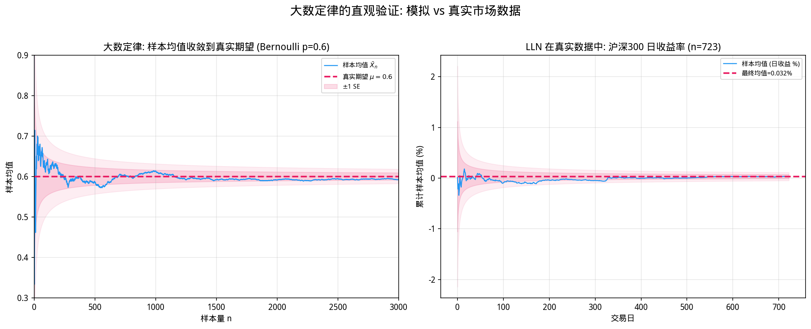
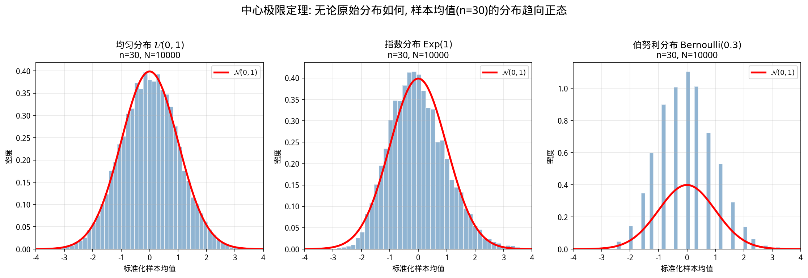
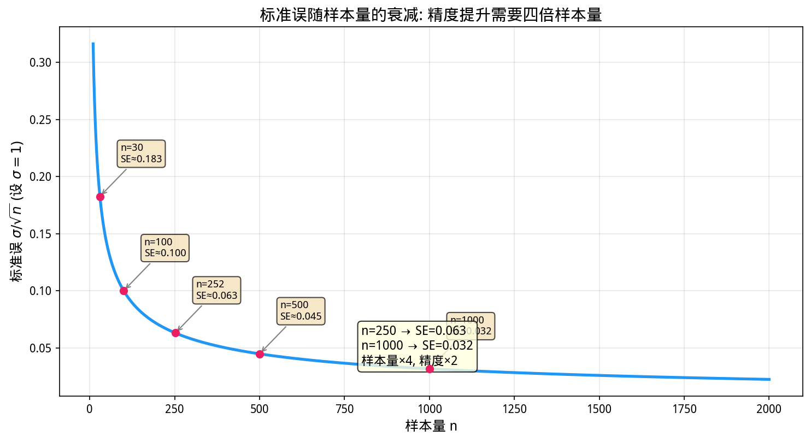
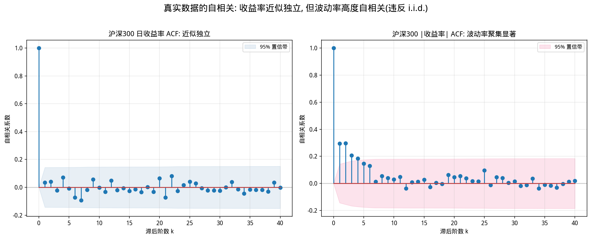
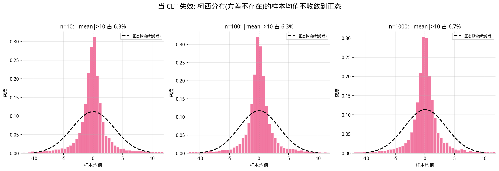
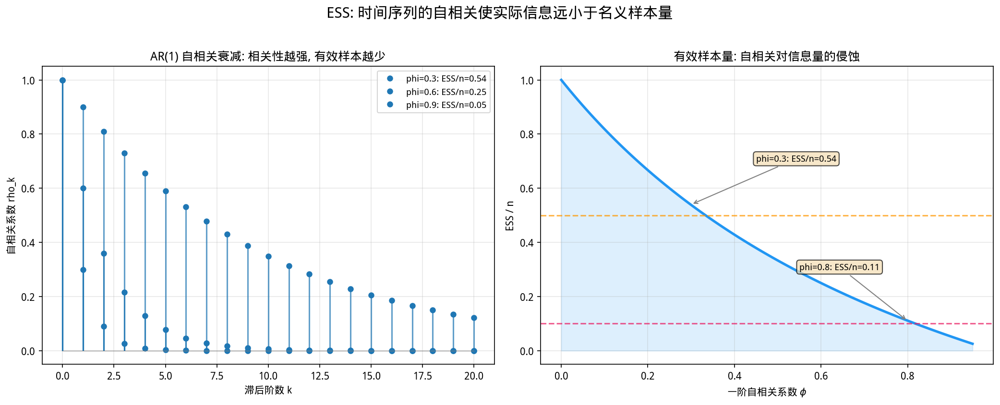
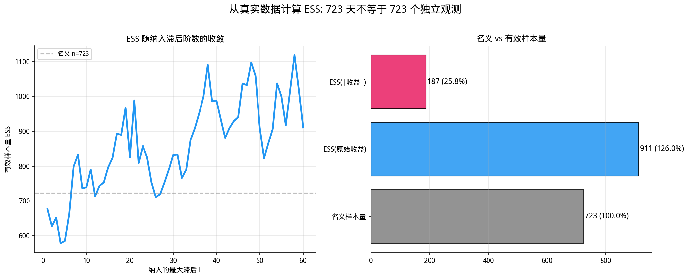
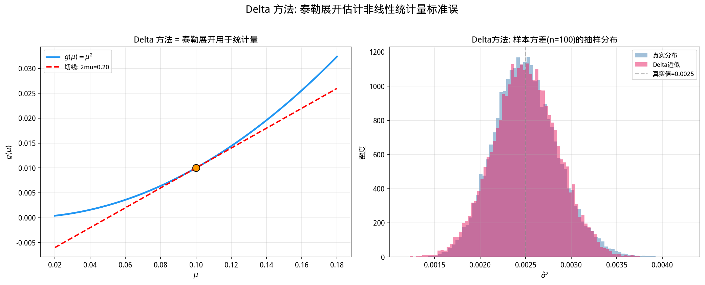

# 第10章 大数定律与中心极限定理——为什么历史数据有意义

> **核心问题**：量化投资天天和历史数据打交道，但"过去"凭什么能告诉我们"未来"？大数定律（LLN）和中心极限定理（CLT）为这个问题提供了数学上的部分答案——它们不保证未来会重复过去，但保证：只要数据生成机制稳定，我们就能从过去的数据中越来越精确地估计出真实的统计参数。

---

## 10.1 动机：历史数据凭什么能预测未来？

量化投资的核心操作看起来很简单：下载历史价格，计算收益率，求均值、方差、相关系数，然后基于这些统计量做资产配置或选股。

但这在逻辑上有一个巨大的跳跃：**过去凭什么代表未来？**

如果你掷一枚公平硬币，前10次都是正面，第11次正面的概率仍然是50%。历史频率不会"自动"延续到未来。然而，如果你掷了10000次，发现正面出现的频率稳定在50.2%附近，你就有充分的理由相信这枚硬币的"真实"正面概率大约是50%。

**大数定律和中心极限定理，正是把"相信"变成"数学定理"的桥梁。**

它们不是说"未来一定会像过去"，而是说：
1. **大数定律**：只要样本量足够大，样本均值就会逼近真实的总体期望。这让我们用"历史平均收益率"来估计"未来期望收益率"有了数学依据。
2. **中心极限定理**：无论原始分布是什么形状，样本均值的分布都会趋向正态。这让我们能够为估计量构建置信区间、进行假设检验（第11章的核心工具）。

当然，金融市场远比掷硬币复杂。市场结构会变化（regime change），收益率存在自相关和波动聚类。这些复杂性意味着LLN和CLT的**前提假设**在金融数据中往往只是近似成立。但理解这两个定理，是理解所有后续统计方法的根基。

---

## 10.2 数学原理：从"频率稳定性"到"正态涌现"

### 10.2.1 大数定律：当样本量足够大，偶然让位于必然

想象你在重复做一个随机实验（比如观察某只股票的日收益率）。每次实验的结果 $X_i$ 都是随机的，但所有结果都来自同一个"概率分布"——这个分布有一个固定的、未知的期望 $\mu$。

你观察了 $n$ 天，得到 $n$ 个收益率 $X_1, X_2, \dots, X_n$。你计算它们的平均值：

$$\bar{X}_n = \frac{1}{n}(X_1 + X_2 + \dots + X_n)$$

**大数定律的直觉**：随着 $n$ 越来越大，这个样本均值 $\bar{X}_n$ 会越来越接近真实的期望 $\mu$。

就像你在迷雾中射箭。射1箭，落点可能偏离靶心很远；射100箭，落点的"中心"就开始显现；射10000箭，平均落点几乎一定在靶心附近。每一箭都是随机的，但**随机性的平均**却呈现出惊人的确定性。



**金融意义**：如果我们假设股票的日收益率分布在一段时间内是稳定的(stationary), 那么历史平均收益率就是在逼近真实的期望收益率. 注意, 大数定律(LLN)说的是"样本均值收敛到期望", 不是说"下一期收益率一定等于历史均值". 这两个陈述的区别至关重要——前者是关于估计量的长期行为, 后者是关于单次预测. **大数定律给了你估计期望的权利, 但没给你预测单次结果的能力.**

### 10.2.2 中心极限定理：正态分布的"霸权"从何而来

如果说大数定律告诉我们"样本均值会趋向一个点", 那么中心极限定理(CLT)告诉我们"样本均值在趋向这个点的过程中, 其**波动**呈现出什么形状".

这是一个更加惊人的事实：**无论原始分布是什么形状**——正态、均匀、指数、甚至严重偏态或双峰分布——只要样本量 $n$ 足够大，标准化后的样本均值就近似服从标准正态分布。

**为什么？** 可以从两个角度理解：

**角度一：卷积的平滑效应**
样本均值是 $n$ 个独立随机变量的和再除以 $n$。两个独立随机变量之和的分布，是它们各自分布的"卷积"。卷积是一种平滑操作：把两个尖锐的分布卷积在一起，会得到更平滑的分布；卷积次数越多，结果越趋向钟形。这是数学上的必然。

**角度二：偏差的对冲**
在 $n$ 个样本中，大的正偏差和大的负偏差倾向于相互抵消。剩下的"净偏差"，其大小被限制在 $\sigma/\sqrt{n}$ 的量级。当 $n$ 很大时，这个净偏差相对于均值的尺度，恰好呈现出正态分布的特征。

**金融意义**：
- 即使单只股票的日收益率不服从正态分布（事实如此，通常是厚尾的），但**多只股票组合的平均收益率**或**长时间段的平均收益率**的分布，却近似正态。
- 这解释了为什么均值-方差分析（需要正态假设）在实际中部分有效。
- 更重要的是，CLT是**假设检验**和**置信区间**的数学基础——第11章我们将用这些工具判断一个因子是否"真的有效".



---

## 10.5 核心公式速查

> 本节是前述各节公式的集中汇总, 供复习和查阅使用.

### 10.5.1 弱大数定律（Weak Law of Large Numbers, WLLN）

设 $X_1, X_2, \dots, X_n$ 是**独立同分布**（i.i.d.）的随机变量，期望 $\mathbb{E}[X_i] = \mu$，方差 $\text{Var}(X_i) = \sigma^2 < \infty$。

样本均值定义为：
$$\bar{X}_n = \frac{1}{n}\sum_{i=1}^n X_i$$

则对任意小的正数 $\epsilon > 0$：
$$\lim_{n \to \infty} P\left(|\bar{X}_n - \mu| \geq \epsilon\right) = 0$$

等价记法：
$$\bar{X}_n \xrightarrow{P} \mu \quad (n \to \infty)$$

**符号含义**：
- $\bar{X}_n$：样本均值（基于 $n$ 个观测的估计量，是一个随机变量）
- $\mu$：总体期望（我们想要估计的真实值，是一个常数）
- $\xrightarrow{P}$：依概率收敛。含义是：当 $n$ 很大时，$\bar{X}_n$ 与 $\mu$ 的差距超过任意给定阈值 $\epsilon$ 的概率趋于0
- $\epsilon$：任意小的正数，代表我们设定的"误差容忍度"

**直观理解**：无论你要求多高的精度（$\epsilon$ 多小），只要样本量 $n$ 足够大，样本均值偏离真实值超过这个精度的概率就可以任意小。

### 10.5.2 中心极限定理（Central Limit Theorem, CLT）

在同样的i.i.d.假设下，定义标准化后的样本均值：

$$Z_n = \frac{\bar{X}_n - \mu}{\sigma / \sqrt{n}} = \frac{\sum_{i=1}^n X_i - n\mu}{\sigma\sqrt{n}}$$

当 $n \to \infty$ 时，$Z_n$ 的分布收敛于标准正态分布：

$$Z_n \xrightarrow{d} \mathcal{N}(0, 1)$$

即对任意实数 $z$：
$$\lim_{n \to \infty} P(Z_n \leq z) = \Phi(z) = \int_{-\infty}^{z} \frac{1}{\sqrt{2\pi}} e^{-t^2/2} dt$$

**符号含义**：
- $\sigma / \sqrt{n}$：样本均值的标准误（Standard Error），衡量样本均值作为估计量的波动幅度
- $\xrightarrow{d}$：依分布收敛。不是收敛到一个数，而是整个概率分布的形状收敛到标准正态
- $\mathcal{N}(0,1)$：均值为0，方差为1的标准正态分布
- $\Phi(z)$：标准正态分布的累积分布函数（CDF）

**关键洞察**: 分母中的 $\sqrt{n}$ 告诉我们, 要提高一倍的精度(将标准误减半), 需要将样本量扩大**四倍**. 从 100 天数据增加到 400 天, 才能把估计精度提高一倍. 从 250 天(约一年)增加到 1000 天(约四年), 精度也只翻了一倍. **这在量化中意味着: 想要显著提高参数估计的精确度, 需要指数级增长的数据量.**



### 10.5.3 金融中的常用形式：置信区间

结合CLT，我们可以为样本均值构建近似的 $1-\alpha$ 置信区间：

$$\bar{X}_n \pm z_{\alpha/2} \cdot \frac{\sigma}{\sqrt{n}}$$

其中 $z_{\alpha/2}$ 是标准正态分布的 $1-\alpha/2$ 分位数（例如，95%置信区间对应 $z_{0.025} \approx 1.96$）。

如果总体标准差 $\sigma$ 未知（实际中总是如此），用样本标准差 $S$ 代替：

$$\bar{X}_n \pm z_{\alpha/2} \cdot \frac{S}{\sqrt{n}}$$

当 $n$ 较小时, 更精确的做法是使用 $t$ 分布的分位数代替 $z$(见第 11 章).

### 10.5.4 Delta 方法: 非线性统计量的渐近分布

若 $\sqrt{n}(\hat{\theta}_n - \theta) \xrightarrow{d} \mathcal{N}(0, \sigma^2)$, 对可导函数 $g$:

$$\sqrt{n}(g(\hat{\theta}_n) - g(\theta)) \xrightarrow{d} \mathcal{N}(0, [g'(\theta)]^2 \sigma^2)$$

**常用实例——夏普比率标准误**:

$$\text{SE}(\widehat{\text{SR}}) \approx \sqrt{\frac{1}{n}\left(1 + \frac{1}{2}\text{SR}^2\right)}$$

### 10.5.5 有效样本量(ESS)

名义样本量 $n$, 实际独立信息量:

$$\text{ESS} = \frac{n}{1 + 2\sum_{k=1}^{\infty} \rho_k}$$

AR(1) 特例: $\text{ESS} \approx n \cdot (1-\phi)/(1+\phi)$.

### 10.5.6 蒙特卡洛标准误

$$\text{SE}(\hat{\mu}_N) = \frac{\sigma_Y}{\sqrt{N}}, \quad \hat{\mu}_N \pm 1.96 \cdot \frac{\hat{\sigma}_Y}{\sqrt{N}}$$

### 10.5.7 鞅差分序列 CLT

若 $E[X_t \mid \mathcal{F}_{t-1}] = 0$ 且方差有限:

$$\frac{1}{\sqrt{n}} \sum_{t=1}^{n} X_t \xrightarrow{d} \mathcal{N}(0, \sigma^2)$$

---

## 10.3 Python示例

### 10.3.1 实验1：大数定律的可视化——样本均值的收敛

我们将模拟一个偏置硬币（或股票的涨跌），真实期望已知，观察样本均值如何"爬行"到真实值。为了体现金融场景，我们用**伯努利分布**模拟一个"上涨概率60%"的交易日。

```python
import numpy as np
import matplotlib.pyplot as plt

# 设置随机种子保证可重复
np.random.seed(42)

# 模拟一个"偏置硬币"：上涨概率0.6，下跌概率0.4
# 用1表示上涨，0表示下跌
p_true = 0.6
n_max = 5000

# 生成5000次独立伯努利试验
samples = np.random.binomial(1, p_true, n_max)

# 计算累积样本均值：cumsum / [1, 2, 3, ..., n_max]
cumulative_means = np.cumsum(samples) / np.arange(1, n_max + 1)

# 绘制
plt.figure(figsize=(10, 6))
plt.plot(cumulative_means, color='steelblue', linewidth=1.5, label='样本均值 $\\bar{X}_n$')
plt.axhline(y=p_true, color='crimson', linestyle='--', linewidth=2, 
            label=f'真实期望 $\\mu = {p_true}$')
plt.xlabel('样本量 $n$', fontsize=12)
plt.ylabel('样本均值', fontsize=12)
plt.title('大数定律：样本均值随样本量增大收敛到真实期望', fontsize=14)
plt.legend(fontsize=11)
plt.grid(True, alpha=0.3)
plt.xlim(0, n_max)
plt.ylim(0.4, 0.8)
plt.tight_layout()
plt.show()
```

**运行结果解读**：你会看到一条蓝色的"毛毛虫"曲线，在初期（$n < 200$）剧烈波动，但随着 $n$ 增大，逐渐稳定在红线（0.6）附近。注意，收敛不是单调的——即使在 $n=1000$ 之后，仍然会有小的偏离，但偏离的幅度越来越小。

**量化启示**: 如果你只观察了某策略 50 天的表现, 样本胜率可能是 70% 也可能是 50%, 波动极大; 但观察 500 天, 胜率会稳定在其"真实"水平附近. 这就是为什么量化回测需要足够长的样本期.

#### 用真实数据验证: 沪深300 日收益率的均值收敛

上面的伯努利模拟很干净, 但真实市场数据呢? 让我们用沪深 300 的 723 个交易日对数收益率来验证 LLN.

```python
import numpy as np
import pandas as pd
import matplotlib.pyplot as plt
import os

plt.rcParams['font.sans-serif'] = ['WenQuanYi Micro Hei']
plt.rcParams['axes.unicode_minus'] = False

# 加载真实数据
csv_path = 'data/ifind_price_data.csv'
df = pd.read_csv(csv_path, parse_dates=['time'])
sub = df[df['thscode'] == '000300.SH'].sort_values('time').set_index('time')
log_rets = np.log(sub['close'] / sub['close'].shift(1)).dropna().values

n = len(log_rets)
cum_means = np.cumsum(log_rets) / np.arange(1, n + 1)
final_mean = log_rets.mean()
final_std = log_rets.std()

fig, ax = plt.subplots(figsize=(12, 5))
ax.plot(cum_means * 100, color='#2196F3', lw=1.2, label='累计样本均值 (日收益 %)')
ax.axhline(y=final_mean * 100, color='#E91E63', linestyle='--', lw=2,
           label=f'最终均值 = {final_mean*100:.3f}%')
# ±2 标准误的收敛带
se = final_std / np.sqrt(np.arange(1, n + 1))
ax.fill_between(range(n), (final_mean - 2*se)*100, (final_mean + 2*se)*100,
                alpha=0.12, color='#E91E63', label='±2 SE 范围')
ax.set_xlabel('交易日序号'); ax.set_ylabel('累计样本均值 (%)')
ax.set_title(f'LLN 在真实数据中: 沪深300 日对数收益率 (n={n})', fontsize=13, fontweight='bold')
ax.legend(fontsize=9); ax.grid(True, alpha=0.3)
plt.tight_layout(); plt.show()

print(f"样本量: {n}")
print(f"日收益率均值: {final_mean:.6f} ({final_mean*100:.4f}%)")
print(f"日收益率标准差: {final_std:.6f}")
print(f"均值的标准误: {final_std/np.sqrt(n):.6f} ({final_std/np.sqrt(n)*100:.4f}%)")
print(f"95% 置信区间: [{final_mean*100 - 1.96*final_std/np.sqrt(n)*100:.3f}%, "
      f"{final_mean*100 + 1.96*final_std/np.sqrt(n)*100:.3f}%]")
```

**关键观察**: 与伯努利模拟不同, 真实收益率均值的收敛曲线在早期阶段可能受市场趋势影响而持续偏向一侧(正值或负值). 收敛带(粉色)在初期很宽, 随着 $n$ 增大逐渐收窄——这正是 $\sigma / \sqrt{n}$ 衰减的直接体现. 注意, 即使 $n=723$, 日均收益率的 95% 置信区间仍然相当宽.

### 10.3.2 实验2：中心极限定理的"魔法"——从任意分布到正态

我们选择三种截然不同的分布，验证CLT的普适性：
1. **均匀分布** $\mathcal{U}(0,1)$：对称、有界、平坦
2. **指数分布** $\text{Exp}(1)$：严重右偏、无界、连续
3. **伯努利分布** $\text{Bernoulli}(0.3)$：离散、只有0和1两个取值

对每种分布，我们重复 $N=10000$ 次实验，每次抽取 $n=30$ 个样本计算均值，最后观察这10000个均值的分布。

```python
import numpy as np
import matplotlib.pyplot as plt
from scipy import stats

np.random.seed(2024)

n = 30      # 每次实验的样本量（CLT通常在n>=30时开始显现）
N = 10000   # 重复实验次数（蒙特卡洛模拟次数）

# 定义三种分布及其理论参数
distributions = {
    '均匀分布 U(0,1)': {
        'generator': lambda size: np.random.uniform(0, 1, size),
        'mu': 0.5,
        'sigma': np.sqrt(1/12),
        'xlim': (-0.2, 1.2)
    },
    '指数分布 Exp(1)': {
        'generator': lambda size: np.random.exponential(1, size),
        'mu': 1.0,
        'sigma': 1.0,
        'xlim': (-1, 3)
    },
    '伯努利分布 Bernoulli(0.3)': {
        'generator': lambda size: np.random.binomial(1, 0.3, size),
        'mu': 0.3,
        'sigma': np.sqrt(0.3 * 0.7),
        'xlim': (-0.5, 1.5)
    }
}

fig, axes = plt.subplots(1, 3, figsize=(15, 5))

for ax, (name, dist) in zip(axes, distributions.items()):
    # 重复N次实验，每次抽取n个样本
    samples = dist['generator']((N, n))
    sample_means = samples.mean(axis=1)

    # 标准化：(均值 - 真实期望) / (标准差 / sqrt(n))
    standardized = (sample_means - dist['mu']) / (dist['sigma'] / np.sqrt(n))

    # 绘制标准化样本均值的直方图
    ax.hist(standardized, bins=50, density=True, alpha=0.6, color='steelblue', 
            edgecolor='white', label='样本均值的分布')

    # 叠加标准正态分布PDF
    x = np.linspace(-4, 4, 200)
    ax.plot(x, stats.norm.pdf(x), 'r-', linewidth=2, label='标准正态 PDF')

    ax.set_title(f'{name}\n$n={n}$', fontsize=12)
    ax.set_xlabel('标准化后的样本均值', fontsize=10)
    ax.set_ylabel('密度', fontsize=10)
    ax.legend(fontsize=9)
    ax.set_xlim(-4, 4)
    ax.grid(True, alpha=0.3)

plt.suptitle('中心极限定理：无论原始分布如何，样本均值都趋向正态', 
             fontsize=14, y=1.02)
plt.tight_layout()
plt.show()
```

**运行结果解读**：三幅图的直方图都惊人地贴合了红色的标准正态曲线——即使原始分布分别是平坦的均匀分布、严重右偏的指数分布，以及只有0和1两个取值的离散分布。

**量化启示**：
- 单只股票的日收益率往往是非正态的（厚尾、偏态），但**月度平均收益率**或**多因子组合的平均收益**的分布，却近似正态。
- 这为我们使用 $t$ 检验、$p$ 值等工具判断因子有效性提供了理论基础（第11章）。

### 10.3.3 实验3：Bootstrap重采样——当理论公式不够用

在真实量化场景中，我们往往不知道总体分布的参数，甚至不知道分布的形状。同时，我们想估计的统计量可能很复杂（比如夏普比率、最大回撤、Calmar比率），没有简单的理论公式来计算其标准误。

**Bootstrap（自助法）** 是CLT思想的一种数值实现：通过**有放回地重复抽样**从原始样本中，模拟"如果重新做一次实验，统计量会如何波动"。

**场景**：你有一只股票一年的日收益率数据（252个交易日），计算出的年化夏普比率为1.2。但这个1.2有多可靠？如果重新抽样，它会波动多少？

```python
import numpy as np
import matplotlib.pyplot as plt

plt.rcParams['font.sans-serif'] = ['WenQuanYi Micro Hei']
plt.rcParams['axes.unicode_minus'] = False

np.random.seed(42)

# 模拟一年的日收益率（252个交易日）
# 假设真实分布是某种厚尾分布（非正态），年化期望收益10%，波动20%
n_days = 252
daily_return = 0.10 / 252
daily_vol = 0.20 / np.sqrt(252)

# 用t分布模拟厚尾收益率（自由度5，比正态更厚的尾部）
# t分布的标准差是 sqrt(df/(df-2))，我们需要反向缩放
t_samples = np.random.standard_t(df=5, size=n_days)
# 缩放和平移到目标均值和波动率
returns = daily_return + daily_vol * t_samples / np.sqrt(5/(5-2))

# 计算原始样本的夏普比率（简化版，假设无风险利率为0）
mean_return = np.mean(returns)
std_return = np.std(returns, ddof=1)
sharpe_original = mean_return / std_return
annualized_sharpe = sharpe_original * np.sqrt(252)

print(f"原始样本年化夏普比率: {annualized_sharpe:.3f}")

# Bootstrap重采样
B = 10000  # 重采样次数
bootstrap_sharpes = []

for _ in range(B):
    # 有放回地抽取n_days个样本
    resampled = np.random.choice(returns, size=n_days, replace=True)
    # 计算重采样样本的夏普比率
    m = np.mean(resampled)
    s = np.std(resampled, ddof=1)
    if s > 1e-10:  # 避免除零
        bootstrap_sharpes.append(m / s * np.sqrt(252))

bootstrap_sharpes = np.array(bootstrap_sharpes)

# 计算95%置信区间
# 注意：这里使用百分位数法，更精确的方法有BCa法，但百分位数法最直观
ci_lower = np.percentile(bootstrap_sharpes, 2.5)
ci_upper = np.percentile(bootstrap_sharpes, 97.5)

print(f"Bootstrap 95% 置信区间: [{ci_lower:.3f}, {ci_upper:.3f}]")
print(f"区间宽度: {ci_upper - ci_lower:.3f}")
print(f"相对误差（区间半宽/中心值）: {(ci_upper - ci_lower)/2/abs(annualized_sharpe)*100:.1f}%")

# 可视化
plt.figure(figsize=(10, 6))
plt.hist(bootstrap_sharpes, bins=50, density=True, alpha=0.7, color='steelblue', 
         edgecolor='white', label='Bootstrap夏普比率分布')
plt.axvline(x=annualized_sharpe, color='crimson', linestyle='--', linewidth=2, 
            label=f'原始估计: {annualized_sharpe:.3f}')
plt.axvline(x=ci_lower, color='orange', linestyle=':', linewidth=2, 
            label=f'95% CI下限: {ci_lower:.3f}')
plt.axvline(x=ci_upper, color='orange', linestyle=':', linewidth=2, 
            label=f'95% CI上限: {ci_upper:.3f}')
plt.xlabel('年化夏普比率', fontsize=12)
plt.ylabel('密度', fontsize=12)
plt.title('Bootstrap重采样：估计夏普比率的不确定性', fontsize=14)
plt.legend(fontsize=10)
plt.grid(True, alpha=0.3)
plt.tight_layout()
plt.show()
```

**运行结果解读**：
- 原始夏普比率可能是1.2左右。
- 但95%置信区间可能从0.5到1.9，宽度达到1.4。
- 这意味着：仅凭一年的数据，你无法确定这个策略的"真实"夏普比率是显著大于0的。区间可能包含0甚至负值！

**量化启示**：
- 很多量化新手看到回测夏普比率>1就兴奋，但Bootstrap告诉你：样本内的夏普比率充满了不确定性。
- 只有当置信区间的下限仍然显著高于0（或高于你的基准），你才有统计信心认为策略"真的有效"。
- Bootstrap不依赖于任何分布假设，是量化实务中极其强大的工具。

---

## 10.4 从理论到实践：量化中的注意事项

### 10.4.1 独立同分布假设的脆弱性

LLN和CLT的核心前提是**独立同分布**（i.i.d.）。但金融时间序列通常：
- **存在自相关**：收益率可能呈现趋势（正自相关）或均值回归（负自相关）
- **存在波动率聚类**：大波动后面跟着大波动（GARCH效应，第21章）
- **存在结构突变**: 2008 年金融危机前后的市场机制完全不同



这些特征意味着"有效样本量"远小于实际样本量。例如，1000天的收益率数据，由于自相关，可能只相当于500天的独立数据。这会导致基于 $n$ 计算的标准误被**低估**，置信区间被**缩窄**，从而过度自信。

**应对**：对于时间序列，需要使用**Newey-West标准误**（异方差和自相关一致标准误）或**块Bootstrap**（Block Bootstrap）来保持时间依赖性。

### 10.4.2 厚尾分布与收敛速度

CLT说"最终会收敛到正态"，但没说"多快"。对于厚尾分布（如金融收益率常见的t分布，自由度<5），方差虽然存在但很大，收敛速度非常慢。

**极端情况**：如果分布的方差不存在（如柯西分布，或自由度$\leq 2$的t分布），**CLT根本不适用**。此时样本均值的分布不会趋向正态，大数定律也可能失效。

**量化启示**：不要假设"样本量够大就万事大吉"。对于厚尾分布，可能需要数万甚至数十万的样本才能达到近似的正态。在量化中，这意味着基于正态假设的风险模型（如VaR）在极端行情下会严重低估风险。

### 10.4.3 Bootstrap的局限与进阶

标准Bootstrap假设数据是i.i.d.的，这直接套用在原始收益率序列上是**错误的**，因为收益率存在时间依赖性。

**进阶方法**：
- **块Bootstrap**（Block Bootstrap）：每次抽取一段连续的时间块（如5天），保持块内的时间依赖性。
- **平稳Bootstrap**（Stationary Bootstrap）：块长度随机化，避免固定块长度带来的周期性。
- **野Bootstrap**（Wild Bootstrap）：处理异方差性更好的方法。

对于初学者，至少应该知道：标准Bootstrap不能直接套用在原始时间序列上。但在横截面数据（如某一天全市场股票的截面收益率）上，标准Bootstrap是合理的。

### 10.4.4 历史数据有意义, 但不保证未来

最后, 也是最重要的: **LLN和CLT说的是"如果数据生成机制不变, 我们能精确估计参数". 但市场结构会变化(regime change), 过去的参数不等于未来的参数.**

这是量化投资中"模型失效"的根本原因. 你可以精确估计出 2005-2015 年间"小市值因子"的期望收益率, 但 2016 年之后这个因子可能彻底失效. LLN 和 CLT 对此无能为力——它们只能帮你估计"历史分布的参数", 不能帮你预测"未来分布是否会变".

### 10.4.5 当 CLT 失效: 柯西分布与无限方差

CLT 要求方差存在($\sigma^2 < \infty$). 如果这个前提不满足呢?

**柯西分布**(自由度 $\nu=1$ 的 t 分布)是最著名的反例. 它的 PDF 是:

$$f(x) = \frac{1}{\pi(1 + x^2)}$$

柯西分布看起来像正态(对称, 钟形), 但有一个致命区别: **方差不存在**(无穷大). 当你从柯西分布中抽取 $n$ 个样本计算均值, 这个样本均值的分布**仍然是柯西分布**——它不会随着 $n$ 增大而收敛到正态.

更直观地说: 在正态分布下, 极端值会随着样本量增大被"平均掉"; 在柯西分布下, 极端值出现的频率如此之高, 以至于再多样本也无法让均值稳定.

**金融含义**: 如果某资产的收益率真的来自方差无穷的分布(稳定分布, Mandelbrot 1963 的假设), 那么:
- 样本均值不会收敛到任何值(LLN 可能也失效)
- 基于正态的 VaR 会被极端低估
- 任何依赖于"方差存在"的统计方法(回归, 优化, 假设检验)全部失效

好在, 大多数金融数据的方差虽然大, 但**确实存在**(比如 t 分布 $\nu > 2$). 但对于新兴市场, 加密货币等极端资产类别, 方差存在性本身就是一个需要检验的前提.



### 10.4.6 鞅差分序列: 将 CLT 推广到金融时间序列

金融收益率显然不满足 i.i.d. 假设. 但我们有更弱的条件:

**鞅差分序列(Martingale Difference Sequence, MDS)**: 若 $\{X_t\}$ 满足 $E[X_t \mid \mathcal{F}_{t-1}] = 0$(即基于过去信息, 下一期的条件期望为零), 且方差有限, 则 CLT 仍然成立:

$$\frac{1}{\sqrt{n}} \sum_{t=1}^{n} X_t \xrightarrow{d} \mathcal{N}(0, \sigma^2)$$

**为什么这在金融中极其重要?**

- **有效市场假说(EMH)** 的弱形式意味着收益率序列是鞅差分: 基于过去价格, 下一期收益率的条件期望为零. 如果市场真的有效, 那么**即使收益率分布不是 i.i.d., CLT 依然适用**.
- **因子模型的残差**通常假设为 MDS: 给定因子暴露, 剩余部分没有可预测的结构.
- **GARCH 模型**(第 21 章)的标准化残差: 即使波动率有时变性, 标准化后的收益率($r_t / \sigma_t$)仍然满足 MDS, CLT 依然可用.

MDS 的 CLT 是金融计量经济学几乎所有大样本推断的**真正基础**. 当你看到研报里写"根据大样本理论, 该 t 统计量渐近服从标准正态", 这句话背后的数学就是鞅差分序列的 CLT.

### 10.4.7 蒙特卡洛标准误: CLT 在模拟中的应用

蒙特卡洛模拟(第 26 章)是量化金融中无法解析定价时的标准工具. 它的数学基础正是 CLT 的一个直接推论:

如果你模拟了 $N$ 条独立路径, 每条路径给你一个期权收益 $Y_i$, 则 MC 估计量为 $\hat{\mu}_N = \frac{1}{N}\sum Y_i$. 这个估计量的标准误是:

$$\text{SE}(\hat{\mu}_N) = \frac{\sigma_Y}{\sqrt{N}}$$

与样本均值的标准误 $\sigma / \sqrt{n}$ 完全同构. 由此可以得到 MC 的 95% 置信区间:

$$\hat{\mu}_N \pm 1.96 \cdot \frac{\hat{\sigma}_Y}{\sqrt{N}}$$

**量化含义**: 要提高 MC 精度一位小数, 需要将模拟次数扩大 100 倍. 这就是为什么衍生品定价需要数百万甚至数十亿条路径——不是因为研究者想炫耀计算能力, 而是 $\sqrt{N}$ 的收敛速度太慢了.

### 10.4.8 有效样本量: 当观测不是独立的

金融数据的一个普遍问题是**自相关**(今天和昨天的收益率可能有关). 当数据序列存在自相关时, $n$ 个观测提供的"独立信息"少于 $n$. **有效样本量(Effective Sample Size, ESS)** 量化了这种信息损失.

对于一阶自回归过程 $X_t = \phi X_{t-1} + \epsilon_t$:

$$\text{ESS} \approx n \cdot \frac{1 - \phi}{1 + \phi}$$

更一般的公式(适用于任意平稳序列)为:

$$\text{ESS} = \frac{n}{1 + 2\sum_{k=1}^{\infty} \rho_k}$$

其中 $\rho_k$ 是滞后 $k$ 的自相关系数.

**量化含义**(见下表):

| $\phi$(一阶自相关) | ESS / n | 含义 |
|-------------------|---------|------|
| 0.0 | 100% | 独立数据——名义样本量等于有效样本量 |
| 0.3 | 54% | 温和正自相关——723 天仅相当于 390 天独立信息 |
| 0.6 | 25% | 显著趋势效应——723 天仅相当于 181 天独立信息 |
| 0.9 | 5.3% | 极度自相关(如某些高频信号)——几乎每个观测都在重复上一个 |





**解读**: 沪深 300 的 723 个交易日:
- 原始收益率的 ESS ≈ 911(126%)——轻微负自相关(均值回复)反而**增加了**有效信息量, 对估计期望收益有利.
- 绝对值收益率的 ESS ≈ 187(26%)——波动率聚集使有效信息**缩水至 1/4**, 对估计方差/风险极为不利.
- **这意味着**: 用 723 天数据估计年化波动率, 实际上只相当于约 187 个独立观测的信息量——你对自己风险估计的精度, 可能只有你以为的 1/4.

**这一节的核心教训**: 当你的量化策略有 1000 天的回测数据, 不要自动假设你有 1000 个独立观测. 如果日收益率存在自相关, 你的有效样本量可能只有名义值的一半甚至更少——标准误会比你想象的大一倍, 置信区间比你想象的宽一倍.

### 10.4.9 Delta 方法: 非线性统计量的标准误

CLT 告诉我们样本均值 $\bar{X}_n$ 的分布近似正态. 但量化中我们关心的统计量往往是均值的**非线性函数**: 夏普比率($\propto \bar{X} / S$), 相关系数, 最大回撤. 这些统计量的标准误怎么估计?

**Delta 方法(D method)** 是 CLT 在非线性变换下的扩展. 核心思想: 用**泰勒展开**近似非线性函数.

设 $\sqrt{n}(\hat{\theta}_n - \theta) \xrightarrow{d} \mathcal{N}(0, \sigma^2)$(CLT 保证). 对任意可导函数 $g$:

$$\sqrt{n}(g(\hat{\theta}_n) - g(\theta)) \xrightarrow{d} \mathcal{N}(0, [g'(\theta)]^2 \sigma^2)$$

即: **$g(\hat{\theta}_n)$ 也渐近正态, 其渐近方差 = 原始方差 × $[g'(\theta)]^2$**. 这正是第 3 章"导数是敏感度"思想在概率层面的应用.

**实例——夏普比率的标准误**: 夏普比率 $\text{SR} = \mu / \sigma$. Delta 方法给出其渐近标准误:

$$\text{SE}(\widehat{\text{SR}}) \approx \sqrt{\frac{1}{n}\left(1 + \frac{1}{2}\text{SR}^2\right)}$$

注意: 夏普比率越高, 其估计越不确定——因为高夏普通常意味着分母(波动率)很小, 而波动率本身也是被估计的.



---

## 10.6 本章小结

| 定理 | 核心结论 | 量化意义 |
|------|---------|---------|
| **大数定律** | 样本均值 $\bar{X}_n$ 依概率收敛到真实期望 $\mu$ | 历史平均收益率是期望收益率的一致估计 |
| **中心极限定理** | 标准化样本均值 $Z_n$ 依分布收敛到 $\mathcal{N}(0,1)$ | 可以构建置信区间，进行假设检验 |
| **Bootstrap** | 通过重采样估计统计量的抽样分布 | 不需要理论公式，就能估计复杂统计量（如夏普比率）的不确定性 |

| **鞅差分 CLT** | 条件均值为零的序列也满足 CLT | 金融收益率(EMH)和因子残差的大样本推断基础 |
| **Delta 方法** | $g(\hat{\theta}) \sim \mathcal{N}(g(\theta), [g'(\theta)]^2 \sigma^2/n)$ | 夏普比率/相关系数等非线性统计量的标准误估计 |
| **有效样本量** | $\text{ESS} = n / (1 + 2\sum\rho_k)$ | 自相关使有效信息少于名义样本量 |
| **MC 标准误** | $\text{SE} \propto 1/\sqrt{N}$ | 蒙特卡洛精度提升需要四倍模拟次数 |

- **大数定律**给了我们用历史样本均值估计真实期望的数学许可证.
- **中心极限定理**告诉我们, 样本均值的波动服从正态分布, 从而可以构建置信区间和进行假设检验.
- **Bootstrap**让我们在不知道总体分布的情况下, 也能估计统计量的不确定性.
- **Delta 方法**将 CLT 推广到非线性统计量, 让我们能为夏普比率等复杂指标计算标准误.
- **鞅差分 CLT**将 i.i.d. 假设放宽到金融数据实际满足的条件, 是金融计量推断的真正基础.
- **有效样本量**提醒我们: 自相关会侵蚀样本的信息量, 名义 $n$ 不等于有效 $n$.
- 这些工具共同构成了量化投资"用历史数据说话"的统计基础——但请记住, 它们的前提是"数据生成机制稳定", 而金融市场恰恰以"不稳定"著称.

---

## 10.7 练习题

### 数学推导

**题 1 — 大数定律的收敛速率**: 设 $X_i \sim \text{Bernoulli}(p)$, $p=0.6$. 使用切比雪夫不等式: $P(|\bar{X}_n - p| \geq \epsilon) \leq \frac{p(1-p)}{n\epsilon^2}$.

(a) 若要求样本均值偏离真实值不超过 $\epsilon = 0.02$ 的概率至少为 $95\%$, 需要多大的样本量 $n$?

(b) 如果 $\epsilon = 0.01$(精度翻倍), 所需的 $n$ 是多少? 与 $\epsilon = 0.02$ 相比, $n$ 增加了多少倍?

(c) 讨论: 为什么切比雪夫不等式给出的 $n$ 往往比实际需要的更大? (提示: 切比雪夫不等式是"通用"的——它对任何分布都成立, 因此是保守的.)


**题 2 — 中心极限定理的标准化**: 设某策略的日超额收益独立同分布, 均值为 $0.05\%$, 标准差为 $1.5\%$.

(a) 一个季度(63 个交易日)的平均日超额收益 $\bar{X}_{63}$ 近似服从什么分布? 写出其均值和标准误.

(b) 该策略在季度内平均日超额收益为负的概率是多少? (用标准正态 CDF 表示结果并计算数值.)

(c) 如果日超额收益实际上不服从正态分布(比如是厚尾的 t 分布), (b)的答案是否仍然有效? CLT 在什么条件下保证了近似正态性?


**题 3 — Bootstrap 置信区间的理论**: Bootstrap 百分位数法的 95% 置信区间是 $[q_{0.025}, q_{0.975}]$(Bootstrap 分布的 2.5% 和 97.5% 分位数).

(a) 为什么百分位数法在样本量较小时可能给出偏低的置信区间? (提示: 考虑 Bootstrap 分布相对于真实抽样分布的偏差.)

(b) 更精确的 BCa(Bias-Corrected and Accelerated)方法在百分位数法的基础上做了哪两项修正? 简要说明其直觉.

### 编程实践

**题 4 — CLT 的收敛速度实验**: 修改 10.4.2 的代码, 固定样本量 $n \in \{5, 10, 30, 100\}$, 对指数分布 $\text{Exp}(1)$, 绘制标准化样本均值的直方图 + 正态叠加. 回答:

(a) $n$ 取多大时, 直方图开始"看起来"像正态? 用 Jarque-Bera 检验量化你的判断.

(b) 金融日收益率通常有显著厚尾(超额峰度 5-15). 用 $t$ 分布($\nu=4$)模拟这种厚尾数据, 重复上述实验. CLT 的收敛速度与指数分布相比, 是更快还是更慢?


**题 5 — 真实数据的 Bootstrap 夏普不确定性**: 基于沪深 300 的日对数收益率数据(加载方式见 10.4.1 真实数据验证部分).

(a) 计算年化夏普比率(假设无风险利率为 0). 使用标准 Bootstrap(有放回重采样)估计夏普比率的 95% 置信区间.

(b) 使用**块 Bootstrap**(Block Bootstrap, 块长度 $l=10$ 个交易日)重复上述计算. 块 Bootstrap 的置信区间是更宽还是更窄? 为什么? (提示: 块 Bootstrap 保留了时间序列中的短期自相关性, 减少了有效样本量.)

(c) 讨论: 对于趋势策略(正自相关)和均值回复策略(负自相关), 标准 Bootstrap 和块 Bootstrap 对夏普置信区间的影响方向是否相同?

---

## 参考文献

1. Wasserman, L. (2004). *All of Statistics: A Concise Course in Statistical Inference*. Springer.（《统计学完全教程》）
   - 第5-6章对LLN和CLT有清晰、严谨的阐述，且避免了过度测度论化，非常适合非数学专业的读者。

2. Casella, G., & Berger, R. L. (2002). *Statistical Inference* (2nd ed.). Duxbury.
   - 经典统计推断教材，第5章对收敛模式（依概率、依分布、几乎必然）有系统讲解，是深入理解LLN各种形式的必备参考。

3. Efron, B., & Tibshirani, R. J. (1993). *An Introduction to the Bootstrap*. Chapman & Hall/CRC.
   - Bootstrap方法的权威著作，第6-10章详细讨论了标准误估计和置信区间的构建方法，第12章专门讨论了时间序列的块Bootstrap。

4. Fama, E. F. (1965). "The Behavior of Stock-Market Prices". *The Journal of Business*, 38(1), 34-105.
   - 早期实证研究，讨论了股票收益率是否服从正态分布，以及CLT在金融中的适用边界。Fama发现日收益率存在厚尾，但月度收益率更接近正态——这正是CLT的体现。

5. Davidson, R., & MacKinnon, J. G. (2004). *Econometric Theory and Methods*. Oxford University Press.
   - 第4章对CLT在不同依赖结构下的推广（如鞅差分序列的CLT）有详细讨论，适用于理解金融时间序列中CLT的适用条件。

---

> **愿我们都能在数字与代码之间，找到理解市场的那把钥匙。**
> 
> *数学的理解没有捷径，量化的能力无法外包。*
