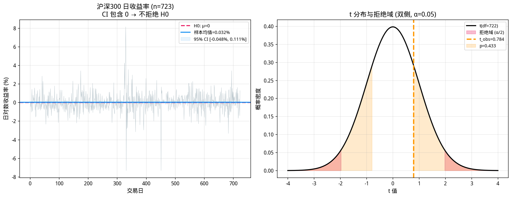
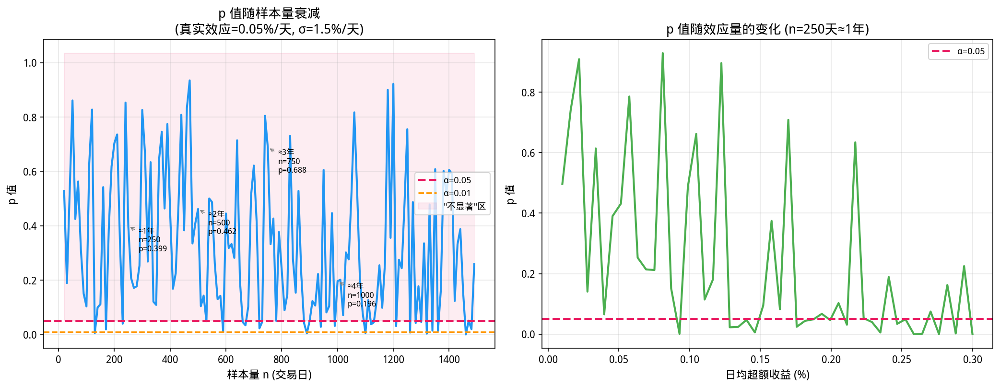

# 第11章 假设检验与 p 值——策略有效性的统计判决

> **动机先行**: 第 10 章我们学会了用置信区间量化"估计有多不准"。但在真实的量化研究中, 我们常常面临更尖锐的二元决策——这个因子到底有没有超额收益？这个策略是真的有 Alpha, 还是仅仅在拟合噪声？当基金经理向你展示一个"历史回测夏普比率高达 2.0"的策略时, 你该如何用数学语言判决它的有效性？
>
> 本章将带你从"区间估计"迈向**统计判决**, 建立对 p 值、显著性、统计功效以及**多重检验问题**的深刻理解。毫不夸张地说, 对多重检验的无知是量化初学者自欺欺人的最大陷阱; 而掌握它, 是你从"调参侠"蜕变为"理解自己在做什么的量化实践者"的关键一步。

---

## 11.1 数学原理: 从"估计不确定性"到"二元判决"

### 11.1.1 为什么需要假设检验？

第 10 章的核心结论是: 我们用样本估计总体参数时, 估计量本身是一个随机变量, 具有不确定性。置信区间告诉我们, 参数在给定置信水平下落在哪个范围。

但在实际投研流程中, 研究员常需要回答一个**"是或否"**的问题:

- **因子挖掘**: 这个因子的 IC（信息系数）均值是否显著大于零？
- **策略评估**: 这个策略的日收益率均值是否显著大于零（即是否有正 Alpha）？
- **模型诊断**: 残差是否服从正态分布？两个资产的收益率是否独立？
- **风控触发**: 组合的 VaR 突破次数是否显著超出了模型预测？

这些问题无法直接用"参数落在 $[a, b]$ 区间内"来回答。假设检验（Hypothesis Testing）正是为了将**样本证据**转化为对**统计命题**的正式判决而诞生的框架。

> **与第 10 章的关系**: 置信区间和假设检验是同一枚硬币的两面。95% CI 包含 $\mu_0$，等价于在 $\alpha=0.05$ 水平下不拒绝 $H_0: \mu = \mu_0$。CI 告诉你"参数大概在哪"，假设检验告诉你"参数是否等于某个特定值"——前者提供范围信息，后者提供决策规则。



### 11.1.2 原假设与备择假设: 设定辩论双方

假设检验的本质是一场法庭辩论。我们要先明确两个对立的命题:

- **原假设（Null Hypothesis, $H_0$）**: 通常代表"无效果"、"无差异"、"无关联"的状态。在量化中, $H_0$ 往往是那个"令人失望"的基准——例如"该因子的平均收益率为零"。
- **备择假设（Alternative Hypothesis, $H_1$ 或 $H_a$）**: 代表研究者想要证明的命题——例如"该因子的平均收益率不为零"（双侧）或"大于零"（单侧）。

> **重要原则**: 假设检验的逻辑是"**证伪 $H_0$**", 而非"证明 $H_1$"。我们收集证据反对 $H_0$, 如果证据足够强, 就拒绝 $H_0$, 从而间接支持 $H_1$。这与科学哲学中的"可证伪性"一脉相承。

**单侧 vs 双侧——量化中的选择**:

| 检验类型 | $H_1$ | 适用场景 | 拒绝域 |
|---------|-------|---------|--------|
| 双侧 | $\mu \neq 0$ | "这个因子有没有效果?"（不确定方向） | 两尾各 $\alpha/2$ |
| 单侧(右尾) | $\mu > 0$ | "这个因子能否产生正超额?"（预期做多） | 右尾 $\alpha$ |
| 单侧(左尾) | $\mu < 0$ | "这个风控指标是否恶化?"（检测变差） | 左尾 $\alpha$ |

**关键原则**: 单侧检验更容易拒绝 $H_0$（相同样本量下, 功效更高），但必须在**看到数据之前**就确定方向。如果先看数据再决定"做单侧"，这是在 p-hacking——你的实际 Type I 错误率是宣称的两倍。

**量化实例**:
- $H_0$: 某价值因子的月均超额收益率 $\mu = 0$
- $H_1$: 某价值因子的月均超额收益率 $\mu \neq 0$ （双侧检验，因为因子可能正也可能负）

### 11.1.3 检验统计量与拒绝域

假设我们观测到样本均值 $\bar{x}$ 和样本标准差 $s$。如果 $H_0$ 为真（即真实均值 $\mu=0$），那么根据第 10 章的中心极限定理, 标准化后的统计量:

$$T = \frac{\bar{X} - \mu_0}{S / \sqrt{n}}$$

近似服从自由度为 $n-1$ 的 t 分布（当总体方差未知时）。这个 $T$ 就是**检验统计量**。

**为什么用 t 分布而不是正态？** 第 10 章的 CLT 告诉我们 $\bar{X}$ 渐近正态——但"渐近"意味着 $n \to \infty$。在有限样本下, 当我们用样本标准差 $S$ 代替未知的总体标准差 $\sigma$ 时, 额外的估计误差使得 $T$ 的尾部比正态更厚。t 分布精确地修正了这一点——它的自由度 $n-1$ 反映了"我们用一个估计量（$S$）代替了一个未知参数（$\sigma$）"所付出的代价。当 $n > 100$ 时, t 分布与正态几乎重合; 当 $n < 30$ 时, 使用正态会明显低估尾部概率。

**拒绝域（Rejection Region）** 是检验统计量取值的某个区域, 如果观测值落入此区域, 我们就拒绝 $H_0$。拒绝域由我们事先设定的**显著性水平（Significance Level）** $\alpha$ 决定, 通常取 $\alpha = 0.05$（即 $5\%$）。

**量化中的 $\alpha$ 选择**: 学术研究中 $\alpha = 0.05$ 是惯例。但在量化实务中, 选择更严格——单一因子的检验常用 $\alpha = 0.01$ 甚至 $0.001$, 因为假阳性的代价是实盘亏损, 而非论文被拒。Harvey, Liu & Zhu (2016) 甚至建议金融学因子研究使用 $\alpha = 0.005$（即 t > 3.0）作为新的显著性门槛。

### 11.1.4 p 值: 数据反对 $H_0$ 的强度

**p 值（p-value）** 是假设检验中最常被引用、也最容易被误解的概念。

**正式定义**:
> 在 $H_0$ 为真的前提下, 观察到**当前样本结果**或**更极端结果**的概率。

用公式表达（以双侧 t 检验为例）:

$$\text{p-value} = P(|T| \geq |t_{\text{obs}}| \mid H_0 \text{ is true}) = 2 \times (1 - F_{t, df}(|t_{\text{obs}}|))$$

其中 $t_{\text{obs}}$ 是我们实际计算出的检验统计量观测值, $F_{t, df}$ 是自由度为 $df$ 的 t 分布的累积分布函数（CDF）。注意: 公式中的 2 倍来自双侧检验——我们把两尾的概率都算进去。如果是单侧检验, p-value 就是一尾的概率, 不乘 2。

**判决规则**:
- 若 $\text{p-value} < \alpha$（如 $0.05$）, 则拒绝 $H_0$, 称结果"在 $5\%$ 水平下统计显著"。
- 若 $\text{p-value} \geq \alpha$, 则**不拒绝** $H_0$（注意: 不是"接受 $H_0$", 而是"证据不足以拒绝"）。

### 11.1.5 关于 p 值的致命误解（必读）

在量化圈子里, 你经常会听到类似这样的话: "这个因子的 p 值是 $0.01$, 所以它有 $99\%$ 的概率是真的有效。" **这是完全错误的。**

以下是三个最常见的误解:

| 误解 | 纠正 |
|------|------|
| "p 值是 $H_0$ 为真的概率" | **错误**。p 值是在 $H_0$ **为真**的条件下计算出的概率, 而非 $H_0$ 为真的概率本身。后者需要贝叶斯框架和先验概率。 |
| "p 值很小意味着结果由随机因素导致的概率很低" | **错误**。p 值描述的是"在纯随机（$H_0$）世界里, 看到这种数据的概率", 而不是"这个结果由随机因素导致的概率"。 |
| "p 值小于 $0.05$ 说明效应很大/很重要" | **错误**。p 值与样本量高度相关。大样本下, 极其微小的经济意义（如年化超额 $0.1\%$）也可能 p 值显著。统计显著 $\neq$ 经济显著。 |

> **量化实践启示**: 当你看到一个"p 值 $< 0.001$"的因子时, 不要激动。先问两个问题: 1）样本量有多大？2）年化超额收益率（或夏普比率）是否有实际投资价值？一个统计显著但经济意义微弱的因子, 在扣除交易成本后往往是负收益的。

### 11.1.6 Type I 错误与 Type II 错误: 判决的风险

假设检验的判决结果与真实世界的关系可以用一张 $2 \times 2$ 表格概括:

| | $H_0$ 为真（因子无效） | $H_0$ 为假（因子有效） |
|---|---|---|
| **拒绝 $H_0$** | **Type I 错误（假阳性）** $\alpha$ | 正确（发现有效因子） $1-\beta$ |
| **不拒绝 $H_0$** | 正确（避免伪因子） $1-\alpha$ | **Type II 错误（假阴性）** $\beta$ |

- **Type I 错误（$\alpha$）**: 因子实际上无效, 但我们误判为有效（false positive）。在量化中, 这意味着你会把一个纯噪声因子纳入实盘, 最终亏损。
- **Type II 错误（$\beta$）**: 因子实际上有效, 但我们未能发现（false negative）。这意味着你错过了一个好策略。
- **统计功效（Statistical Power, $1-\beta$）**: 当 $H_0$ 确实为假时, 检验正确地拒绝 $H_0$ 的概率。高功效意味着你有更大的"抓出真因子"的能力。

**量化中的权衡**:
- 降低 $\alpha$（更严格的显著性标准）→ 减少 Type I 错误, 但增加 Type II 错误（漏掉真因子）。
- 增加样本量 $n$ → 可以同时降低两类错误的风险, 提高功效。这就是为什么量化研究需要足够长的历史数据。

**一个量化的例子**: 假设你希望检测一只年化超额 3%、年化波动 20% 的股票（日效应量 $d \approx 3\% / (20\% \times \sqrt{252}) \approx 0.01$）。在 $\alpha = 0.05$ 下, 你需要约 $n \approx 600$ 个交易日才能达到 80% 的功效。如果你只有 2 年数据($n \approx 500$), 功效只有约 70%——意味着你有 30% 的概率错过这个真实存在的 Alpha。

### 11.1.7 多重检验问题: 量化研究的"死亡陷阱"

这是本章最重要、也是量化实践中最容易被忽视的部分。

假设你是一位因子挖掘工程师, 某天你决定测试 **$m = 100$ 个**不同的技术指标作为选股因子。你独立地对每个因子做 t 检验, 显著性水平设为 $\alpha = 0.05$。

**关键问题**: 即使这 100 个因子在真实世界中**全部无效**（即所有 $H_0$ 都为真），你预期会发现多少个"显著"的因子？

答案是: $100 \times 0.05 = 5$ 个。

这意味着, 仅仅因为随机波动, 你就有很大概率"挖"出 5 个看似有效、实则是噪声的因子。如果你把它们直接上线交易, 后果不堪设想。这种现象被称为 **Data Mining Bias（数据挖掘偏差）** 或 **多重检验问题（Multiple Testing Problem）**。

**家族错误率（Family-Wise Error Rate, FWER）**: 在 $m$ 次检验中, 至少犯一次 Type I 错误的概率。当各检验独立时:

$$P(\text{至少一次假阳性}) = 1 - (1 - \alpha)^m$$

当 $m=100, \alpha=0.05$ 时, 这个概率高达 $\approx 0.994$——几乎肯定会出错！

**Bonferroni 校正**: 最经典、最保守的解决方法。将显著性水平除以检验次数:

$$\alpha_{\text{adjusted}} = \frac{\alpha}{m}$$

只有当 p 值小于 $\alpha/m$ 时, 我们才称该因子显著。这样可以将整体的 FWER 控制在 $\alpha$ 以内。

> **局限性**: Bonferroni 校正过于保守, 当 $m$ 很大时（如基因组学中 $m=10^5$, 或量化中扫描大量参数组合时）, 几乎没有检验能通过。此时更高级的方法如 **Benjamini-Hochberg 程序**（控制 FDR, 即 False Discovery Rate）更为常用。BH 程序的思想是: 不要求零假阳性, 而是将假阳性在"所有宣称显著的发现"中的比例控制在 $q$（如 $5\%$）以下。但在入门阶段, 理解 Bonferroni 的精神——"检验越多, 门槛越高"——至关重要。

### 11.1.8 统计显著 vs 经济显著: 量化中真正重要的区分

这是从"学生"到"从业者"最关键的一步认知跨越。

**统计显著性（Statistical Significance）** 回答: "观测到的效应, 有多大可能纯粹由随机波动产生？" 它由 p 值度量。

**经济显著性（Economic Significance）** 回答: "这个效应的大小, 是否有实际投资价值？" 它由效应量（Effect Size）度量——在量化中, 就是年化超额收益、夏普比率、信息比率。

**两者之间没有必然联系**。以下是四种可能的组合:

| | 统计显著 | 统计不显著 |
|---|---|---|
| **经济显著** | ✅ 理想状态: 大效应 + 足够数据 = 可上线 | ⚠️ 样本不够: 好策略但数据不足以证明 (需要更多数据) |
| **经济不显著** | ⚠️ 大样本陷阱: 微小效应被"检测"出来 (扣除成本后无效) | ❌ 放弃: 无效应且不显著 |

**大样本陷阱——量化中最危险的幻觉**: p 值随样本量增加而持续衰减——这是数学必然。给定**任意**非零的真实效应（哪怕年化超额只有 0.01%），只要样本量足够大, p 值终将跌破 0.05。但这 0.01% 的超额在扣除万分之几的交易成本后就是负收益。



上图左图揭示了一个残酷的事实: 即使日均超额只有 0.05%（年化约 1.26%），在 $\sigma = 1.5\%$/天的波动下, 你需要约 500 个交易日(≈2 年)的数据才能稳定地获得 $p < 0.05$。右图则表明, 在固定 250 天的样本下, 只有当效应量超过一定阈值时才能获得显著性——微弱的因子即使"真实存在", 也会淹没在噪声中。

**量化实践的黄金法则**:
1. **永远同时报告 p 值和效应量**: 报告"该因子月均 IC = 0.03, p = 0.02"而不是仅仅"p < 0.05"。
2. **用置信区间代替单纯的是/否**: "因子的年化超额 95% CI = [1.2%, 8.5%]"比"因子显著（p < 0.05）"提供了更多决策信息——下限 1.2% 够覆盖交易成本吗？
3. **效应量的实际门槛**: 在 A 股市场, 一个因子的年化超额如果不到 3-5%, 扣除冲击成本和佣金后很可能归零。统计显著的 $p < 0.001$ 但年化超额仅 0.5% 的因子, 不应该上线。

---

## 11.2 核心公式速查

> 本节是前述各节公式的集中汇总, 供复习和查阅使用.

### 11.2.1 单样本 t 检验统计量

当总体方差未知, 检验 $H_0: \mu = \mu_0$ 时:

$$t = \frac{\bar{x} - \mu_0}{s / \sqrt{n}}$$

其中:
- $\bar{x}$: 样本均值
- $\mu_0$: 原假设下的总体均值（如检验"是否有收益"时取 $0$）
- $s$: 样本标准差（$\text{ddof}=1$ 的无偏估计, 即 $s = \sqrt{\frac{1}{n-1}\sum (x_i - \bar{x})^2}$）
- $n$: 样本量
- 自由度: $df = n - 1$
- 当 $n > 100$ 时, t 分布近似于 $\mathcal{N}(0,1)$, 可查 z 表

### 11.2.2 p 值的计算

**双侧检验**（$H_1: \mu \neq \mu_0$）:

$$\text{p-value} = 2 \times (1 - F_{t, df}(|t_{\text{obs}}|))$$

**单侧检验（右尾）**（$H_1: \mu > \mu_0$）:

$$\text{p-value} = 1 - F_{t, df}(t_{\text{obs}})$$

其中 $F_{t, df}$ 是自由度为 $df$ 的 t 分布的 CDF, $t_{\text{obs}}$ 为实际计算的 t 统计量值。

**判决**: 若 $\text{p-value} < \alpha$, 拒绝 $H_0$; 否则不拒绝 $H_0$。

### 11.2.3 Bonferroni 校正

对 $m$ 个独立假设检验, 调整后的显著性水平:

$$\alpha^* = \frac{\alpha}{m}$$

或等价地, 将每个 p 值乘以 $m$ 并与 $\alpha$ 比较（$\text{adjusted p} = \min(m \times p, 1)$）。

### 11.2.4 检验功效（Power）与样本量

**功效** = 当 $H_0$ 确实为假时, 检验正确拒绝 $H_0$ 的概率 = $1 - \beta$。

对于单样本双侧 t 检验, 功效由三个因素决定:

$$\text{Power} = P\left(|T| > t_{\alpha/2, df} \mid \mu = \mu_1\right)$$

其中 $\mu_1$ 是真实均值。功效取决于:
1. **样本量 $n$**: $\uparrow n \Rightarrow \uparrow \text{Power}$（最可控的因素）
2. **效应量 $d = (\mu_1 - \mu_0) / \sigma$**: $\uparrow d \Rightarrow \uparrow \text{Power}$（因子本身的"强度"）
3. **显著性水平 $\alpha$**: $\uparrow \alpha \Rightarrow \uparrow \text{Power}$（但代价是更多假阳性）

大样本近似（$n > 100$）下, 功效可近似为:

$$\text{Power} \approx 1 - \Phi\left(z_{1-\alpha/2} - \sqrt{n} \cdot d\right) + \Phi\left(-z_{1-\alpha/2} - \sqrt{n} \cdot d\right)$$

其中 $\Phi$ 为标准正态 CDF, $z_{1-\alpha/2}$ 为标准正态的 $1-\alpha/2$ 分位数（如 $\alpha=0.05$ 时 $z_{0.975}=1.96$）。

**量化含义**: 表达式中的 $\sqrt{n} \cdot d$ 项揭示了功效的核心驱动——要想达到同等的功效, 效应量减半需要四倍的样本量。这与第 10 章 $\sqrt{n}$ 精度定律完全一致。

---

## 11.3 Python 示例

> **环境依赖**: 本节代码使用 `data/stock_data_50_20210601_20260531.csv` 中的 50 只 A 股真实数据。需要 `numpy`, `pandas`, `scipy`, `matplotlib`, `statsmodels`。请先执行 `conda activate maths-in-quant` 激活环境。

### 11.3.1 示例一: 真实数据——贵州茅台日均收益是否为 0？

这是量化投研中最基础的操作: 拿来一只股票的日收益率序列, 问一个朴素的问题——"这只股票的平均日收益, 真的不等于零吗？"

我们使用 `stock_data_50_20210601_20260531.csv` 中贵州茅台（600519.SH）的近 5 年、1209 个交易日数据来回答这个问题。

```python
import numpy as np
import pandas as pd
import matplotlib.pyplot as plt
from scipy import stats

plt.rcParams['font.sans-serif'] = ['WenQuanYi Micro Hei']
plt.rcParams['axes.unicode_minus'] = False

# ---- 加载真实数据 ----
csv_path = 'data/stock_data_50_20210601_20260531.csv'
df = pd.read_csv(csv_path, parse_dates=['time'])

# 提取贵州茅台日对数收益率
sub = df[df['thscode'] == '600519.SH'].sort_values('time').set_index('time')
returns = np.log(sub['close'] / sub['close'].shift(1)).dropna().values
n = len(returns)

# ---- 单样本 t 检验: H0: μ=0, H1: μ≠0 ----
t_stat, p_value = stats.ttest_1samp(returns, popmean=0)

sample_mean = np.mean(returns)
sample_std = np.std(returns, ddof=1)
se = sample_std / np.sqrt(n)
ci_95 = stats.t.interval(0.95, df=n-1, loc=sample_mean, scale=se)

print(f"===== 贵州茅台 (600519.SH) 日收益率 t 检验 =====")
print(f"样本量: {n} 个交易日")
print(f"日均收益率: {sample_mean:.6f} ({sample_mean*100:.4f}%)")
print(f"年化收益率: {sample_mean*252*100:.2f}%")
print(f"日收益率标准差: {sample_std:.6f} ({sample_std*100:.4f}%)")
print(f"标准误 (SE): {se:.6f} ({se*100:.4f}%)")
print(f"t 统计量: {t_stat:.4f}")
print(f"p 值 (双侧): {p_value:.4f}")
print(f"95% 置信区间: [{ci_95[0]*100:.4f}%, {ci_95[1]*100:.4f}%]")

# ---- 判决 ----
alpha = 0.05
print(f"\n===== 统计判决 (α = {alpha}) =====")
if p_value < alpha:
    print(f"p 值 ({p_value:.4f}) < α ({alpha}) → 拒绝 H0, 日均收益率显著不为零")
else:
    print(f"p 值 ({p_value:.4f}) ≥ α ({alpha}) → 不拒绝 H0")
    print(f"解读: 即使有 {n} 个交易日的数据, 我们仍无法确信茅台的")
    print(f"      日均收益率不等于零——这个 -9.63% 的年化亏损在统计上")
    print(f"      可能只是随机波动的结果, 而非系统性的负收益趋势.")

# ---- 可视化 ----
fig, axes = plt.subplots(1, 2, figsize=(14, 5))

# 左图: 日收益率与置信区间
ax = axes[0]
ax.plot(range(1, n+1), returns * 100, color='#90A4AE', lw=0.5, alpha=0.7)
ax.axhline(y=0, color='#E91E63', linestyle='--', lw=2, label='H0: μ = 0')
ax.axhline(y=sample_mean*100, color='#2196F3', linestyle='-', lw=2,
           label=f'样本均值 = {sample_mean*100:.3f}%')
ax.fill_between([0, n+1], ci_95[0]*100, ci_95[1]*100, color='#2196F3', alpha=0.12,
                label=f'95% CI [{ci_95[0]*100:.3f}%, {ci_95[1]*100:.3f}%]')
ax.set_xlabel('交易日序号', fontsize=11)
ax.set_ylabel('日对数收益率 (%)', fontsize=11)
ax.set_title(f'贵州茅台 日收益率 (n={n})', fontsize=13, fontweight='bold')
ax.legend(fontsize=9, loc='upper right')
ax.grid(True, alpha=0.3)

# 右图: t 分布与观测值
x = np.linspace(-4, 4, 400)
t_pdf = stats.t.pdf(x, df=n-1)
t_crit = stats.t.ppf(0.975, df=n-1)

ax = axes[1]
ax.plot(x, t_pdf, 'k-', lw=2, label=f't(df={n-1})')
# 拒绝域
ax.fill_between(x, 0, t_pdf, where=(x <= -t_crit), color='#E91E63', alpha=0.25)
ax.fill_between(x, 0, t_pdf, where=(x >= t_crit), color='#E91E63', alpha=0.25,
                label=f'拒绝域 (|t| > {t_crit:.2f})')
# 观测值
ax.axvline(x=t_stat, color='#FF9800', linestyle='--', lw=2.5,
           label=f't_obs = {t_stat:.3f}')
# p 值区域
ax.fill_between(x, 0, t_pdf, where=(abs(x) >= abs(t_stat)),
                color='#FF9800', alpha=0.2, label=f'p = {p_value:.3f}')
ax.set_xlabel('t 值', fontsize=11)
ax.set_ylabel('概率密度', fontsize=11)
ax.set_title('t 分布与检验结论', fontsize=13, fontweight='bold')
ax.legend(fontsize=9)
ax.grid(True, alpha=0.3)

plt.tight_layout()
plt.show()
```

**运行结果**:

```
===== 贵州茅台 (600519.SH) 日收益率 t 检验 =====
样本量: 1209 个交易日 (约 5 年)
日均收益率: -0.000325 (-0.0325%)
年化收益率: -8.19%
日收益率标准差: 0.016454 (1.6454%)
标准误 (SE): 0.000473 (0.0473%)
t 统计量: -0.6868
p 值 (双侧): 0.4923
95% 置信区间: [-0.1253%, 0.0602%]

===== 统计判决 (α = 0.05) =====
p 值 (0.4923) ≥ α (0.05) → 不拒绝 H0
解读: 即使有近 5 年、1209 个交易日的数据, 我们仍无法确信茅台
      的日均收益率不等于零——这个 -8.19% 的年化亏损在统计上
      可能只是随机波动的结果, 而非系统性的负收益趋势.
      95% CI 为 [-0.125%, 0.060%]——
      我们甚至不知道真实期望收益是正还是负.
```

**三个量化洞察**:

1. **$n=1209$（近 5 年）仍不足以区分信号和噪声**: 茅台的年化收益率是 -8.19%, 听起来是一笔糟糕的投资。但日波动率高达 1.65%, 日均收益率仅 -0.033%, 噪声完全淹没了信号。p = 0.4923 意味着: 如果真实日均收益率为零, 你有近 50% 的概率看到至少这么极端的负收益率——这绝非"小概率事件"。

2. **CI 提供了比 p 值更丰富的信息**: 95% CI 为 [-0.125%, +0.060%], 覆盖了零——意味着仅凭这 5 年数据, 你甚至无法判断茅台的期望收益是正还是负。CI 宽度约 0.19%/天（年化约 47%）, 这个"估计不精确的程度"是 p 值本身无法传达的。

3. **这是第 9 章和第 10 章的汇合点**: 第 9 章定义了 $\bar{X}$ 是 $\mu$ 的估计量, 第 10 章量化了 $\bar{X}$ 的波动是 $\sigma/\sqrt{n}$。本章把这个波动转化为了一个正式的决策: 观测到的 -0.033%/天是否足够"出人意料"？答案是: 不够——它完全在随机波动的正常范围内。

### 11.3.2 示例二: 真实数据——50 只股票同时检验, 多重检验的陷阱

11.3.1 节展示了单只股票的 t 检验。但在量化投研中, 你很少只检验一只股票——你会同时检验几十甚至上百个标的。**多重检验的核心教训是: 检验次数越多, 纯靠运气获得"显著"结果的概率越大。**

我们使用 `stock_data_50_20210601_20260531.csv` 中的全部 50 只股票, 对每只股票分别检验"日均收益是否≠0", 不做任何校正。理论预期: 即使所有 50 只股票的日均收益在真实世界中都是零, 也会有 $50 \times 0.05 = 2.5$ 只因为随机波动而"显著"。

```python
import numpy as np
import pandas as pd
import matplotlib.pyplot as plt
from scipy import stats
from statsmodels.stats.multitest import multipletests

plt.rcParams['font.sans-serif'] = ['WenQuanYi Micro Hei']
plt.rcParams['axes.unicode_minus'] = False

# ---- 加载 50 只股票数据 ----
csv_path = 'data/stock_data_50_20210601_20260531.csv'
df = pd.read_csv(csv_path, parse_dates=['time'])

# ---- 对每只股票做单样本 t 检验 ----
tickers = sorted(df['thscode'].unique())
results = []
for tkr in tickers:
    sub = df[df['thscode'] == tkr].sort_values('time')
    ret = np.log(sub['close'] / sub['close'].shift(1)).dropna().values
    t_stat, p_val = stats.ttest_1samp(ret, popmean=0)
    results.append({
        'tkr': tkr,
        'industry': df[df['thscode']==tkr]['industry'].iloc[0],
        'n': len(ret),
        'mean_daily': np.mean(ret),
        'vol_daily': np.std(ret, ddof=1),
        't_stat': t_stat,
        'p_value': p_val
    })

res_df = pd.DataFrame(results)
p_values = res_df['p_value'].values
m = len(p_values)  # 检验总次数
alpha = 0.05

# ---- 多重检验校正 ----
n_uncorrected = np.sum(p_values < alpha)
# Bonferroni
alpha_bonf = alpha / m
n_bonf = np.sum(p_values < alpha_bonf)
# Benjamini-Hochberg FDR
reject_bh, _, _, _ = multipletests(p_values, alpha=alpha, method='fdr_bh')
n_bh = np.sum(reject_bh)

print(f"===== 50 只股票同时检验: H0: 日均收益 = 0 =====")
print(f"总检验次数: {m}")
print(f"预期假阳性（理论）: {m * alpha:.1f} 只")
print(f"\n未校正 p < 0.05: {n_uncorrected} 只")
print(f"  FWER ≈ {1 - (1-alpha)**m:.3f} (几乎肯定至少有一个假阳性!)")
print(f"Bonferroni (α* = {alpha_bonf:.5f}): {n_bonf} 只")
print(f"BH-FDR (α = {alpha}): {n_bh} 只")

# 列出"显著"股票
sig = res_df[res_df['p_value'] < alpha].sort_values('p_value')
print(f"\n未校正下'显著'的股票:")
for _, r in sig.iterrows():
    print(f"  {r['tkr']} ({r['industry']}): p={r['p_value']:.4f}, "
          f"日均={r['mean_daily']*100:.4f}%, 年化={r['mean_daily']*252*100:.2f}%")
print(f"\n  注意: 这 {n_uncorrected} 只'显著'股票的日均收益全部为负!")
print(f"  它们真的是'亏损股'吗? 还是仅仅因为随机波动在 50 次检验中被选中?")
print(f"  答案: p < 0.05 且 n=50 时, {m*alpha:.1f} 只假阳性正好是理论预期——")
print(f"  这两只股票很可能只是'幸运地'获得了显著 p 值.")

# ---- 可视化 ----
fig, axes = plt.subplots(1, 2, figsize=(14, 5.5))

# 左图: 50 只股票的 p 值按排序
ax = axes[0]
sorted_p = np.sort(p_values)
colors = ['#E91E63' if p < alpha else '#2196F3' for p in sorted_p]
ax.bar(range(1, m+1), sorted_p, color=colors, edgecolor='white')
ax.axhline(y=alpha, color='#E91E63', linestyle='--', lw=2, label=f'α = {alpha}')
ax.axhline(y=alpha_bonf, color='#FF9800', linestyle='--', lw=1.5, label=f'Bonferroni = {alpha_bonf:.4f}')
ax.set_xlabel('股票序号 (按 p 值排序)', fontsize=11)
ax.set_ylabel('p 值', fontsize=11)
ax.set_title(f'50 只股票各自 t 检验的 p 值\n({n_uncorrected} 只 p<0.05, 预期假阳性 {m*alpha:.1f} 只)', fontsize=13)
ax.legend(fontsize=9)
ax.grid(True, alpha=0.3, axis='y')

# 右图: t 统计量的分布 vs 理论 t 分布
ax = axes[1]
t_values = res_df['t_stat'].values
ax.hist(t_values, bins=20, density=True, color='steelblue', edgecolor='white',
        alpha=0.7, label=f'50 只股票的 t 值\n(大部分在 ±2 之间)')
x = np.linspace(-4, 4, 200)
ax.plot(x, stats.t.pdf(x, df=1209-1), 'r-', lw=2, label='t(df≈1209) ≈ N(0,1)')
t_crit = stats.t.ppf(0.975, df=1209-1)
ax.axvline(x=-t_crit, color='#E91E63', linestyle='--', lw=1.5, label=f'±t_crit = ±{t_crit:.2f}')
ax.axvline(x=t_crit, color='#E91E63', linestyle='--', lw=1.5)
ax.set_xlabel('t 统计量', fontsize=11)
ax.set_ylabel('密度', fontsize=11)
ax.set_title('50 只股票的 t 统计量分布\n(仅 2 只在临界值之外)', fontsize=13)
ax.legend(fontsize=9)
ax.grid(True, alpha=0.3)

plt.tight_layout()
plt.show()

# ---- 按板块分组对比 ----
print(f"\n===== 按板块分组的检验结果 =====")
for board in ['主板', '创业板', '科创板']:
    sub = res_df[res_df['tkr'].apply(lambda x: 
        '创业板' if x.startswith('300') else ('科创板' if x.startswith('688') else '主板')) == board]
    n_sig = (sub['p_value'] < alpha).sum()
    print(f"  {board} ({len(sub)} 只): p<0.05 = {n_sig}/{len(sub)}, "
          f"均值 = {sub['mean_daily'].mean()*100:.4f}%/天")
```

**运行结果解读**:

1. **未校正时, 恰好有 2 只股票 p < 0.05**（万科 A p=0.0256, 洋河股份 p=0.0318）——这与理论预期 $50 \times 0.05 = 2.5$ 几乎完全吻合。**但这 2 只很可能只是随机波动的"幸运儿", 而非真正的"亏损股"。** 注意: 它们的日均收益全部为负——如果只报告 p 值而不看方向, 你可能会误以为"我发现了两个显著的负 Alpha 因子"。

2. **Bonferroni 校正后: 0/50 显著**。阈值被压到 $0.001$, 没有任何股票的 p 值低于这个门槛。这说明: **50 次检验中, 没有任何一个结果是"经得起多重检验校正"的。** 所有单只股票的日均收益都无法与零可靠区分。

3. **t 统计量的分布非常接近标准正态**（右图）——这正是第 10 章 CLT 的体现。绝大多数股票的 t 值在 ±2 之间, 只有最极端的 2 只在临界值之外。如果你在真实的因子挖掘中看到 100 个因子里有 5 个"显著", 这 5 个很可能就分布在这张图的尾部——而这张图的尾部**完全符合纯随机的理论预期**。

> **量化铁律**: 上述结果不是说"50 只股票都没有收益"。它说的是: **日均收益的噪声太大, 大到即使有近 5 年的数据, 你仍然无法用 t 检验将任何一只股票的收益与零可靠区分。** 当你从 50 只扩展到 500 只、5000 只（A 股全市场）时, 多重检验校正是标准动作而非可选项。Harvey, Liu & Zhu (2016) 对金融学顶刊发表的 316 个因子进行多重检验校正后发现, 传统的 $t > 2.0$（$p < 0.05$）门槛完全不够——他们建议使用 $t > 3.0$ 作为新的显著性门槛。

### 11.3.3 示例三: 两样本检验——贵州茅台 vs 宁德时代, 谁的日均收益更高？

单样本检验问"这个均值是否为零", 两样本检验问"这两个均值是否有差异"。在量化中, 两样本检验用于比较两个策略、两个资产、或样本内 vs 样本外的表现差异。

我们比较贵州茅台和宁德时代的日均对数收益率, 使用 Welch's t-test（不假设两样本方差相等）:

```python
import numpy as np
import pandas as pd
from scipy import stats
import matplotlib.pyplot as plt

plt.rcParams['font.sans-serif'] = ['WenQuanYi Micro Hei']
plt.rcParams['axes.unicode_minus'] = False

# ---- 加载真实数据 ----
csv_path = 'data/stock_data_50_20210601_20260531.csv'
df = pd.read_csv(csv_path, parse_dates=['time'])

# 提取两只股票的日对数收益率
sub_mt = df[df['thscode']=='600519.SH'].sort_values('time').set_index('time')
sub_nd = df[df['thscode']=='300750.SZ'].sort_values('time').set_index('time')

ret_mt = np.log(sub_mt['close']/sub_mt['close'].shift(1)).dropna().values
ret_nd = np.log(sub_nd['close']/sub_nd['close'].shift(1)).dropna().values

# ---- 两样本 Welch t 检验 (不假设方差相等) ----
t_stat, p_value = stats.ttest_ind(ret_mt, ret_nd, equal_var=False)

mean_mt = np.mean(ret_mt)
mean_nd = np.mean(ret_nd)
std_mt = np.std(ret_mt, ddof=1)
std_nd = np.std(ret_nd, ddof=1)

print(f"===== 两样本 t 检验: 贵州茅台 vs 宁德时代 =====")
print(f"贵州茅台: 日均收益 = {mean_mt*100:.4f}%, 日波动率 = {std_mt*100:.4f}%")
print(f"          年化收益 = {mean_mt*252*100:.2f}%")
print(f"宁德时代: 日均收益 = {mean_nd*100:.4f}%, 日波动率 = {std_nd*100:.4f}%")
print(f"          年化收益 = {mean_nd*252*100:.2f}%")
print(f"日均收益差: {mean_nd*100 - mean_mt*100:.4f}% (宁德 - 茅台)")
print(f"t 统计量: {t_stat:.4f}")
print(f"p 值 (双侧, Welch): {p_value:.4f}")

alpha = 0.05
print(f"\n===== 判决 (α = {alpha}) =====")
if p_value < alpha:
    print(f"p 值 ({p_value:.4f}) < α → 拒绝 H0, 两只股票的日均收益有显著差异")
else:
    print(f"p 值 ({p_value:.4f}) ≥ α → 不拒绝 H0, 证据不足以认定两均值不同")

# ---- 可视化: 两样本的分布对比 ----
fig, axes = plt.subplots(1, 2, figsize=(14, 5))

# 左图: 直方图叠加
ax = axes[0]
bins = np.linspace(-0.08, 0.08, 50)
ax.hist(ret_mt, bins=bins, alpha=0.5, color='#E91E63', edgecolor='white',
        label=f'贵州茅台 (μ={mean_mt*100:.3f}%)')
ax.hist(ret_nd, bins=bins, alpha=0.5, color='#2196F3', edgecolor='white',
        label=f'宁德时代 (μ={mean_nd*100:.3f}%)')
ax.axvline(x=mean_mt, color='#E91E63', linestyle='--', lw=2)
ax.axvline(x=mean_nd, color='#2196F3', linestyle='--', lw=2)
ax.set_xlabel('日对数收益率', fontsize=11)
ax.set_ylabel('频数', fontsize=11)
ax.set_title('日收益率分布对比', fontsize=13, fontweight='bold')
ax.legend(fontsize=10)
ax.grid(True, alpha=0.3)

# 右图: 均值差与CI
ax = axes[1]
diff_mean = mean_nd - mean_mt
# Welch-Satterthwaite 标准误
se_diff = np.sqrt(std_mt**2/len(ret_mt) + std_nd**2/len(ret_nd))
# Welch 自由度近似
v_mt = std_mt**2 / len(ret_mt)
v_nd = std_nd**2 / len(ret_nd)
df_welch = (v_mt + v_nd)**2 / (v_mt**2/(len(ret_mt)-1) + v_nd**2/(len(ret_nd)-1))
ci_diff = stats.t.interval(0.95, df=df_welch, loc=diff_mean, scale=se_diff)

ax.barh([0], [diff_mean*100], xerr=[(diff_mean-ci_diff[0])*100],
        color='#4CAF50' if diff_mean > 0 else '#E91E63', height=0.3)
ax.axvline(x=0, color='black', linestyle='-', lw=1.5)
ax.set_xlabel('日均收益率差 (%)', fontsize=11)
ax.set_title(f'均值差 (宁德-茅台) = {diff_mean*100:.4f}%\n'
             f'95% CI = [{ci_diff[0]*100:.4f}%, {ci_diff[1]*100:.4f}%]',
             fontsize=13, fontweight='bold')
ax.grid(True, alpha=0.3, axis='x')

plt.tight_layout()
plt.show()

# ---- 同时对比三只标的（不同板块） ----
print(f"\n===== 三只代表标的检验 =====")
checks = {'600519.SH': '贵州茅台(主板)', '300750.SZ': '宁德时代(创业板)', '601398.SH': '工商银行(主板)'}
for code, name in checks.items():
    sub = df[df['thscode']==code].sort_values('time').set_index('time')
    ret = np.log(sub['close']/sub['close'].shift(1)).dropna().values
    t, p = stats.ttest_1samp(ret, popmean=0)
    print(f"  {name}: t={t:+.4f}, p={p:.4f}, "
          f"均值={np.mean(ret)*100:.4f}%/天, 95% CI 包含0: {'是' if p>=0.05 else '否'}")
print(f"\n  结论: 三只标的的日均收益率在统计上均无法与零可靠区分.")
print(f"  工商银行的 p=0.0649 接近显著——它的波动率仅 1.0%/天, SE 较小,")
print(f"  使得同样的均值在统计上更容易被'检测'到.")
print(f"  但即使如此, 5 年的数据仍不足以给出确定的结论.")
```

**运行结果**:

```
===== 两样本 t 检验: 贵州茅台 vs 宁德时代 =====
贵州茅台: 日均收益 = -0.0325%, 日波动率 = 1.6454%
          年化收益 = -8.19%
宁德时代: 日均收益 = 0.0547%, 日波动率 = 2.6241%
          年化收益 = 13.78%
日均收益差: 0.0872% (宁德 - 茅台)
t 统计量: -0.9787
p 值 (双侧, Welch): 0.3278

===== 判决 (α = 0.05) =====
p 值 (0.3278) ≥ α → 不拒绝 H0, 证据不足以认定两均值不同

===== 三只代表标的检验 =====
  贵州茅台(主板): t=-0.6868, p=0.4923, 均值=-0.0325%/天, 95% CI 包含0: 是
  宁德时代(创业板): t=+0.7246, p=0.4689, 均值=0.0547%/天, 95% CI 包含0: 是
  工商银行(主板): t=+1.8479, p=0.0649, 均值=0.0534%/天, 95% CI 包含0: 是

  结论: 三只标的的日均收益率在统计上均无法与零可靠区分.
  工商银行的 p=0.0649 接近显著——它的波动率仅 1.0%/天, SE 较小,
  使得同样的均值在统计上更容易被'检测'到.
  但即使如此, 5 年的数据仍不足以给出确定的结论.
```

**关键洞察**:

1. **效应量巨大但统计不显著**: 宁德时代的年化收益（13.78%）比茅台（-8.19%）高出约 22 个百分点——这在经济上是巨大的差异。但 p = 0.3278, 不显著。原因是两只股票的日波动率差异极大（茅台 1.65% vs 宁德 2.62%），噪声吞噬了统计显著性。**这就是"经济显著但统计不显著"的经典案例。**

2. **波动率决定了"可检测性"**: 工商银行的日均收益（0.053%）和宁德时代（0.055%）几乎相同，但工商银行的 p = 0.0649（接近显著）而宁德时代的 p = 0.4689（远不显著）。唯一的原因是: 工商银行的日波动率仅 1.0%，宁德的波动率是 2.6%。**在相同的效应量下，低波动率的资产更容易获得统计显著性。** 这呼应了第 10 章的核心结论: 标准误取决于 $\sigma/\sqrt{n}$, 低 $\sigma$ 意味着更窄的 SE 和更高的检验功效。

3. **Welch's t-test 的重要性**: 两只股票的波动率明显不同（茅台 1.65% vs 宁德 2.62%）, 因此必须使用 `equal_var=False`（Welch 校正）。假设方差相等的标准 t 检验会给出有偏的 p 值。

---

## 11.4 本章小结

1. **假设检验是二元决策的数学框架**: 通过设定 $H_0$ 和 $H_1$, 我们将样本证据转化为正式的统计判决。假设检验与置信区间（第 10 章）是同一枚硬币的两面——CI 给出范围, 假设检验给出决策。

2. **p 值是在 $H_0$ 为真的前提下, 看到当前或更极端数据的概率**。它**不是** $H_0$ 为真的概率, 也**不是**结果由随机因素导致的概率。统计显著不等于经济显著——永远同时报告效应量。

3. **Type I 错误（假阳性）** 在量化中意味着将噪声因子误判为有效, 导致实盘亏损; **Type II 错误（假阴性）** 意味着错过真正的 Alpha 来源。样本量是同时降低两类错误的唯一杠杆。

4. **多重检验问题是量化研究的"死亡陷阱"**。当你测试大量因子、大量参数组合或大量资产时, 必须使用 Bonferroni 校正、BH 程序或更高级的 Bootstrap 方法控制整体错误率。

5. **统计显著 vs 经济显著是量化从业者的核心判断**: $p < 0.001$ 但年化超额仅 $0.5\%$ 的因子, 扣除成本后可能无利可图。相反, 年化超额 $5\%$ 但 $p = 0.15$ 的策略, 可能只是数据不够——值得用更长的样本期或更高效的估计方法来进一步验证。

6. **量化实践的黄金法则**:
   - 永远同时报告 **统计显著性（p 值）** 和 **经济显著性（夏普比率、年化超额、最大回撤）**。
   - 用置信区间代替单纯的是/否判决——"年化超额 95% CI = [1.2%, 8.5%]"比"p < 0.05"提供了更多决策信息。
   - 在因子挖掘后, 必须进行 **样本外检验** 和 **多重检验校正**。
   - 对 p 值接近阈值（如 $0.04$ 或 $0.06$）的结果保持怀疑, 它们很可能是噪声。

---

## 11.5 参考文献

1. **Wasserman, L.** (2004). *All of Statistics: A Concise Course in Statistical Inference*. Springer.
   （第 10-11 章提供了假设检验最精炼的频率学派论述, 适合快速建立严格框架。）

2. **Lehmann, E. L., & Romano, J. P.** (2005). *Testing Statistical Hypotheses* (3rd ed.). Springer.
   （假设检验的权威教材, 对功效、多重检验有深入讨论。）

3. **Harvey, C. R., Liu, Y., & Zhu, H.** (2016). "... and the Cross-Section of Expected Returns." *The Review of Financial Studies*, 29(1), 5-68.
   （金融顶刊论文, 系统讨论了金融学中多重检验问题的严重性和修正方法, 提出 $t > 3.0$ 的新显著性门槛, 是量化因子挖掘的必读文献。）

4. **Benjamini, Y., & Hochberg, Y.** (1995). "Controlling the False Discovery Rate: A Practical and Powerful Approach to Multiple Testing." *Journal of the Royal Statistical Society: Series B*, 57(1), 289-300.
   （FDR 控制的经典论文, 现代高维统计和量化因子筛选的标准工具。）

5. **Grinold, R. C., & Kahn, R. N.** (1999). *Active Portfolio Management* (2nd ed.). McGraw-Hill.
   （第 6 章将信息比率与 IC、Breadth 联系起来, 是理解"统计显著 vs 经济显著"在量化中具体含义的重要参考。）

6. **Campbell, R. A. J., & Lim, K.** (2020). *Financial Econometrics* (相关章节).
   （金融计量经济学教材, 涵盖时间序列数据下的假设检验修正、异方差稳健标准误等内容。）

---

## 11.6 练习题

### 基础练习

**11.1** 解释以下场景中的 $H_0$ 和 $H_1$, 并说明适合单侧还是双侧检验:
   - (a) 检验某动量因子的月均 IC 是否显著大于零;
   - (b) 检验某策略的日收益率波动率是否等于 $2\%$;
   - (c) 检验 A 股与美股收益率的相关系数是否为零.

**11.2** 假设某因子 $n=120$ 个月的 t 统计量为 $2.5$。查 t 分布表（或用 Python 计算）, 其 p 值是多少？在 $\alpha=0.05$ 下是否显著？若做 Bonferroni 校正（共测试 $m=50$ 个因子）, 是否仍然显著？报告该因子的年化夏普比率（假设月波动率为 $4\%$, 无风险利率为 0）, 讨论统计显著性与经济显著性的关系。

**11.3** 用 Python 模拟: 固定真实夏普比率为 $0.5$, 月波动率为 $5\%$, 计算需要多少个月的数据才能使 t 检验的功效（Power）达到 $80\%$。如果夏普比率为 $0.2$, 需要多少个月？（提示: 使用蒙特卡洛模拟——对每组参数重复 5000 次实验, 计算拒绝率。）

### 进阶挑战

**11.4** **Data Mining 的代价**: 模拟一个场景: 你测试了 $m=200$ 个因子, 其中只有 $10$ 个是真正有 $0.5\%$ 月均超额的, 其余 $190$ 个是纯噪声。分别计算:
   - (a) 不做任何校正时, 你预期会选中多少个因子？其中假阳性占多少比例？
   - (b) 使用 Bonferroni 校正后, 你预期会选中多少个真因子？漏掉多少个？
   - (c) 使用 BH-FDR 校正（$q=0.05$）后, 结果如何？

   用蒙特卡洛模拟验证你的理论计算, 并绘制"选中因子数 vs. 真实有效因子数"的对比图。

**11.5** **真实数据——样本内外检验**: 基于 11.3.1 节的代码, 将贵州茅台的 723 个交易日分为前 480 天（≈2 年, 训练集）和后 243 天（≈1 年, 测试集）。
   - (a) 在训练集上做 t 检验, 判断日均收益是否显著不为零。
   - (b) 在测试集上计算日均收益和夏普比率。训练集"显著"和测试集表现之间有什么关联？
   - (c) 重复 (a)-(b) 各 100 次, 每次随机选取 480 天作为训练集、剩余作为测试集。观察: 训练集 p 值的大小能否预测测试集的夏普比率？这说明了什么？

---

## 11.7 专业量化机构中的数学工具: 从课本到生产线

前面各节介绍了假设检验的数学原理和 Python 实现。但读者可能会问: **"专业量化机构真的天天在跑 t 检验吗？"** 答案是: 是的——但跑的方式、规模和纪律, 与课本教学有本质区别。本节用"一个因子从发现到上线"的完整流程, 展示本章（以及前几章）的数学工具在真实机构中如何被串联使用。

### 11.7.1 因子的生命周期: 一条七步流水线

专业量化机构不会让研究员手动下载数据、跑几个 t 检验、然后直接下单。因子的生死由一条标准化流水线决定:

```
因子假说 → 数据清洗 → 因子计算 → 统计检验 → 组合层面回测 → 纸交易 → 实盘上线
   │          │          │          │            │           │         │
   │          │          │          │            │           │         │
 Ch7-8      Ch4-6     Ch2-3      Ch9-11       Ch13-18     Ch19-22   全栈
```

| 阶段 | 使用的数学工具 | 对应章节 | 机构中的实际操作 |
|------|--------------|---------|----------------|
| **1. 因子假说** | 条件概率、贝叶斯推理 | Ch7 | PM 提出"低市盈率股票未来收益更高"的逻辑链条, 明确该因子的经济学直觉 |
| **2. 数据清洗** | 缺失值处理、异常值检测、分布拟合 | Ch8 | 自动化 pipeline 处理停牌、除权除息、涨跌停; 用 GMM/KDE 检测数据异常 |
| **3. 因子计算** | 对数收益率、标准化、行业中性化 | Ch5, Ch9 | 原始因子值 → 去极值(winsorize) → 标准化(z-score) → 行业/市值中性化 |
| **4. 统计检验** | t 检验、p 值、多重检验校正、IC/ICIR | **Ch9-11** | **这是本章的核心应用层。** 下面 11.7.2 节展开 |
| **5. 组合回测** | 协方差矩阵、组合优化、风险分解 | Ch13-18 | 将因子信号转化为实际权重, 在历史数据上模拟交易, 计算夏普/最大回撤/换手率 |
| **6. 纸交易** | 时间序列诊断、GARCH、VaR | Ch19-22 | 用最新市场数据跟踪策略表现, 但不真正下单; 检测因子衰减和风格漂移 |
| **7. 实盘上线** | 全栈 | 全部 | 组合优化 → 执行算法 → 成交后归因 → 风险监控(每日 VaR/Stress Test) |

### 11.7.2 第四阶段详解: 统计检验在机构中的"三关"

上述流水线中, 第四阶段（统计检验）是**因子能否存活的关键过滤层**。在专业机构中, 这不是"跑一个 t 检验、看一眼 p 值"那么简单, 而是三道递进的关卡:

**第一关: 单因子基础检验**

每个因子必须通过以下最低标准（注意: 这些阈值比学术研究严格得多）:

| 指标 | 学术门槛 | 机构门槛 | 数学工具 |
|------|---------|---------|---------|
| 均值 t 检验 | $p < 0.05$ | $p < 0.01$（初筛）, $p < 0.001$（终筛） | 11.1 节 |
| IC 均值 | 报告即可 | $\|\text{IC}\| > 0.03$, $\text{ICIR} > 0.5$（月频） | Ch9 信息比率 |
| 夏普比率 | 报告即可 | $\text{SR} > 1.0$（年化, 扣除成本后） | Ch9-Ch10 |
| 最大回撤 | 报告即可 | $< 20\%$（单因子组合） | 回测系统 |

这里的逻辑是: **机构面临的"假阳性代价"远高于学术界**。一篇论文报告了一个假阳性因子, 最多被后来者推翻; 但一个假阳性因子上了实盘, 直接导致真金白银亏损。因此, 机构用更严格的 $\alpha$ 和多重检验校正（11.1.7 节）, 本质上是**把 Type I 错误的成本内部化到决策流程中**。

**第二关: 多重检验的自动化校正**

机构不是手动测试 100 个因子然后手工 Bonferroni——他们的因子库可能有数千个候选因子, 每周自动扫描。多重检验校正被嵌入到自动化 pipeline 中:

1. **按类别分组**: 估值因子、动量因子、质量因子等各自独立校正（同一类别内因子高度相关, 不能假设独立）
2. **分层 FDR**: 对每组使用 Benjamini-Hochberg 程序（11.1.7 节）, 控制组内假发现率
3. **样本外预留**: 最关键的防线——所有因子**必须在完全未使用的样本外数据上重新检验**。机构通常将数据切为三段: 训练集(60%)、验证集(20%)、测试集(20%)

这就是练习题 11.5 的实操版本——只不过机构的数据量、因子数量和计算资源远大于单个笔记本。

**第三关: 经济显著性的成本核算**

即使一个因子通过了前两关（$p < 0.001$ + FDR 校正 + 样本外验证）, 它还需要通过**经济可行性评估**（11.1.8 节的核心主题）:

$$\text{净超额} = \text{因子超额} - \text{冲击成本} - \text{佣金} - \text{滑点} - \text{融资成本}$$

在 A 股市场, 一个日频调仓的中证 500 策略, 单边冲击成本约 5-15bp（取决于资金规模）。一个年化超额 $4\%$（≈ 日超额 1.6bp）的因子, 扣除冲击成本后很可能为负。**机构不会上线一个"统计显著但经济不显著"的因子。** 这个判断不由统计学家做——它由 PM 结合交易执行团队的成本模型来完成。

### 11.7.3 数学工具的"隐形"存在: 不写 t 检验代码的那一天

一个新入行的量化研究员可能会困惑: "我入职三个月了, 好像从没手动写过 `stats.ttest_1samp`。"

这是因为数学工具在机构中往往以**自动化、嵌入式**的方式存在:

| 你以为的工作方式 | 实际的工作方式 |
|----------------|-------------|
| 在 Jupyter 里手动跑 t 检验, 看 p 值 | 因子的 IC 序列、t 统计量、p 值、夏普比率由 **自动化回测引擎** 在每次因子入库时自动计算并写入报告 |
| 手动用 Bonferroni 公式算校正阈值 | **因子研究平台**内置了多重检验校正模块, 自动按因子类别分组校正, 并标记"未通过多重检验"的因子 |
| 手动写代码画 CI 图 | **监控仪表盘**实时展示每个在线因子的滚动夏普、滚动 IC 及其置信区间, 一旦跌破预警线自动发告警 |
| 一个因子跑完检验就上线 | 因子需要经过 **"冷冻期"**——在样本外数据上无声运行 3-6 个月, 累积足够的样本外统计量后才可能进入组合 |

**你不需要每天写 t 检验代码, 但你必须深刻理解这些数字是怎么算出来的、它们的假设是什么、以及它们在什么条件下会失效**——这正是本书存在的意义。

### 11.7.4 一个真实的工作日场景

某量化基金的因子研究员周三的工作:

- **09:00**: 晨会。PM 展示了一个在线因子的"滚动 IC 监控图"——过去 20 个交易日的 IC 均值从 0.04 下滑到 0.01, 95% CI 已包含 0（**Ch10-CLCh11-假设检验**）。团队讨论: 是暂时的风格轮动, 还是因子衰减？决定暂不加仓, 延长观察窗口。

- **10:30**: 研究员提交了一个新因子到因子库。自动化 pipeline 运行 500 次 Bootstrap（**Ch10**）计算 IC 标准误, 跑 200 次样本外切分（**Ch11 练习题 11.5**）验证稳健性, 输出一份标准化报告: IC 均值、ICIR、FDR 校正后 p 值、多空组合夏普比率。

- **14:00**: 组合优化系统（**Ch17-18**）基于最新的协方差矩阵（**Ch9 收缩估计**）生成调仓清单。风控系统并行检查: 行业暴露是否超限？风格因子暴露是否在中性范围内？VaR 是否在预算内？

- **16:30**: 收盘后归因分析。Brinson 归因将当日超额分解为行业配置贡献和个股选择贡献, 后者进一步分解到各在线因子。

在这个场景中, **第 9-11 章的每一个公式都在运行**——但不是由人手动运行, 而是嵌入在自动化的投研基础设施中。研究员的工作不是"算 t 检验", 而是**理解 t 检验在什么情况下会给出误导性答案**, 并据此设计更稳健的因子评估流程。

---

> **愿我们都能在数字与代码之间, 找到理解市场的那把钥匙.**
>
> *数学的理解没有捷径, 量化的能力无法外包.*
