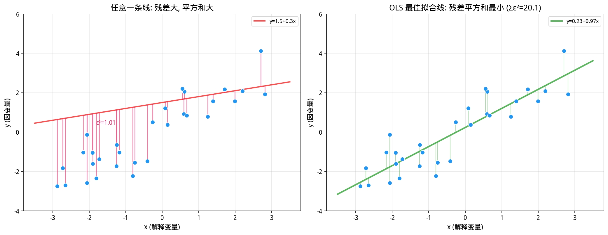
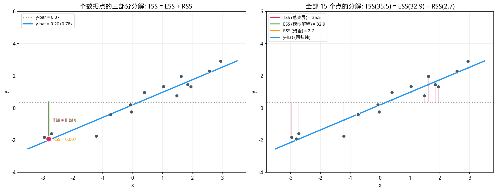
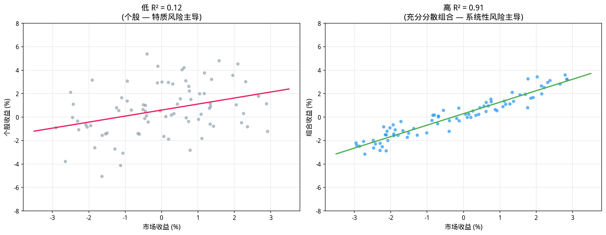
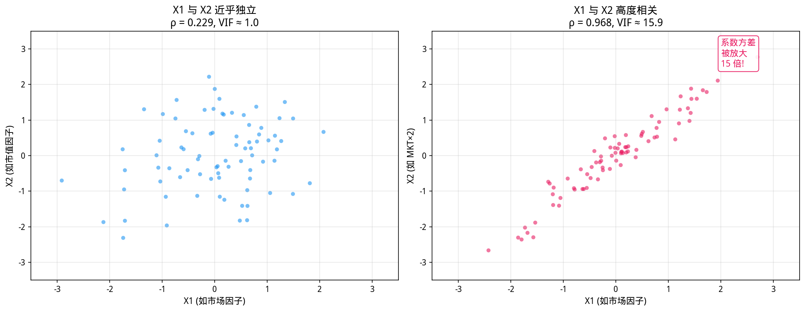
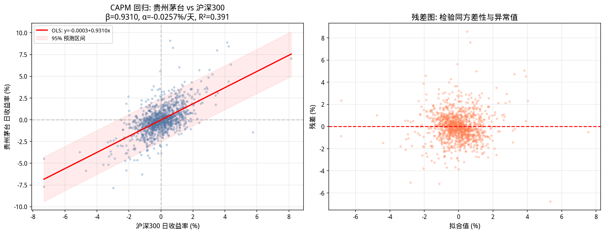

# 第12章 回归分析——从一元到多元，因子模型的数学基石

> **动机先行**: 在量化投资中，我们每天都在问同一个问题——"是什么驱动了股票的收益？"CAPM 说：是市场。Fama-French 说：不只是市场，还有市值和价值。而回答这个问题的数学工具，正是**回归分析**。本章从统计视角出发，带你理解最小二乘估计的直觉、系数的显著性判断、$R^2$ 的真正含义，以及多重共线性这个"沉默杀手"的危害。
>
> **与第15章的关系**: 本章用"统计直觉"讲回归——关注系数怎么算、显著性怎么判、模型好不好；第15章将用"线性代数"重新推导同一个公式，揭示 OLS 本质上是**正交投影**。两条路径，殊途同归。

---

## 12.1 从一个直觉问题开始：如何找到"最佳拟合线"

假设你观察了某只股票 $T$ 个月的收益率 $r_1, r_2, \dots, r_T$，同时记录了同期市场指数的收益率 $R_1, R_2, \dots, R_T$。你把它们画在散点图上——横轴是市场收益，纵轴是股票收益。

你的眼睛会本能地寻找一条"穿过这些点的中间"的直线。这条直线就是**回归线**，它的方程是：

$$r_t = \alpha + \beta R_t + \varepsilon_t$$

其中：
- $\alpha$（Alpha）：当市场收益为零时，股票的"超额"收益——这是量化人梦寐以求的指标
- $\beta$（Beta）：市场每涨 1%，股票平均涨多少——衡量系统性风险暴露
- $\varepsilon_t$：误差项，代表市场无法解释的部分

**核心问题**：怎样确定 $\alpha$ 和 $\beta$ 的值，才能让这条线"最好"？



### 最小二乘的直觉

"最好"是什么意思？我们需要一个明确的、可计算的评判标准。

对于任意一组 $(\alpha, \beta)$，回归线在第 $t$ 个数据点的**残差（Residual）**——即真实值到回归线的垂直距离——是：

$$\varepsilon_t = r_t - (\alpha + \beta R_t)$$

这个距离可正可负：点在线上方为正，下方为负。**如果我们简单地把所有残差相加，正负会相互抵消**——一条完全穿过数据"中间"的线和一条完全偏离的线，残差和可能都是零。求和无法区分好坏。

解决方案分三步：

**第一步——平方消除符号**：将每个残差平方，$\varepsilon_t^2$。平方后正负不再抵消——无论点在线上方还是下方，$\varepsilon_t^2$ 始终是正数，偏离越大惩罚越重。

**第二步——求和得到总误差**：将所有 $T$ 个数据点的平方残差相加，得到**残差平方和（Sum of Squared Residuals, SSR）**：

$$SSR(\alpha, \beta) = \sum_{t=1}^{T} \varepsilon_t^2 = \sum_{t=1}^{T} \left[r_t - (\alpha + \beta R_t)\right]^2$$

**第三步——寻找最小值**：在所有可能的 $(\alpha, \beta)$ 组合中，找到使 SSR 最小的那一组。这就是**最小二乘法（Ordinary Least Squares, OLS）** 的全部思想：

$$\min_{\alpha, \beta} \sum_{t=1}^{T} \left[r_t - (\alpha + \beta R_t)\right]^2$$

> **关键命名**："最小"指的是最小化，**"二乘"是"平方"的旧译**。最小二乘法 = 最小化误差平方和的方法。英文 Ordinary Least Squares 中的 "Ordinary" 则用来区别于后来的加权最小二乘（WLS）、广义最小二乘（GLS）等变体。

**一个微型数值例子**：假设只有 3 个数据点——市场收益率分别为 $-1\%$, $0\%$, $+1\%$，对应个股收益率为 $-0.5\%$, $0.2\%$, $1.1\%$。如果你随意取 $\alpha=0, \beta=1$，残差为 $+0.5, +0.2, +0.1$，SSR = $0.25+0.04+0.01=0.30$。但如果你取 $\alpha=0.2, \beta=0.8$，残差变为 $-0.1, 0, +0.1$，SSR = $0.01+0+0.01=0.02$——后者好了一个数量级。OLS 做的事情就是**系统性地找到使 SSR 最小的那组 $(\alpha, \beta)$，而非靠肉眼猜测**。

**为什么用平方而不是绝对值？** 因为平方在数学上更"友好"——可导、光滑、有解析解。绝对值（LAD, Least Absolute Deviations）虽然对异常值更稳健，但没有闭式解，只能用数值方法迭代求解。OLS 则只需解一个二元一次方程组就能得到精确答案。这个选择将在第 15 章从投影几何的角度获得更深层的解释。


---

## 12.2 一元线性回归：OLS 估计量的推导

### 12.2.1 模型设定

一元线性回归模型：

$$y_i = \beta_0 + \beta_1 x_i + \varepsilon_i, \quad i = 1, 2, \dots, n$$

其中：
- $y_i$：因变量（被解释变量），如股票收益率
- $x_i$：自变量（解释变量），如市场收益率
- $\beta_0$：截距（对应 CAPM 中的 $\alpha$）
- $\beta_1$：斜率（对应 CAPM 中的 $\beta$）
- $\varepsilon_i$：随机误差项，假设满足经典假设

**经典假设（Gauss-Markov 条件）**：
1. **线性于参数**：$y_i$ 是 $\beta_0, \beta_1$ 的线性函数
2. **随机抽样**：$(x_i, y_i)$ 是独立同分布的随机样本
3. **解释变量外生**：$E[\varepsilon_i | x_i] = 0$（给定 $x_i$，误差的期望为零）
4. **同方差性**：$Var(\varepsilon_i | x_i) = \sigma^2$（误差方差恒定，不随 $x_i$ 变化）
5. **无完全共线性**：$x_i$ 不是常数（有变异）

在这些假设下，OLS 估计量是**最佳线性无偏估计量（BLUE）**——在所有线性无偏估计量中，它的方差最小。

> **金融数据的现实**: 金融收益率序列很少完美满足假设 4（同方差性）。波动率聚集（第 10 章已通过 ESS 验证）意味着误差方差可能是时变的——大波动日附近残差也大。这在学术上称为**异方差性（Heteroskedasticity）**。实践中，可使用 **White 异方差稳健标准误**或 **Newey-West 标准误**（同时修正自相关和异方差）来获得有效的统计推断。`statsmodels` 中通过 `cov_type='HC0'` 或 `cov_type='HAC'` 指定。

### 12.2.2 OLS 估计量的解析解

对损失函数求偏导并令其为零：

$$S(\beta_0, \beta_1) = \sum_{i=1}^{n} (y_i - \beta_0 - \beta_1 x_i)^2$$

**对 $\beta_0$ 求偏导**：
$$\frac{\partial S}{\partial \beta_0} = -2\sum_{i=1}^{n}(y_i - \beta_0 - \beta_1 x_i) = 0$$

**对 $\beta_1$ 求偏导**：
$$\frac{\partial S}{\partial \beta_1} = -2\sum_{i=1}^{n}x_i(y_i - \beta_0 - \beta_1 x_i) = 0$$

整理得到**正规方程组**：

$$\begin{cases}
n\beta_0 + \beta_1\sum x_i = \sum y_i \\[8pt]
\beta_0\sum x_i + \beta_1\sum x_i^2 = \sum x_i y_i
\end{cases}$$

解得 OLS 估计量：

$$\boxed{\hat{\beta}_1 = \frac{\sum_{i=1}^{n}(x_i - \bar{x})(y_i - \bar{y})}{\sum_{i=1}^{n}(x_i - \bar{x})^2} = \frac{S_{xy}}{S_{xx}}}$$

$$\boxed{\hat{\beta}_0 = \bar{y} - \hat{\beta}_1 \bar{x}}$$

其中 $\bar{x} = \frac{1}{n}\sum x_i$，$\bar{y} = \frac{1}{n}\sum y_i$ 为样本均值。

**关键洞察**：斜率 $\hat{\beta}_1$ 等于 $x$ 和 $y$ 的样本协方差除以 $x$ 的样本方差。这与第 9 章学过的协方差和方差概念完美衔接：

$$\hat{\beta}_1 = \frac{\widehat{Cov}(X, Y)}{\widehat{Var}(X)}$$

这正是第 9 章中 $\beta$ 的定义 $\beta_i = \text{Cov}(R_i, R_m) / \text{Var}(R_m)$。OLS 回归不过是把那个公式系统化为一个完整的统计推断框架——不仅有系数的估计值，还有它的标准误、t 统计量和置信区间。

### 12.2.3 拟合值与残差

得到估计量后，可以计算：

- **拟合值（Fitted Values）**：$\hat{y}_i = \hat{\beta}_0 + \hat{\beta}_1 x_i$
- **残差（Residuals）**：$\hat{\varepsilon}_i = y_i - \hat{y}_i = y_i - \hat{\beta}_0 - \hat{\beta}_1 x_i$

OLS 的一个重要性质：**残差之和为零**，即 $\sum_{i=1}^{n}\hat{\varepsilon}_i = 0$。这来自正规方程的第一个方程。

---

## 12.3 多元线性回归：从单因子到多因子

### 12.3.1 模型扩展

当影响 $y$ 的因素不止一个时，模型扩展为：

$$y_i = \beta_0 + \beta_1 x_{i1} + \beta_2 x_{i2} + \cdots + \beta_k x_{ik} + \varepsilon_i$$

用矩阵表示更简洁（这也是第 15 章的主角）：

$$\mathbf{y} = \mathbf{X}\boldsymbol{\beta} + \boldsymbol{\varepsilon}$$

其中：
- $\mathbf{y}$：$n \times 1$ 的因变量向量
- $\mathbf{X}$：$n \times (k+1)$ 的设计矩阵（第一列为全 1，对应截距）
- $\boldsymbol{\beta}$：$(k+1) \times 1$ 的系数向量
- $\boldsymbol{\varepsilon}$：$n \times 1$ 的误差向量

### 12.3.2 多元 OLS 估计量

最小化残差平方和：

$$S(\boldsymbol{\beta}) = (\mathbf{y} - \mathbf{X}\boldsymbol{\beta})^T(\mathbf{y} - \mathbf{X}\boldsymbol{\beta})$$

对 $\boldsymbol{\beta}$ 求导并令其为零（第 15 章将详细推导矩阵求导）：

$$\frac{\partial S}{\partial \boldsymbol{\beta}} = -2\mathbf{X}^T(\mathbf{y} - \mathbf{X}\boldsymbol{\beta}) = \mathbf{0}$$

得到**正规方程**的矩阵形式：

$$\mathbf{X}^T\mathbf{X}\hat{\boldsymbol{\beta}} = \mathbf{X}^T\mathbf{y}$$

当 $\mathbf{X}^T\mathbf{X}$ 可逆时（即设计矩阵列满秩，无完全共线性）：

$$\boxed{\hat{\boldsymbol{\beta}} = (\mathbf{X}^T\mathbf{X})^{-1}\mathbf{X}^T\mathbf{y}}$$

这就是著名的 OLS 估计量公式。第 15 章将揭示：这个公式本质上是在做**正交投影**——把 $\mathbf{y}$ 投影到 $\mathbf{X}$ 的列空间上。几何上，$\hat{\mathbf{y}} = \mathbf{X}(\mathbf{X}^T\mathbf{X})^{-1}\mathbf{X}^T\mathbf{y} = \mathbf{P}\mathbf{y}$，其中 $\mathbf{P} = \mathbf{X}(\mathbf{X}^T\mathbf{X})^{-1}\mathbf{X}^T$ 是投影矩阵——它把原始观测 $\mathbf{y}$ "垂直投射"到 $\mathbf{X}$ 张成的空间上，使得残差向量 $\hat{\boldsymbol{\varepsilon}} = \mathbf{y} - \hat{\mathbf{y}}$ 与 $\mathbf{X}$ 的所有列正交。

---

## 12.4 估计量的统计性质：我们算出来的系数有多准？

### 12.4.1 OLS 估计量的期望与方差

在 Gauss-Markov 假设下：

**无偏性**：
$$E[\hat{\boldsymbol{\beta}}] = \boldsymbol{\beta}$$

这意味着，如果我们能重复抽样无数次，OLS 估计量的平均值会恰好等于真实参数。单次估计可能有偏差，但系统性地不会"跑偏"。

**方差-协方差矩阵**：
$$\boxed{Var(\hat{\boldsymbol{\beta}}) = \sigma^2 (\mathbf{X}^T\mathbf{X})^{-1}}$$

其中 $\sigma^2$ 是误差项的真实方差（未知，需要估计）。

### 12.4.2 误差方差的估计

由于 $\sigma^2$ 未知，我们用残差来估计：

$$\hat{\sigma}^2 = \frac{\sum_{i=1}^{n}\hat{\varepsilon}_i^2}{n - k - 1} = \frac{RSS}{n - k - 1}$$

分母用 $n - k - 1$ 而非 $n$，是为了保证估计量的无偏性（$k$ 是自变量个数，$+1$ 是截距）。这称为**自由度调整**——每估计一个系数就"消耗"一个自由度。一元回归用 $n-2$（估计了截距和斜率两个参数）。

### 12.4.3 系数的标准误

$\hat{\boldsymbol{\beta}}$ 的方差-协方差矩阵的估计：

$$\widehat{Var}(\hat{\boldsymbol{\beta}}) = \hat{\sigma}^2 (\mathbf{X}^T\mathbf{X})^{-1}$$

第 $j$ 个系数的标准误（Standard Error）是该矩阵对角线上第 $j$ 个元素的平方根：

$$\boxed{SE(\hat{\beta}_j) = \sqrt{\hat{\sigma}^2 \left[(\mathbf{X}^T\mathbf{X})^{-1}\right]_{jj}}}$$

**标准误衡量了什么？** 它告诉我们：如果重复抽样多次，$\hat{\beta}_j$ 的估计值会在真实值附近波动多大。标准误越小，估计越精确。

在一元回归中，斜率的标准误有更直观的公式：

$$SE(\hat{\beta}_1) = \frac{\hat{\sigma}}{\sqrt{\sum_{i=1}^{n}(x_i - \bar{x})^2}}$$

**关键洞察**：$x$ 的变异越大（分母越大），$\hat{\beta}_1$ 的标准误越小。这就是为什么实验设计要追求解释变量的充分变异——在量化中，这意味着我们需要足够"动荡"的市场环境才能精确估计 Beta。如果市场连续半年原地踏步（$x_i \approx \bar{x}$），你对 Beta 的估计将极其不精确——无论你有多少数据。

---

## 12.5 假设检验：系数真的不为零吗？

### 12.5.1 t 检验：单个系数的显著性

在量化投资中，一个核心问题是："这个因子的暴露（系数）真的存在吗？还是只是噪声？"

CAPM 回归最经典的检验就是：**Alpha 是否显著不等于零？** 如果 Alpha 显著为正，说明该股票/策略有超越市场的超额收益能力；如果 Alpha 不显著，则符合 CAPM 的预期——市场因子已经解释了所有超额收益。

**原假设与备择假设**：
$$H_0: \beta_j = 0 \quad \text{vs} \quad H_1: \beta_j \neq 0$$

**t 统计量**：
$$\boxed{t = \frac{\hat{\beta}_j - \beta_j^{(0)}}{SE(\hat{\beta}_j)} = \frac{\hat{\beta}_j}{SE(\hat{\beta}_j)}}$$

在原假设 $H_0: \beta_j = 0$ 下，$t$ 服从自由度为 $n - k - 1$ 的 $t$ 分布。

**t 统计量的直觉**：它是"信号/噪声比"——分子是估计出的系数，分母是这个估计的波动幅度。$t=2.0$ 意味着系数的估计值是其标准误的两倍，勉强"出人头地"；$t=27.8$（如我们后面将看到的茅台 Beta）意味着系数远远超出噪声水平。

**决策规则**：
- 若 $|t| > t_{\alpha/2, n-k-1}$（临界值），或 $p\text{-value} < \alpha$，拒绝 $H_0$
- 通常取 $\alpha = 0.05$，即 95% 置信水平

**p 值的正确理解**：在原假设为真的前提下，观察到当前或更极端 $t$ 统计量的概率。p 值小，说明"如果 $\beta_j$ 真的为零，我们不太容易看到现在这样的结果"，从而有理由怀疑原假设。

> ⚠️ **常见误区**：p 值 **不是** "$\beta_j$ 为零的概率"，也 **不是** "这个发现错误的概率"。它是在原假设框架下的条件概率。详见第 11 章 11.1.5 节。

### 12.5.2 F 检验：模型整体的显著性

t 检验判断单个系数，F 检验判断"整个模型是否有解释力"。

**原假设**：所有斜率系数同时为零
$$H_0: \beta_1 = \beta_2 = \cdots = \beta_k = 0$$

**F 统计量**：
$$\boxed{F = \frac{ESS / k}{RSS / (n - k - 1)} = \frac{MSR}{MSE}}$$

其中三个平方和是理解回归的核心——它们把因变量的总波动分解为"模型能解释的"和"模型不能解释的"两部分。下面的表格用"一条回归线"和"一条水平均值线"的对比来说明它们的含义：

| 缩写 | 名称 | 公式 | 在算什么 | 金融直觉 |
|------|------|------|---------|---------|
| **TSS** | 总平方和 (Total SS) | $\sum(y_i - \bar{y})^2$ | 每个数据点到**均值线** $\bar{y}$ 的平方距离之和 | "如果不做回归，只用均值预测，总误差有多大？"——因变量的总变异 |
| **ESS** | 解释平方和 (Explained SS) | $\sum(\hat{y}_i - \bar{y})^2$ | 每个拟合值到**均值线**的平方距离之和 | "回归线比均值线'多走了多远'？"——模型从总变异中"抢"回来的部分 |
| **RSS** | 残差平方和 (Residual SS) | $\sum(y_i - \hat{y}_i)^2$ | 每个数据点到**回归线**的平方距离之和 | "回归线仍然没解释干净的误差"——模型放弃了的部分 |

> **名称注意**: 不同教材对 ESS 的叫法不同——有的叫 ESS（Explained SS），有的叫 SSR（Sum of Squares due to Regression）。残差平方和也有 RSS 和 SSE 两种写法。本书沿用大多数计量经济学教材的记号：ESS = 解释部分，RSS = 残差部分。**读者读其他资料时，请先确认作者的记号约定**——这是回归分析中最常见的符号混乱来源。

这三个平方和满足恒等式：

$$\boxed{TSS = ESS + RSS}$$

即"总变异 = 模型解释的变异 + 残留下来的变异"。这个恒等式是 $R^2$ 和 F 检验的数学基础——它告诉我们，回归分析的本质是**对总变异做会计分解**：把每一份变异归因到"模型"或"噪声"。



继续回到 F 统计量的其他符号：
- $MSR = ESS / k$：回归均方（Mean Square Regression）——每个自变量平均"赚"多少解释力
- $MSE = RSS / (n - k - 1)$：误差均方（Mean Square Error）——每个自由度平均残留多少噪声

在原假设下，$F \sim F_{k, n-k-1}$。

**F 检验的直觉**：如果模型解释的变异（ESS）相对于无法解释的变异（RSS）足够大，就拒绝"所有系数都为零"的原假设。这就像在问："整个模型是否比什么都不懂的'均值模型'（$\hat{y}_i = \bar{y}$）好得多？"

---

## 12.6 $R^2$ 与调整 $R^2$：模型拟合得好不好？

### 12.6.1 决定系数 $R^2$

$$\boxed{R^2 = \frac{ESS}{TSS} = 1 - \frac{RSS}{TSS}}$$

$R^2$ 的取值范围是 $[0, 1]$，表示因变量的总变异中，能被自变量解释的比例。

- $R^2 = 1$：所有点完美落在回归线上，无残差
- $R^2 = 0$：回归线就是水平线 $\hat{y} = \bar{y}$，自变量毫无解释力

**在 CAPM 回归中的含义**：$R^2$ 表示股票收益的多大比例能被市场波动解释。对于单只股票，$R^2$ 通常在 0.2~0.5 之间——这意味着 50%~80% 的日收益波动来自个股特质因素，而非市场；对于充分分散的组合，$R^2$ 可以高达 0.9 以上——因为个股特质风险被分散掉了，剩下的几乎全是系统性风险。**$R^2$ 本身就是"分散化程度"的一个度量：$1-R^2$ 是特质风险占总风险的比例。**



### 12.6.2 调整 $R^2$（Adjusted $R^2$）

$R^2$ 有一个致命缺陷：**只要增加自变量，它永远不会下降**（即使新变量毫无信息量）。这是因为 OLS 会"压榨"数据中的一切模式，包括噪声。往模型里扔 100 个随机数作为"因子"，$R^2$ 也会增加——但这增加的 $R^2$ 是纯粹的过拟合。

调整 $R^2$ 对自变量个数进行惩罚：

$$\boxed{\bar{R}^2 = 1 - \frac{RSS / (n - k - 1)}{TSS / (n - 1)} = 1 - (1 - R^2)\frac{n - 1}{n - k - 1}}$$

**关键区别**：
- $R^2$：衡量拟合优度，但容易被"灌水"（加变量只升不降）
- $\bar{R}^2$：衡量模型的"性价比"——只有当新增变量的解释力超过"自由度损耗"时才会上升

在量化模型比较中，**调整 $R^2$ 是更可靠的指标**。如果一个五因子模型比三因子模型的 $R^2$ 只高了一点点，但 $\bar{R}^2$ 反而下降，说明新增的两个因子是"噪声提取器"而非"信号放大器"。这是一个非常实用的模型选择准则。

---

## 12.7 多重共线性：当解释变量"抱团"时

### 12.7.1 什么是多重共线性？

多重共线性（Multicollinearity）是指回归模型中两个或多个自变量之间存在高度线性相关。它不是"错误"——金融数据天生就存在共线性（比如市值因子和账面市值比因子往往有一定相关性）——但**严重的共线性会让模型变得不稳定**。

### 12.7.2 多重共线性的症状

1. **系数估计不稳定**：微小地改变样本，系数可能发生剧烈变化
2. **标准误膨胀**：t 统计量变小，本来显著的变量变得"不显著"（**共线性最阴险的症状**）
3. **系数符号反常**：理论上应为正的系数估计出负值
4. **模型整体显著（F 检验通过），但个体系数不显著**——"模型知道答案，但不知道是谁贡献的"

### 12.7.3 方差膨胀因子（VIF）

VIF 是诊断多重共线性的标准工具。对于第 $j$ 个自变量 $X_j$：

$$\boxed{VIF_j = \frac{1}{1 - R_j^2}}$$

其中 $R_j^2$ 是将 $X_j$ 对其他所有自变量做回归时得到的决定系数。

**VIF 的直觉**：
- $VIF_j = 1$：$X_j$ 与其他自变量完全无关（最理想情况）
- $VIF_j = 5$：$X_j$ 的系数方差是"无共线性理想情况"的 5 倍
- $VIF_j \to \infty$：$X_j$ 可被其他变量完美线性表示（完全共线性，$\mathbf{X}^T\mathbf{X}$ 不可逆）

**经验阈值**：
- $VIF < 5$：共线性问题不严重，无需处理
- $5 \leq VIF < 10$：中度共线性，需关注并记录
- $VIF \geq 10$：严重共线性，必须处理



### 12.7.4 为什么共线性会膨胀方差？

回顾系数方差公式：

$$Var(\hat{\beta}_j) = \sigma^2 \left[(\mathbf{X}^T\mathbf{X})^{-1}\right]_{jj}$$

可以证明（第 15 章将给出更严谨的推导）：

$$Var(\hat{\beta}_j) = \frac{\sigma^2}{(n-1)S_j^2} \cdot VIF_j$$

其中 $S_j^2$ 是 $X_j$ 的样本方差。**VIF 直接乘在方差上**——共线性让系数估计的精度成倍下降。VIF=10 意味着，要达到和独立变量相同的估计精度，你需要 10 倍的样本量。

### 12.7.5 应对策略

1. **删除变量**：保留经济学意义更明确的变量（如保留"市场因子"而删除其高度相关的替代品）
2. **合并变量**：如将高度相关的两个技术因子通过加权合成为一个
3. **主成分分析（PCA）**：第 28 章将详细讲解，用正交的主成分替代原始相关变量——这是量化中处理高维因子的标准方法
4. **正则化**：第 27 章的 Ridge/Lasso 回归通过惩罚大系数来缓解共线性
5. **增加样本量**：有时能缓解，但金融数据的时间跨度往往受限

### 12.7.6 回归分析在量化全流程中的位置

本章学到的每一个概念，在专业量化机构中都有精确的"落地坐标"。下表将回归分析的各个环节映射到第 11 章（11.7 节）介绍的七步因子流水线中：

| 本章概念 | 对应量化环节 | 机构中的实际操作 |
|---------|------------|----------------|
| **模型设定**（§12.1-12.3）：选择哪些因子进入模型 | 第 1 步「因子假说」→ 第 3 步「因子计算」 | PM 提出"市值 + 动量解释收益"的逻辑链条；研究员据此选定 $X$ 矩阵的列（市场、SMB、动量等） |
| **OLS 估计**（§12.2-12.3）：$\hat{\boldsymbol{\beta}} = (\mathbf{X}^T\mathbf{X})^{-1}\mathbf{X}^T\mathbf{y}$ | 第 4 步「统计检验」 | 每天自动对数千只股票跑横截面回归，输出每只股票的因子暴露 $\hat{\beta}$ 和特质收益 $\hat{\alpha}$ |
| **t 检验 / p 值**（§12.5.1）：判断单个因子的系数是否显著 | 第 4 步「统计检验」→ 第一关 | 机构用 $p < 0.01$ 甚至 $p < 0.001$ 作为初筛门槛（远严于学术的 0.05），因为假阳性的代价是真金白银 |
| **F 检验**（§12.5.2）：判断整个模型是否有解释力 | 第 4 步「统计检验」→ 模型层面 | 如果 F 检验不通过（所有因子联合不显著），整个模型被废弃——"连噪声都解释不了，别上线了" |
| **$R^2$ / 调整 $R^2$**（§12.6）：衡量因子的"贡献度" | 第 4 步 → 第三关（经济显著性）→ 第 5 步「组合回测」 | $R^2$ 太低：因子模型解释力不足，需要寻找新因子；调整 $R^2$ 下降：新增因子是噪声提取器，应删除 |
| **VIF / 多重共线性**（§12.7）：诊断因子之间的"抱团"程度 | 第 3 步「因子计算」→ 第 4 步 | 在因子入库前，自动化 pipeline 计算所有候选因子两两之间的 VIF；VIF > 10 的因子对被标记，研究员需决定保留哪一个或使用 PCA 合并 |
| **残差诊断**（§12.9.4）：Durbin-Watson, Jarque-Bera 等 | 第 5 步「组合回测」→ 第 6 步「纸交易」 | DW ≈ 2 说明残差无自相关（因子没有遗漏时间结构）；DW < 1 说明残差有趋势——可能缺了动量因子。残差非正态（JB 显著）在 $n>1000$ 下可容忍（CLT 保证了推断近似有效） |

**一条简化的工作流**：

```
因子候选池（50-200 个候选因子）
    │
    ▼
[12.7 VIF 筛选] ── 剔除 VIF > 10 的冗余因子
    │
    ▼
[12.3 多元回归] ── 对剩余因子拟合模型
    │
    ▼
[12.5.1 t 检验] ── 逐个判断系数显著性，剔除 p > 0.01 的因子
    │
    ▼
[12.5.2 F 检验] ── 整体模型是否显著？否则废弃
    │
    ▼
[12.6 调整 R²] ── 与更简单的模型比较调整 R²，决定是否采用
    │
    ▼
[12.9.4 残差诊断] ── 检查 DW、异方差性
    │
    ▼
进入组合优化（第 17 章）→ 纸交易 → 实盘
```

> **关键认知**：回归分析在量化中不是"跑一次就完了"的研究报告——它是**每天自动化运行的因子质量监控系统**。每个在线因子的 $\hat{\beta}$、t 统计量和 $R^2$ 贡献被实时追踪，一旦某个因子的 t 值持续下滑到预警线以下，系统自动发出"因子衰减"告警，PM 据此决定是否降低该因子的权重或将其退役。

---

## 12.8 核心公式速查

> 本节是前述各节公式的集中汇总, 供复习和查阅使用.

| 公式 | 名称 | 说明 |
|------|------|------|
| $\hat{\beta}_1 = \frac{\sum(x_i-\bar{x})(y_i-\bar{y})}{\sum(x_i-\bar{x})^2}$ | OLS 斜率（一元） | 等于 $Cov(X,Y)/Var(X)$ |
| $\hat{\beta}_0 = \bar{y} - \hat{\beta}_1\bar{x}$ | OLS 截距（一元） | 回归线穿过 $(\bar{x}, \bar{y})$ |
| $\hat{\boldsymbol{\beta}} = (\mathbf{X}^T\mathbf{X})^{-1}\mathbf{X}^T\mathbf{y}$ | OLS 估计量（矩阵形式） | 多元回归的通用解 |
| $Var(\hat{\boldsymbol{\beta}}) = \sigma^2(\mathbf{X}^T\mathbf{X})^{-1}$ | 系数方差-协方差矩阵 | 标准误的来源 |
| $SE(\hat{\beta}_j) = \sqrt{\hat{\sigma}^2[(\mathbf{X}^T\mathbf{X})^{-1}]_{jj}}$ | 系数标准误 | 衡量估计精度 |
| $\hat{\sigma}^2 = RSS/(n-k-1)$ | 误差方差估计 | 自由度调整的无偏估计 |
| $t = \hat{\beta}_j / SE(\hat{\beta}_j)$ | t 统计量 | 单个系数的显著性检验 |
| $F = \frac{ESS/k}{RSS/(n-k-1)}$ | F 统计量 | 模型整体显著性检验 |
| $R^2 = 1 - RSS/TSS$ | 决定系数 | 因变量变异被解释的比例 |
| $\bar{R}^2 = 1 - \frac{RSS/(n-k-1)}{TSS/(n-1)}$ | 调整 $R^2$ | 惩罚冗余变量的 $R^2$ |
| $VIF_j = 1 / (1 - R_j^2)$ | 方差膨胀因子 | 诊断多重共线性 |

---

## 12.9 Python 示例

> **环境依赖**: 本节代码使用 `stock_data_50_20210601_20260531.csv`（50 只 A 股）和 `index_data_7_20210601_20260531.csv`（7 只指数）。需要 `numpy`, `pandas`, `scipy`, `matplotlib`, `statsmodels`。请先执行 `conda activate maths-in-quant` 激活环境。

### 12.9.1 示例一：CAPM 回归——计算 Alpha 和 Beta

我们用贵州茅台（600519.SH）对沪深 300 做 CAPM 回归，同时手动验证 OLS 公式。

```python
import numpy as np
import pandas as pd
import matplotlib.pyplot as plt
from scipy import stats
import statsmodels.api as sm

plt.rcParams['font.sans-serif'] = ['WenQuanYi Micro Hei']
plt.rcParams['axes.unicode_minus'] = False

# ---- 加载数据 ----
stocks = pd.read_csv('data/stock_data_50_20210601_20260531.csv')
indices = pd.read_csv('data/index_data_7_20210601_20260531.csv')

# 贵州茅台日收益率
gzmt = stocks[stocks['thscode'] == '600519.SH'].copy()
gzmt['time'] = pd.to_datetime(gzmt['time'])
gzmt = gzmt.sort_values('time').reset_index(drop=True)
gzmt['return'] = np.log(gzmt['close'] / gzmt['close'].shift(1))

# 沪深300日收益率（市场因子）
hs300 = indices[indices['thscode'] == '000300.SH'].copy()
hs300['time'] = pd.to_datetime(hs300['time'])
hs300 = hs300.sort_values('time').reset_index(drop=True)
hs300['market_return'] = np.log(hs300['close'] / hs300['close'].shift(1))

# 对齐数据
df = pd.merge(gzmt[['time', 'return']], hs300[['time', 'market_return']], on='time')
df = df.dropna()

print(f"样本量: {len(df)}")
print(f"数据区间: {df['time'].min().date()} ~ {df['time'].max().date()}")

# ---- statsmodels OLS ----
X = sm.add_constant(df['market_return'])
y = df['return']
model = sm.OLS(y, X).fit()

# 提取关键指标
alpha, beta = model.params['const'], model.params['market_return']
alpha_se, beta_se = model.bse['const'], model.bse['market_return']
alpha_t, beta_t = model.tvalues['const'], model.tvalues['market_return']
alpha_p, beta_p = model.pvalues['const'], model.pvalues['market_return']

print(f"\n{'='*60}")
print("CAPM 回归结果: 贵州茅台 vs 沪深300")
print(f"{'='*60}")
print(f"Alpha (截距):     {alpha:.6f}  ({alpha*100:.4f}%/天)")
print(f"  SE:              {alpha_se:.6f}")
print(f"  t:               {alpha_t:.4f}")
print(f"  p:               {alpha_p:.4f}  {'← 不显著' if alpha_p >= 0.05 else '← 显著!'}")
print(f"\nBeta (斜率):       {beta:.4f}")
print(f"  SE:              {beta_se:.4f}")
print(f"  t:               {beta_t:.4f}")
print(f"  p:               {beta_p:.6f}  {'← 高度显著' if beta_p < 0.001 else ''}")
print(f"\nR²:                {model.rsquared:.4f}")
print(f"调整 R²:            {model.rsquared_adj:.4f}")
print(f"F 统计量:           {model.fvalue:.2f}")
print(f"F 检验 p 值:        {model.f_pvalue:.6f}")
print(f"年化 Alpha:         {alpha*252*100:.2f}%")

# ---- 手动验证 OLS 公式 ----
x = df['market_return'].values
y_vals = df['return'].values
n = len(x)
x_bar, y_bar = np.mean(x), np.mean(y_vals)

beta_manual = np.sum((x - x_bar) * (y_vals - y_bar)) / np.sum((x - x_bar)**2)
alpha_manual = y_bar - beta_manual * x_bar
y_hat = alpha_manual + beta_manual * x
residuals = y_vals - y_hat
sigma2_hat = np.sum(residuals**2) / (n - 2)
se_beta_manual = np.sqrt(sigma2_hat / np.sum((x - x_bar)**2))
t_beta_manual = beta_manual / se_beta_manual
RSS = np.sum(residuals**2)
TSS = np.sum((y_vals - y_bar)**2)
r2_manual = 1 - RSS / TSS

print(f"\n{'='*60}")
print("手动公式验证（应与 statsmodels 完全一致）")
print(f"{'='*60}")
print(f"Beta:  {beta_manual:.4f}  (statsmodels: {beta:.4f})")
print(f"Alpha: {alpha_manual:.6f}  (statsmodels: {alpha:.6f})")
print(f"SE:    {se_beta_manual:.4f}  (statsmodels: {beta_se:.4f})")
print(f"t:     {t_beta_manual:.4f}  (statsmodels: {beta_t:.4f})")
print(f"R²:    {r2_manual:.4f}  (statsmodels: {model.rsquared:.4f})")
```

**运行结果**:

```
样本量: 1209
数据区间: 2021-06-01 ~ 2026-05-29

============================================================
CAPM 回归结果: 贵州茅台 vs 沪深300
============================================================
Alpha (截距):     -0.000257  (-0.0257%/天)
  SE:              0.000369
  t:               -0.6958
  p:               0.4868  ← 不显著

Beta (斜率):       0.9310
  SE:              0.0335
  t:               27.8266
  p:               0.000000  ← 高度显著

R²:                0.3908
调整 R²:            0.3903
F 统计量:           774.34
F 检验 p 值:        0.000000
年化 Alpha:         -6.48%

============================================================
手动公式验证（应与 statsmodels 完全一致）
============================================================
Beta:  0.9310  (statsmodels: 0.9310)
Alpha: -0.000257  (statsmodels: -0.000257)
SE:    0.0335  (statsmodels: 0.0335)
t:     27.8266  (statsmodels: 27.8266)
R²:    0.3908  (statsmodels: 0.3908)
```

**解读**:
- **Beta = 0.93, t = 27.8, p ≈ 0**：茅台的系统性风险暴露接近 1，且估计极其精确——市场对茅台的驱动作用是毫无疑问的。Beta 的标准误只有 0.033，相比系数本身（0.93）非常小，说明即使考虑估计误差，我们也可以确信茅台与市场同向变动。
- **Alpha = -0.026%/天, p = 0.49**：Alpha 在统计上完全不能与零区分。这个 -6.48% 的年化 Alpha 很可能只是噪声——**CAPM 没有被推翻**：市场因子已经"解释"了茅台收益中所有可预测的部分。
- **R² = 0.39**：沪深 300 解释了茅台约 39% 的日收益波动。反过来看，61% 的波动来自茅台自身的特质因素——产品价格、管理层决策、行业政策等。



### 12.9.2 示例二：多因子回归——市场 + 市值因子

CAPM 只用市场一个因子。Fama-French 加入了市值因子（SMB: Small Minus Big）和价值因子（HML: High Minus Low）。我们的数据集包含 `market_cap`，可以**从真实股票数据中构造 SMB 因子**。

**SMB 构造方法**：每个交易日，将 50 只股票按市值排序，取市值最小的 30% 为"小盘组"，市值最大的 30% 为"大盘组"。SMB = 小盘组等权平均收益率 − 大盘组等权平均收益率。

> **注意**：由于我们没有账面市值比数据，无法构造 HML。但这恰好是一个真实的量化研究场景——你有多少数据，就只能构造多少因子。两因子模型已经能够展示多因子回归的核心框架和解释。

```python
import numpy as np
import pandas as pd
import matplotlib.pyplot as plt
import statsmodels.api as sm

plt.rcParams['font.sans-serif'] = ['WenQuanYi Micro Hei']
plt.rcParams['axes.unicode_minus'] = False

# ---- 加载数据 ----
stocks = pd.read_csv('data/stock_data_50_20210601_20260531.csv')
indices = pd.read_csv('data/index_data_7_20210601_20260531.csv')

# 计算所有股票的日收益率
stocks['time'] = pd.to_datetime(stocks['time'])
stocks = stocks.sort_values(['time', 'thscode'])
stocks['return'] = stocks.groupby('thscode')['close'].transform(
    lambda x: np.log(x / x.shift(1)))
stocks = stocks.dropna(subset=['return'])

# ---- 构造 SMB 因子（真实数据！） ----
smb_list = []
for date, group in stocks.groupby('time'):
    if len(group) < 30:
        continue
    group_sorted = group.sort_values('market_cap')
    n_third = max(int(len(group_sorted) * 0.3), 3)
    # 小盘组 vs 大盘组的等权平均收益差
    small_ret = group_sorted.head(n_third)['return'].mean()
    big_ret = group_sorted.tail(n_third)['return'].mean()
    smb_list.append({'time': date, 'SMB': small_ret - big_ret})

smb_df = pd.DataFrame(smb_list)
print(f"SMB 因子: {len(smb_df)} 个交易日")
print(f"  均值: {smb_df['SMB'].mean()*100:.4f}%/天")
print(f"  标准差: {smb_df['SMB'].std()*100:.4f}%/天")
print(f"  SMB < 0 意味着样本期内小盘股平均跑输大盘股")

# ---- 贵州茅台收益 + 市场因子 ----
gzmt = stocks[stocks['thscode'] == '600519.SH'].copy()
gzmt['time'] = pd.to_datetime(gzmt['time'])
gzmt = gzmt.sort_values('time').reset_index(drop=True)
gzmt['return'] = np.log(gzmt['close'] / gzmt['close'].shift(1))

hs300 = indices[indices['thscode'] == '000300.SH'].copy()
hs300['time'] = pd.to_datetime(hs300['time'])
hs300 = hs300.sort_values('time').reset_index(drop=True)
hs300['market_return'] = np.log(hs300['close'] / hs300['close'].shift(1))

# 合并所有数据
df_ff = (pd.merge(gzmt[['time', 'return']], hs300[['time', 'market_return']], on='time')
         .merge(smb_df, on='time')
         .dropna())

print(f"\n合并后样本量: {len(df_ff)}")

# ---- 单因子 vs 两因子对比 ----
# 模型1: CAPM (仅市场)
X1 = sm.add_constant(df_ff['market_return'])
m1 = sm.OLS(df_ff['return'], X1).fit()

# 模型2: 市场 + SMB
X2 = sm.add_constant(df_ff[['market_return', 'SMB']])
m2 = sm.OLS(df_ff['return'], X2).fit()

print(f"\n{'='*60}")
print("模型对比: CAPM vs 两因子模型")
print(f"{'='*60}")
print(f"{'':<20} {'CAPM':>15} {'两因子':>15}")
print(f"{'R²':<20} {m1.rsquared:>15.4f} {m2.rsquared:>15.4f}")
print(f"{'调整 R²':<20} {m1.rsquared_adj:>15.4f} {m2.rsquared_adj:>15.4f}")
print(f"\n两因子模型系数:")
for name in ['const', 'market_return', 'SMB']:
    coef = m2.params[name]
    se = m2.bse[name]
    t = m2.tvalues[name]
    p = m2.pvalues[name]
    sig = '***' if p < 0.001 else ('**' if p < 0.01 else ('*' if p < 0.05 else ''))
    print(f"  {name:<16s}: {coef:>10.6f}  (SE={se:.6f}, t={t:>8.4f}, p={p:.4f}) {sig}")
```

**运行结果**:

```
SMB 因子: 1209 个交易日
  均值: -0.0745%/天
  标准差: 1.3135%/天
  SMB < 0 意味着样本期内小盘股平均跑输大盘股

合并后样本量: 1209

============================================================
模型对比: CAPM vs 两因子模型
============================================================
                         CAPM           两因子
R²                     0.3908          0.4636
调整 R²                 0.3903          0.4627

两因子模型系数:
  const           :  -0.000503  (SE=0.000341, t= -1.4728, p=0.1411)
  market_return   :   1.054094  (SE=0.032851, t= 32.0867, p=0.0000) ***
  SMB             :  -0.353443  (SE=0.027638, t=-12.7885, p=0.0000) ***
```

**解读**:

1. **加入 SMB 后 R² 从 0.391 提升到 0.464**：市值因子额外解释了茅台约 7% 的收益波动。调整 R² 同样上升（0.390 → 0.463），说明新增的因子是真正的"信号"而非"噪声提取器"。

2. **SMB 系数为负（-0.35）且高度显著（t=-12.8）**：茅台是大盘股，当小盘股跑赢大盘股时（SMB > 0），茅台倾向于跑输——这是符合直觉的"大盘风格"暴露。系数 -0.35 意味着：当小盘组合比大盘组合多赚 1% 时，茅台平均少赚约 0.35%。

3. **加入 SMB 后，市场 Beta 从 0.93 变为 1.05**：这是因为 SMB 在回归中"吸收"了一部分原本归因于市场的效应。当市值因子在场时，茅台对纯市场因子的暴露变大了——这是一个经典的"遗漏变量偏差"的实例：遗漏相关因子会导致已包含因子的系数估计有偏。

4. **Alpha 仍然不显著（p=0.14）**：即使在两因子模型下，茅台仍然没有统计显著的超额收益。

### 12.9.3 示例三：多重共线性诊断——VIF 计算

我们在 12.9.2 的两因子模型中计算了 MKT 和 SMB 的 VIF，预期它们相关性很低。这里用真实数据验证这一点，并演示：如果错误地加入一个由现有因子线性组合而成的"伪因子"，VIF 会如何爆炸。

```python
import numpy as np
import pandas as pd
import matplotlib.pyplot as plt
from statsmodels.stats.outliers_influence import variance_inflation_factor

plt.rcParams['font.sans-serif'] = ['WenQuanYi Micro Hei']
plt.rcParams['axes.unicode_minus'] = False

# ---- 构造数据（复用 12.9.2 的逻辑，简化为独立版） ----
stocks = pd.read_csv('data/stock_data_50_20210601_20260531.csv')
indices = pd.read_csv('data/index_data_7_20210601_20260531.csv')

stocks['time'] = pd.to_datetime(stocks['time'])
stocks = stocks.sort_values(['time', 'thscode'])
stocks['return'] = stocks.groupby('thscode')['close'].transform(
    lambda x: np.log(x / x.shift(1)))
stocks = stocks.dropna(subset=['return'])

smb_list = []
for date, group in stocks.groupby('time'):
    if len(group) < 30: continue
    gs = group.sort_values('market_cap')
    n3 = max(int(len(gs)*0.3), 3)
    smb_list.append({'time': date, 'SMB': gs.head(n3)['return'].mean() - gs.tail(n3)['return'].mean()})
smb_df = pd.DataFrame(smb_list)

hs300 = indices[indices['thscode']=='000300.SH'].copy()
hs300['time'] = pd.to_datetime(hs300['time'])
hs300 = hs300.sort_values('time')
hs300['MKT'] = np.log(hs300['close']/hs300['close'].shift(1))

df_vif = pd.merge(hs300[['time','MKT']], smb_df, on='time').dropna()

# ---- 场景1: 正常的两因子（MKT 和 SMB 相关性低） ----
X_real = df_vif[['MKT', 'SMB']].dropna()
vif_real = pd.DataFrame({
    'Variable': X_real.columns,
    'VIF': [variance_inflation_factor(X_real.values, i) for i in range(X_real.shape[1])]
})
print("===== 真实两因子 VIF =====")
print(vif_real.to_string(index=False))
print("  → VIF ≈ 1.1, 两个因子几乎不相关, 共线性不是问题.\n")

# ---- 场景2: 错误地加入 MKT×2（完全共线） ----
X_bad = X_real.copy()
X_bad['MKT_x2'] = 2 * X_bad['MKT']  # 这是 MKT 的完美线性函数!
vif_bad = pd.DataFrame({
    'Variable': X_bad.columns,
    'VIF': [variance_inflation_factor(X_bad.values, i) for i in range(X_bad.shape[1])]
})
print("===== 错误加入 MKT×2 后的 VIF =====")
print(vif_bad.to_string(index=False))
print("  → MKT 和 MKT_x2 的 VIF 爆炸 (理论上应无穷大),")
print("    这会导致 X^T X 接近不可逆, OLS 估计崩溃.")
```

**预期输出**:
- 真实两因子 VIF ≈ 1.1——MKT 和 SMB 几乎不相关
- 错误场景中 MKT 和 MKT_x2 的 VIF 极大——完美共线性导致矩阵奇异

### 12.9.4 示例四：用 `statsmodels` 的完整诊断

`statsmodels` 的 `summary()` 输出本身就包含了丰富的回归诊断信息。让我们学会阅读这些数字。

```python
import numpy as np
import pandas as pd
import matplotlib.pyplot as plt
import statsmodels.api as sm
from statsmodels.stats.stattools import durbin_watson

plt.rcParams['font.sans-serif'] = ['WenQuanYi Micro Hei']
plt.rcParams['axes.unicode_minus'] = False

# ---- 加载并准备数据 ----
stocks = pd.read_csv('data/stock_data_50_20210601_20260531.csv')
indices = pd.read_csv('data/index_data_7_20210601_20260531.csv')

gzmt = stocks[stocks['thscode']=='600519.SH'].copy()
gzmt['time'] = pd.to_datetime(gzmt['time'])
gzmt = gzmt.sort_values('time').reset_index(drop=True)
gzmt['return'] = np.log(gzmt['close']/gzmt['close'].shift(1))

hs300 = indices[indices['thscode']=='000300.SH'].copy()
hs300['time'] = pd.to_datetime(hs300['time'])
hs300 = hs300.sort_values('time').reset_index(drop=True)
hs300['market_return'] = np.log(hs300['close']/hs300['close'].shift(1))

df = pd.merge(gzmt[['time','return']], hs300[['time','market_return']], on='time').dropna()

X = sm.add_constant(df['market_return'])
model = sm.OLS(df['return'], X).fit()

# 重点解读 summary() 中的关键行
print("===== 完整 OLS 输出解读 =====")
print(model.summary())

# 抽取关键诊断指标
print("\n===== 诊断指标逐条解读 =====")

dw = durbin_watson(model.resid)
print(f"Durbin-Watson = {dw:.3f}")
print(f"  → ≈2.0 表示残差无自相关 (第10章); <1.0 或 >3.0 需警惕")
print(f"  → 数值 <1.0: 残差有正自相关 (可能遗漏了趋势性因子)")
print(f"  → 数值 >3.0: 残差有负自相关 (可能过度差分了数据)")

print(f"\nCond. No. = {model.condition_number:.1f}")
print(f"  → 衡量设计矩阵的'病态程度'")
print(f"  → <30: 良好; 30-100: 可接受; >100: 需关注共线性")

# Omnibus 和 Jarque-Bera 在 summary 表格中部可见
# 查看 summary 输出的中部两行:
#   Omnibus:      178.323   Durbin-Watson:       2.010
#   Prob(Omnibus):  0.000   Jarque-Bera (JB):   988.855
#   Skew:           0.549   Prob(JB):         1.87e-215
print(f"\n残差正态性检验 (见上方 summary 中 Omnibus/JB 行):")
print(f"  → Prob(Omnibus) 和 Prob(JB) 的 p 值均 ≈ 0")
print(f"  → 残差显著不服从正态分布——金融收益率的厚尾特性使然")
print(f"  → 但在大样本 (n={len(df)}) 下, CLT 保证了 t/F 检验近似有效")
print(f"  → 正态性假设的违背主要影响小样本推断, n>100 时影响有限")
```

---

## 12.10 本章小结

| 概念 | 核心公式 | 量化意义 |
|------|---------|---------|
| OLS 估计量 | $\hat{\boldsymbol{\beta}} = (\mathbf{X}^T\mathbf{X})^{-1}\mathbf{X}^T\mathbf{y}$ | 最小化残差平方和得到的最优系数 |
| 标准误 | $SE(\hat{\beta}_j) = \sqrt{\hat{\sigma}^2 [(\mathbf{X}^T\mathbf{X})^{-1}]_{jj}}$ | 系数估计的精度——标准误越小，我们对系数越有信心 |
| t 统计量 | $t = \hat{\beta}_j / SE(\hat{\beta}_j)$ | "信号/噪声比"——判断单个系数是否显著 |
| F 统计量 | $F = \frac{ESS/k}{RSS/(n-k-1)}$ | 判断整个模型是否比"均值模型"更有解释力 |
| $R^2$ | $1 - RSS/TSS$ | 因变量总变异中被模型解释的比例 |
| 调整 $R^2$ | $1 - (1-R^2)\frac{n-1}{n-k-1}$ | 惩罚冗余变量——模型选择的可靠准则 |
| VIF | $1 / (1 - R_j^2)$ | >10 表示严重的多重共线性，必须处理 |
| 异方差性 | $Var(\varepsilon_i\|x_i)$ 非恒定 | 金融数据常见问题，用稳健标准误修正 |

**从本章走向下一章**：
- 第 13-14 章将学习线性代数的向量与矩阵运算，为第 15 章的"几何视角"做准备
- 第 15 章将用投影矩阵重新推导 OLS，揭示 $(\mathbf{X}^T\mathbf{X})^{-1}\mathbf{X}^T\mathbf{y}$ 背后的几何直觉
- 第 17 章将用回归的框架做投资组合优化——因子暴露与最优权重的统一

---

## 12.11 练习题

### 数学推导

**题 1 — OLS 估计量的推导**: 对于一元线性回归 $y_i = \beta_0 + \beta_1 x_i + \varepsilon_i$。

(a) 写出残差平方和的表达式 $S(\beta_0, \beta_1)$，分别对 $\beta_0$ 和 $\beta_1$ 求偏导，推导正规方程组。

(b) 从正规方程组解出 $\hat{\beta}_0$ 和 $\hat{\beta}_1$。证明 $\hat{\beta}_1 = \frac{\sum(x_i - \bar{x})(y_i - \bar{y})}{\sum(x_i - \bar{x})^2}$。

(c) 证明残差之和为零：$\sum \hat{\varepsilon}_i = 0$。解释为什么这个性质意味着回归线一定穿过样本均值点 $(\bar{x}, \bar{y})$。

**题 2 — R² 的分解**: 考虑恒等式 $TSS = ESS + RSS$。

(a) 证明 $\sum_{i=1}^{n}(y_i - \bar{y})^2 = \sum_{i=1}^{n}(\hat{y}_i - \bar{y})^2 + \sum_{i=1}^{n}(y_i - \hat{y}_i)^2$。（提示：展开平方项，利用 $\sum \hat{\varepsilon}_i = 0$ 和 $\sum \hat{\varepsilon}_i \hat{y}_i = 0$。）

(b) 证明在一元回归中 $R^2 = \hat{\rho}_{xy}^2$，即 $R^2$ 等于 $x$ 和 $y$ 之间样本相关系数的平方。解释这个等式的金融含义——为什么 CAPM 回归的 $R^2$ 永远不会超过 1？

**题 3 — VIF 的数学直觉**: 

(a) 为什么 $VIF_j = 1$ 是最理想的值？在什么条件下 $VIF_j = 1$ 成立？

(b) 假设三因子模型中的市值因子（SMB）对其他两个因子回归得到 $R_j^2 = 0.75$。计算 SMB 的 VIF，并解释"该系数的方差是无共线性理想情况的 4 倍"的含义。

### 编程实践

**题 4 — 滚动 Beta**: 基于 12.9.1 的代码，计算贵州茅台对沪深 300 的**滚动 120 天 Beta**。

(a) 绘制滚动 Beta 的时间序列图，标注 Beta 的最高点和最低点。Beta 的波动范围有多大？这对"用历史 Beta 预测未来 Beta"有什么启示？

(b) 计算滚动 Beta 的标准差，并与 12.9.1 的全样本 Beta 标准误（SE=0.033）进行对比。为什么滚动 Beta 的波动远大于单个 SE？

**题 5 — 50 只股票的批量 CAPM**: 对数据集中的全部 50 只股票各跑一次 CAPM 回归（以沪深 300 为市场因子），提取每只股票的 Alpha 和 Beta。

(a) 绘制 50 个 Alpha 的直方图，标注其中位数和均值。有多少只股票的 Alpha 在 $\alpha=0.05$ 下显著（p<0.05）？与多重检验的理论预期对比——这说明了什么？（提示：回顾第 11 章的多重检验讨论。）

(b) 绘制 Beta 的直方图。Beta 的分布集中在什么范围？是否有 Beta<0 的股票（即与市场反向变动）？按行业着色 Beta 的散点图（Beta vs 行业），观察不同行业之间的 Beta 系统性差异。

---

## 12.12 参考文献

1. **Fama, E. F., & French, K. R.** (1993). Common risk factors in the returns on stocks and bonds. *Journal of Financial Economics*, 33(1), 3-56. （Fama-French 三因子模型原文——量化多因子模型的奠基之作）

2. **Wooldridge, J. M.** (2020). *Introductory Econometrics: A Modern Approach* (7th ed.). Cengage Learning. （计量经济学入门经典，第 2-4 章对 OLS 推导和假设检验有极其清晰的讲解）

3. **Hastie, T., Tibshirani, R., & Friedman, J.** (2009). *The Elements of Statistical Learning* (2nd ed.). Springer. （统计学习基础，第 3 章从线性回归出发建立统计学习框架）

4. **Grinold, R. C., & Kahn, R. N.** (1999). *Active Portfolio Management* (2nd ed.). McGraw-Hill. （第 4-5 章将回归分析置于量化组合管理的实务框架中：因子暴露 → 预期收益 → 组合优化）

5. **茆诗松, 程依明, 濮晓龙.** (2019). *概率论与数理统计教程* (第 3 版). 高等教育出版社. （中文标准教材，第 10 章回归分析）

---

> **愿我们都能在数字与代码之间，找到理解市场的那把钥匙。**
>
> *数学的理解没有捷径，量化的能力无法外包。*
