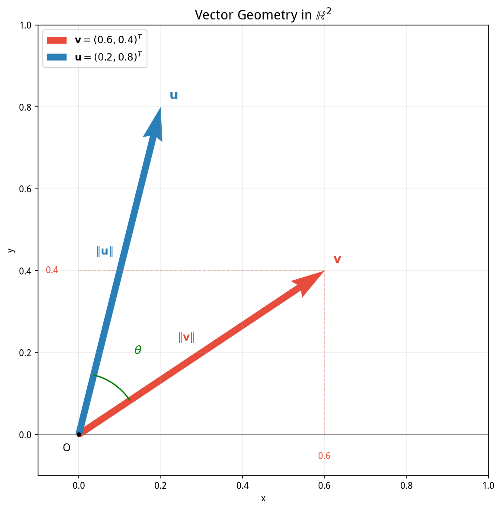
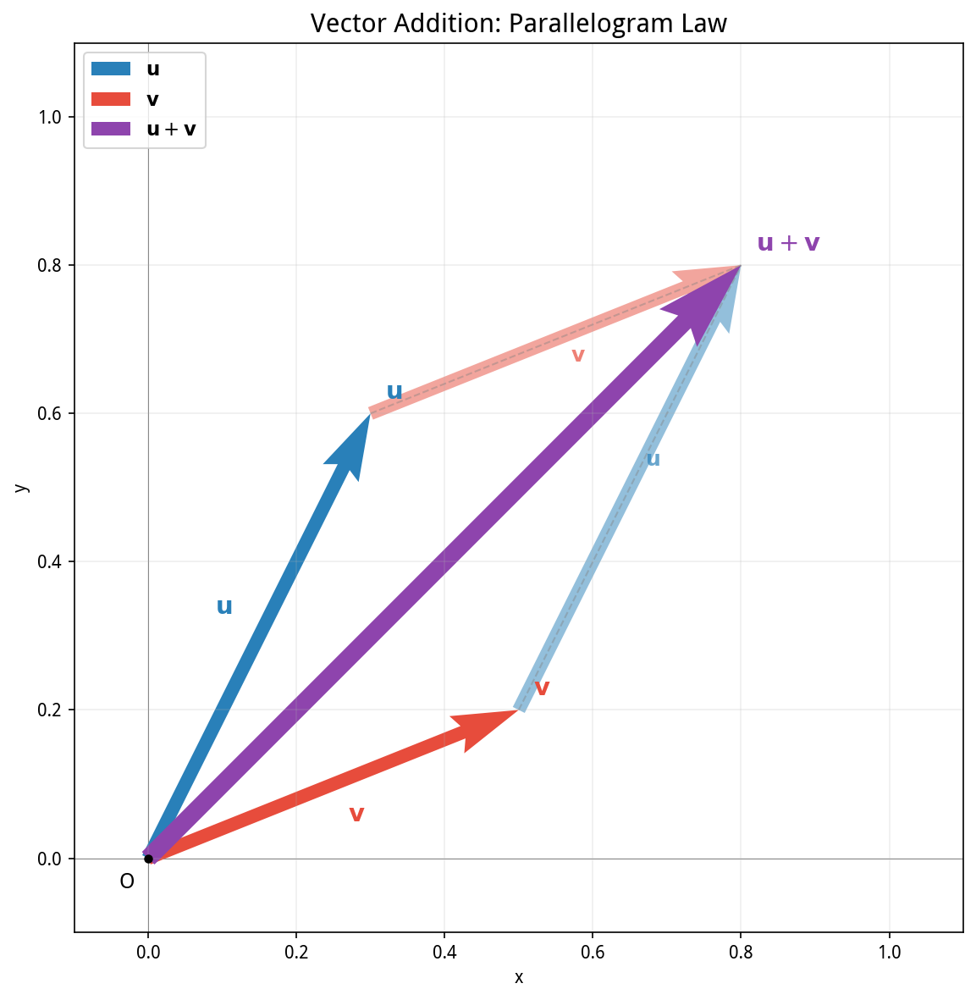

# 第13章 向量与矩阵——多资产组合的数学表示

> **动机先行**: 前面 12 章, 我们学会了用标量描述单只股票的收益和风险, 用协方差度量两只股票之间的关系. 但真实的量化组合管理远不止两只股票——你需要同时处理 50 只、500 只甚至 5000 只资产. 如果继续用标量符号逐一书写, 你很快会被淹没在 $N(N+1)/2$ 个协方差的汪洋大海中. **向量和矩阵, 正是为了"批量处理"这种复杂性而发明的数学语言.** 本章从向量出发, 教你用紧凑的符号表达"多资产"世界, 为第 14 章的矩阵运算和第 15 章的 OLS 几何视角打下基础.

---

## 13.1 动机: 从"一只股票"到"一堆股票"——为什么标量不够用了

回忆第 9 章的组合方差公式: 当你持有 $N$ 只股票, 权重分别为 $w_1, w_2, \dots, w_N$, 组合的方差是:

$$\sigma_p^2 = \sum_{i=1}^{N} \sum_{j=1}^{N} w_i w_j \sigma_{ij}$$

光是把这个双重求和写下来, 就已经令人望而生畏. 如果你要计算组合的每日收益率, 你需要对每一期 $t$ 写下:

$$r_{p,t} = w_1 r_{1,t} + w_2 r_{2,t} + \cdots + w_N r_{N,t}$$

当 $N=50$ 时, 这意味着 50 个加数、50 个权重变量、50 个收益率变量. **你需要的是一套能够将"一组数"当作一个整体来操作的符号系统.** 这套系统就是线性代数——而它的第一个、也是最重要的概念, 就是**向量 (Vector)**.

**本章的定位**: 本章只讲"向量"这个核心概念, 以及如何用向量"表示"多资产世界. 矩阵的乘法、转置、特征分解等操作将在第 14-15 章展开. 但在此之前, 你必须先学会用向量的眼光看世界——把一组权重、一组收益率、一组因子暴露都看作**一个单一的数学对象**.

> **历史注记**: 向量 (Vector) 这个词源自拉丁语 *vehere* (承载、运输). 19 世纪, 哈密顿 (Hamilton) 和格拉斯曼 (Grassmann) 分别独立发展了向量理论. 但向量真正的威力在 20 世纪才被量子力学和经济学充分释放——前者用向量描述量子态, 后者用向量描述商品束和资产组合. Markowitz (1952) 的均值-方差框架之所以能用两页纸写完, 正是因为向量和矩阵的紧凑性.

---

## 13.2 向量: 金融中的"有序列表"

### 13.2.1 向量的定义

一个 **$n$ 维实向量** 是 $n$ 个实数的有序排列:

$$\mathbf{v} = \begin{pmatrix} v_1 \\ v_2 \\ \vdots \\ v_n \end{pmatrix} \in \mathbb{R}^n$$

其中 $\mathbb{R}^n$ 表示"所有 $n$ 维实向量的集合". $v_i$ 称为向量的第 $i$ 个**分量 (Component)**.

**约定**: 本书用**粗体小写字母**表示向量 ($\mathbf{w}, \mathbf{r}, \boldsymbol{\beta}$), 用普通小写字母表示标量 ($w_i, r_t$). 向量默认写作**列向量** (Column Vector). 如果写成行向量 (Row Vector), 会加转置符号: $\mathbf{w}^T = (w_1, w_2, \dots, w_n)$.

### 13.2.2 三个金融实例

**实例 1——持仓权重向量**: 你持有 5 只股票, 分别配置 20% 的资金. 这个配置方案就是一个向量:

$$\mathbf{w} = \begin{pmatrix} 0.20 \\ 0.20 \\ 0.20 \\ 0.20 \\ 0.20 \end{pmatrix}$$

向量的每个分量对应一只股票的仓位. 所有分量之和为 1 (全额投资). 如果某只股票你卖空了 (Short), 对应的分量就是负数.

**实例 2——收益率向量**: 某一天, 这 5 只股票的日收益率分别是 +0.5%, -0.3%, +1.2%, 0.0%, -0.8%. 这也是一个向量:

$$\mathbf{r} = \begin{pmatrix} 0.005 \\ -0.003 \\ 0.012 \\ 0.000 \\ -0.008 \end{pmatrix}$$

**实例 3——因子暴露向量**: Fama-French 三因子模型中, 每只股票对市场 (MKT)、市值 (SMB)、价值 (HML) 三个因子各有一个暴露系数. 对于某只股票:

$$\boldsymbol{\beta} = \begin{pmatrix} \beta_{\text{MKT}} \\ \beta_{\text{SMB}} \\ \beta_{\text{HML}} \end{pmatrix} = \begin{pmatrix} 1.05 \\ -0.30 \\ 0.45 \end{pmatrix}$$

$\beta_{\text{SMB}} = -0.30$ 意味着这只股票与"小盘股减大盘股"因子反向变动——换句话说, 这是一只大盘股.

> **关键认知**: 向量的分量**必须有顺序**且**位置有意义**. 如果 $\mathbf{w}$ 中第一个分量对应茅台、第二个对应宁德时代, 那么 $\mathbf{r}$ 的分量也必须按同样的顺序排列——否则 $\mathbf{w} \cdot \mathbf{r}$ 算出来的"组合收益率"毫无意义.

### 13.2.3 向量的几何直觉

在 $\mathbb{R}^2$ (二维平面) 中, 向量 $\mathbf{v} = \begin{pmatrix} a \\ b \end{pmatrix}$ 可以用一个从原点出发、终点在 $(a, b)$ 的**有向箭头**来表示:



这个几何图像有三个关键要素:
- **长度**: 箭头有多长——对应"仓位大小"或"风险大小"
- **方向**: 箭头指向哪里——对应"资产的相对配比"
- **夹角**: 两个箭头之间的角度——对应"两只资产的相关性"(第 13.5 节展开)

在 $\mathbb{R}^3$ 中, 向量对应三维空间中的一个箭头. 在 $\mathbb{R}^n$ ($n > 3$) 中, 几何直觉失效——你无法"画"出一个 50 维的箭头——但**所有在 $\mathbb{R}^2$ 和 $\mathbb{R}^3$ 中成立的代数规则, 在 $\mathbb{R}^n$ 中依然成立**. 线性代数的核心哲学就是: 把低维的几何直觉通过代数推广到高维.

---

## 13.3 向量的基本运算: 加法与数乘

### 13.3.1 向量加法: 逐分量相加

两个**同维度**的向量相加, 就是对应的分量分别相加:

$$\mathbf{u} + \mathbf{v} = \begin{pmatrix} u_1 \\ u_2 \\ \vdots \\ u_n \end{pmatrix} + \begin{pmatrix} v_1 \\ v_2 \\ \vdots \\ v_n \end{pmatrix} = \begin{pmatrix} u_1 + v_1 \\ u_2 + v_2 \\ \vdots \\ u_n + v_n \end{pmatrix}$$

**金融含义——合并两个子组合**: 假设你的核心组合 $\mathbf{w}_A$ 持有大盘蓝筹, 卫星组合 $\mathbf{w}_B$ 持有成长股:

$$\mathbf{w}_A = \begin{pmatrix} 0.15 \\ 0.10 \\ 0 \\ 0 \end{pmatrix}, \quad \mathbf{w}_B = \begin{pmatrix} 0 \\ 0 \\ 0.08 \\ 0.12 \end{pmatrix}$$

合并后的总组合为:

$$\mathbf{w}_{\text{total}} = \mathbf{w}_A + \mathbf{w}_B = \begin{pmatrix} 0.15 \\ 0.10 \\ 0.08 \\ 0.12 \end{pmatrix}$$

> **注意**: 总权重之和 $0.15+0.10+0.08+0.12 = 0.45$, 并不是全额投资. "加总"后是否需要归一化 (让权重之和重新变成 1) 取决于你的投资约束. 金融含义永远比数学操作更重要.

**几何解释**: 向量加法对应**平行四边形法则**. 把 $\mathbf{v}$ 的起点放在 $\mathbf{u}$ 的终点上, 从原点走到 $\mathbf{v}$ 的新终点——这就是 $\mathbf{u} + \mathbf{v}$.



### 13.3.2 数乘 (标量乘法): 每个分量同比例缩放

一个标量 $\alpha$ 乘以一个向量, 就是 $\alpha$ 乘以向量的每一个分量:

$$\alpha \cdot \mathbf{v} = \alpha \cdot \begin{pmatrix} v_1 \\ v_2 \\ \vdots \\ v_n \end{pmatrix} = \begin{pmatrix} \alpha v_1 \\ \alpha v_2 \\ \vdots \\ \alpha v_n \end{pmatrix}$$

**金融含义——加杠杆或减仓**: 

- $\alpha = 2$: 将每个仓位翻倍 (2 倍杠杆). $\mathbf{w}_{\text{levered}} = 2\mathbf{w}$ 意味着权重之和变为 2, 你需要借入相当于本金 100% 的资金.
- $\alpha = 0.5$: 将所有仓位减半 (半仓). $\mathbf{w}_{\text{half}} = 0.5\mathbf{w}$ 意味着权重之和变为 0.5, 剩余资金以现金形式持有.
- $\alpha = -1$: 将所有持仓反向 (从做多变为做空, 反之亦然).

**几何解释**: 数乘不改变向量的方向, 只改变长度. $\alpha > 0$ 时方向不变, $\alpha < 0$ 时方向反转.

> **关键命名**: 在向量运算中, 单个数字 $\alpha$ 称为**标量 (Scalar)**. "标量"的意思是"用来缩放的量"——它告诉我们把向量"拉伸"或"压缩"多少倍. 在金融中, 标量可以是杠杆倍数、时间长度、无风险利率等.

### 13.3.3 线性组合: 投资组合的数学本质

把加法和数乘结合起来, 就得到了**线性组合 (Linear Combination)**:

$$\alpha_1 \mathbf{v}_1 + \alpha_2 \mathbf{v}_2 + \cdots + \alpha_k \mathbf{v}_k$$

**金融含义——任何投资组合都是个股的线性组合**: 将 $N$ 只股票各自视为一个"基向量" $\mathbf{e}_i$ (第 $i$ 个分量为 1, 其余为 0 的向量), 那么任意一个权重向量:

$$\mathbf{w} = w_1 \begin{pmatrix} 1 \\ 0 \\ 0 \\ \vdots \end{pmatrix} + w_2 \begin{pmatrix} 0 \\ 1 \\ 0 \\ \vdots \end{pmatrix} + \cdots + w_N \begin{pmatrix} 0 \\ 0 \\ \vdots \\ 1 \end{pmatrix} = w_1\mathbf{e}_1 + w_2\mathbf{e}_2 + \cdots + w_N\mathbf{e}_N$$

**这就是线性组合的金融本质: 你的投资组合 = 各只股票的"基向量"按权重配比合成的一个新向量.**

同样的逻辑也适用于收益率: 组合的收益率向量是各资产收益率向量的线性组合:
$$\mathbf{r}_p = w_1 \mathbf{r}_1 + w_2 \mathbf{r}_2 + \cdots + w_N \mathbf{r}_N$$

其中 $\mathbf{r}_i$ 是第 $i$ 只资产的收益率时间序列向量.

### 13.3.4 量化实战: 用 NumPy 创建权重与收益率向量

理论讲完，用真实数据实操。从 `stock_data_50` 中选6只不同行业股票，创建等权、主动、多空三种权重向量:

```python
import numpy as np
import pandas as pd
import matplotlib.pyplot as plt
import matplotlib
matplotlib.rcParams['font.sans-serif'] = ['WenQuanYi Micro Hei']
matplotlib.rcParams['axes.unicode_minus'] = False

selected = ['000002.SZ', '600519.SH', '300750.SZ', '000858.SZ', '601398.SH', '002415.SZ']
csv_path = 'data/stock_data_50_20210601_20260531.csv'
df = pd.read_csv(csv_path, parse_dates=['time'])

df_recent = df[df['time'] >= '2025-06-01'].copy()
pivot_close = df_recent.pivot(index='time', columns='thscode', values='close')[selected]
log_rets = np.log(pivot_close / pivot_close.shift(1)).dropna()

print(f"收益率矩阵形状: {log_rets.shape} (T={log_rets.shape[0]} 天, N={log_rets.shape[1]} 只股票)")

N = len(selected)
w_equal = np.ones(N) / N                                    # 等权重
w_active = np.array([0.10, 0.25, 0.25, 0.20, 0.10, 0.10])  # 主动超配
w_ls = np.array([0.30, -0.20, 0.40, -0.10, 0.30, 0.30])    # 多空

print(f"等权重向量: {w_equal.round(3)}, sum={w_equal.sum():.2f}")
print(f"主动权重向量: {w_active.round(3)}, sum={w_active.sum():.2f}")
print(f"多空权重向量: {w_ls.round(3)}, sum={w_ls.sum():.2f}")
```

**运行结果**:
```
收益率矩阵形状: (240, 6) (T=240 天, N=6 只股票)
等权重向量: [0.167 0.167 0.167 0.167 0.167 0.167], sum=1.00
主动权重向量: [0.1 0.25 0.25 0.2 0.1 0.1], sum=1.00
多空权重向量: [ 0.3 -0.2  0.4 -0.1  0.3  0.3], sum=1.00
```

> **关键收获**: 三种权重向量都是 $\mathbb{R}^6$ 中的合法向量，对应三种截然不同的投资观点——等权是"没有观点"的被动基准，主动是"看好食品饮料和新能源"的偏配，多空是"做多低波动、做空高波动"的市场中性策略。**同一个数学对象 (向量)，承载了完全不同的投资逻辑。**

---

## 13.4 点积: 组合收益率的计算引擎

### 13.4.1 点积的定义

两个 $n$ 维向量 $\mathbf{u}$ 和 $\mathbf{v}$ 的**点积 (Dot Product)** (也称**内积, Inner Product**) 定义为:

$$\boxed{\mathbf{u} \cdot \mathbf{v} = u_1 v_1 + u_2 v_2 + \cdots + u_n v_n = \sum_{i=1}^{n} u_i v_i}$$

点积的**输入**是两个 $n$ 维向量, **输出**是一个标量. 这是向量运算中最重要的一种——它把两个向量的信息"压缩"成一个数字.

**金融含义——组合收益率**: 

$$\mathbf{w} \cdot \mathbf{r} = w_1 r_1 + w_2 r_2 + \cdots + w_N r_N = \text{组合在这一期的收益率}$$

这就是"组合收益率 = 权重向量 · 收益率向量"的完整数学表述. 在第 9 章中, 我们把它写成了 $\sum w_i r_i$; 现在, 我们用**一个符号**代替了**一长串求和号**.

**一个微型数值例子**: 持有 3 只股票, 权重为 $\mathbf{w} = (0.5, 0.3, 0.2)^T$, 某日收益率分别为 $+1.0\%, -0.5\%, +2.0\%$, 即 $\mathbf{r} = (0.010, -0.005, 0.020)^T$. 组合收益率:

$$\mathbf{w} \cdot \mathbf{r} = 0.5 \times 0.010 + 0.3 \times (-0.005) + 0.2 \times 0.020 = 0.0050 - 0.0015 + 0.0040 = 0.0075 = 0.75\%$$

### 13.4.2 点积的运算性质

点积满足以下代数性质:
1. **交换律**: $\mathbf{u} \cdot \mathbf{v} = \mathbf{v} \cdot \mathbf{u}$ (权重向量点乘收益率向量, 顺序无关)
2. **分配律**: $\mathbf{u} \cdot (\mathbf{v} + \mathbf{w}) = \mathbf{u} \cdot \mathbf{v} + \mathbf{u} \cdot \mathbf{w}$ (先合并组合再算收益, 等于分别算收益再相加)
3. **与数乘的兼容性**: $(\alpha\mathbf{u}) \cdot \mathbf{v} = \alpha(\mathbf{u} \cdot \mathbf{v})$ (先把仓位翻倍再算收益, 等价于先算收益再翻倍)
4. **正定性**: $\mathbf{v} \cdot \mathbf{v} \geq 0$, 且 $\mathbf{v} \cdot \mathbf{v} = 0$ 当且仅当 $\mathbf{v} = \mathbf{0}$

### 13.4.3 点积的几何含义

在 $\mathbb{R}^2$ 和 $\mathbb{R}^3$ 中, 点积有清晰的几何解释:

$$\boxed{\mathbf{u} \cdot \mathbf{v} = \|\mathbf{u}\| \|\mathbf{v}\| \cos \theta}$$

其中 $\|\mathbf{u}\|$ 和 $\|\mathbf{v}\|$ 是向量的长度 (下一节定义), $\theta$ 是两向量之间的夹角.

重排这个公式得到:

$$\cos \theta = \frac{\mathbf{u} \cdot \mathbf{v}}{\|\mathbf{u}\| \|\mathbf{v}\|}$$

这个比值称为**余弦相似度 (Cosine Similarity)**——它在 -1 到 +1 之间, 描述了两个向量在方向上的接近程度. 在量化金融中, 两个收益率向量的余弦相似度类似于"未中心化的相关系数": +1 表示完全同向, -1 表示完全反向, 0 表示互相垂直.

> **金融直觉**: 如果两只股票的日收益率向量夹角很小 ($\cos \theta \approx 1$), 它们几乎每天都同涨同跌——分散化的好处非常有限. 如果夹角接近 90° ($\cos \theta \approx 0$), 它们的涨跌几乎没有方向性关联——分散化效果最好.

### 13.4.4 量化实战: 点积计算组合单日收益率

继续用6只股票的数据，用 `np.dot(w, r)` 一步算出组合在某一天的收益率:

```python
import numpy as np
import pandas as pd

selected = ['000002.SZ', '600519.SH', '300750.SZ', '000858.SZ', '601398.SH', '002415.SZ']
csv_path = 'data/stock_data_50_20210601_20260531.csv'
df = pd.read_csv(csv_path, parse_dates=['time'])

df_recent = df[df['time'] >= '2025-06-01'].copy()
pivot_close = df_recent.pivot(index='time', columns='thscode', values='close')[selected]
log_rets = np.log(pivot_close / pivot_close.shift(1)).dropna()

N = len(selected)
w_equal = np.ones(N) / N
w_active = np.array([0.10, 0.25, 0.25, 0.20, 0.10, 0.10])

# 取最近一天的收益率向量, 点积 = 组合收益率
r_latest = log_rets.iloc[-1].values
rp_equal = np.dot(w_equal, r_latest)
rp_active = np.dot(w_active, r_latest)

print(f"最近交易日: {log_rets.index[-1].strftime('%Y-%m-%d')}")
for i, code in enumerate(selected):
    print(f"  {code}: {r_latest[i]:+.4f}")
print(f"\n等权组合收益率  w_equal·r = {rp_equal:+.4f}")
print(f"主动组合收益率  w_active·r = {rp_active:+.4f}")

# 验证: 手动求和 vs 点积
manual = sum(w_equal[i] * r_latest[i] for i in range(N))
print(f"手动求和验证: {manual:+.4f} = dot结果? {np.isclose(rp_equal, manual)}")
```

**运行结果**:
```
最近交易日: 2026-05-29
  000002.SZ: +0.0700
  600519.SH: +0.0385
  300750.SZ: +0.0198
  000858.SZ: +0.0409
  601398.SH: +0.0252
  002415.SZ: -0.0065

等权组合收益率  w_equal·r = +0.0313
主动组合收益率  w_active·r = +0.0316
手动求和验证: +0.0313 = dot结果? True
```

> **关键收获**: `np.dot(w, r)` 这一行代码替代了 $\sum w_i r_i$ 的求和循环。当 $N=500$ 时，你在代码中看到的仍然是 `np.dot(w, r)`——向量符号把复杂性封装在了一个统一的接口后面。

---

## 13.5 向量的长度与夹角: 风险的几何视角

### 13.5.1 范数: 向量的长度

向量 $\mathbf{v}$ 的**欧几里得范数 (Euclidean Norm)**——即"长度"——定义为:

$$\boxed{\|\mathbf{v}\| = \sqrt{\mathbf{v} \cdot \mathbf{v}} = \sqrt{v_1^2 + v_2^2 + \cdots + v_n^2}}$$

在金融中, 范数有多种含义:
- **权重向量的范数** $\|\mathbf{w}\|$: 衡量仓位的"集中度". 等权重时 $\|\mathbf{w}\| = 1/\sqrt{N}$ (最小), 全仓一只股票时 $\|\mathbf{w}\| = 1$ (最大).
- **收益率向量的范数** $\|\mathbf{r}\|$: 衡量某一期所有股票收益率的"总强度"——如果所有股票都大涨, $\|\mathbf{r}\|$ 会很大.
- **去均值收益率向量的范数**: $\|\mathbf{r} - \bar{r}\mathbf{1}\| / \sqrt{T-1}$ 正好是收益率的标准差! 这说明**波动率本质上是"去均值收益率向量"的长度** (除以 $\sqrt{T-1}$).

**单位向量 (Unit Vector)**: 长度为 1 的向量. 任何非零向量都可以通过除以自己的范数变成单位向量:
$$\hat{\mathbf{v}} = \frac{\mathbf{v}}{\|\mathbf{v}\|}$$
单位向量只保留"方向"信息, 丢弃了"长度"信息. 在风险预算 (Risk Budgeting) 中, 我们关心的是各资产**相对**风险贡献的方向, 而非绝对大小.

### 13.5.2 向量之间的距离

两个向量 $\mathbf{u}$ 和 $\mathbf{v}$ 之间的**欧几里得距离**:

$$d(\mathbf{u}, \mathbf{v}) = \|\mathbf{u} - \mathbf{v}\| = \sqrt{(u_1 - v_1)^2 + (u_2 - v_2)^2 + \cdots + (u_n - v_n)^2}$$

**金融含义——跟踪误差 (Tracking Error)**: 如果你的组合收益率向量是 $\mathbf{r}_p$, 基准 (如沪深 300) 收益率向量是 $\mathbf{r}_b$, 那么 $\mathbf{r}_p - \mathbf{r}_b$ 就是逐日的超额收益向量. 这个向量的范数 (除以 $\sqrt{T-1}$) 就是**跟踪误差**:

$$\text{Tracking Error} = \frac{\|\mathbf{r}_p - \mathbf{r}_b\|}{\sqrt{T-1}}$$

跟踪误差越小, 你的组合越贴近基准; 跟踪误差越大, 你的主动偏离越大. 被动指数基金追求跟踪误差 < 0.5%, 主动量化基金通常在 3-8%.

### 13.5.3 正交: 当点积为零

如果两个非零向量的点积为零, 它们**正交 (Orthogonal)**:

$$\mathbf{u} \cdot \mathbf{v} = 0 \quad \Longrightarrow \quad \cos \theta = 0 \quad \Longrightarrow \quad \theta = 90^\circ$$

在金融中, "两只资产的收益率向量正交"意味着: 从方向上看, 它们的涨跌模式完全不相关 (在去均值前). 正交性是相关系数为零的**几何对应物**.

> **桥接第 14 章**: 如果两个向量正交, 它们"互不投影"——一个向量在另一个向量方向上没有分量. 这个看似简单的几何事实, 正是第 15 章 OLS 回归中"残差向量与解释变量向量正交"的数学基础. 回归的本质, 就是将被解释变量 $\mathbf{y}$ 投影到解释变量张成的空间上, 残差 $\hat{\boldsymbol{\varepsilon}}$ 则与该空间正交.

### 13.5.4 量化实战: 向量长度、夹角与余弦相似度

用6只股票的去均值收益率向量，计算两两余弦相似度，并可视化权重向量的"范数=集中度":

```python
import numpy as np
import pandas as pd
import matplotlib.pyplot as plt
import matplotlib
matplotlib.rcParams['font.sans-serif'] = ['WenQuanYi Micro Hei']
matplotlib.rcParams['axes.unicode_minus'] = False

selected = ['000002.SZ', '600519.SH', '300750.SZ', '000858.SZ', '601398.SH', '002415.SZ']
csv_path = 'data/stock_data_50_20210601_20260531.csv'
df = pd.read_csv(csv_path, parse_dates=['time'])

df_recent = df[df['time'] >= '2025-06-01'].copy()
pivot_close = df_recent.pivot(index='time', columns='thscode', values='close')[selected]
log_rets = np.log(pivot_close / pivot_close.shift(1)).dropna()

R = log_rets.values
R_centered = R - R.mean(axis=0)  # 去均值, 余弦相似度 ≈ 相关系数

codes = list(log_rets.columns); n = len(codes)
cos_sim = np.zeros((n, n))
for i in range(n):
    for j in range(n):
        u, v = R_centered[:, i], R_centered[:, j]
        cos_sim[i, j] = np.dot(u, v) / (np.linalg.norm(u) * np.linalg.norm(v))

print("余弦相似度矩阵 (去均值后 ≈ 相关系数矩阵):")
print(pd.DataFrame(cos_sim.round(3), index=codes, columns=codes))

# 可视化
fig, axes = plt.subplots(1, 2, figsize=(14, 6))
# 左: 两只股票收益率散点图 (茅台 vs 宁德时代)
r1, r2 = R_centered[:, 1], R_centered[:, 2]
cos_theta = np.dot(r1, r2) / (np.linalg.norm(r1) * np.linalg.norm(r2))
theta = np.arccos(cos_theta) * 180 / np.pi
axes[0].scatter(r1, r2, alpha=0.3, s=10, color='steelblue')
axes[0].set_xlabel('600519.SH (茅台) 去均值收益'); axes[0].set_ylabel('300750.SZ (宁德时代) 去均值收益')
axes[0].axhline(y=0, color='gray', linewidth=0.5); axes[0].axvline(x=0, color='gray', linewidth=0.5)
axes[0].set_title(f'收益率散点: cosθ={cos_theta:.3f}, θ={theta:.1f}°')
axes[0].set_aspect('equal'); axes[0].grid(True, alpha=0.3)

# 右: 权重向量范数可视化
w_equal = np.ones(n) / n
w_active = np.array([0.10, 0.25, 0.25, 0.20, 0.10, 0.10])
x_pos = np.arange(n)
codes_short = [c[:6] for c in codes]
width = 0.35
axes[1].bar(x_pos-width/2, w_equal, width, label='等权', color='steelblue', alpha=0.8)
axes[1].bar(x_pos+width/2, w_active, width, label='主动', color='darkorange', alpha=0.8)
axes[1].set_xticks(x_pos); axes[1].set_xticklabels(codes_short, rotation=45, ha='right')
axes[1].set_ylabel('权重'); axes[1].set_title('权重向量: 等权 vs 主动')
axes[1].legend(); axes[1].grid(True, alpha=0.3, axis='y')

print(f"\n||w_equal||={np.linalg.norm(w_equal):.4f}, ||w_active||={np.linalg.norm(w_active):.4f}")
print(f"(等权范数最小 = 1/sqrt(N) = {1/np.sqrt(n):.4f}, 集中度越高范数越大)")

plt.tight_layout()
plt.savefig('images/ch13_fig4_vector_visualization.png', dpi=150, bbox_inches='tight')
plt.show()
```

**运行结果**:
```
余弦相似度矩阵 (去均值后 ≈ 相关系数矩阵):
            000002.SZ  600519.SH  300750.SZ  000858.SZ  601398.SH  002415.SZ
000002.SZ      1.000      0.348      0.214      0.414      0.004      0.269
600519.SH      0.348      1.000      0.220      0.770      0.233      0.130
300750.SZ      0.214      0.220      1.000      0.156     -0.074      0.191
000858.SZ      0.414      0.770      0.156      1.000      0.216      0.241
601398.SH      0.004      0.233     -0.074      0.216      1.000     -0.039
002415.SZ      0.269      0.130      0.191      0.241     -0.039      1.000

||w_equal||=0.4082, ||w_active||=0.4416
(等权范数最小 = 1/sqrt(N) = 0.4082, 集中度越高范数越大)
```

> **关键收获**: 茅台(600519)和五粮液(000858)的余弦相似度高达0.770——同为白酒股，涨跌方向高度一致。宁德时代与工商银行的余弦相似度只有-0.074——新能源与银行的收益方向几乎不相关。**余弦相似度矩阵就是"方向版的协方差矩阵"**，第14章将对它做特征分解，找出其中最重要的风险方向。

---

## 13.6 矩阵: 多资产世界的"数据表"

### 13.6.1 矩阵作为向量的集合

到目前为止, 我们讨论的都是单个向量——一个权重向量、一个收益率向量. 但在实践中, 你需要同时处理很多东西:
- 50 只股票 × 1210 个交易日 = 60500 个收益率数据
- 每一列是一只股票的时间序列, 每一行是一个截面的收益率快照

**矩阵 (Matrix)** 就是这样一种"二维表格": 把多个同维度的向量并排放在一起.

一个 $m \times n$ 矩阵有 $m$ 行、$n$ 列:

$$\mathbf{R} = \begin{pmatrix}
R_{11} & R_{12} & \cdots & R_{1n} \\
R_{21} & R_{22} & \cdots & R_{2n} \\
\vdots & \vdots & \ddots & \vdots \\
R_{m1} & R_{m2} & \cdots & R_{mn}
\end{pmatrix}$$

**约定**: 本书用**粗体大写字母**表示矩阵 ($\mathbf{R}, \mathbf{X}, \mathbf{\Sigma}$).

### 13.6.2 矩阵的"列视角": 最重要的一种看法

将矩阵视为**一组列向量的横向排列**, 这是量化金融中最自然的视角:

$$\mathbf{R} = \begin{bmatrix}
| & | & & | \\
\mathbf{r}_1 & \mathbf{r}_2 & \cdots & \mathbf{r}_n \\
| & | & & |
\end{bmatrix}$$

其中 $\mathbf{r}_j$ 是第 $j$ 只资产的收益率时间序列 (一个 $m$ 维列向量).

对于 `stock_data_50_20210601_20260531.csv`:
- $m = 1210$ (交易日)
- $n = 50$ (股票)
- $\mathbf{r}_1$ 是万科 A (000002.SZ) 的 1210 个日收益率
- $\mathbf{r}_{50}$ 是第 50 只股票的 1210 个日收益率

**金融解读**:
- **每一列** = 一只资产的时间序列 (纵切矩阵 → 单资产分析)
- **每一行** = 一个截面上所有资产的收益率 (横切矩阵 → 横截面分析)
- **整个矩阵** = 多资产 × 多时期 = 面板数据 (Panel Data)

### 13.6.3 转置: 行列互换

矩阵 $\mathbf{R}$ 的**转置 (Transpose)** 记作 $\mathbf{R}^T$, 是将行和列互换得到的新矩阵:

如果 $\mathbf{R}$ 是 $m \times n$, 则 $\mathbf{R}^T$ 是 $n \times m$. 元素满足 $(\mathbf{R}^T)_{ij} = R_{ji}$.

**列向量的转置变成行向量**:

$$\mathbf{r} = \begin{pmatrix} r_1 \\ r_2 \\ \vdots \\ r_n \end{pmatrix}, \quad \mathbf{r}^T = (r_1, r_2, \dots, r_n)$$

在金融计算中, 行向量 $\mathbf{w}^T$ 与矩阵 $\mathbf{R}$ 的组合 $\mathbf{w}^T \mathbf{R}$ 即将在第 13.7 节出现——它表示的正是"用权重向量 $\mathbf{w}$ 去乘收益矩阵 $\mathbf{R}$, 得到组合的收益率时间序列".

---

## 13.7 矩阵与向量的乘法: 组合收益的批量计算

### 13.7.1 矩阵乘以列向量

一个 $m \times n$ 矩阵 $\mathbf{R}$ 乘以一个 $n$ 维列向量 $\mathbf{w}$, 得到一个 $m$ 维列向量:

$$\boxed{\mathbf{R}\mathbf{w} = \begin{pmatrix}
R_{11} & \cdots & R_{1n} \\
\vdots & \ddots & \vdots \\
R_{m1} & \cdots & R_{mn}
\end{pmatrix} \begin{pmatrix} w_1 \\ \vdots \\ w_n \end{pmatrix} = \begin{pmatrix}
R_{11}w_1 + \cdots + R_{1n}w_n \\
\vdots \\
R_{m1}w_1 + \cdots + R_{mn}w_n
\end{pmatrix}}$$

结果的第 $i$ 个分量是矩阵第 $i$ 行与 $\mathbf{w}$ 的点积.

**金融含义——组合收益率时间序列的计算**:

设 $\mathbf{R}$ 是 $T \times N$ 的日收益率矩阵 (行=日期, 列=资产), $\mathbf{w}$ 是 $N \times 1$ 的权重向量. 则:

$$\mathbf{r}_p = \mathbf{R}\mathbf{w}$$

$\mathbf{r}_p$ 是一个 $T$ 维向量, 其中第 $t$ 个分量 $r_{p,t} = \sum_{j=1}^{N} R_{tj} w_j$ 就是第 $t$ 天整个组合的收益率.

**这就是量化投资中最常见的矩阵运算**: 用权重向量 $\mathbf{w}$ 去"加权"收益率矩阵 $\mathbf{R}$ 的每一列, 一秒钟算出全部 $T$ 天的组合收益率.

### 13.7.2 矩阵-向量乘法就是"列的线性组合"

矩阵-向量乘法有一个极其重要的等价表述:

$$\boxed{\mathbf{R}\mathbf{w} = w_1 \begin{pmatrix} R_{11} \\ R_{21} \\ \vdots \\ R_{m1} \end{pmatrix} + w_2 \begin{pmatrix} R_{12} \\ R_{22} \\ \vdots \\ R_{m2} \end{pmatrix} + \cdots + w_n \begin{pmatrix} R_{1n} \\ R_{2n} \\ \vdots \\ R_{mn} \end{pmatrix} = w_1\mathbf{r}_1 + w_2\mathbf{r}_2 + \cdots + w_n\mathbf{r}_n}$$

其中 $\mathbf{r}_j$ 是 $\mathbf{R}$ 的第 $j$ 列 (第 $j$ 只资产的收益率时间序列).

**这个等式揭示了矩阵-向量乘法的本质**: $\mathbf{R}\mathbf{w}$ 是以 $\mathbf{w}$ 的分量为权重, 对 $\mathbf{R}$ 的各列做**线性组合**. 组合的收益率时间序列, 无非就是各资产收益率时间序列按权重配比后的线性合成.

> **与 13.3.3 节的呼应**: 我们之前说"投资组合 = 个股基向量的线性组合". 现在更进一步——"组合的收益率时间序列 = 各资产收益率向量的线性组合". 前者是静态的 (权重), 后者是动态的 (收益率的时间展开).

### 13.7.3 小结: 从标量到向量到矩阵——公式的精简之路

| 表述方式 | 组合收益率的写法 | 特点 |
|---------|----------------|------|
| 标量 (逐资产) | $r_{p,t} = \sum_{j=1}^{N} w_j r_{j,t}$ | 对每个 $t$ 都要写一遍 |
| 向量 (单期) | $r_p = \mathbf{w} \cdot \mathbf{r}$ | 一期搞定, 但还是只针对一个截面 |
| 矩阵-向量 (全部时期) | $\mathbf{r}_p = \mathbf{R}\mathbf{w}$ | **一次性算出所有 $T$ 期的组合收益率** |

这就是为什么现代量化金融离不开线性代数: 一个公式 $\mathbf{r}_p = \mathbf{R}\mathbf{w}$ 替代了 $T \times N$ 次标量运算——不仅书写简洁, 更重要的是, 计算机在执行矩阵运算时可以高度并行化和优化.

### 13.7.4 量化实战: 批量计算组合全时期收益率

用 `R @ w` 一次性算出等权组合和主动组合的全部历史收益率，并对比净值曲线:

```python
import numpy as np
import pandas as pd
import matplotlib.pyplot as plt
import matplotlib
matplotlib.rcParams['font.sans-serif'] = ['WenQuanYi Micro Hei']
matplotlib.rcParams['axes.unicode_minus'] = False

selected = ['000002.SZ', '600519.SH', '300750.SZ', '000858.SZ', '601398.SH', '002415.SZ']
csv_path = 'data/stock_data_50_20210601_20260531.csv'
df = pd.read_csv(csv_path, parse_dates=['time'])

df_recent = df[df['time'] >= '2025-06-01'].copy()
pivot_close = df_recent.pivot(index='time', columns='thscode', values='close')[selected]
log_rets = np.log(pivot_close / pivot_close.shift(1)).dropna()

N = len(selected)
w_equal = np.ones(N) / N
w_active = np.array([0.10, 0.25, 0.25, 0.20, 0.10, 0.10])

R = log_rets.values                 # (T, 6)
rp_equal_ts = R @ w_equal           # (T,) —— 等权组合的整条收益率序列
rp_active_ts = R @ w_active         # (T,) —— 主动组合的整条收益率序列

# 验证: 矩阵乘法的最后一天结果 = 逐日点积的结果
print(f"最后一天 R@w: {rp_equal_ts[-1]:+.6f}")
print(f"逐日点积验证: {np.dot(R[-1], w_equal):+.6f}")
print(f"一致: {np.isclose(rp_equal_ts[-1], np.dot(R[-1], w_equal))}")

# 净值曲线
cum_equal = np.exp(np.cumsum(rp_equal_ts))
cum_active = np.exp(np.cumsum(rp_active_ts))

fig, axes = plt.subplots(1, 2, figsize=(14, 5))
axes[0].plot(log_rets.index, cum_equal, label='等权组合', linewidth=1.5)
axes[0].plot(log_rets.index, cum_active, label='主动组合', linewidth=1.5)
axes[0].set_title('组合净值曲线: R@w 一次算出全部历史')
axes[0].set_xlabel('日期'); axes[0].set_ylabel('累计净值')
axes[0].legend(); axes[0].grid(True, alpha=0.3)

excess = rp_active_ts - rp_equal_ts
axes[1].plot(log_rets.index, np.exp(np.cumsum(excess)), color='darkred', linewidth=1.5)
axes[1].axhline(y=1.0, color='gray', linestyle='--', alpha=0.5)
axes[1].set_title('超额收益 (主动 - 等权)')
axes[1].set_xlabel('日期'); axes[1].set_ylabel('超额收益比率')
axes[1].grid(True, alpha=0.3)
plt.tight_layout()
plt.savefig('images/ch13_fig3_portfolio_cumulative.png', dpi=150, bbox_inches='tight')
plt.show()

print(f"等权年化波动: {np.std(rp_equal_ts)*np.sqrt(252):.2%}")
print(f"主动年化波动: {np.std(rp_active_ts)*np.sqrt(252):.2%}")
```

**运行结果**:
```
最后一天 R@w: +0.031312
逐日点积验证: +0.031312
一致: True
等权年化波动: 14.78%
主动年化波动: 16.20%
```

> **关键收获**: 一行 `R @ w` 完成了 $T \times N = 240 \times 6 = 1440$ 次乘加运算。在 NumPy 内部，这会被映射到高度优化的 BLAS 矩阵乘法——不是 Python 循环 1440 次，而是 C/Fortran 层面的一次向量化调用。当你从 6 只股票扩展到 500 只时，这个差距就是生产力与瓶颈的区别。

---

## 13.8 核心公式速查

> 本节是前述各节公式的集中汇总, 供复习和查阅使用.

| 概念 | 公式 | 金融含义 |
|------|------|---------|
| 向量定义 | $\mathbf{v} = (v_1, \dots, v_n)^T \in \mathbb{R}^n$ | 持仓权重、收益率序列、因子暴露 |
| 向量加法 | $(\mathbf{u}+\mathbf{v})_i = u_i + v_i$ | 合并两个子组合的权重 |
| 数乘 | $(\alpha\mathbf{v})_i = \alpha v_i$ | 加杠杆 ($\alpha>1$)、减仓 ($0<\alpha<1$)、反向 ($\alpha<0$) |
| 线性组合 | $\sum \alpha_i \mathbf{v}_i$ | 投资组合是各资产的线性组合 |
| 点积 | $\mathbf{u}\cdot\mathbf{v} = \sum u_i v_i$ | 组合单期收益率 = 权重向量 · 收益率向量 |
| 点积几何含义 | $\mathbf{u}\cdot\mathbf{v} = \|\mathbf{u}\|\|\mathbf{v}\|\cos\theta$ | 点积越大, 两向量方向越一致 |
| 范数 (长度) | $\|\mathbf{v}\| = \sqrt{\sum v_i^2}$ | 权重集中度; 波动率 = 去均值向量的范数/√(T-1) |
| 欧几里得距离 | $d(\mathbf{u},\mathbf{v}) = \|\mathbf{u}-\mathbf{v}\|$ | 跟踪误差 = 超额收益向量的范数/√(T-1) |
| 余弦相似度 | $\cos\theta = \frac{\mathbf{u}\cdot\mathbf{v}}{\|\mathbf{u}\|\|\mathbf{v}\|}$ | 两资产收益率方向的接近程度 |
| 正交 | $\mathbf{u}\cdot\mathbf{v}=0$ ($\theta=90^\circ$) | 两向量"互不投影"——回归残差的理论基础 |
| 矩阵列视角 | $\mathbf{R} = [\mathbf{r}_1\ \mathbf{r}_2\ \cdots\ \mathbf{r}_n]$ | 每列是一只资产的收益率时间序列 |
| 转置 | $(\mathbf{R}^T)_{ij} = R_{ji}$ | 列向量 ↔ 行向量的转换 |
| 矩阵-向量乘法 | $\mathbf{R}\mathbf{w} = \sum w_j \mathbf{r}_j$ | 组合全部时期的收益率 = 各资产收益率的线性加权 |
| 组合收益率 (完整) | $\mathbf{r}_p = \mathbf{R}\mathbf{w}$ | 一次性批量计算 $T$ 期组合收益率 |

---

---

## 13.9 本章小结

| 概念 | 核心公式 | 量化意义 |
|------|---------|---------|
| 向量 | $\mathbf{v} \in \mathbb{R}^n$ | 多资产的统一表示——权重、收益率、因子暴露 |
| 向量加法 | $\mathbf{u} + \mathbf{v} = (u_i+v_i)$ | 合并子组合; 计算超额收益 ($\mathbf{r}_p - \mathbf{r}_b$) |
| 数乘 | $\alpha\mathbf{v} = (\alpha v_i)$ | 杠杆调节; 仓位缩放 |
| 线性组合 | $\sum \alpha_i\mathbf{v}_i$ | 投资组合的数学本质 |
| 点积 | $\mathbf{w}\cdot\mathbf{r} = \sum w_i r_i$ | 单期组合收益率; 因子收益归因 |
| 范数 | $\|\mathbf{v}\| = \sqrt{\sum v_i^2}$ | 权重集中度; 波动率 = 去均值收益率范数/√(T-1) |
| 余弦相似度 | $\cos\theta = \frac{\mathbf{u}\cdot\mathbf{v}}{\|\mathbf{u}\|\|\mathbf{v}\|}$ | 两资产收益率方向的一致性度量 |
| 正交 | $\mathbf{u}\cdot\mathbf{v} = 0$ | 回归残差与解释变量"互不投影"的几何基础 |
| 矩阵列视角 | $\mathbf{R}=[\mathbf{r}_1\ \cdots\ \mathbf{r}_n]$ | 面板数据: 行=时间, 列=资产 |
| 矩阵-向量乘法 | $\mathbf{R}\mathbf{w} = \sum w_j\mathbf{r}_j$ | 批量计算全时期组合收益率 |

**从本章走向下一章**:
- 第 14 章将学习矩阵乘法与特征分解——把 $\mathbf{R}\mathbf{w}$ 推广到 $\mathbf{R}\mathbf{W}$ ($\mathbf{W}$ 是多组权重), 并揭示协方差矩阵的特征值/特征向量如何刻画风险的主方向
- 第 15 章将用投影矩阵重新推导 OLS, 揭示 $\hat{\boldsymbol{\beta}} = (\mathbf{X}^T\mathbf{X})^{-1}\mathbf{X}^T\mathbf{y}$ 的几何本质

---

## 13.10 练习题

### 数学推导

**题 1 — 点积与组合方差**: 设有两只资产, 收益率分别为随机变量 $r_1$ 和 $r_2$, 权重为 $w_1$ 和 $w_2$. 记权重向量 $\mathbf{w} = (w_1, w_2)^T$, 收益率向量 $\mathbf{r} = (r_1, r_2)^T$.

(a) 写出组合收益率 $r_p$ 用点积表达的公式, 并证明 $E[r_p] = \mathbf{w} \cdot E[\mathbf{r}]$.

(b) 组合方差为 $Var(r_p) = E[(r_p - E[r_p])^2]$. 展开平方, 证明:
$$Var(r_p) = w_1^2 Var(r_1) + w_2^2 Var(r_2) + 2w_1 w_2 Cov(r_1, r_2)$$

(c) 定义协方差矩阵 $\mathbf{\Sigma} = \begin{pmatrix} Var(r_1) & Cov(r_1, r_2) \\ Cov(r_2, r_1) & Var(r_2) \end{pmatrix}$. 验证 $\mathbf{w}^T \mathbf{\Sigma} \mathbf{w}$ 展开后等于 (b) 中的表达式. (这为第 14 章的矩阵形式组合优化埋下伏笔.)

**题 2 — 向量范数与权重集中度**: 对于 $N$ 只股票, 权重向量 $\mathbf{w}$ 满足 $w_i \geq 0$ 且 $\sum w_i = 1$.

(a) 证明: 在所有满足条件的 $\mathbf{w}$ 中, 等权重向量 $\mathbf{w}_{ew} = (1/N, \dots, 1/N)^T$ 使范数 $\|\mathbf{w}\|$ 最小, 且 $\|\mathbf{w}_{ew}\| = 1/\sqrt{N}$.

(b) 证明: 集中投资于单只股票的权重向量 $\mathbf{w}_{conc} = (1, 0, \dots, 0)^T$ 使范数最大, 且 $\|\mathbf{w}_{conc}\| = 1$.

(c) 如果 $N$ 从 10 只增加到 50 只, 等权组合的范数如何变化? 用范数的变化解释"分散化降低风险"的数学直觉.

**题 3 — 余弦相似度与相关系数**: 对于两个去均值的收益率向量 $\tilde{\mathbf{r}}_A = \mathbf{r}_A - \bar{r}_A\mathbf{1}$ 和 $\tilde{\mathbf{r}}_B = \mathbf{r}_B - \bar{r}_B\mathbf{1}$ (其中 $\mathbf{1}$ 为全 1 向量, $\bar{r}_A$ 和 $\bar{r}_B$ 为样本均值):

(a) 证明样本相关系数 $\hat{\rho}_{AB}$ 等于 $\tilde{\mathbf{r}}_A$ 与 $\tilde{\mathbf{r}}_B$ 的余弦相似度:
$$\hat{\rho}_{AB} = \frac{\tilde{\mathbf{r}}_A \cdot \tilde{\mathbf{r}}_B}{\|\tilde{\mathbf{r}}_A\| \|\tilde{\mathbf{r}}_B\|}$$

(b) 解释: 为什么去均值是必需的操作? 如果不去均值, $\mathbf{r}_A$ 与 $\mathbf{r}_B$ 的余弦相似度会度量什么?

### 编程实践

**题 4 — 权重向量的风险含义**: 基于 13.7.4 的矩阵-向量乘法框架, 从 `stock_data_50_20210601_20260531.csv` 中选取 10 只不同行业的股票 (最近 250 天), 完成以下分析:

(a) 生成 100 组随机权重向量 (每组 10 个正数, 归一化到和为 1). 对每组权重, 通过矩阵-向量乘法 $\mathbf{r}_p = \mathbf{R}\mathbf{w}$ 计算组合的日收益率序列, 并记录年化波动率. 绘制 100 组权重的年化波动率直方图, 标注等权组合的波动率位置.

(b) 计算每组权重向量的范数 $\|\mathbf{w}\|$, 绘制 $\|\mathbf{w}\|$ 与年化波动率的散点图. 两者是否呈现正相关? 解释为什么范数更大的权重向量倾向于产生更高的波动率. (提示: 考虑 $\|\mathbf{w}\| = 1$ 的极端情况.)

**题 5 — 余弦相似度与行业聚类**: 

(a) 选取 15 只来自 5 个不同行业 (每个行业 3 只) 的股票, 计算它们最近 250 天去均值日收益率两两之间的余弦相似度. 将 15×15 的余弦相似度矩阵用热力图 (heatmap) 可视化, 并按行业分组标注.

(b) 对同一行业内的 3 只股票, 计算平均余弦相似度; 对不同行业的股票对, 也计算平均余弦相似度. 行业内平均相似度是否显著高于行业间? 用这个发现解释"行业中性化"(Sector Neutralization) 为什么能在不损失太多 Alpha 的前提下有效降低组合风险.

---

## 13.11 参考文献

1. **Lay, D. C., Lay, S. R., & McDonald, J. J.** (2021). *Linear Algebra and Its Applications* (6th ed.). Pearson. （线性代数标准教材, 第 1 章向量与矩阵的入门讲解极其清晰, 适合初学者建立几何直觉）

2. **Strang, G.** (2016). *Introduction to Linear Algebra* (5th ed.). Wellesley-Cambridge Press. （MIT 线性代数课程教材, 强调"列空间"与"线性组合"的视角——与本章 13.7 节的列视角一脉相承）

3. **Markowitz, H.** (1952). Portfolio selection. *The Journal of Finance*, 7(1), 77-91. （均值-方差框架的原始论文——只需两页, 靠的就是向量和矩阵的紧凑表达）

4. **Meucci, A.** (2005). *Risk and Asset Allocation*. Springer. （第 3 章系统性地用向量和矩阵语言重新表述了均值-方差优化、风险预算和因子模型）

5. **Grinold, R. C., & Kahn, R. N.** (1999). *Active Portfolio Management* (2nd ed.). McGraw-Hill. （第 4 章将组合收益率 $\mathbf{r}_p = \mathbf{R}\mathbf{w}$ 与因子暴露和特异收益联系起来——本章矩阵-向量乘法的直接应用）

---

> **愿我们都能在数字与代码之间, 找到理解市场的那把钥匙.**
>
> *数学的理解没有捷径, 量化的能力无法外包.*
