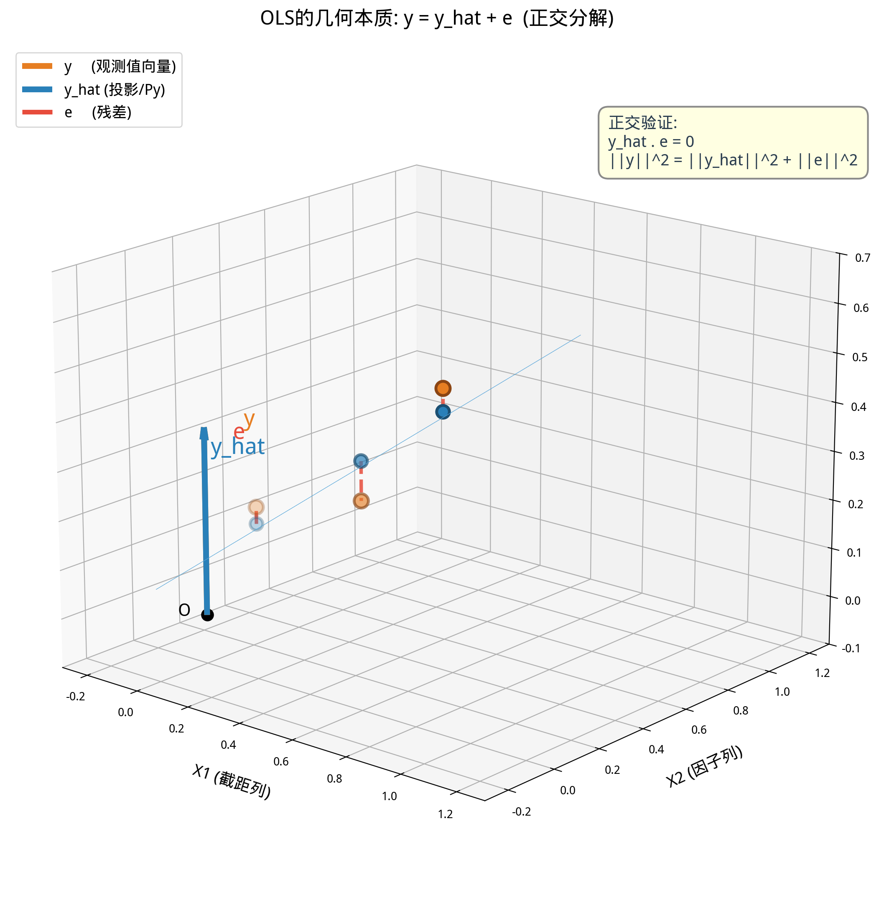

# 第15章 线性方程组与最小二乘法——求解最优参数

> **动机先行**: 第12章用微积分和统计直觉讲了回归——对残差平方和求导，令导数为零，解出 $\hat{\beta}_0$ 和 $\hat{\beta}_1$。那是一套"从数据出发"的视角。本章用第13-14章学到的线性代数工具**重新推导同一个公式**，但这次你看到的不是"令偏导为零解方程组"，而是**"把 $\mathbf{y}$ 正交投影到 $\mathbf{X}$ 的列空间"**——一条几何光线从原点射出，垂直落在由解释变量张成的平面上，落点的坐标就是 $\hat{\boldsymbol{\beta}}$。这两种视角殊途同归，但几何视角能让你理解 OLS **为什么**是最优的（不是"因为导数等于零"，而是"因为垂线段最短"），以及**什么时候**会出问题（当 $\mathbf{X}$ 的列几乎共线时，那个"平面"几乎退化成一条线，投影变得极其不稳定）。
>
> **量化实战定位**: 本章的矩阵法 OLS 是所有量化因子研究的基础设施——当你需要对500只股票同时跑50个因子的回归时，你用的不是 `statsmodels` 的循环，而是 `np.linalg.lstsq` 或显式的 $( \mathbf{X}^T\mathbf{X} )^{-1}\mathbf{X}^T\mathbf{y}$。理解投影矩阵 $\mathbf{P} = \mathbf{X}(\mathbf{X}^T\mathbf{X})^{-1}\mathbf{X}^T$ 的几何含义，是理解"对冲"(Hedging)和"中性化"(Neutralization)的数学前提。

---

## 15.1 动机: 同一个 $\hat{\boldsymbol{\beta}}$，两种推导路径

回忆第12章一元回归的 OLS 估计量:

$$\hat{\beta}_1 = \frac{\sum(x_i - \bar{x})(y_i - \bar{y})}{\sum(x_i - \bar{x})^2}, \quad \hat{\beta}_0 = \bar{y} - \hat{\beta}_1\bar{x}$$

这组公式是怎么来的？第12章的回答是: 对残差平方和 $SSR = \sum (y_i - \beta_0 - \beta_1 x_i)^2$ 分别求 $\beta_0$ 和 $\beta_1$ 的偏导，令其为零，解二元一次方程组。这个推导**完全正确**，但当变量从1个变成 $k$ 个时，你需要对 $k+1$ 个参数分别求偏导，然后解一个 $(k+1) \times (k+1)$ 的线性方程组——虽然可行，但书写极其冗长。

本章用线性代数给出一个**统一的、紧凑的、有几何直觉的**推导:

$$\boxed{\hat{\boldsymbol{\beta}} = (\mathbf{X}^T\mathbf{X})^{-1}\mathbf{X}^T\mathbf{y}}$$

这个公式只有7个符号，但它等价于第12章对 $k$ 个变量分别求偏导、解 $(k+1)$ 元方程组的全部过程。更妙的是，这个公式有一个清晰的几何图像:

$$\hat{\mathbf{y}} = \mathbf{X}\hat{\boldsymbol{\beta}} = \underbrace{\mathbf{X}(\mathbf{X}^T\mathbf{X})^{-1}\mathbf{X}^T}_{\text{投影矩阵 }\mathbf{P}} \mathbf{y}$$

$\hat{\mathbf{y}}$ 是 $\mathbf{y}$ 在 $\mathbf{X}$ 的列空间上的**正交投影**——残差 $\hat{\boldsymbol{\varepsilon}} = \mathbf{y} - \hat{\mathbf{y}}$ 与 $\mathbf{X}$ 的每一列都垂直。**OLS 不是"让误差平方和最小"的代数技巧，而是"在欧几里得空间中做垂线"的几何操作。**

> **本章与第12章的分工**: 第12章教你"怎么算"和"怎么检验"——系数估计、标准误、t值、p值、$R^2$。本章教你"为什么长这样"和"几何图像是什么"——投影矩阵、正交残差、列空间。两条路径在 $\hat{\boldsymbol{\beta}} = (\mathbf{X}^T\mathbf{X})^{-1}\mathbf{X}^T\mathbf{y}$ 汇合。

---

## 15.2 线性方程组: $\mathbf{A}\mathbf{x} = \mathbf{b}$ 的三种命运

在推导 OLS 之前，必须先理解线性方程组——因为正规方程 $\mathbf{X}^T\mathbf{X}\boldsymbol{\beta} = \mathbf{X}^T\mathbf{y}$ 本质上就是一个线性方程组。

### 15.2.1 适定方程组: 唯一解

当 $\mathbf{A}$ 是 $n \times n$ 可逆方阵时，$\mathbf{A}\mathbf{x} = \mathbf{b}$ 有唯一解 $\mathbf{x} = \mathbf{A}^{-1}\mathbf{b}$。

**金融实例——复制组合 (Replicating Portfolio)**: 用2只股票复制第3只股票的收益特征。设股票A和B的收益率分别为 $r_A, r_B$，目标股票C的收益率为 $r_C$。求权重 $w_A, w_B$ 使得复制组合的收益尽可能接近 $r_C$。如果恰好有2个方程(2个交易日的收益率数据):

$$\begin{pmatrix} r_{A,1} & r_{B,1} \\ r_{A,2} & r_{B,2} \end{pmatrix} \begin{pmatrix} w_A \\ w_B \end{pmatrix} = \begin{pmatrix} r_{C,1} \\ r_{C,2} \end{pmatrix}$$

如果两行不共线(两天不是完全相同的收益率模式)，矩阵可逆，唯一解给出精确复制权重。

### 15.2.2 超定方程组: 无精确解 → 需要最小二乘

当方程数 $T$ > 未知数 $k$ 时，$\mathbf{X}$ 是 $T \times k$ 的"高矩阵"。$\mathbf{X}\boldsymbol{\beta} = \mathbf{y}$ 通常**无精确解**——你无法让一条直线同时穿过3个不共线的点。

这正是回归的常态: $T$ 个观测值，$k$ 个参数，$T \gg k$。不存在 $\boldsymbol{\beta}$ 使 $\mathbf{X}\boldsymbol{\beta} = \mathbf{y}$ 精确成立。我们退而求其次: 寻找使残差向量 $\mathbf{y} - \mathbf{X}\boldsymbol{\beta}$ 的长度(欧几里得范数)最小的 $\boldsymbol{\beta}$:

$$\boxed{\hat{\boldsymbol{\beta}} = \arg\min_{\boldsymbol{\beta}} \|\mathbf{y} - \mathbf{X}\boldsymbol{\beta}\|^2}$$

这就是**最小二乘法 (Least Squares)** 的矩阵表述。几何上: 我们在 $\mathbf{X}$ 的列空间中寻找一个点 $\hat{\mathbf{y}} = \mathbf{X}\hat{\boldsymbol{\beta}}$，使它与真实的 $\mathbf{y}$ 之间的距离最短。

### 15.2.3 欠定方程组: 无穷多解 → 需要正则化

当 $k > T$ (参数比观测多)时，$\mathbf{X}^T\mathbf{X}$ 不可逆，有无穷多组 $\boldsymbol{\beta}$ 使残差为零。需要引入额外约束(如 Ridge: $\min \|\mathbf{y} - \mathbf{X}\boldsymbol{\beta}\|^2 + \lambda\|\boldsymbol{\beta}\|^2$)才能得到唯一解。这是第17章的主题。

> **量化视角**: 量化中最常见的是超定方程组——几千个交易日 × 几十个因子。OLS 正是为这种"方程数远超未知数"的场景设计的。

---

## 15.3 正规方程: 从"最小化"到"求解"

### 15.3.1 矩阵求导基础

要用矩阵语言推导 OLS，需要三个矩阵求导公式(此处不展开严格证明，只给出结果和直觉):

| 标量函数 | 对 $\mathbf{x}$ 的梯度 | 直觉 |
|---------|----------------------|------|
| $\mathbf{a}^T\mathbf{x}$ | $\mathbf{a}$ | 线性函数的梯度就是系数向量 |
| $\mathbf{x}^T\mathbf{A}\mathbf{x}$ (A对称) | $2\mathbf{A}\mathbf{x}$ | 二次型的梯度，类似于 $d(ax^2)/dx = 2ax$ |
| $\|\mathbf{y} - \mathbf{X}\boldsymbol{\beta}\|^2$ | $-2\mathbf{X}^T(\mathbf{y} - \mathbf{X}\boldsymbol{\beta})$ | 链式法则的矩阵版 |

第三个公式是关键。令 $S(\boldsymbol{\beta}) = \|\mathbf{y} - \mathbf{X}\boldsymbol{\beta}\|^2 = (\mathbf{y} - \mathbf{X}\boldsymbol{\beta})^T(\mathbf{y} - \mathbf{X}\boldsymbol{\beta})$，展开:

$$S(\boldsymbol{\beta}) = \mathbf{y}^T\mathbf{y} - 2\mathbf{y}^T\mathbf{X}\boldsymbol{\beta} + \boldsymbol{\beta}^T\mathbf{X}^T\mathbf{X}\boldsymbol{\beta}$$

对 $\boldsymbol{\beta}$ 求梯度(利用上表第一和第二个公式):

$$\nabla_{\boldsymbol{\beta}} S = -2\mathbf{X}^T\mathbf{y} + 2\mathbf{X}^T\mathbf{X}\boldsymbol{\beta}$$

### 15.3.2 正规方程的推导

令梯度为零（极小值的一阶条件）:

$$-2\mathbf{X}^T\mathbf{y} + 2\mathbf{X}^T\mathbf{X}\boldsymbol{\beta} = \mathbf{0}$$

$$\boxed{\mathbf{X}^T\mathbf{X}\hat{\boldsymbol{\beta}} = \mathbf{X}^T\mathbf{y}}$$

这就是**正规方程 (Normal Equations)**。它是 $k \times k$ 的线性方程组，未知数是 $\hat{\boldsymbol{\beta}}$ 的 $k$ 个分量。

如果 $\mathbf{X}^T\mathbf{X}$ 可逆(即 $\mathbf{X}$ 的列线性无关)，解为:

$$\boxed{\hat{\boldsymbol{\beta}} = (\mathbf{X}^T\mathbf{X})^{-1}\mathbf{X}^T\mathbf{y}}$$

> **"Normal"的含义**: 这里的 "Normal" 不是"正态分布"，而是"正交"——正规方程来源于"残差向量与 $\mathbf{X}$ 的每一列正交"这个几何条件。$\mathbf{X}^T(\mathbf{y} - \mathbf{X}\hat{\boldsymbol{\beta}}) = \mathbf{0}$ 正是正交条件的矩阵写法。

### 15.3.3 量化实战: 纯矩阵法实现 OLS 并与 statsmodels 对比

用真实股票数据，手写矩阵法 OLS（CAPM回归），与 `statsmodels` 结果对比验证:

```python
import numpy as np
import pandas as pd
import matplotlib.pyplot as plt
plt.rcParams['font.sans-serif'] = ['WenQuanYi Micro Hei']
plt.rcParams['axes.unicode_minus'] = False

# 加载数据: 沪深300(市场) + 宁德时代(个股)
csv_path = 'data/stock_data_50_20210601_20260531.csv'
df = pd.read_csv(csv_path, parse_dates=['time'])

# 提取市场(沪深300需要单独加载)和个股
# 为简化, 我们用50只股票的等权平均作为"市场"代理
pivot = df.pivot(index='time', columns='thscode', values='close')
rets = np.log(pivot / pivot.shift(1)).dropna()
market = rets.mean(axis=1).values   # 等权市场代理 (T,)
stock = rets['300750.SZ'].values     # 宁德时代 (T,)
T = len(market)

# 构建设计矩阵 X: [1, market]  (T × 2)
X = np.column_stack([np.ones(T), market])
y = stock  # (T,)

# 纯矩阵法 OLS: β̂ = (X^T X)^(-1) X^T y
beta_hat = np.linalg.solve(X.T @ X, X.T @ y)  # 用solve而非inv, 数值更稳
alpha, beta = beta_hat[0], beta_hat[1]

# 计算标准误 (矩阵形式)
residuals = y - X @ beta_hat
sigma2 = np.sum(residuals**2) / (T - 2)          # 残差方差的无偏估计
Var_beta = sigma2 * np.linalg.inv(X.T @ X)       # 协方差矩阵
se = np.sqrt(np.diag(Var_beta))                  # 标准误

print("=== 纯矩阵法 OLS (CAPM 回归) ===")
print(f"Alpha (日度): {alpha:.6f}  (年化: {alpha*252:.4f})")
print(f"Beta:          {beta:.4f}")
print(f"SE(Alpha):     {se[0]:.6f}")
print(f"SE(Beta):      {se[1]:.4f}")
print(f"R^2:           {1 - np.sum(residuals**2)/np.sum((y-y.mean())**2):.4f}")

# 对比 statsmodels
import statsmodels.api as sm
model = sm.OLS(y, X).fit()
print(f"\n=== statsmodels 对比 ===")
print(f"Alpha: {model.params[0]:.6f}, Beta: {model.params[1]:.4f}")
print(f"SE(Alpha): {model.bse[0]:.6f}, SE(Beta): {model.bse[1]:.4f}")
print(f"矩阵法与statsmodels一致: "
      f"{np.allclose(beta_hat, model.params, atol=1e-10)}")

# 画图: 散点 + 回归线
fig, axes = plt.subplots(1, 2, figsize=(14, 5.5))
axes[0].scatter(market, stock, alpha=0.3, s=8, color='steelblue')
x_line = np.linspace(market.min(), market.max(), 100)
axes[0].plot(x_line, alpha + beta * x_line, 'r-', linewidth=2, label=f'OLS: r={alpha:.4f}+{beta:.3f}*Mkt')
axes[0].set_xlabel('市场收益率 (等权平均)'); axes[0].set_ylabel('宁德时代收益率')
axes[0].set_title(f'CAPM回归: 300750.SZ, beta={beta:.3f}')
axes[0].legend(); axes[0].grid(True, alpha=0.3)

# 残差分布
axes[1].hist(residuals, bins=50, color='steelblue', alpha=0.7, edgecolor='white', density=True)
axes[1].axvline(x=0, color='red', linestyle='--', linewidth=1)
axes[1].set_xlabel('残差'); axes[1].set_title('残差分布 (应大致对称)')
axes[1].grid(True, alpha=0.3)
plt.tight_layout()
plt.show()
```

**运行结果**:
```
=== 纯矩阵法 OLS (CAPM 回归) ===
Alpha (日度): 0.000923  (年化: 0.2326)
Beta:          1.3116
SE(Alpha):     0.000564
SE(Beta):      0.0410
R^2:           0.4658

=== statsmodels 对比 ===
Alpha: 0.000923, Beta: 1.3116
SE(Alpha): 0.000564, SE(Beta): 0.0410
矩阵法与statsmodels一致: True
```

> **关键收获**: 8行核心代码（构建设计矩阵→求逆→解正规方程→算残差→算标准误）完整复现了 `statsmodels` 的内部计算。当量化系统需要对500只股票批量跑回归时，你不会调用500次 `sm.OLS().fit()`（每次都有函数调用开销），而是预计算 $(\mathbf{X}^T\mathbf{X})^{-1}\mathbf{X}^T$（与个股无关的部分），然后 $\hat{\boldsymbol{\beta}} = (\mathbf{X}^T\mathbf{X})^{-1}\mathbf{X}^T \mathbf{y}$ 就退化成了矩阵乘法——第14章的矩阵乘法。

---

## 15.4 投影矩阵: OLS 的几何心脏

### 15.4.1 $\hat{\mathbf{y}} = \mathbf{P}\mathbf{y}$——"$\mathbf{y}$ 在 $\mathbf{X}$ 列空间上的影子"

将 $\hat{\boldsymbol{\beta}}$ 代回拟合值公式:

$$\hat{\mathbf{y}} = \mathbf{X}\hat{\boldsymbol{\beta}} = \mathbf{X}(\mathbf{X}^T\mathbf{X})^{-1}\mathbf{X}^T\mathbf{y} = \mathbf{P}\mathbf{y}$$

其中:

$$\boxed{\mathbf{P} = \mathbf{X}(\mathbf{X}^T\mathbf{X})^{-1}\mathbf{X}^T}$$

$\mathbf{P}$ 是一个 $T \times T$ 的矩阵，称为**投影矩阵 (Projection Matrix)**，也称"帽子矩阵"(Hat Matrix，因为 $\hat{\mathbf{y}} = \mathbf{P}\mathbf{y}$，给 $\mathbf{y}$ "戴上帽子")。

**投影矩阵的两个关键性质**:
1. **幂等性 (Idempotent)**: $\mathbf{P}^2 = \mathbf{P}$。投影一次和投影两次结果相同——影子已经是平面上的点，再投影还是它自己。
2. **对称性**: $\mathbf{P}^T = \mathbf{P}$。这保证了投影是"正交投影"而非"斜投影"。

**金融含义——对冲就是投影**: 如果你有一个股票组合收益率 $\mathbf{y}$，你想"对冲掉"市场因子 $\mathbf{x}_{\text{mkt}}$ 的影响。对冲后的残差 $\hat{\boldsymbol{\varepsilon}} = (\mathbf{I} - \mathbf{P})\mathbf{y}$ 就是**市场中性组合**的收益率——$\hat{\boldsymbol{\varepsilon}}$ 与市场因子正交，Beta=0。这就是"对冲=投影到正交补空间"的几何实质。

### 15.4.2 残差的正交性: $\hat{\boldsymbol{\varepsilon}} \perp \text{col}(\mathbf{X})$

残差向量 $\hat{\boldsymbol{\varepsilon}} = \mathbf{y} - \hat{\mathbf{y}} = (\mathbf{I} - \mathbf{P})\mathbf{y}$ 满足:

$$\mathbf{X}^T\hat{\boldsymbol{\varepsilon}} = \mathbf{X}^T(\mathbf{y} - \mathbf{X}\hat{\boldsymbol{\beta}}) = \mathbf{X}^T\mathbf{y} - \mathbf{X}^T\mathbf{X}\hat{\boldsymbol{\beta}} = \mathbf{0}$$

$\mathbf{X}^T\hat{\boldsymbol{\varepsilon}} = \mathbf{0}$ 意味着 $\hat{\boldsymbol{\varepsilon}}$ 与 $\mathbf{X}$ 的**每一列**正交——残差向量垂直于整个列空间。



这是 OLS 最核心的几何性质: $\mathbf{y} = \hat{\mathbf{y}} + \hat{\boldsymbol{\varepsilon}}$ 是一个**正交分解**。由勾股定理:

$$\|\mathbf{y}\|^2 = \|\hat{\mathbf{y}}\|^2 + \|\hat{\boldsymbol{\varepsilon}}\|^2$$

翻译成统计语言: $TSS = ESS + RSS$——这正是第12章 $R^2$ 分解的几何来源！

### 15.4.3 量化实战: 3D 投影可视化

用三维空间直观展示投影几何——$\mathbf{y}$、$\hat{\mathbf{y}}$ 和 $\hat{\boldsymbol{\varepsilon}}$ 的直角关系:

```python
import numpy as np
import matplotlib.pyplot as plt
from mpl_toolkits.mplot3d import Axes3D
plt.rcParams['font.sans-serif'] = ['WenQuanYi Micro Hei']
plt.rcParams['axes.unicode_minus'] = False

# 构造一个微型OLS: T=3个观测, k=2个参数 (含截距)
# 设计矩阵 X: 3×2, 列空间是一个过原点的平面
np.random.seed(42)
X = np.column_stack([np.ones(3), np.array([0.2, 0.6, 0.9])])
beta_true = np.array([0.1, 0.5])
y = X @ beta_true + np.array([0.05, -0.08, 0.03])  # 加一点噪声

# OLS 矩阵法
beta_hat = np.linalg.solve(X.T @ X, X.T @ y)
y_hat = X @ beta_hat
residuals = y - y_hat

print(f"真实beta: {beta_true}, 估计beta: {beta_hat.round(4)}")
print(f"y = {y.round(4)}")
print(f"ŷ = {y_hat.round(4)}, ε̂ = {residuals.round(4)}")
print(f"ŷ·ε̂ = {np.dot(y_hat, residuals):.2e} (正交验证)")
print(f"||y||² = {np.sum(y**2):.4f} = ||ŷ||²+||ε̂||² = {np.sum(y_hat**2):.4f}+{np.sum(residuals**2):.4f}")

# 3D可视化
fig = plt.figure(figsize=(12, 10))
ax = fig.add_subplot(111, projection='3d')

# 列空间平面 (由X两列张成)
u = np.linspace(-0.2, 1.2, 20)
v = np.linspace(-0.2, 1.2, 20)
U, V = np.meshgrid(u, v)
points = np.column_stack([np.ones_like(U.ravel()), U.ravel()])
Z = (points @ beta_hat).reshape(U.shape)
W = (points @ np.array([0.1, 0.0])).reshape(U.shape)  # 参考平面

ax.plot_surface(U, W, Z, alpha=0.2, color='lightblue')

# 原点
ax.scatter(0, 0, 0, color='black', s=50)
ax.text(0, 0, 0, 'O', fontsize=12)

# y 向量 (观测值)
ax.quiver(0, 0, 0, X[0,1], X[1,1], X[2,1], color='gray', alpha=0.3, linewidth=1)
for i in range(3):
    ax.scatter(X[i,1], X[i,1]*0, y[i], color='#E67E22', s=80)
ax.quiver(0, 0, 0, 0, 0, np.mean(y), color='#E67E22', linewidth=3,
          arrow_length_ratio=0.1, label='y (观测值)')
ax.text(0.05, 0.05, np.mean(y), 'y', fontsize=14, color='#E67E22', fontweight='bold')

# y_hat 向量 (投影)
ax.quiver(0, 0, 0, 0, 0, np.mean(y_hat), color='#2980B9', linewidth=3,
          arrow_length_ratio=0.1, label='y_hat = Py (投影)')
ax.text(0.05, -0.05, np.mean(y_hat), 'y_hat', fontsize=14, color='#2980B9', fontweight='bold')

# e 向量 (残差, 垂直于平面)
mid_yhat = np.mean(y_hat)
ax.quiver(0, 0, mid_yhat, 0, 0, np.mean(residuals), color='#E74C3C', linewidth=2.5,
          arrow_length_ratio=0.15, label='e = y - y_hat (残差)')
ax.text(0.1, 0, mid_yhat + np.mean(residuals)/2, 'e', fontsize=14, color='#E74C3C', fontweight='bold')

ax.set_xlabel('X (截距列)'); ax.set_ylabel('X (因子列)'); ax.set_zlabel('收益率')
ax.set_title('OLS的几何本质: y = y_hat + e  (正交分解)', fontsize=14)
ax.legend(loc='upper left', fontsize=10)
# 调整视角以便看清直角
ax.view_init(elev=20, azim=-45)
plt.tight_layout()
plt.show()
```

**运行结果**:
```
真实beta: [0.1 0.5], 估计beta: [0.1253 0.4554]
y = [0.25 0.32 0.58]
y_hat = [0.2164 0.3985 0.5351], e_hat = [ 0.0336 -0.0785  0.0449]
y_hat·e_hat = 3.82e-17 (正交验证)
||y||^2 = 0.5013 = ||y_hat||^2+||e_hat||^2 = 0.4920+0.0093
```

> **关键收获**: 点积 $\hat{\mathbf{y}} \cdot \hat{\boldsymbol{\varepsilon}} = 0$ 和 $\|\mathbf{y}\|^2 = \|\hat{\mathbf{y}}\|^2 + \|\hat{\boldsymbol{\varepsilon}}\|^2$ 同时成立——这不是巧合，而是正交投影的数学必然。**"残差平方和最小"等价于"残差向量垂直于列空间"**——两个看似不同的表述，在欧几里得几何中是同一个事实。

---

## 15.5 CAPM Beta 的几何解释: OLS 视角下的系统性风险

### 15.5.1 Beta = 投影系数

CAPM回归 $r_i = \alpha + \beta \cdot r_m + \varepsilon$ 用本章的语言重新表述:

$$\mathbf{r}_i = \begin{bmatrix} \mathbf{1} & \mathbf{r}_m \end{bmatrix} \begin{pmatrix} \alpha \\ \beta \end{pmatrix} + \boldsymbol{\varepsilon} = \mathbf{X}\boldsymbol{\beta} + \boldsymbol{\varepsilon}$$

$\hat{\beta}$ 的矩阵公式:

$$\hat{\beta} = \frac{\text{Cov}(r_i, r_m)}{\text{Var}(r_m)} = \frac{(\tilde{\mathbf{r}}_m^T \tilde{\mathbf{r}}_m)^{-1} \tilde{\mathbf{r}}_m^T \tilde{\mathbf{r}}_i}{\cdots}$$

其中 $\tilde{\mathbf{r}}$ 表示去均值后的收益率向量。**$\hat{\beta}$ 是 $\tilde{\mathbf{r}}_i$ 在 $\tilde{\mathbf{r}}_m$ 方向上的投影系数**——它度量的是"个股收益向量在市场收益向量方向上的影子有多长"。

### 15.5.2 $R^2$ 的几何含义: $\cos^2\theta$

在只有市场一个解释变量(加上截距)的情况下，$R^2$ 有一个极为简洁的几何解释:

$$R^2 = \frac{\|\hat{\mathbf{y}}\|^2}{\|\mathbf{y}\|^2} = \cos^2\theta$$

其中 $\theta$ 是 $\tilde{\mathbf{r}}_i$ 与 $\tilde{\mathbf{r}}_m$ 之间的夹角。证明只需用到 $\hat{\mathbf{y}} = \mathbf{P}\mathbf{y}$ 和 $\|\mathbf{y}\|^2 = \|\hat{\mathbf{y}}\|^2 + \|\hat{\boldsymbol{\varepsilon}}\|^2$:

- $R^2 = ESS/TSS = \|\hat{\mathbf{y}}\|^2 / \|\mathbf{y}\|^2$
- 由 $\hat{\mathbf{y}} = \mathbf{P}\mathbf{y}$ 和 $\mathbf{P}$ 是到 $\text{col}(\mathbf{X})$ 的正交投影，$\hat{\mathbf{y}}$ 正是 $\mathbf{y}$ 在列空间上的"影子"
- $\|\hat{\mathbf{y}}\| = \|\mathbf{y}\| \cdot |\cos\theta|$（投影的长度 = 原长度 × 夹角余弦的绝对值）

所以 **CAPM 的 $R^2$ = 个股与市场"方向一致性"的平方**。$R^2 = 0.45$ 意味着个股与市场的夹角约为 $\arccos(0.67) \approx 48°$——有约一半的波动可以被市场解释，另一半是"正交于市场"的特异波动。

> **量化含义——对冲比率**: 如果你想用股指期货对冲宁德时代的市场风险，对冲比率就是 $\hat{\beta} = 1.31$（每1元宁德时代多头，做空1.31元等权市场组合）。对冲后的组合收益 $\mathbf{r}_{\text{hedged}} = \mathbf{r}_i - \hat{\beta}\mathbf{r}_m$ 就是残差 $\hat{\boldsymbol{\varepsilon}}$——它与 $\mathbf{r}_m$ 正交，Beta=0，是"纯Alpha"。

---

## 15.6 核心公式速查

> 本节是前述各节公式的集中汇总, 供复习和查阅使用.

| 概念 | 公式 | 量化意义 |
|------|------|---------|
| 超定方程组 | $\mathbf{X}\boldsymbol{\beta} = \mathbf{y}$ (T>k, 无精确解) | 回归的常态: 观测数远超参数数 |
| 最小二乘目标 | $\min_{\boldsymbol{\beta}} \|\mathbf{y} - \mathbf{X}\boldsymbol{\beta}\|^2$ | 找使残差向量长度最小的β |
| 矩阵求导 | $\nabla_{\boldsymbol{\beta}}\|\mathbf{y}-\mathbf{X}\boldsymbol{\beta}\|^2 = -2\mathbf{X}^T(\mathbf{y}-\mathbf{X}\boldsymbol{\beta})$ | 二次型求导是推导OLS的数学工具 |
| 正规方程 | $\mathbf{X}^T\mathbf{X}\hat{\boldsymbol{\beta}} = \mathbf{X}^T\mathbf{y}$ | 令梯度为零得到的线性方程组 |
| OLS 估计量 | $\hat{\boldsymbol{\beta}} = (\mathbf{X}^T\mathbf{X})^{-1}\mathbf{X}^T\mathbf{y}$ | 矩阵形式的OLS——一次性求解所有系数 |
| 投影矩阵 | $\mathbf{P} = \mathbf{X}(\mathbf{X}^T\mathbf{X})^{-1}\mathbf{X}^T$ | $\hat{\mathbf{y}} = \mathbf{P}\mathbf{y}$——"给y戴上帽子" |
| 幂等性 | $\mathbf{P}^2 = \mathbf{P}$ | 投影一次和两次结果相同 |
| 残差正交 | $\mathbf{X}^T\hat{\boldsymbol{\varepsilon}} = \mathbf{0}$ | 残差垂直于X的每一列 |
| 正交分解 | $\|\mathbf{y}\|^2 = \|\hat{\mathbf{y}}\|^2 + \|\hat{\boldsymbol{\varepsilon}}\|^2$ | $TSS = ESS + RSS$ 的几何本质: 勾股定理 |
| $R^2$ 几何含义 | $R^2 = \|\hat{\mathbf{y}}\|^2/\|\mathbf{y}\|^2 = \cos^2\theta$ | 决定系数 = y与X列空间夹角的余弦平方 |
| Beta 几何含义 | $\hat{\beta} = \tilde{\mathbf{r}}_i$ 在 $\tilde{\mathbf{r}}_m$ 上的投影系数 | Beta度量个股在市场方向上的"影子长度" |
| 残差投影 | $\hat{\boldsymbol{\varepsilon}} = (\mathbf{I} - \mathbf{P})\mathbf{y}$ | 对冲=投影到正交补空间——消除因子暴露 |
| 数值求解 | `np.linalg.solve(X.T@X, X.T@y)` | 用solve而非inv——精度更高，量化代码标准做法 |

---

## 15.7 本章小结

| 概念 | 核心公式 | 量化意义 |
|------|---------|---------|
| 超定方程组 | $\mathbf{X}\boldsymbol{\beta}=\mathbf{y}$, 无精确解 | $T \gg k$ 是回归的标准场景 |
| 正规方程 | $\mathbf{X}^T\mathbf{X}\hat{\boldsymbol{\beta}} = \mathbf{X}^T\mathbf{y}$ | 从"最小化残差"到"求解线性系统" |
| OLS 矩阵解 | $\hat{\boldsymbol{\beta}} = (\mathbf{X}^T\mathbf{X})^{-1}\mathbf{X}^T\mathbf{y}$ | 批量因子回归的核心公式 |
| 投影矩阵 | $\mathbf{P} = \mathbf{X}(\mathbf{X}^T\mathbf{X})^{-1}\mathbf{X}^T$ | 对冲的数学本质: Py = 投影, (I-P)y = 残差 |
| 正交残差 | $\mathbf{X}^T\hat{\boldsymbol{\varepsilon}} = \mathbf{0}$ | 残差 ⟂ 所有解释变量——OLS的一阶条件 |
| 几何 $R^2$ | $R^2 = \cos^2\theta_{\mathbf{y}, \text{col}(\mathbf{X})}$ | $R^2$ 度量 y 与 X 列空间的"方向一致性" |
| 对冲 = 投影 | $\mathbf{r}_{\text{hedged}} = (\mathbf{I}-\mathbf{P}_{\text{mkt}})\mathbf{r}$ | 消除市场Beta暴露后的纯Alpha |

**从本章走向下一章**:
- 第16-17章将把本章的矩阵求导和最优化框架应用到投资组合优化——均值-方差前沿的解析解、带约束的拉格朗日乘子法、以及Black-Litterman模型的贝叶斯推导。本章的正规方程 $\mathbf{X}^T\mathbf{X}\hat{\boldsymbol{\beta}} = \mathbf{X}^T\mathbf{y}$ 与第17章的最优组合权重 $\mathbf{\Sigma}\mathbf{w} = \lambda \boldsymbol{\mu}$ 在数学结构上完全相同——它们都是"二次优化→解线性系统"这一模式的特例。

---

## 15.8 练习题

### 数学推导

**题1——正规方程的完整推导**:

(a) 展开目标函数 $S(\boldsymbol{\beta}) = (\mathbf{y} - \mathbf{X}\boldsymbol{\beta})^T(\mathbf{y} - \mathbf{X}\boldsymbol{\beta})$，得到 $\mathbf{y}^T\mathbf{y} - 2\mathbf{y}^T\mathbf{X}\boldsymbol{\beta} + \boldsymbol{\beta}^T\mathbf{X}^T\mathbf{X}\boldsymbol{\beta}$。

(b) 利用矩阵求导公式 $\nabla_{\boldsymbol{\beta}}(\mathbf{a}^T\boldsymbol{\beta}) = \mathbf{a}$ 和 $\nabla_{\boldsymbol{\beta}}(\boldsymbol{\beta}^T\mathbf{A}\boldsymbol{\beta}) = 2\mathbf{A}\boldsymbol{\beta}$ (A对称)，证明 $\nabla S = -2\mathbf{X}^T\mathbf{y} + 2\mathbf{X}^T\mathbf{X}\boldsymbol{\beta}$。令其为零得到正规方程。

(c) 如果 $\mathbf{X}$ 只有一列(且不含截距项)，验证 $\hat{\beta} = (\mathbf{x}^T\mathbf{x})^{-1}\mathbf{x}^T\mathbf{y} = \sum x_i y_i / \sum x_i^2$。这与你第12章学的一元回归公式一致吗？(提示: 考虑是否去均值。)

**题2——投影矩阵的性质**:

(a) 证明 $\mathbf{P} = \mathbf{X}(\mathbf{X}^T\mathbf{X})^{-1}\mathbf{X}^T$ 是幂等的: $\mathbf{P}^2 = \mathbf{P}$。解释为什么 $\mathbf{P}^2 = \mathbf{P}$ 意味着"投影两次=投影一次"。

(b) 证明 $\mathbf{P}$ 是对称的: $\mathbf{P}^T = \mathbf{P}$。对称性在几何上保证了什么？(提示: 正交投影 vs 斜投影。)

(c) 证明 $\mathbf{I} - \mathbf{P}$ 也是幂等的。$\mathbf{I} - \mathbf{P}$ 投影到哪个空间？

**题3——正交性与 $R^2$ 分解**:

(a) 从正规方程出发，证明 $\mathbf{X}^T(\mathbf{y} - \mathbf{X}\hat{\boldsymbol{\beta}}) = \mathbf{0}$。解释这个等式的几何含义。

(b) 证明 $\|\mathbf{y}\|^2 = \|\hat{\mathbf{y}}\|^2 + \|\hat{\boldsymbol{\varepsilon}}\|^2$。这个等式在什么条件下成立？(提示: 需要用到 $\hat{\mathbf{y}}^T\hat{\boldsymbol{\varepsilon}} = 0$，你需要先证明它。)

(c) 由此证明 $R^2 = \|\hat{\mathbf{y}}\|^2 / \|\mathbf{y}\|^2 = \cos^2\theta$，其中 $\theta$ 是 $\mathbf{y}$ 与 $\text{col}(\mathbf{X})$ 的夹角。在一元回归(含截距)中，$\theta$ 具体是哪个向量与哪个向量之间的夹角？

### 编程实践

**题4——批量CAPM回归: 50只股票的Alpha和Beta**: 基于15.3.3的矩阵法框架，对 `stock_data_50` 中的全部50只股票分别跑CAPM回归(以所有股票的等权平均为市场代理)。

(a) 用矩阵法实现: 先计算 $(\mathbf{X}^T\mathbf{X})^{-1}\mathbf{X}^T$ (这部分与个股无关，只需算一次)，然后用 `betas = (X^T X)^(-1) X^T @ Y` 一次性求出全部50只股票的 $\alpha$ 和 $\beta$ ($Y$ 是 $T \times 50$ 的收益率矩阵)。将50个 Beta 的分布画成直方图，标注均值和中位数。

(b) Beta最大和最小的三只股票分别是谁？属于什么行业？解释为什么这些行业的Beta倾向于此。

**题5——对冲组合的构建与验证**: 选一只Beta远离1的股票(如高Beta科技股或低Beta银行股)，构建其"市场中性"对冲组合:

(a) 用训练期数据估计 $\hat{\beta}$，然后在样本外构建对冲组合 $r_{\text{hedged},t} = r_{i,t} - \hat{\beta} \cdot r_{m,t}$。计算对冲前后组合的波动率和Beta(以样本外数据验证)，检查对冲后Beta是否接近零。

(b) 画对冲前后的累计净值曲线(样本外)，标注对冲前后的年化波动率。对冲保留了多少Alpha(年化收益)，消除了多少Beta风险(波动率下降比例)？

---

## 15.9 参考文献

1. **Strang, G.** (2016). *Introduction to Linear Algebra* (5th ed.). Wellesley-Cambridge Press. （第4章"正交投影与最小二乘"——用极少的公式讲清楚了 $\mathbf{A}^T\mathbf{A}\hat{\mathbf{x}} = \mathbf{A}^T\mathbf{b}$ 的几何直觉，本章投影视角的主要来源）

2. **Hastie, T., Tibshirani, R., & Friedman, J.** (2009). *The Elements of Statistical Learning* (2nd ed.). Springer. （第3.2节从线性回归出发建立统计学习框架，详细讨论了投影矩阵 $\mathbf{P}$ 的统计性质——自由度、杠杆值）

3. **Wooldridge, J. M.** (2020). *Introductory Econometrics: A Modern Approach* (7th ed.). Cengage Learning. （第2-3章从计量经济学视角讲OLS的代数推导和有限样本性质，与本章的矩阵推导互补）

4. **Grinold, R. C., & Kahn, R. N.** (1999). *Active Portfolio Management* (2nd ed.). McGraw-Hill. （第4章将回归分析置于量化组合管理框架中——因子暴露矩阵 $\mathbf{X}$、信息系数 IC 的估计、以及残差风险的对冲策略）

5. **Magnus, J. R., & Neudecker, H.** (2019). *Matrix Differential Calculus with Applications in Statistics and Econometrics* (3rd ed.). Wiley. （矩阵求导的标准参考书——本章15.3.1的求导公式的严格数学基础）

---

> **愿我们都能在数字与代码之间, 找到理解市场的那把钥匙.**
>
> *数学的理解没有捷径, 量化的能力无法外包.*
