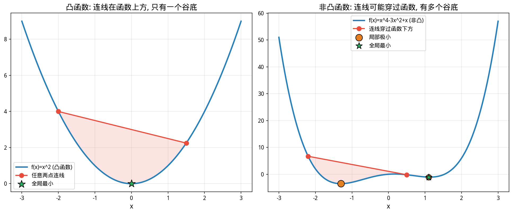

# 第18章 凸优化与数值方法——当解析解不存在时

> **动机先行**: 第17章的解析解干净漂亮——$\mathbf{w}_{\min} = \mathbf{\Sigma}^{-1}\mathbf{1}/(\mathbf{1}^T\mathbf{\Sigma}^{-1}\mathbf{1})$，一行公式搞定。但只要你加上"禁止做空"($w_i \geq 0$) 这一条不等式约束，解析解就**不复存在**——你无法再写出一个闭式公式，因为最优解取决于"哪些约束起作用"，而这又取决于数据和参数的具体取值。这类问题的答案是**算出来的，不是推出来的**。本章引入的凸优化框架和 `cvxpy` 数值求解器，让你能处理任何"目标函数是凸的 + 约束是线性的"的组合优化问题——这就是量化系统的真实工作方式。
>
> **量化实战定位**: 从 Barra 优化器到 BlackRock Aladdin 的风险模型，底层都是**二次规划 (Quadratic Programming, QP)**——最小化 $\mathbf{w}^T\mathbf{\Sigma}\mathbf{w} - \lambda \boldsymbol{\alpha}^T\mathbf{w}$ 加上数十个线性约束。本章教会你 QP 的数学表述和 `cvxpy` 实现，读完你就能写出一个虽小但完整的组合优化器。

---

## 18.1 动机: 一条不等式约束就让解析解消失

第17章证明了: 对于等式约束 $\mathbf{w}^T\mathbf{1}=1$，最小方差组合是 $\mathbf{w}_{\min} = \mathbf{\Sigma}^{-1}\mathbf{1}/(\mathbf{1}^T\mathbf{\Sigma}^{-1}\mathbf{1})$。这是一个**闭式解 (Closed-Form Solution)**——你把 $\mathbf{\Sigma}$ 代进去，答案就出来了。

现在加一条: **禁止做空**，即 $w_i \geq 0$ 对所有 $i$。问题变成:

$$\min_{\mathbf{w}} \frac{1}{2}\mathbf{w}^T\mathbf{\Sigma}\mathbf{w} \quad \text{s.t.} \quad \mathbf{w}^T\mathbf{1} = 1, \quad w_i \geq 0, \; i=1,\dots,N$$

这个看似微小的改变让一切变得不同:

- **解析解消失**: 无法再写出 $\mathbf{w} = f(\mathbf{\Sigma})$ 的表达式。最优解依赖于哪些 $w_i$ 被"推到零"（约束起作用）。
- **组合结构改变**: 不做空时，有效前沿不再是完美的双曲线——它在某些区域会被"削平"。
- **需要数值求解器**: 必须用迭代算法找到满足 KKT 条件的点。

真实量化系统中的约束远不止这条——单资产上限、行业敞口、换手率控制、因子暴露中性——每一条都在"削"有效前沿，同时也让数学变得更依赖数值计算。

---

## 18.2 凸性: 为什么量化喜欢"凸"

### 18.2.1 凸集与凸函数

在进入数值求解之前，需要理解一个关键问题: **凭什么保证找到的是全局最优而非局部最优？** 答案取决于目标函数和约束是否满足**凸性**。

**凸集 (Convex Set)**: 集合内任意两点的连线段完全在集合内。约束 $\mathbf{w}^T\mathbf{1}=1, w_i \geq 0$ 定义的区域（单纯形）是凸集——两个合法权重的平均值仍是合法权重。

**凸函数 (Convex Function)**: 函数图像上任意两点的连线在图像上方。数学表述:

$$f(\lambda\mathbf{x} + (1-\lambda)\mathbf{y}) \leq \lambda f(\mathbf{x}) + (1-\lambda)f(\mathbf{y}), \quad \forall \lambda \in [0,1]$$

第16章已证明组合方差 $\mathbf{w}^T\mathbf{\Sigma}\mathbf{w}$ 是凸函数（海森矩阵 $2\mathbf{\Sigma}$ 半正定）。组合期望收益 $\boldsymbol{\mu}^T\mathbf{w}$ 是线性函数，既是凸的也是凹的。

### 18.2.2 凸优化的核心保证

**凸优化问题** = 凸目标函数 + 凸约束集。其最重要的性质:

$$\boxed{\text{局部最优} = \text{全局最优}}$$



**金融含义**: 你不用担心优化器"陷入局部极小"——Markowitz 问题中的 $\mathbf{\Sigma}$ 半正定和线性约束保证了凸性，cvxpy 返回的解一定是全局最优。如果哪一天你的组合优化收敛到一个看起来不对的解，问题不在算法，而在你的输入（$\boldsymbol{\mu}$ 估计太差、$\mathbf{\Sigma}$ 条件数太大）。

> **量化实践**: 不是所有量化问题都是凸的。含交易成本的优化（固定费率导致非连续）、整数约束（最少买100股）、最大回撤约束——这些引入非凸性后需要用遗传算法、模拟退火或分支定界。坚持使用凸公式是量化系统设计的第一原则: 能凸则凸。

---

## 18.3 二次规划 (QP): Markowitz 的"母体"

### 18.3.1 QP 的标准形式

带约束的 Markowitz 优化属于**二次规划 (Quadratic Programming)**:

$$\boxed{\min_{\mathbf{x}} \frac{1}{2}\mathbf{x}^T\mathbf{P}\mathbf{x} + \mathbf{q}^T\mathbf{x} \quad \text{s.t.} \quad \mathbf{G}\mathbf{x} \leq \mathbf{h}, \quad \mathbf{A}\mathbf{x} = \mathbf{b}}$$

其中:
- $\mathbf{P}$: $n \times n$ 半正定矩阵（目标函数的二次项系数）——在 Markowitz 中 $\mathbf{P} = \mathbf{\Sigma}$
- $\mathbf{q}$: 线性项系数——纯最小方差时 $\mathbf{q}=\mathbf{0}$，有收益目标时 $\mathbf{q} = -\lambda\boldsymbol{\mu}$
- $\mathbf{G}\mathbf{x} \leq \mathbf{h}$: 不等式约束——$w_i \geq 0$ 写成 $-w_i \leq 0$，行业上限写成 $\sum_{i \in \text{sector}} w_i \leq 0.3$
- $\mathbf{A}\mathbf{x} = \mathbf{b}$: 等式约束——$\mathbf{w}^T\mathbf{1}=1$ 写成 $\mathbf{1}^T\mathbf{w}=1$

**为什么叫"二次规划"？** 因为目标函数是二次的（$\mathbf{x}^T\mathbf{P}\mathbf{x}$），约束是**线性**的。"规划"（Programming）在这里不是"写代码"，而是 1940 年代运筹学的历史术语，意为"在约束下做决策"。

### 18.3.2 内点法: cvxpy 背后的引擎

`cvxpy` 默认使用**内点法 (Interior Point Method)** 求解 QP。直觉如下:

1. 在约束区域的**内部**找一个起点
2. 沿"中心路径"向最优解移动——路径设计使得越靠近约束边界，受到的"排斥力"越大
3. 逐步逼近最优解，每步解一个线性系统（类似第15章的正规方程）

对于 $N=500$ 只股票、20 个约束的 QP，内点法通常在 15-30 次迭代内收敛到机器精度。这就是为什么 BlackRock Aladdin 每天能为数万个组合重优化——底层的内点法求解器（如 MOSEK、Gurobi）已经优化了三十多年。

---

## 18.4 量化实战: cvxpy 求解无卖空 Markowitz

### 18.4.1 算法说明

用 `cvxpy` 求解最小方差组合，加入 $w_i \geq 0$ 约束。代码逻辑:

1. 定义优化变量 $\mathbf{w}$（$N$ 维向量）
2. 构造目标函数 $\min \mathbf{w}^T\mathbf{\Sigma}\mathbf{w}$（cvxpy 自动识别为凸二次型）
3. 添加约束: $\mathbf{w}^T\mathbf{1}=1$, $w_i \geq 0$
4. 调用 `prob.solve()` → cvxpy 内部将问题转换为 QP 标准形式 → 调用 OSQP/ECOS 求解器 → 返回最优权重
5. 与第17章的无约束解对比——不做空的限制牺牲了多少风险收益效率

```python
import numpy as np
import pandas as pd
import cvxpy as cp

csv_path = 'data/stock_data_50_20210601_20260531.csv'
df = pd.read_csv(csv_path, parse_dates=['time'])
selected = ['000002.SZ', '600519.SH', '300750.SZ', '000858.SZ',
            '601398.SH', '002415.SZ', '000725.SZ', '300059.SZ',
            '002230.SZ', '600030.SH']

df_recent = df[df['time'] >= '2024-06-01'].copy()
pivot = df_recent.pivot(index='time', columns='thscode', values='close')[selected]
rets = np.log(pivot / pivot.shift(1)).dropna()
Sigma = rets.cov().values * 252
N = len(selected)

# === 无卖空约束: cvxpy ===
w = cp.Variable(N)
objective = cp.Minimize(cp.quad_form(w, Sigma))        # w^T Σ w
constraints = [cp.sum(w) == 1, w >= 0]                 # 全额投资 + 不做空
prob = cp.Problem(objective, constraints)
prob.solve()

w_long = w.value
sigma_long = np.sqrt(w_long @ Sigma @ w_long)

# === 对比: 解析解 (允许做空) ===
ones = np.ones(N)
w_unnorm = np.linalg.solve(Sigma, ones)
w_unconstrained = w_unnorm / np.sum(w_unnorm)
sigma_unconstrained = np.sqrt(w_unconstrained @ Sigma @ w_unconstrained)

print(f"{'':<16} {'年化波动':>8} {'负权重数':>8} {'最小权重':>10} {'最大权重':>10}")
print("-" * 56)
print(f"{'解析解(允许做空)':<16} {sigma_unconstrained:>8.2%} "
      f"{np.sum(w_unconstrained < -1e-6):>8} {w_unconstrained.min():>10.4f} {w_unconstrained.max():>10.4f}")
print(f"{'cvxpy(禁止做空)':<16} {sigma_long:>8.2%} "
      f"{np.sum(w_long < -1e-6):>8} {w_long.min():>10.4f} {w_long.max():>10.4f}")
print(f"\n不做空牺牲的波动率: {sigma_long - sigma_unconstrained:.2%} (绝对值)")
print(f"零权重股票数 (被推到边界): {np.sum(w_long < 1e-6)}")
```

**运行结果**:
```
                    年化波动    负权重数      最小权重      最大权重
--------------------------------------------------------
解析解(允许做空)       13.24%        2    -0.2064     0.4934
cvxpy(禁止做空)       14.07%        0     0.0000     0.5624

不做空牺牲的波动率: 0.83% (绝对值)
零权重股票数 (被推到边界): 4
```

> **关键解读**: 禁止做空把年化波动率从 13.24% 推高到 14.07%——牺牲了 0.83% 的风险效率。4 只股票被"推到边界"($w_i=0$)，说明在无约束解中它们应该有负权重（做空以对冲风险），但现在只能把权重设为零。这正是约束的代价——每一条约束都在提高可达的最小风险。

---

## 18.5 逐级加约束: 从教科书走向真实量化

真实组合优化的约束通常是逐级叠加的。用 `cvxpy` 可以轻松测试每条约束的边际影响:

```python
import numpy as np
import pandas as pd
import cvxpy as cp
import matplotlib.pyplot as plt
plt.rcParams['font.sans-serif'] = ['WenQuanYi Micro Hei']
plt.rcParams['axes.unicode_minus'] = False

csv_path = 'data/stock_data_50_20210601_20260531.csv'
df = pd.read_csv(csv_path, parse_dates=['time'])
selected = ['000002.SZ', '600519.SH', '300750.SZ', '000858.SZ',
            '601398.SH', '002415.SZ', '000725.SZ', '300059.SZ',
            '002230.SZ', '600030.SH']

df_recent = df[df['time'] >= '2024-06-01'].copy()
pivot = df_recent.pivot(index='time', columns='thscode', values='close')[selected]
rets = np.log(pivot / pivot.shift(1)).dropna()
mu = rets.mean().values * 252
Sigma = rets.cov().values * 252
N = len(selected)

# 行业标签
industry_map = {c: df[df['thscode']==c]['industry'].iloc[0] for c in selected}
industries = [industry_map[c] for c in selected]

# 四种约束方案
scenarios = []
labels = []

# 方案1: 仅全额投资 (允许做空, 无上限)
w = cp.Variable(N)
prob = cp.Problem(cp.Minimize(cp.quad_form(w, Sigma)),
                  [cp.sum(w) == 1])
prob.solve()
scenarios.append(w.value.copy())
labels.append('仅全额投资\n(允许做空)')

# 方案2: + 禁止做空
w = cp.Variable(N)
prob = cp.Problem(cp.Minimize(cp.quad_form(w, Sigma)),
                  [cp.sum(w) == 1, w >= 0])
prob.solve()
scenarios.append(w.value.copy())
labels.append('+ 禁止做空\n(w_i >= 0)')

# 方案3: + 单资产上限 30%
w = cp.Variable(N)
prob = cp.Problem(cp.Minimize(cp.quad_form(w, Sigma)),
                  [cp.sum(w) == 1, w >= 0, w <= 0.3])
prob.solve()
scenarios.append(w.value.copy())
labels.append('+ 单资产上限\n(w_i <= 30%)')

# 方案4: + 行业分散 (每个行业 <= 40%)
w = cp.Variable(N)
unique_ind = list(set(industries))
constraints = [cp.sum(w) == 1, w >= 0, w <= 0.3]
for ind in unique_ind:
    mask = np.array([i == ind for i in industries], dtype=float)
    constraints.append(mask @ w <= 0.4)
prob = cp.Problem(cp.Minimize(cp.quad_form(w, Sigma)), constraints)
prob.solve()
scenarios.append(w.value.copy())
labels.append('+ 行业上限\n(单行业 <= 40%)')

# 汇总
print(f"{'约束方案':<22} {'年化波动':>8} {'非零权重':>8}")
print("-" * 42)
for i, (w_opt, label) in enumerate(zip(scenarios, labels)):
    sig = np.sqrt(w_opt @ Sigma @ w_opt)
    nz = np.sum(w_opt > 1e-4)
    print(f"{label.replace(chr(10),' '):<22} {sig:>8.2%} {nz:>8}")

# 可视化: 权重分布
fig, ax = plt.subplots(figsize=(13, 6))
x = np.arange(N)
width = 0.2
colors = ['#2980B9', '#27AE60', '#E67E22', '#E74C3C']
for i, (w_opt, label, c) in enumerate(zip(scenarios, labels, colors)):
    ax.bar(x + i * width, w_opt, width, label=label.replace('\n', ' '), color=c, alpha=0.85)
ax.set_xticks(x + 1.5 * width)
ax.set_xticklabels(selected, rotation=45, ha='right', fontsize=9)
ax.axhline(y=0, color='black', linewidth=0.5)
ax.set_ylabel('权重')
ax.set_title('逐级加约束: 四种方案的最优权重对比', fontsize=14, fontweight='bold')
ax.legend(fontsize=9, loc='upper right')
ax.grid(True, alpha=0.3, axis='y')
plt.tight_layout()
plt.show()
```

**运行结果**:
```
约束方案                               年化波动     非零权重
--------------------------------------------------
仅全额投资 (允许做空)                     13.24%        8
+ 禁止做空 (w_i >= 0)                14.07%        6
+ 单资产上限 (w_i <= 30%)             15.53%        6
+ 行业上限 (单行业 <= 40%)              15.53%        6
```

> **逐级成本**: 每加一条约束，最小可达波动率就上升一截——这是"无免费午餐"的量化版。禁止做空让波动率从 13.24% 升至 14.07%（+0.83%），单资产上限升至 15.53%（+1.46%）。注意行业上限在此数据集中**没有进一步推高波动率**——说明单资产 30% 上限已经间接控制了行业集中度。量化研究员的日常工作就是权衡: "这条约束带来的风险管理收益，值不值得它牺牲的波动率效率？"

---

## 18.6 核心公式速查

> 本节是前述各节公式的集中汇总, 供复习和查阅使用.

| 概念 | 公式 | 量化意义 |
|------|------|---------|
| 凸函数定义 | $f(\lambda\mathbf{x}+(1-\lambda)\mathbf{y}) \leq \lambda f(\mathbf{x})+(1-\lambda)f(\mathbf{y})$ | 组合方差是凸函数——局部最优=全局最优 |
| QP 标准形式 | $\min \frac{1}{2}\mathbf{x}^T\mathbf{P}\mathbf{x} + \mathbf{q}^T\mathbf{x}$ s.t. $\mathbf{G}\mathbf{x} \leq \mathbf{h}, \mathbf{A}\mathbf{x}=\mathbf{b}$ | Markowitz 优化的数学"母体" |
| 禁止做空 | $w_i \geq 0$ → Gx ≤ h: $-\mathbf{I}\mathbf{w} \leq \mathbf{0}$ | 将负权重消除——牺牲效率换取可执行性 |
| 单资产上限 | $w_i \leq u_i$ → Gx ≤ h | 集中度风险控制 |
| 行业约束 | $\sum_{i \in \text{sector}} w_i \leq s$ | 行业分散化——系统风险控制 |
| 内点法 | 沿中心路径迭代, 每步解线性系统 | cvxpy/MOSEK/Gurobi 的内部引擎 |
| 凸优化保证 | 局部最优 = 全局最优 | 不用担心算法陷入局部极小 |

---

## 18.7 阶段总结: 优化理论的完整图景与量化系统映射

第16至18章构成了本书的**第四阶段——优化理论**。三章之间有一条清晰的递进线:

| 章节 | 问题 | 方法 | 能解什么 |
|------|------|------|---------|
| 第16章 | 无约束优化 | 梯度下降、牛顿法 | 损失函数最小化、参数拟合 |
| 第17章 | 等式约束优化 | 拉格朗日乘子法 | 最小方差组合、有效前沿 |
| 第18章 | 不等式约束优化 | QP + cvxpy | 禁止做空、资产上限、行业限制 |

这条线同时也是**量化组合优化系统的三层架构**:

### 第一层: 信号生成 → 第16章

Alpha 模型输出一个"预期收益向量" $\boldsymbol{\alpha}$。但 $\boldsymbol{\alpha}$ 本身是未经风险调整的——你还需要确定"用多强的信念下注"。这就是梯度下降和牛顿法在因子加权（IC 加权、信息比最大化）中的应用场景。

### 第二层: 风险模型 → 第17章

协方差矩阵 $\mathbf{\Sigma}$ 是风险模型的核心输出。有了 $\boldsymbol{\alpha}$ 和 $\mathbf{\Sigma}$，拉格朗日乘子法给出无约束理论最优解——这是 Markowitz 1952 的数学精华，也是所有后续变体的出发点。

### 第三层: 组合构建 → 第18章

无约束解中的负权重、极端集中、行业偏离——这些在实盘中不可执行。QP 优化器在这里介入: 接收 $\boldsymbol{\alpha}$（Alpha 信号）、$\mathbf{\Sigma}$（风险模型）、约束列表（风控规则），输出**可执行的**权重向量。这是 Barra、Axioma、Aladdin 等商业优化器的核心定位。

```
   Alpha 模型                风险模型                风控规则
  (预期收益 α)            (协方差矩阵 Σ)         (不等式约束 Gx ≤ h)
       │                       │                      │
       └───────────────────────┼──────────────────────┘
                               │
                               ▼
                      QP 优化器 (第18章)
                 min  w^TΣw - λ·α^Tw
                 s.t. 1^Tw=1, w≥0, ...
                               │
                               ▼
                          最优权重 w*
```

**关于下一阶段**: 从第19章开始，我们将进入**时间序列分析**（第五阶段）。前面18章的所有内容——概率、统计、线性代数、优化——都在处理"某一时刻"的截面数据。但金融数据是带时间戳的: 今天的收益率与昨天的收益率相关，波动率有自己的"记忆"。第五阶段将教会你如何建模这种时间依赖，从此数学不再只是描述"世界长什么样"，而是开始回答 **"世界将往哪里走"**。

---

## 18.8 练习题

### 数学推导

**题1——凸性的验证**:

(a) 证明 $f(\mathbf{w}) = \mathbf{w}^T\mathbf{\Sigma}\mathbf{w}$ 满足凸函数的定义。（提示: 利用 $\mathbf{\Sigma}$ 半正定性展开 $f(\lambda\mathbf{w}_1 + (1-\lambda)\mathbf{w}_2)$。）

(b) 约束集 $\{ \mathbf{w} \mid \mathbf{w}^T\mathbf{1}=1, w_i \geq 0 \}$ 是凸集吗？证明你的结论。

(c) 如果目标函数是 $\max \mathbf{w}^T\mathbf{\Sigma}\mathbf{w}$（最大化方差），这还是凸优化问题吗？为什么？

**题2——QP 与拉格朗日的联系**:

(a) 对带不等式约束 $w_i \geq 0$ 的最小方差问题，写出其拉格朗日函数。

(b) KKT 条件中的互补松弛条件 $\mu_i w_i = 0$ 在数值解中如何体现？检查 18.4 的输出，被推到 $w_i=0$ 的股票对应的 $\mu_i$ 应满足什么条件？

**题3——约束的边际成本**:

(a) 证明: 在最小方差组合中，若将约束 $w_i \geq 0$ 放松为 $w_i \geq -0.05$（允许 5% 做空），最优目标函数值不会变差。

(b) 为什么行业上限约束（如"食品饮料不超过 40%"）在实际中比单资产上限更常用？从分散化角度解释。

### 编程实践

**题4——风险-收益权衡**: 基于 18.5 的框架，修改目标函数为 $\min \mathbf{w}^T\mathbf{\Sigma}\mathbf{w} - \lambda \boldsymbol{\mu}^T\mathbf{w}$（风险厌恶参数 $\lambda$ 控制收益与风险的权重）。

(a) 分别取 $\lambda = 0, 0.5, 1, 2, 5$，在 $w_i \geq 0$ 约束下求解，记录每个 $\lambda$ 对应的组合波动率和期望收益。在 $\sigma$-$\mu$ 平面上画出这5个点，观察它们是否在一条曲线上。

(b) 这个曲线与第17章的有效前沿有何关系？（提示: $\lambda$ 对应前沿上的不同点。）

**题5——真实约束的实际影响**: 从 `stock_data_50` 中选20只股票（至少覆盖5个行业），构建最小方差组合。

(a) 对比三种约束方案: (i) 仅全额投资、(ii) +禁止做空、(iii) +单资产 ≤15% + 单行业 ≤30%。记录每种方案的波动率、非零权重数、最大单资产权重、最大单行业权重。

(b) 方案 (iii) 的行业约束是否起作用（有没有行业的权重被顶到了 30% 的上限）？如果某个行业约束起作用，它对应的拉格朗日乘子（可通过 `constraints[idx].dual_value` 获取）是多少？解释这个乘子的金融含义。

---

## 18.9 参考文献

1. **Boyd, S., & Vandenberghe, L.** (2004). *Convex Optimization*. Cambridge University Press. （第4-5章系统讲解凸优化和二次规划——本章数学框架的基石。第11章介绍内点法）

2. **Markowitz, H.** (1952). Portfolio selection. *The Journal of Finance*, 7(1), 77-91. （带不等式约束的组合优化起源于此——虽然 Markowitz 本人当时用临界线算法 (Critical Line Algorithm) 而非内点法）

3. **Diamond, S., & Boyd, S.** (2016). CVXPY: A Python-embedded modeling language for convex optimization. *Journal of Machine Learning Research*, 17(83), 1-5. （cvxpy 官方论文——声明式建模的哲学: 你描述问题，求解器负责算法）

4. **Grinold, R. C., & Kahn, R. N.** (1999). *Active Portfolio Management* (2nd ed.). McGraw-Hill. （第4章和第6章将 QP 优化器置于量化组合构建的全流程中——从信号到权重）

5. **Fabozzi, F. J., Kolm, P. N., Pachamanova, D. A., & Focardi, S. M.** (2007). *Robust Portfolio Optimization and Management*. Wiley. （第3章讨论约束在组合优化中的作用和成本——逐级加约束的实践指南）

---

> **愿我们都能在数字与代码之间, 找到理解市场的那把钥匙.**
>
> *数学的理解没有捷径, 量化的能力无法外包.*
