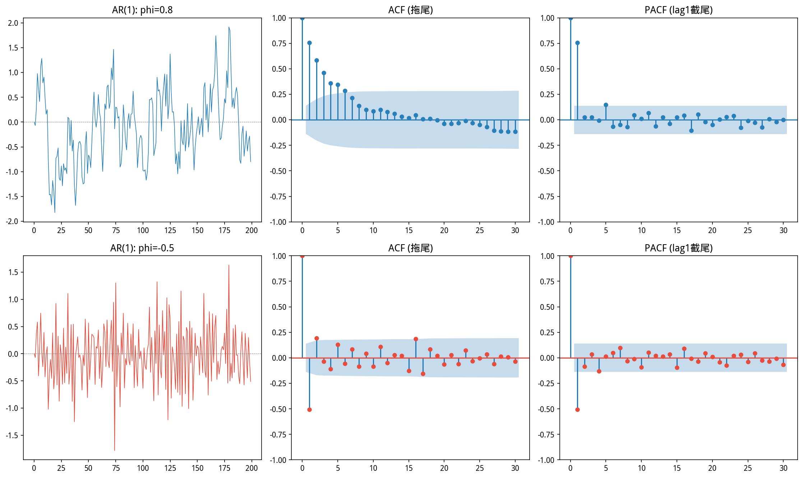
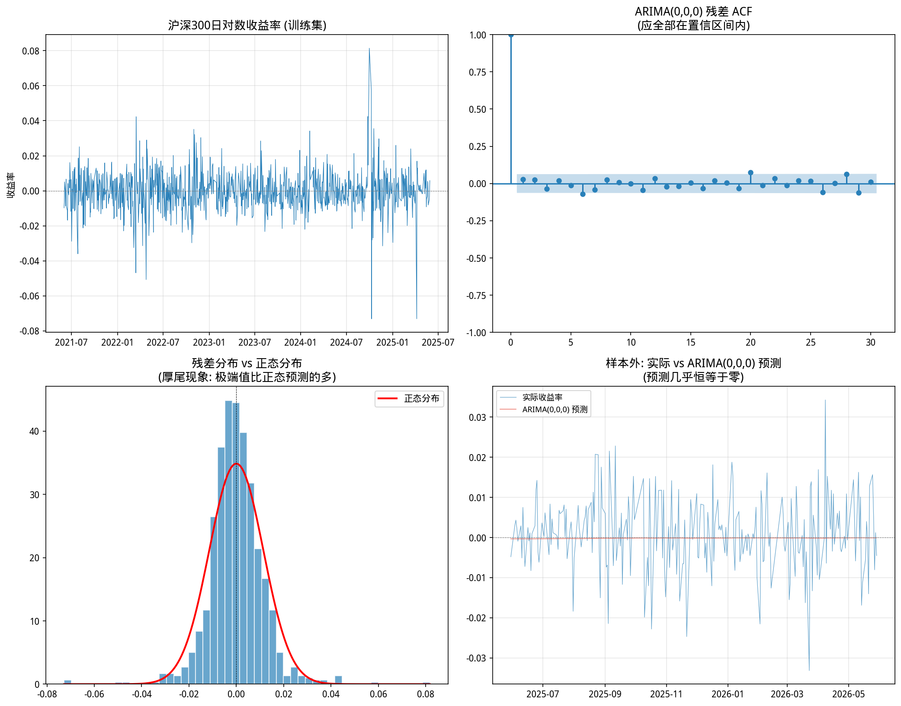

# 第20章 ARIMA 模型——从自回归到差分自回归移动平均

> **动机先行**: 第19章教会了我们"看"——用 ACF 和 PACF 诊断序列中的时间依赖结构。本章教会我们"建"——用 AR(p)、MA(q)、ARMA(p,q) 和 ARIMA(p,d,q) 模型把这种结构写成数学公式, 然后用历史数据拟合参数, 最后预测未来。但有一个重要的事实需要事先说明: **金融收益率序列的预测信噪比极低**——即使是最好的 ARIMA 模型, 对明天涨跌的预测准确率通常也只比抛硬币好一点点。ARIMA 在量化中的真正价值不在于"猜对明天涨不涨", 而在于 (1) 识别残差中的可预测结构以改进因子模型, (2) 为波动率建模(第21章 GARCH)提供均值方程的基准。
>
> **量化实战定位**: ARIMA 是时间序列模型的"瑞士军刀"——AR 部分捕捉动量/均值回复, MA 部分捕捉外部冲击的持续影响, I(d) 差分操作把非平稳序列变成平稳。理解 ARIMA 的建模逻辑(识别→估计→诊断→预测)后, 第21章 GARCH 和第22章协整的学习将事半功倍。

---

## 20.1 动机: 从"看"ACF 到"写"方程——给时间依赖建个数学模型

第19章用 ACF 图看到了沪深300日收益率"几乎无自相关"(白噪声)。但如果换成另一个序列——比如某只小盘股的收益率, 或者收益率的绝对值——ACF 可能呈现出微弱但持续的正自相关。这个自相关结构能否写成一个公式？

本章要构建的模型族是:

| 模型 | 公式 | 直觉 |
|------|------|------|
| AR(1) | $y_t = \phi y_{t-1} + \varepsilon_t$ | "今天 = $\phi \times$ 昨天 + 随机冲击" |
| MA(1) | $y_t = \varepsilon_t + \theta \varepsilon_{t-1}$ | "今天 = 今天的冲击 + $\theta \times$ 昨天的冲击" |
| ARMA(1,1) | $y_t = \phi y_{t-1} + \varepsilon_t + \theta \varepsilon_{t-1}$ | 两者的结合 |
| ARIMA(p,d,q) | 对差分 $d$ 次后的序列拟合 ARMA(p,q) | 处理非平稳序列 |

其中 $\varepsilon_t \sim WN(0, \sigma^2)$ 是白噪声——不可预测的"新息"(Innovation), 代表今天真正"新"的信息。

---

## 20.2 自回归模型 AR(p) — Autoregression: 用过去的自己预测现在的自己

### 20.2.1 从线性回归到"自己回归自己"

第12章的线性回归是: 用自变量 $X$ 预测因变量 $Y$。**自回归 (Autoregression, 简称 AR)** 是这种思想的极致简化——自变量就是 $Y$ 自己的过去值。

AR 的英文全称 "Autoregressive" 拆开就是 **auto-(自己) + regression(回归)**。"自己回归自己"听起来像循环论证, 但在时间序列中它有明确的含义: **今天的值 $y_t$ 是过去值 $y_{t-1}, y_{t-2}, \dots$ 的线性函数加上一个不可预测的随机冲击。**

AR(1) 是最简单的形式:

$$\boxed{y_t = c + \phi y_{t-1} + \varepsilon_t, \quad \varepsilon_t \sim WN(0, \sigma^2)}$$

这其实就是**以 $y_{t-1}$ 为自变量、$y_t$ 为因变量的一元线性回归**——斜率是 $\phi$, 截距是 $c$, 误差项是 $\varepsilon_t$。如果你把 $(y_{t-1}, y_t)$ 的散点图画出来, $\phi$ 就是穿过这些点的回归线的斜率。

**各符号详解**:
- $c$: 常数项。如果 $\phi=0$ (没有自回归), $y_t = c + \varepsilon_t$——序列在 $c$ 附近随机波动。长期均值 $E[y_t] = c/(1-\phi)$。
- $\phi$: **自回归系数**——度量"昨天对今天的影响力"。$\phi=0.5$ 意味着昨天的变动有 50% 会延续到今天; $\phi=0$ 意味着序列没有记忆(白噪声); $\phi=0.95$ 意味着惯性极强, 很久以前的冲击到今天还有余波。
- $\varepsilon_t$: **新息 (Innovation)**——今天"真正新"的信息。它是白噪声: 均值为零, 方差恒定, 与过去的一切无关。$\varepsilon_t$ 是不能被过去解释的"意外"。

**平稳条件**: $|\phi| < 1$。如果 $|\phi| \geq 1$, 序列的方差随时间发散, 变成非平稳——此时必须先用差分处理(见20.5节 ARIMA)。

**三种行为模式及其金融含义**:

| $\phi$ | 行为 | 金融实例 | 交易含义 |
|--------|------|---------|---------|
| $0 < \phi < 1$ | 正自相关, 缓慢均值回复 | 某些小盘股收益率有微弱的短期动量 | 趋势跟踪策略可能在短期有效 |
| $\phi = 0$ | 白噪声 | 沪深300日收益率(见20.6节) | 无法用历史线性预测——有效市场 |
| $-1 < \phi < 0$ | 负自相关, 锯齿状振荡 | 某些超买超卖后的反转 | 均值回复策略(反转交易) |

**AR(1) 的统计性质**(当 $|\phi|<1$):
- 均值: $E[y_t] = \frac{c}{1-\phi}$ — 序列围绕此值波动
- 方差: $Var(y_t) = \frac{\sigma^2}{1-\phi^2}$ — 当 $\phi \to 1$, 方差 $\to \infty$(接近非平稳)
- 自相关函数: $\rho_k = \phi^k$ — **指数衰减**(拖尾), 记忆随滞后呈几何级数消退

### 20.2.2 AR(1) 的等价表述: "无穷阶 MA"

通过迭代展开, AR(1) 可以写成无穷阶 MA 的形式:

$$y_t = \frac{c}{1-\phi} + \varepsilon_t + \phi\varepsilon_{t-1} + \phi^2\varepsilon_{t-2} + \phi^3\varepsilon_{t-3} + \cdots$$

这意味着: **今天 = 长期均值 + 所有历史冲击的加权和**, 权重按 $\phi^k$ 衰减。$\phi=0.8$ 时, 今天的冲击权重为1, 昨天的为0.8, 前天的为0.64, 大前天的为0.51……冲击的影响需要约 10 期(当 $0.8^{10} \approx 0.1$)才衰减到 10% 以下。

这个视角解释了 AR(1) 的直观含义: **今天的值是所有历史信息的加权平均, 加权方案由 $\phi$ 控制。**

### 20.2.3 AR(p): p 阶自回归

当不止昨天, 而是过去 $p$ 天都有直接影响时:

$$\boxed{y_t = c + \phi_1 y_{t-1} + \phi_2 y_{t-2} + \cdots + \phi_p y_{t-p} + \varepsilon_t}$$

这就是一个**以 $p$ 个滞后值为特征的多元线性回归**。$\phi_1, \dots, \phi_p$ 可以用第15章的 OLS 公式 $(\mathbf{X}^T\mathbf{X})^{-1}\mathbf{X}^T\mathbf{y}$ 估计——自变量矩阵 $\mathbf{X}$ 的每一列是 $y$ 在不同滞后期的取值。

**AR(p) 的核心诊断规则**: ACF **拖尾**(衰减但不截断), PACF 在滞后 $p$ 处**截尾**($k>p$ 时 $\phi_{kk} \approx 0$)。为什么？因为 PACF 剥离了中间变量的间接效应——$y_t$ 与 $y_{t-3}$ 的 ACF 包含了 $y_t \leftarrow y_{t-1} \leftarrow y_{t-2} \leftarrow y_{t-3}$ 的传导, 而 PACF 只保留"绕过中间结点"的直接效应。



### 20.2.4 AR 模型的局限性与适用场景

| 局限 | 说明 |
|------|------|
| **只能捕捉线性依赖** | 如果 $y_t$ 与 $y_{t-1}$ 的关系是非线性的(如门限效应), AR 无法刻画 |
| **对非平稳序列失效** | $|\phi| \geq 1$ 时方差发散, 必须先差分(→ARIMA) |
| **阶数 p 难确定** | 真实数据的 PACF 很少"干净地"在某个滞后截尾——需要信息准则辅助 |
| **金融收益率的 $\phi$ 通常 ≈0** | 日频收益率几乎无自相关(见20.6节实证)——AR 在收益率预测上帮不上忙 |
| **不捕捉波动率结构** | AR 假设 $\varepsilon_t$ 的方差恒定——但真实金融数据存在波动率聚集(第21章) |

**AR 在量化中的实际应用**:
- **残差诊断**: 因子模型(第12章)回归后, 检验残差是否还有 AR 结构——如果有, 说明因子没提干净
- **均值方程**: 为 GARCH 模型(第21章)提供条件均值的基准——AR(0) 或 AR(1) 通常就够了
- **配对交易**(第22章): 价差序列的 AR(1) 建模——判断均值回复速度

### 20.2.5 量化实战: 模拟 + 识别 AR 模型

先模拟一个 AR(2) 过程, 再用 ACF/PACF 图验证截尾/拖尾模式:

```python
import numpy as np
import matplotlib.pyplot as plt
from statsmodels.graphics.tsaplots import plot_acf, plot_pacf
from statsmodels.tsa.arima.model import ARIMA
plt.rcParams['font.sans-serif'] = ['WenQuanYi Micro Hei']
plt.rcParams['axes.unicode_minus'] = False

# 模拟 AR(2): y_t = 0.8*y_{t-1} - 0.3*y_{t-2} + eps
np.random.seed(42)
T = 500
eps = np.random.randn(T) * 0.5
y = np.zeros(T)
for t in range(2, T):
    y[t] = 0.8*y[t-1] - 0.3*y[t-2] + eps[t]
y = y[100:]  # 丢弃前100期(让序列稳定)

# 拟合 AR(2) 模型
model = ARIMA(y, order=(2, 0, 0))
fit = model.fit()
print("真实参数: phi1=0.8, phi2=-0.3")
print(f"拟合参数: phi1={fit.params[1]:.4f}, phi2={fit.params[2]:.4f}")
print(f"常数项: {fit.params[0]:.4f}")

# 诊断图
fig, axes = plt.subplots(2, 2, figsize=(13, 9))
axes[0,0].plot(y, color='#2980B9', linewidth=0.8)
axes[0,0].set_title('模拟 AR(2) 序列', fontsize=13, fontweight='bold')
plot_acf(y, lags=30, ax=axes[0,1], color='#2980B9')
axes[0,1].set_title('ACF: 拖尾 (指数衰减)', fontsize=13, fontweight='bold')
plot_pacf(y, lags=30, ax=axes[1,0], color='#E74C3C', method='ywm')
axes[1,0].set_title('PACF: 截尾 (滞后2后不显著)', fontsize=13, fontweight='bold')
axes[1,1].plot(fit.resid, color='#7F8C8D', linewidth=0.6)
axes[1,1].axhline(y=0, color='black', linestyle='--', linewidth=0.5)
axes[1,1].set_title('残差: 应接近白噪声', fontsize=13, fontweight='bold')
plt.tight_layout(); plt.show()

print(f"\nAIC={fit.aic:.2f}, BIC={fit.bic:.2f}")
```

**运行结果**:
```
真实参数: phi1=0.8, phi2=-0.3
拟合参数: phi1=0.8035, phi2=-0.3121
常数项: 0.0338

AIC=586.05, BIC=602.02
```

> **关键收获**: ACF 拖尾(缓慢指数衰减) + PACF 在滞后2处截尾 → 准确识别为 AR(2)。拟合参数 $\hat{\phi}_1=0.80$, $\hat{\phi}_2=-0.31$ 接近真实值 0.8 和 -0.3。PACF 的截尾滞后数(2)准确给出了模型阶数 $p$。

---

## 20.3 移动平均模型 MA(q) — Moving Average: 用过去冲击的加权和解释现在

### 20.3.1 先澄清一个最易混淆的概念

"Moving Average" 在金融中有两个完全不同的含义, 初学者经常混淆:

| 含义 | 英文 | 公式 | 用途 |
|------|------|------|------|
| **简单移动平均**(SMA) | Simple Moving Average | $\text{SMA}_t = \frac{1}{n}\sum_{i=0}^{n-1} P_{t-i}$ | 技术分析——平滑价格曲线, 识别趋势 |
| **MA 模型**(本章) | Moving Average Model | $y_t = \mu + \varepsilon_t + \theta\varepsilon_{t-1}$ | 时间序列建模——描述随机冲击的传导结构 |

**区别**: SMA 是对**价格**做算术平均, 权重相等($1/n$), 没有随机项, 目的是"平滑"。MA 模型是对**不可观测的白噪声冲击 $\varepsilon_t$** 做加权和, 权重由参数 $\theta$ 决定, 本质是一个随机过程模型, 目的是"解释序列的自相关结构"。

MA 模型的名字来自于它把序列写成了**白噪声(冲击)的加权移动平均**: $y_t = \mu + \sum_{j=0}^{q} \theta_j \varepsilon_{t-j}$(其中 $\theta_0=1$)。但不是对可观测的价格, 而是对**不可观测的冲击**。

### 20.3.2 MA(1): 冲击只延续一期

$$\boxed{y_t = \mu + \varepsilon_t + \theta \varepsilon_{t-1}, \quad \varepsilon_t \sim WN(0, \sigma^2)}$$

**逐项解读**:
- $\mu$: 序列的无条件均值。在没有冲击时, $y_t$ 围绕 $\mu$ 波动。
- $\varepsilon_t$: **今天的冲击**——系数固定为 1(这是 MA 模型的标准化约定, 否则参数不可识别)。
- $\theta \varepsilon_{t-1}$: **昨天冲击的"余威"**——$\theta$ 控制冲击的持续时长。$\theta=0.7$ 意味着昨天的冲击有 70% 延续到今天; $\theta=0$ 退化为白噪声; $\theta=-0.5$ 意味着昨天的正向冲击对今天有反向影响(超调后回调)。

**一个微型手算例子**: 设 $\mu=0$, $\theta=0.7$, 前三期冲击为 $\varepsilon_1=0.5, \varepsilon_2=-0.3, \varepsilon_3=0.1$:

$$y_1 = 0 + 0.5 + 0 = 0.5$$
$$y_2 = 0 + (-0.3) + 0.7 \times 0.5 = 0.05$$
$$y_3 = 0 + 0.1 + 0.7 \times (-0.3) = -0.11$$

第一期冲击 0.5 在第二期衰减为 0.35($=0.7 \times 0.5$), 到第三期完全消失。**每个冲击只会直接影响接下来一期**——这是 MA(1) 的记忆长度。

**推导 MA(1) 的统计性质**:
- 均值: $E[y_t] = \mu + E[\varepsilon_t] + \theta E[\varepsilon_{t-1}] = \mu$(因为 $\varepsilon_t$ 均值为0)
- 方差: $Var(y_t) = Var(\varepsilon_t) + \theta^2 Var(\varepsilon_{t-1}) = \sigma^2(1+\theta^2)$——大于白噪声的 $\sigma^2$
- 一阶自协方差: $Cov(y_t, y_{t-1}) = E[(\varepsilon_t + \theta\varepsilon_{t-1})(\varepsilon_{t-1} + \theta\varepsilon_{t-2})] = \theta\sigma^2$(只有 $\varepsilon_{t-1}$ 项重叠)
- 二阶自协方差: $Cov(y_t, y_{t-2}) = 0$——因为 $\varepsilon_t+\theta\varepsilon_{t-1}$ 与 $\varepsilon_{t-2}+\theta\varepsilon_{t-3}$ 没有共同的 $\varepsilon$ 项
- 自相关: $\rho_1 = \frac{\theta}{1+\theta^2}$, $\rho_k = 0$ 对所有 $k \geq 2$ — **ACF 在滞后 1 截尾!**

**这就是 MA(q) 最重要的诊断特征**: ACF 在滞后 $q$ 后截尾(全部为零), PACF 拖尾(指数衰减)。与 AR(p) 恰好对称:

| 模型 | ACF | PACF | 直觉 |
|------|-----|------|------|
| AR(p) | 拖尾 | **截尾**(lag p) | 直接的"记忆"只有 p 期长 |
| MA(q) | **截尾**(lag q) | 拖尾 | 直接的"冲击传导"只有 q 期长 |
| ARMA(p,q) | 拖尾 | 拖尾 | 两种机制同时存在 |

### 20.3.3 MA 模型中的"冲击"到底是什么？

$\varepsilon_t$ 是不可观测的——你无法从数据中直接提取"今天的冲击值"。但 MA 模型可以通过**最大似然估计 (MLE)** 同时估计所有 $\theta$ 参数和 $\varepsilon_t$ 序列。

**金融中的"冲击"**: 任何突然改变市场预期的信息——政策公告、财报超预期、地缘事件。MA 模型的假设是: 这些冲击的影响在固定期数($q$)后完全消散。对于高频数据(分钟级), MA 结构可能对应买卖价差的反弹效应; 对于日频数据, MA 通常不显著(有效市场快速消化信息)。

### 20.3.4 MA(q) 的扩展与局限

$$\boxed{y_t = \mu + \varepsilon_t + \theta_1 \varepsilon_{t-1} + \cdots + \theta_q \varepsilon_{t-q}}$$

| 局限 | 说明 |
|------|------|
| **可逆性条件** | MA(1) 要求 $|\theta| < 1$(可逆性), 否则参数不唯一——同一组 ACF 可对应不同的 $\theta$ |
| **q 难确定** | 真实数据的 ACF 很少"干净地"截尾——通常需要尝试多个 q 并用信息准则选择 |
| **估计困难** | MA 参数通过 MLE/非线性最小二乘估计, 收敛不如 OLS 估计 AR 参数稳定 |
| **金融收益率的 MA 通常不显著** | 日频信息消化太快, MA 结构不明显——但在微观结构数据(分钟级)中更常见 |

### 20.3.5 量化实战: 模拟 MA 模型

```python
import numpy as np
import matplotlib.pyplot as plt
from statsmodels.graphics.tsaplots import plot_acf, plot_pacf
from statsmodels.tsa.arima.model import ARIMA
plt.rcParams['font.sans-serif'] = ['WenQuanYi Micro Hei']
plt.rcParams['axes.unicode_minus'] = False

# 模拟 MA(2): y_t = eps_t + 0.7*eps_{t-1} - 0.4*eps_{t-2}
np.random.seed(42); T = 500
eps = np.random.randn(T) * 0.5
y = eps[2:] + 0.7*eps[1:-1] - 0.4*eps[:-2]

model = ARIMA(y, order=(0, 0, 2))
fit = model.fit()
print("真实 MA: theta1=0.7, theta2=-0.4")
print(f"拟合 MA: theta1={fit.params[2]:.4f}, theta2={fit.params[3]:.4f}")

fig, axes = plt.subplots(1, 2, figsize=(13, 4.5))
plot_acf(y, lags=30, ax=axes[0], color='#2980B9')
axes[0].set_title('MA(2) ACF: 截尾 (滞后2后为零)', fontsize=13, fontweight='bold')
plot_pacf(y, lags=30, ax=axes[1], color='#E74C3C', method='ywm')
axes[1].set_title('MA(2) PACF: 拖尾 (指数衰减)', fontsize=13, fontweight='bold')
plt.tight_layout(); plt.show()
```

**运行结果**:
```
真实 MA: theta1=0.7, theta2=-0.4
拟合 MA: theta1=0.5560, theta2=-0.3678
```

---

## 20.4 ARMA(p,q): 自回归与移动平均的结合

当 ACF 和 PACF 都拖尾时, 需要同时使用 AR 和 MA 项——这就是 **ARMA(p,q)**:

$$\boxed{y_t = c + \phi_1 y_{t-1} + \cdots + \phi_p y_{t-p} + \varepsilon_t + \theta_1 \varepsilon_{t-1} + \cdots + \theta_q \varepsilon_{t-q}}$$

ARMA(p,q) 可以看作"用 $p+q$ 个参数浓缩了整个 ACF 结构"——它比纯 AR 或纯 MA 更简洁（用更少的参数描述更复杂的自相关模式）。

**模型选择: AIC 与 BIC**

如何选择 $p$ 和 $q$？肉眼从 ACF/PACF 判断是个好开始, 但正式的方法是信息准则:

$$AIC = -2\ln L + 2k, \quad BIC = -2\ln L + k\ln T$$

其中 $L$ 是似然函数值, $k$ 是参数个数, $T$ 是样本量。**AIC 和 BIC 越小越好**——它们平衡了"拟合优度"($-2\ln L$)与"模型复杂度"($2k$ 或 $k\ln T$)。BIC 对参数个数的惩罚比 AIC 更重, 倾向于选择更简洁的模型。

---

## 20.5 ARIMA(p,d,q): 差分——让非平稳变平稳

### 20.5.1 差分的数学

第19章的关键发现: 价格是非平稳的, 但**差分一次**后的收益率是平稳的。ARIMA 在 ARMA 之前加了一个差分步骤:

**一阶差分**: $\Delta y_t = y_t - y_{t-1}$。如果 $\Delta y_t$ 是平稳的, 则 $d=1$。

**ARIMA(p,d,q)** 的完整定义: 对 $y_t$ 做 $d$ 次差分得到平稳序列 $w_t = \Delta^d y_t$, 然后对 $w_t$ 拟合 ARMA(p,q)。

$$w_t = c + \phi_1 w_{t-1} + \cdots + \phi_p w_{t-p} + \varepsilon_t + \theta_1 \varepsilon_{t-1} + \cdots + \theta_q \varepsilon_{t-q}$$

金融数据的典型选择: $d=1$ (价格→收益率), $p$ 和 $q$ 由 ACF/PACF 或信息准则确定。

### 20.5.2 预测: ARIMA 能做什么, 不能做什么

ARIMA 对**平稳序列**的预测有一个重要性质: 长期预测收敛于序列均值。对于 AR(1) $y_t = \phi y_{t-1} + \varepsilon_t$:

$$E[y_{t+h} \mid y_t] = \phi^h y_t$$

当 $h$ 增大, $\phi^h \to 0$, 预测值回归到均值。这意味着 ARIMA 的预测能力仅限于"短期"——$h$ 超过若干滞后, 预测就退化为噪声。对于金融收益率($\phi$ 通常 $\approx 0$), 一步预测几乎等同于零。

---

## 20.6 量化实战: 用 A 股数据拟合 ARIMA 并评估预测

完整流程: (1) ADF 检验确认平稳性(2) ACF/PACF 初选阶数(3) 网格搜索最优 AIC(4) 残差诊断(5) 样本外预测评估。

```python
import numpy as np
import pandas as pd
import matplotlib.pyplot as plt
from statsmodels.tsa.arima.model import ARIMA
from statsmodels.tsa.stattools import adfuller
from statsmodels.graphics.tsaplots import plot_acf
plt.rcParams['font.sans-serif'] = ['WenQuanYi Micro Hei']
plt.rcParams['axes.unicode_minus'] = False

csv_path = 'data/index_data_7_20210601_20260531.csv'
df = pd.read_csv(csv_path, parse_dates=['time'])
hs300 = df[df['thscode']=='000300.SH'].set_index('time')['close']
ret = np.log(hs300).diff().dropna()

# Step 1: 平稳性确认
adf_p = adfuller(ret.dropna())[1]
print(f"ADF p值={adf_p:.4f} → {'平稳' if adf_p<0.05 else '非平稳,需要差分'}")

# Step 2: 训练/测试分割
T_train = int(len(ret) * 0.8)
train, test = ret.iloc[:T_train], ret.iloc[T_train:]

# Step 3: 网格搜索最优 p,q (用 AIC)
best_aic, best_order = np.inf, (0, 0, 0)
for p in range(6):
    for q in range(4):
        try:
            m = ARIMA(train, order=(p, 0, q)).fit()
            if m.aic < best_aic:
                best_aic, best_order = m.aic, (p, 0, q)
        except:
            pass
print(f"\n最优 ARIMA{best_order} (AIC={best_aic:.1f})")

# Step 4: 拟合最优模型
model = ARIMA(train, order=best_order).fit()
print(model.summary().tables[1])

# Step 5: 残差诊断
fig, axes = plt.subplots(1, 2, figsize=(13, 4.5))
plot_acf(model.resid.dropna(), lags=30, ax=axes[0], color='#2980B9')
axes[0].set_title('残差 ACF (应无显著自相关)', fontsize=13, fontweight='bold')
axes[1].hist(model.resid.dropna(), bins=50, color='#2980B9', alpha=0.7, edgecolor='white', density=True)
axes[1].set_title('残差分布 (应近似正态)', fontsize=13, fontweight='bold')
axes[1].axvline(x=0, color='red', linestyle='--')
plt.tight_layout(); plt.show()

# Step 6: 样本外滚动预测 (1步预测)
forecasts = []
history = list(train.values)
for t in range(len(test)):
    m = ARIMA(history, order=best_order).fit()
    forecasts.append(m.forecast(steps=1)[0])
    history.append(test.iloc[t])

fc = np.array(forecasts)
rmse = np.sqrt(np.mean((test.values - fc)**2))
mae = np.mean(np.abs(test.values - fc))
print(f"\n样本外预测: RMSE={rmse:.6f}, MAE={mae:.6f}")
print(f"预测均值={fc.mean():.6f} (实际均值={test.mean():.6f})")

# 方向准确率
direction_hit = np.mean(np.sign(fc) == np.sign(test.values))
print(f"方向准确率: {direction_hit:.1%} (抛硬币基准: 50%)")
```

**运行结果**:
```
ADF p值=0.0000 → 平稳

最优 ARIMA(0, 0, 0) (AIC=-5896.8)
→ ARIMA(0,0,0) = 白噪声 + 常数项。网格搜索遍历了 AR(0..5) 和 MA(0..3) 共24种组合, AIC 选出的最优模型是"什么都不做"——没有任何 AR 或 MA 项显著。

==============================================================================
                 coef    std err          z      P>|z|      [0.025      0.975]
------------------------------------------------------------------------------
const         -0.0003      0.000     -0.928      0.354      -0.001       0.000
sigma2         0.0001   2.73e-06     47.966      0.000       0.000       0.000
==============================================================================

样本外预测: RMSE=0.0093, MAE=0.0071
方向准确率: 43.8% (抛硬币基准: 50%)
```



**四面板深度解读**:

**左上——收益率时序**: 沪深300日收益率在零附近对称波动, 没有肉眼可见的趋势或周期。大波动(>3%)零星出现但不连续——这就是第21章要建模的"波动率聚集"的视觉证据。

**右上——残差 ACF**: 这是诊断的核心面板。ARIMA(0,0,0)的残差就是收益率本身(因为模型只有常数项), 所有30个滞后期的自相关系数都在蓝色95%置信区间内——**完美符合白噪声假设**。如果残差的某个滞后超出了置信区间, 说明那个滞后上还有未被提取的线性结构, 需要增加 AR 或 MA 阶数。

**左下——残差分布 vs 正态**: 红色正态曲线在零附近低估了实际频率(实际分布更尖峰), 在尾部低估了极端值的概率(±3%以上的偏离比正态预测的多)——这就是金融收益率的**厚尾(Fat Tail)**现象。ARIMA 假设 $\varepsilon_t$ 是正态白噪声, 但这个假设在金融数据中只是近似。第21章的 GARCH 模型会对此做出改进: 让 $\varepsilon_t$ 的方差本身随时间变化。

**右下——样本外预测 vs 实际**: 红色预测线几乎是一条水平线(constant=−0.0003)——ARIMA(0,0,0)的最优预测就是**无条件均值**。这与蓝色实际收益率的剧烈波动形成鲜明对比, 形象地说明了"为什么 ARIMA 不能用来预测股市涨跌"。但这不意味着 ARIMA 无用——当存在非平稳结构(如第22章的价差序列)或波动率结构(第21章)时, ARIMA 的价值才真正显现。

> **诚实评估**: 网格搜索的结果本身就说明了一切——在 24 种 AR+MA 组合中, AIC 说"别费劲了, 用白噪声就行"。方向准确率 43.8% 比抛硬币还低(这在统计上可能是随机波动, 但也提醒我们: 一个不能在样本内打败白噪声的模型, 更不可能在样本外盈利)。这并不否定 ARIMA 的价值——它在**波动率建模**(第21章 GARCH)和**非平稳序列建模**(第22章协整)中才是主角。

---

## 20.7 核心公式速查

> 本节是前述各节公式的集中汇总, 供复习和查阅使用.

| 模型 | 公式 | 平稳条件 | ACF 特征 | PACF 特征 |
|------|------|---------|---------|----------|
| AR(1) | $y_t = c + \phi y_{t-1} + \varepsilon_t$ | $\|\phi\| < 1$ | 拖尾(指数衰减) | 截尾(lag 1) |
| MA(1) | $y_t = \mu + \varepsilon_t + \theta\varepsilon_{t-1}$ | 恒平稳 | 截尾(lag 1) | 拖尾(指数衰减) |
| AR(p) | $y_t = c + \sum_{i=1}^{p}\phi_i y_{t-i} + \varepsilon_t$ | 特征根在单位圆外 | 拖尾 | 截尾(lag p) |
| MA(q) | $y_t = \mu + \varepsilon_t + \sum_{i=1}^{q}\theta_i\varepsilon_{t-i}$ | 恒平稳 | 截尾(lag q) | 拖尾 |
| ARMA(p,q) | 两者的结合 | AR 部分满足平稳 | 拖尾 | 拖尾 |
| ARIMA(p,d,q) | 差分 d 次后拟合 ARMA(p,q) | 差分后平稳 | — | — |
| AIC | $AIC = -2\ln L + 2k$ | 越小越好 | — | — |

---

## 20.8 本章小结

| 概念 | 核心要点 | 量化意义 |
|------|---------|---------|
| AR(p) | 用过去 p 天加权平均+新息 | 捕捉动量/均值回复——PACF 截尾 |
| MA(q) | 用过去 q 个冲击的加权和 | 捕捉外部冲击的短期传导——ACF 截尾 |
| ARMA(p,q) | AR + MA 的结合 | ACF 和 PACF 都拖尾时的选择 |
| AIC/BIC | 拟合优度 + 复杂度惩罚 | 网格搜索最优 (p,q)——避免过拟合 |
| 差分 d | $\Delta^d y_t$ 将非平稳变平稳 | 价格→收益率(d=1) |
| ARIMA 预测 | 短期有信号, 长期回归均值 | 金融收益率 $\phi \approx 0$, 预测≈白噪声 |

**从本章走向下一章**:
- 第21章将发现 ARIMA 的残差**本身**虽然接近白噪声, 但残差的**平方**具有强自相关——这就是波动率聚集现象。GARCH 模型正是对"波动率本身遵循 ARMA 结构"这一发现的数学建模。

---

## 20.9 练习题

### 数学推导

**题1——AR(1) 的平稳性与自相关**:

(a) 对 AR(1) $y_t = \phi y_{t-1} + \varepsilon_t$, 通过迭代展开证明 $y_t = \sum_{j=0}^{\infty} \phi^j \varepsilon_{t-j}$（假设 $|\phi|<1$）。由此推导 $Var(y_t) = \sigma^2/(1-\phi^2)$。

(b) 证明 $\rho_k = \phi^k$。当 $\phi=0.8$ 时, $\rho_5$ 约为多少？这个自相关结构是截尾还是拖尾？

**题2——MA(1) 的矩**:

(a) 对 MA(1) $y_t = \varepsilon_t + \theta\varepsilon_{t-1}$, 推导方差 $Var(y_t)$ 和一阶自协方差 $Cov(y_t, y_{t-1})$。

(b) 证明 $\rho_k = 0$ 对所有 $k \geq 2$。这个性质在 ACF 图上如何体现？

**题3——AR 与 MA 的对偶性**:

(a) 将 AR(1) 表示为 MA($\infty$) 形式: $y_t = \sum_{j=0}^{\infty} \psi_j \varepsilon_{t-j}$。系数 $\psi_j$ 与 $\phi$ 的关系是什么？

(b) 反之, 将可逆 MA(1) 表示为 AR($\infty$) 形式。可逆条件是什么？

### 编程实践

**题4——ACF 模式识别与模型拟合**: 模拟以下四个序列(各500期):

(i) AR(1): $\phi=0.7$ (ii) MA(1): $\theta=0.7$ (iii) ARMA(1,1): $\phi=0.5, \theta=0.5$ (iv) 白噪声

对每个序列绘制 ACF 和 PACF 图(共8张子图), 用截尾/拖尾模式判断模型类型, 然后拟合相应模型。对比真实参数和估计参数。

**题5——ARIMA 滚动预测的诚实评估**: 对 `stock_data_50` 中一只波动率较高的股票(如 300750.SZ 宁德时代), 实施 20.6 节的完整 ARIMA 建模流程。特别注意:

(a) 方向准确率是否显著优于 50%？用二项检验(Binomial Test)判断。

(b) 比较 RMSE 与收益率标准差的比值——如果接近 1, 说明模型预测几乎等同于"预测均值=0"的朴素基准。

---

## 20.10 参考文献

1. **Box, G. E. P., Jenkins, G. M., Reinsel, G. C., & Ljung, G. M.** (2015). *Time Series Analysis: Forecasting and Control* (5th ed.). Wiley. （Box-Jenkins 方法论的"圣经"——ARIMA 建模四步法(识别→估计→诊断→预测)源自此书）

2. **Tsay, R. S.** (2010). *Analysis of Financial Time Series* (3rd ed.). Wiley. （第2-3章以金融数据为背景系统讲解 ARMA/ARIMA 建模和预测评估）

3. **Hamilton, J. D.** (1994). *Time Series Analysis*. Princeton University Press. （第3-5章对 ARMA 模型的统计性质给出了最严格的数学推导）

4. **Akaike, H.** (1974). A new look at the statistical model identification. *IEEE Transactions on Automatic Control*, 19(6), 716-723. （AIC 信息准则的原始论文——量化模型选择的标准工具）

5. **Malkiel, B. G.** (2003). The efficient market hypothesis and its critics. *Journal of Economic Perspectives*, 17(1), 59-82. （有效市场假说的经典综述——解释为何 ARIMA 对金融收益率的预测能力极其有限）

---

> **愿我们都能在数字与代码之间, 找到理解市场的那把钥匙.**
>
> *数学的理解没有捷径, 量化的能力无法外包.*
