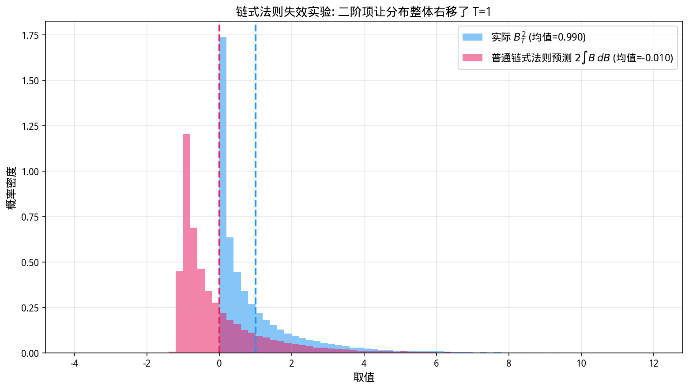
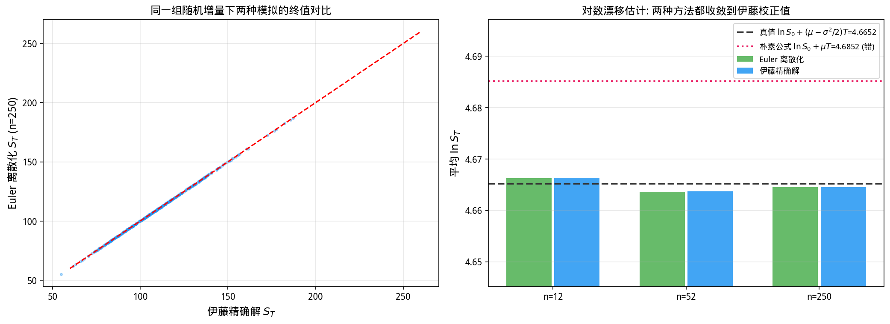
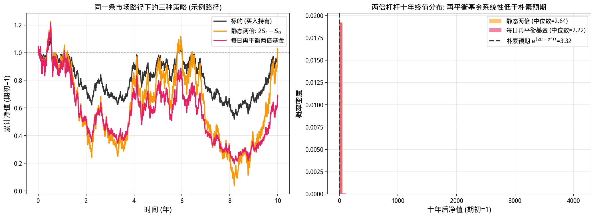
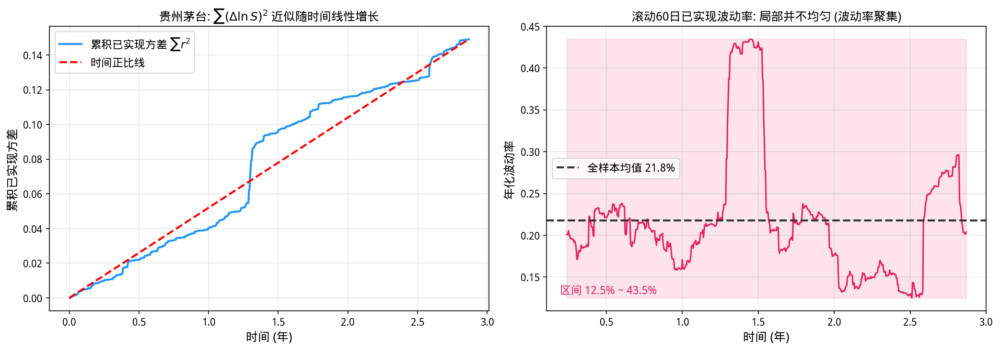

# 第24章 伊藤引理——随机微积分的核心

> **动机先行**: 第23章末尾埋下了一颗种子: $(\mathrm{d}B)^2 = \mathrm{d}t$——随机增量的平方不是二阶小量, 而是一阶小量。这颗种子会让普通微积分的链式法则在随机世界**系统性算错答案**, 而修复它的工具就是本章的主角: **伊藤引理 (Itô's Lemma)**——随机世界的链式法则。第23章那个"神秘的" $-\sigma^2/2$、杠杆基金的长期衰减、期权定价方程里的 Gamma 项, 全部是这一个额外项的不同化身。
>
> **量化实战定位**: 伊藤引理是衍生品定价的心脏。本章你将看到它三战成名: 推导几何布朗运动的解析解、解释两倍杠杆ETF十年跑输朴素预期近 $34\%$ 的原因、以及用真实 A 股数据验证二次变差的线性增长。

---

## 24.1 动机: 链式法则在随机世界失灵

在第3章, 复合函数求导的链式法则是整个微积分的地基: 若 $Y = f(X)$ 且 $X$ 随时间变化, 那么

$$
\frac{\mathrm{d}Y}{\mathrm{d}t} = f'(X)\,\frac{\mathrm{d}X}{\mathrm{d}t}
$$

一个自然的问题: 如果 $X_t$ 不是确定性函数, 而是布朗运动 $B_t$, 这个公式还成立吗?

答案是否定的, 而且错得离谱——不是差一个小量, 而是**整项漂移会凭空消失**。要理解为什么, 我们需要回到泰勒展开 (第6章): 对光滑函数,

$$
f(x + \Delta x) = f(x) + f'(x)\,\Delta x + \frac{1}{2}f''(x)\,(\Delta x)^2 + \cdots
$$

在确定性世界里, 当 $\Delta x \to 0$ 时 $(\Delta x)^2$ 是二阶小量, 可以放心丢弃——这就是链式法则只保留一阶项的原因。但在随机世界里, $\Delta B \sim \sqrt{\mathrm{d}t}$ (第23章), 于是

$$
(\Delta B)^2 \sim \mathrm{d}t
$$

**二阶项摇身一变成了与 $\mathrm{d}t$ 同阶的一阶项!** 丢弃它就等于丢掉了一部分真实的漂移。下面用一个可以亲手验证的实验让这件事现形。

## 24.2 失效现场: 用 $B^2$ 做一个实验

### 24.2.1 实验设计

取最简单的非线性函数 $f(x) = x^2$, 问: $B_t^2$ 的动态是什么?

对增量做精确的泰勒展开:

$$
\Delta(B_t^2) = (B_{t+\Delta t})^2 - B_t^2 = 2B_t\,\Delta B + (\Delta B)^2
$$

现在对比两种算法:

- **普通链式法则**只保留一阶项: $\mathrm{d}(B^2) = 2B\,\mathrm{d}B$。注意每一项 $2B_k\,\Delta B_k$ 中, $B_k$ 在增量产生前已知, 而 $\Delta B_k$ 正负对称均值为零——所以这个预测的总和期望为 **0**;
- **保留二阶项**: 多出 $(\Delta B)^2$, 其期望为 $\Delta t > 0$。逐段累加, 总贡献恰好是第23章的二次变差 $\sum(\Delta B)^2 \to T$。

而真实答案是确定的: $E[B_T^2] = \mathrm{Var}(B_T) = T$。普通链式法则预言 0, 真实值是 $T$——**它把全部漂移都弄丢了**。

```python
import numpy as np
import matplotlib.pyplot as plt

plt.rcParams['font.sans-serif'] = ['WenQuanYi Micro Hei']
plt.rcParams['axes.unicode_minus'] = False

np.random.seed(24)

n_paths = 50000     # 路径数
n_steps = 250       # [0,1] 区间的细分步数
T = 1.0
dt = T / n_steps

dW = np.random.normal(0.0, np.sqrt(dt), size=(n_paths, n_steps))
W = np.concatenate([np.zeros((n_paths, 1)), np.cumsum(dW, axis=1)], axis=1)

actual = W[:, -1]**2                                # 实际的 B_T^2
naive = 2 * np.sum(W[:, :-1] * dW, axis=1)          # 普通链式法则: 只保留一阶项 2B dB
diff = actual - naive                               # 差值恰好等于二次变差

print("=== f(B)=B^2: 普通链式法则 vs 伊藤修正 ===")
print(f"{'统计量':>30} | {'理论':>8} | {'模拟均值':>8}")
print("-" * 56)
print(f"{'E[B(T)^2] (实际值)':>26} | {1.0:>8.4f} | {actual.mean():>8.4f}")
print(f"{'E[普通链式法则预测 2∫B dB]':>22} | {0.0:>8.4f} | {naive.mean():>8.4f}")
print(f"{'E[差值 B^2 - 2∫B dB]':>24} | {1.0:>8.4f} | {diff.mean():>8.4f}")
print(f"\n差值的逐路径验证: diff 与 sum(dW^2) 的最大绝对误差 = "
      f"{np.abs(diff - (dW**2).sum(axis=1)).max():.2e}")

# 可视化: 实际分布 vs 普通链式法则的预测分布
fig, ax = plt.subplots(figsize=(10.5, 6))
bins = np.arange(-4, 12.01, 0.2)
ax.hist(actual, bins=bins, density=True, alpha=0.55, color='#2196F3',
        label=f'实际 $B_T^2$ (均值={actual.mean():.3f})')
ax.hist(naive, bins=bins, density=True, alpha=0.55, color='#E91E63',
        label=r'普通链式法则预测 $2\int B\,dB$ (均值=' + f'{naive.mean():.3f})')
ax.axvline(1.0, color='#2196F3', linestyle='--', linewidth=2)
ax.axvline(0.0, color='#E91E63', linestyle='--', linewidth=2)
ax.set_xlabel('取值', fontsize=12)
ax.set_ylabel('概率密度', fontsize=12)
ax.set_title('链式法则失效实验: 二阶项让分布整体右移了 T=1', fontsize=13)
ax.legend(fontsize=11)
ax.grid(True, alpha=0.3)
plt.tight_layout()
plt.show()
```

**运行结果**:

```
=== f(B)=B^2: 普通链式法则 vs 伊藤修正 ===
                           统计量 |       理论 |     模拟均值
--------------------------------------------------------
           E[B(T)^2] (实际值) |   1.0000 |   0.9897
    E[普通链式法则预测 2∫B dB] |   0.0000 |  -0.0102
      E[差值 B^2 - 2∫B dB] |   1.0000 |   0.9999

差值的逐路径验证: diff 与 sum(dW^2) 的最大绝对误差 = 3.13e-14
```



**观察**:

1. 实际值 $B_T^2$ 的均值 0.99 收敛于理论 $T=1$; 普通链式法则的预测均值 $-0.01 \approx 0$;
2. 最后一行是本节的点睛之笔: **逐条路径上**, "实际值 − 一阶预测" 与 "增量平方和 $\sum(\Delta W)^2$" 的最大偏差只有 $3\times 10^{-14}$——机器精度! 差值不是统计意义上的近似相等, 而是**恒等式**:
   $$B_T^2 = 2\int_0^T B_t\,\mathrm{d}B_t + \sum (\Delta B)^2$$

### 24.2.2 失效的根源与修复: 随机乘法表

失效的根源就是第23章的二次变差: $(\Delta B)^2$ 的和收敛到确定值而非零。由此得到随机微积分的**乘法表**——它只有一行半, 却定义了一门新的微积分:

| 乘积 | 结果 | 原因 |
|------|------|------|
| $\mathrm{d}t \cdot \mathrm{d}t$ | $0$ | 平方是高阶小量 |
| $\mathrm{d}t \cdot \mathrm{d}B$ | $0$ | $\mathrm{d}B \sim \sqrt{\mathrm{d}t}$ |
| $\mathrm{d}B \cdot \mathrm{d}B$ | $\mathrm{d}t$ | $E[(\Delta B)^2] = \Delta t$, 二次变差 |

> 💡 **记忆法**: 把 $\mathrm{d}B$ 看成 "$\sqrt{\mathrm{d}t}$ 量级"的东西, 乘法表自动浮现: $\sqrt{\mathrm{d}t}\times\sqrt{\mathrm{d}t}=\mathrm{d}t$, 更低阶的全归零。

普通泰勒展开中, 判断一项去留的标准是"它是几阶小量"; 伊藤世界中标准变为"它在乘法表下约化到什么"。凡能约化为 $\mathrm{d}t$ 的项都必须保留——这就是伊藤引理的全部秘密。

## 24.3 一元伊藤引理: 陈述与直觉

**定义 (伊藤过程)**: 若 $X_t = X_0 + \int_0^t a_s\,\mathrm{d}s + \int_0^t b_s\,\mathrm{d}B_s$, 记作 $\mathrm{d}X_t = a\,\mathrm{d}t + b\,\mathrm{d}B_t$ ($a$ 为漂移, $b$ 为波动率)。

**定理 (一元伊藤引理)**: 设 $f(t, x)$ 关于 $t$ 一阶连续可导、关于 $x$ 二阶连续可导, 则

$$
\boxed{\;\mathrm{d}f(t, X_t) = \left(f_t + a\,f_x + \frac{1}{2}\,b^2 f_{xx}\right)\mathrm{d}t + b\,f_x\,\mathrm{d}B_t\;}
$$

它与普通链式法则的唯一区别, 就是多出了 $\frac{1}{2}b^2 f_{xx}\,\mathrm{d}t$——**曲率 × 方差**项。

逐项清点泰勒展开, 用乘法表判断去留:

| 泰勒项 | 乘法表约化 | 阶数 | 去留 |
|--------|-----------|------|------|
| $f_t\,\mathrm{d}t$ | — | $\mathrm{d}t$ | 保留 |
| $f_x \cdot a\,\mathrm{d}t$ | — | $\mathrm{d}t$ | 保留 |
| $f_x \cdot b\,\mathrm{d}B$ | — | $\sqrt{\mathrm{d}t}$ | 保留 |
| $\frac{1}{2}f_{xx}\,(b\,\mathrm{d}B)^2$ | $\frac{1}{2}b^2 f_{xx}\,\mathrm{d}t$ | $\mathrm{d}t$ | **保留!** |
| 高阶项 $(\mathrm{d}t)^{3/2}, \mathrm{d}t^2, \ldots$ | 归零 | 高阶 | 丢弃 |

两个热身例子 (取 $a=0, b=1$, 即 $X = B$):

1. $f(x)=x^2$: $\mathrm{d}(B^2) = 2B\,\mathrm{d}B + \mathrm{d}t$——正是 24.2 节实验的理论版;
2. $f(x)=e^x$: $\mathrm{d}(e^B) = e^B\,\mathrm{d}B + \frac{1}{2}e^B\,\mathrm{d}t$。两边积分并取期望 (随机积分项均值为零): $E[e^{B_T}] = 1 + \frac{1}{2}\int_0^T E[e^{B_s}]\,\mathrm{d}s$, 解此积分方程得 $E[e^{B_T}] = e^{T/2}$——若没有修正项, 你会误以为是 $e^0 = 1$。

> 💡 **一句话记住伊藤引理**: 二阶项不再可忽略, 因为 $(\mathrm{d}B)^2 = \mathrm{d}t$。凸函数 ($f_{xx}>0$) 在随机世界里获得额外的正漂移——波动的"凸性补贴"。

## 24.4 实战一: 推导几何布朗运动的解

### 24.4.1 三行推导

第23章我们直接给出了几何布朗运动的解, 其中 $-\sigma^2/2$ 来得不明不白。现在用它应得的正式方式推导。GBM 的 SDE:

$$
\mathrm{d}S_t = \mu S_t\,\mathrm{d}t + \sigma S_t\,\mathrm{d}B_t
$$

即 $a(S) = \mu S$, $b(S) = \sigma S$。取 $f(x) = \ln x$: $f_x = 1/x$, $f_{xx} = -1/x^2$。代入伊藤引理:

$$
\mathrm{d}(\ln S_t) = \left(0 + \mu S \cdot \frac{1}{S} + \frac{1}{2}\sigma^2 S^2 \cdot \left(-\frac{1}{S^2}\right)\right)\mathrm{d}t + \sigma S \cdot \frac{1}{S}\,\mathrm{d}B_t
$$

$$
\Rightarrow \quad \mathrm{d}(\ln S_t) = \left(\mu - \frac{\sigma^2}{2}\right)\mathrm{d}t + \sigma\,\mathrm{d}B_t
$$

**对数价格是一个带漂移的布朗运动** (这正是第23章的出发点), 两边从 $0$ 积分到 $T$:

$$
\ln S_T = \ln S_0 + \left(\mu - \frac{\sigma^2}{2}\right)T + \sigma B_T \quad\Longrightarrow\quad S_T = S_0\,e^{\left(\mu-\frac{\sigma^2}{2}\right)T + \sigma B_T}
$$

谜底揭晓: $-\sigma^2/2$ 就是伊藤修正项 $\frac{1}{2}b^2 f_{xx} = \frac{1}{2}\sigma^2 S^2 \times (-1/S^2)$。对数是凹函数 ($f_{xx}<0$), 波动率越大, 凹性扣掉的漂移越多。

顺带解开另一个悬念 (第23章练习题预告过的正态矩公式): 对 $Z \sim N(0,1)$ 有 $E[e^{\lambda Z}] = e^{\lambda^2/2}$, 因此 $E[S_T] = S_0 e^{(\mu-\sigma^2/2)T} \cdot e^{\sigma^2 T/2} = S_0 e^{\mu T}$——期望不含 $\sigma$, 中位数却含, "波动率拖累"至此有了严格出处。

### 24.4.2 数值验证: 两种模拟 vs 一个错误公式

理论说完了, 用三种方法计算一年后的对数价格漂移:

```python
import numpy as np
import matplotlib.pyplot as plt

plt.rcParams['font.sans-serif'] = ['WenQuanYi Micro Hei']
plt.rcParams['axes.unicode_minus'] = False

np.random.seed(42)

S0, mu, sigma, T = 100.0, 0.08, 0.20, 1.0

theory_mean = S0 * np.exp(mu*T)
theory_median = S0 * np.exp((mu-0.5*sigma**2)*T)
theory_std = np.sqrt(S0**2 * np.exp(2*mu*T) * (np.exp(sigma**2*T)-1))

print("=== GBM 终值分布: Euler 离散化 vs 伊藤精确解 ===")
print(f"参数: S0={S0:.0f}, mu={mu*100:.0f}%, sigma={sigma*100:.0f}%, T={T:.0f}年")
print(f"理论: 均值={theory_mean:.2f}, 中位数={theory_median:.2f}, 标准差={theory_std:.2f}")
print()

M = 100000
for n_steps in [12, 52, 250]:
    dtg = T / n_steps
    Z = np.random.standard_normal((M, n_steps))       # 同一组增量喂给两种方法
    S = np.full(M, S0)
    for k in range(n_steps):
        S = S + mu*S*dtg + sigma*S*np.sqrt(dtg)*Z[:, k]
    ST_euler = S
    ST_exact = S0*np.exp((mu-0.5*sigma**2)*T + sigma*np.sqrt(dtg)*Z.sum(axis=1))
    print(f"n={n_steps:>4} | Euler : 均值={ST_euler.mean():7.2f}, 中位数={np.median(ST_euler):7.2f}"
          f" | 精确解: 均值={ST_exact.mean():7.2f}, 中位数={np.median(ST_exact):7.2f}")

n_steps = 250
dtg = T / n_steps
Z = np.random.standard_normal((M, n_steps))
ln_naive = np.log(S0) + mu*T + sigma*np.sqrt(dtg)*Z.sum(axis=1)
ln_true = np.log(S0) + (mu-0.5*sigma**2)*T + sigma*np.sqrt(dtg)*Z.sum(axis=1)
print()
print(f"朴素对数公式 (漏掉二阶项): 平均 ln S_T = {ln_naive.mean():.4f} -> 价格 {np.exp(ln_naive.mean()):.2f}")
print(f"伊藤引理修正后           : 平均 ln S_T = {ln_true.mean():.4f} -> 价格 {np.exp(ln_true.mean()):.2f}")
print(f"两者之差 = sigma^2*T/2 = {sigma**2*T/2:.4f}")

# 可视化: 左图-Euler与精确解的终值散点; 右图-对数漂移估计随步数的收敛
fig, axes = plt.subplots(1, 2, figsize=(14, 5.2))

axes[0].scatter(ST_exact[:400], ST_euler[:400], s=6, alpha=0.35, color='#2196F3')
lims = [60, 260]
axes[0].plot(lims, lims, 'r--', linewidth=1.5)
axes[0].set_xlabel('伊藤精确解 $S_T$', fontsize=12)
axes[0].set_ylabel('Euler 离散化 $S_T$ (n=250)', fontsize=12)
axes[0].set_title('同一组随机增量下两种模拟的终值对比', fontsize=12)
axes[0].grid(True, alpha=0.3)

ns_bar = [12, 52, 250]
estimates = []
for nb in ns_bar:
    dtb = T/nb
    Zb = Z[:, :nb]
    Sb = np.full(M, S0)
    for k in range(nb):
        Sb = Sb + mu*Sb*dtb + sigma*Sb*np.sqrt(dtb)*Zb[:, k]
    estimates.append(np.log(Sb).mean())

xs = np.arange(len(ns_bar))
true_ln = np.log(S0)+(mu-0.5*sigma**2)*T
naive_ln = np.log(S0)+mu*T
axes[1].bar(xs, [est - true_ln for est in estimates], 0.5,
            color='#4CAF50', alpha=0.85, label='Euler估计 − 真值')
axes[1].axhline(0, color='#333333', linewidth=1.5)
axes[1].set_xticks(xs)
axes[1].set_xticklabels([f'n={nb}' for nb in ns_bar])
axes[1].set_ylabel('对数漂移估计误差', fontsize=12)
axes[1].set_title(f'Euler估计迅速贴近真值 {true_ln:.4f}; 朴素公式在 {naive_ln:.4f} (偏高0.02)', fontsize=11)
axes[1].legend(fontsize=10)
axes[1].grid(True, alpha=0.3, axis='y')
plt.tight_layout()
plt.show()
```

**运行结果**:

```
=== GBM 终值分布: Euler 离散化 vs 伊藤精确解 ===
参数: S0=100, mu=8%, sigma=20%, T=1年
理论: 均值=108.33, 中位数=106.18, 标准差=21.88

n=  12 | Euler : 均值= 108.21, 中位数= 106.23 | 精确解: 均值= 108.24, 中位数= 106.05
n=  52 | Euler : 均值= 108.31, 中位数= 106.20 | 精确解: 均值= 108.31, 中位数= 106.16
n= 250 | Euler : 均值= 108.30, 中位数= 106.23 | 精确解: 均值= 108.31, 中位数= 106.23

朴素对数公式 (漏掉二阶项): 平均 ln S_T = 4.6835 -> 价格 108.15
伊藤引理修正后           : 平均 ln S_T = 4.6635 -> 价格 106.00
两者之差 = sigma^2*T/2 = 0.0200
```



**观察**:

1. **诚实的老老实实**: Euler 离散化和伊藤精确解给出的均值、中位数都落在理论值附近, 且随步数增加彼此靠拢——两条完全独立的路线殊途同归于伊藤校正后的世界。
2. **朴素公式错得稳定**: 它与正确答案的差距恒等于 $\sigma^2 T/2 = 0.02$ (两条曲线共享同一组随机冲击, 所以差值分毫不差)。换算成价格, 相当于把典型终价高估约 $2\%$。
3. **实践红利**: 注意"精确解"那一列根本不需要逐步模拟——因为伊藤引理告诉我们 $\ln S$ 是带常系数的布朗运动, 可以一步到位。**先做变量变换再模拟**, 是量化工程师每天都在用的技巧。

## 24.5 实战二: 两倍杠杆基金的路径依赖衰减

2018 年后美股涌现大量两倍、三倍杠杆 ETF (如 TQQQ)。销售材料给散户的直觉是: "指数涨 1%, 基金涨 2%; 十年下来收益翻两番"。数学上这个直觉哪里错了?

关键在"**每日再平衡**": 基金每天收盘时调整仓位, 保证当天净值变动恰好是指数当日变动的两倍。于是基金每天的收益率是 $2 r_d$, 长期净值为 $\prod (1 + 2r_k)$——**复利发生在两倍的尺度上**, 而不是"先算指数复利再翻倍"。

用伊藤引理的语言 (连续再平衡近似): 基金净值满足 $\mathrm{d}L/L = 2\mu\,\mathrm{d}t + 2\sigma\,\mathrm{d}B$, 即一个漂移为 $2\mu$、**波动率为 $2\sigma$** 的几何布朗运动。套用 24.4 节结论, 其对数漂移为

$$
2\mu - \frac{(2\sigma)^2}{2} = 2\mu - 2\sigma^2
$$

而朴素的"两倍收益"预期对应 $2(\mu - \sigma^2/2) = 2\mu - \sigma^2$。**缺口恰为 $\sigma^2$/年**。下面的蒙特卡洛把这笔账算了十年:

```python
import numpy as np
import matplotlib.pyplot as plt

plt.rcParams['font.sans-serif'] = ['WenQuanYi Micro Hei']
plt.rcParams['axes.unicode_minus'] = False

np.random.seed(7)

S0, mu, sigma = 100.0, 0.08, 0.20
years = 10
D = 252 * years
M = 100000

# 日频对数收益: 年化漂移 mu-sigma^2/2, 年化波动率 sigma (与第23章GBM一致)
m_d = (mu - 0.5*sigma**2) / 252
s_d = sigma / np.sqrt(252)
R = np.random.normal(m_d, s_d, size=(M, D))

S_T = S0 * np.exp(R.sum(axis=1))                     # 买入并持有标的
V_static = 2*S_T - S0                                # 静态两倍杠杆 (期初借一倍钱)

growth_fund = 1 + 2*(np.exp(R) - 1)                  # 每日再平衡的两倍基金
L_T = S0 * growth_fund.prod(axis=1)

med_S = np.median(S_T)
med_V = np.median(V_static)
med_L = np.median(L_T)
ann = lambda x: (x/S0)**(1/years) - 1

print("=== 两倍杠杆: '每天再平衡' vs '买一次不管' ===")
print(f"参数: mu={mu*100:.0f}%, sigma={sigma*100:.0f}%, T={years:.0f}年, {M} 条路径")
print()
print(f"标的的年化对数漂移 (中位数视角): ({mu*100:.0f}%-{sigma**2/2*100:.0f}%) = {(mu-0.5*sigma**2)*100:.0f}%")
print(f"朴素直觉 '两倍杠杆 = 两倍收益': {(mu-0.5*sigma**2)*2*100:.0f}%")
print()
print(f"{'策略':>22} | {'中位终值(每1元)':>14} | {'中位年化':>8}")
print("-" * 54)
print(f"{'买入并持有标的':>22} | {med_S/S0:>14.3f} | {ann(med_S)*100:>7.2f}%")
print(f"{'静态两倍: 2S_T-S_0':>21} | {med_V/S0:>14.3f} | {ann(med_V)*100:>7.2f}%")
print(f"{'每日再平衡两倍基金':>21} | {med_L/S0:>14.3f} | {ann(med_L)*100:>7.2f}%")
print()
print(f"连续再平衡的理论年化 2*mu-2*sigma^2 = {(2*mu-2*sigma**2)*100:.0f}%  (与每日再平衡模拟吻合)")
print(f"十年累计的差距: 朴素预期 e^{{1.2}}={np.exp(1.2):.2f} 倍 vs 基金中位数 {med_L/S0:.2f} 倍")

# 可视化: 左图-同一条路径下三种策略; 右图-十年终值分布
fig, axes = plt.subplots(1, 2, figsize=(14, 5.2))

t_axis = np.arange(D+1)/252
R0 = np.concatenate([[0], R[0]])
S_path = S0*np.exp(np.cumsum(R0))
L_path = S0*np.cumprod(np.concatenate([[1], 1+2*(np.exp(R0[1:])-1)]))
V_path = 2*S_path - S0
axes[0].plot(t_axis, S_path/S0, lw=1.8, label='标的 (买入持有)', color='#333333')
axes[0].plot(t_axis, V_path/S0, lw=1.8, label=r'静态两倍: $2S_t-S_0$', color='#FF9800')
axes[0].plot(t_axis, L_path/S0, lw=1.8, label='每日再平衡两倍基金', color='#E91E63')
axes[0].axhline(1, color='gray', linestyle='--', linewidth=1)
axes[0].set_xlabel('时间 (年)', fontsize=12)
axes[0].set_ylabel('累计净值 (期初=1)', fontsize=12)
axes[0].set_title('同一条市场路径下的三种策略 (示例路径)', fontsize=12)
axes[0].legend(fontsize=10)
axes[0].grid(True, alpha=0.3)

bins = np.linspace(0, np.percentile(L_T, 99), 80)
axes[1].hist(V_static/S0, bins=bins, density=True, alpha=0.55, color='#FF9800',
             label=f'静态两倍 (中位数={np.median(V_static)/S0:.2f})')
axes[1].hist(L_T/S0, bins=bins, density=True, alpha=0.55, color='#E91E63',
             label=f'每日再平衡基金 (中位数={np.median(L_T)/S0:.2f})')
axes[1].axvline(np.exp(1.2), color='#333333', linestyle='--', linewidth=2,
                label=r'朴素预期 $e^{(2\mu-\sigma^2)T}$=' + f'{np.exp(1.2):.2f}')
axes[1].set_xlabel('十年后净值 (期初=1)', fontsize=12)
axes[1].set_ylabel('概率密度', fontsize=12)
axes[1].set_title('两倍杠杆十年终值分布: 再平衡基金系统性低于朴素预期', fontsize=12)
axes[1].legend(fontsize=10)
axes[1].grid(True, alpha=0.3)
plt.tight_layout()
plt.show()
```

**运行结果**:

```
=== 两倍杠杆: '每天再平衡' vs '买一次不管' ===
参数: mu=8%, sigma=20%, T=10年, 100000 条路径

标的的年化对数漂移 (中位数视角): (8%-2%) = 6%
朴素直觉 '两倍杠杆 = 两倍收益': 12%

                    策略 |      中位终值(每1元) |     中位年化
------------------------------------------------------
               买入并持有标的 |          1.818 |    6.16%
       静态两倍: 2S_T-S_0 |          2.636 |   10.18%
            每日再平衡两倍基金 |          2.216 |    8.28%

连续再平衡的理论年化 2*mu-2*sigma^2 = 8%  (与每日再平衡模拟吻合)
十年累计的差距: 朴素预期 e^{1.2}=3.32 倍 vs 基金中位数 2.22 倍
```



**观察**:

1. **朴素预期 vs 现实的鸿沟**: 散户以为的十年 3.32 倍, 实际中位数只有 2.22 倍——少了整整三分之一。缺口 $e^{\sigma^2 T}/e^{(2\mu-\sigma^2)T}$ 中的 $\sigma^2 T = 0.4$ 全部来自"以 $2\sigma$ 波动率复利"所缴纳的伊藤税。
2. **基金甚至不是最优杠杆**: 表中最亮眼的是静态两倍 (10.18%)。每日再平衡保证的是"每天都是两倍", 代价是把组合的有效波动率钉死在 $2\sigma$ 上, 缴满全额 $\sigma^2$ 的税; 静态仓位的有效杠杆会随盈亏浮动, 反而少缴一些。**"保持恒定杠杆"本身就是一个有价格的决策**。
3. **这不是产品缺陷而是算术**: 波动拖累在单边牛市里同样存在, 只是涨幅掩盖了它; 在横盘震荡市里它会赤裸裸地把净值磨掉——2020 年后多家杠杆 ETF 的长期持有者对此有切肤之痛。监管要求此类产品持续披露"长期持有可能偏离杠杆目标", 数学根源正是本节的两行公式。

## 24.6 多元伊藤引理与交叉项

现实中的函数往往依赖多个随机源: 组合价值取决于多只股票, 价差期权取决于两个标的。多元版本的伊藤引理只需在泰勒展开中补齐交叉项。设

$$
\mathrm{d}X_t = a_X\,\mathrm{d}t + b_X\,\mathrm{d}B^X_t, \qquad \mathrm{d}Y_t = a_Y\,\mathrm{d}t + b_Y\,\mathrm{d}B^Y_t
$$

其中两条布朗运动的相关系数为 $\rho$。乘法表补上一行: $\mathrm{d}B^X \cdot \mathrm{d}B^Y = \rho\,\mathrm{d}t$ (相关系数就是"标准化后的协方差", 二次变差逻辑同样适用)。于是对 $f(t, X, Y)$:

$$
\mathrm{d}f = f_t\,\mathrm{d}t + f_x\,\mathrm{d}X + f_y\,\mathrm{d}Y + \frac{1}{2}\left(f_{xx}\,(\mathrm{d}X)^2 + 2\,f_{xy}\,\mathrm{d}X\,\mathrm{d}Y + f_{yy}\,(\mathrm{d}Y)^2\right)
$$

代入乘法表展开:

$$
\boxed{\;\mathrm{d}f = \left(f_t + a_X f_x + a_Y f_y + \frac{1}{2}b_X^2 f_{xx} + \rho\,b_X b_Y f_{xy} + \frac{1}{2}b_Y^2 f_{yy}\right)\mathrm{d}t + b_X f_x\,\mathrm{d}B^X + b_Y f_y\,\mathrm{d}B^Y\;}
$$

三个要点:

1. **交叉项就是协方差的化身**: $\rho\,b_X b_Y f_{xy}$ 与第9章组合方差 $w^\top\Sigma w$ 中的协方差项、第14章协方差矩阵的角色完全一致——连续时间模型里的相关性通过这一项进入动力学。
2. **线性函数免疫**: 若 $f$ 对各变量是线性的 (如组合价值 $V = w_1 S_1 + w_2 S_2$), 所有二阶导数为零, 伊藤修正项整体消失, 普通微积分照常工作。**需要伊藤引理的从来不是"随机"本身, 而是"随机 × 非线性"的组合**。
3. **非线性在哪里出现**: 期权价值是股价的非线性函数 (Gamma $f_{xx} \neq 0$), 价差、比率类结构同理。后续章节推导 Black-Scholes 方程时, 正是这个多元框架加上无套利条件, 把 $f_{xx}$ (Gamma) 变成了期权价格的组成部分。

## 24.7 真实市场检验: 二次变差的实证影子

伊藤引理建立在 $(\mathrm{d}B)^2 = \mathrm{d}t$ 之上, 而这条性质有一个可以直接用数据检验的推论: **对数价格的已实现方差 $\sum r_i^2$ 应当近似随时间线性增长**。用贵州茅台三年日线数据验证:

```python
import numpy as np
import pandas as pd
import matplotlib.pyplot as plt

plt.rcParams['font.sans-serif'] = ['WenQuanYi Micro Hei']
plt.rcParams['axes.unicode_minus'] = False

csv_path = 'data/ifind_price_data.csv'
df = pd.read_csv(csv_path)
mt = df[df['thscode'] == '600519.SH'].sort_values('time').reset_index(drop=True)

lp = np.log(mt['close'])
r = lp.diff().dropna()
n = len(r)
yrs = n / 252

sigma_std = r.std() * np.sqrt(252)          # 常规方法: 标准差 x sqrt(252)
rv_total = (r**2).sum()                     # 已实现方差总量 sum(r^2)
sigma_qv = np.sqrt(rv_total / yrs)          # 二次变差年化

print("=== 二次变差在真实市场的影子: 贵州茅台 ===")
print(f"样本: {mt['time'].iloc[0]} ~ {mt['time'].iloc[-1]}, 共 {n} 个交易日 ≈ {yrs:.2f} 年")
print(f"(a) 标准差法    sqrt(Var(r))*sqrt(252): 年化波动率 = {sigma_std*100:.2f}%")
print(f"(b) 二次变差法  sqrt(sum(r^2)/年数)   : 年化波动率 = {sigma_qv*100:.2f}%")
print("(两种方法几乎一致 —— sum(r^2) 就是总波动的载体, 这正是 (dB)^2=dt 的实证版本)")

cum = (r**2).cumsum().values
print()
print("累积已实现方差 vs 时间正比线:")
print(f"{'时间占比':>8} | {'实际 cumRV':>12} | {'正比线预测':>12} | {'比值':>7}")
for frac in [0.25, 0.50, 0.75, 1.00]:
    idx = int(n*frac) - 1
    pred = rv_total * frac
    print(f"{frac:>9.2f} | {cum[idx]:>16.4f} | {pred:>16.4f} | {cum[idx]/pred:>11.3f}")

roll_vol = np.sqrt((r**2).rolling(60).sum() * 252 / 60).dropna()
print()
print(f"但局部看, 波动率并不均匀: 滚动60日已实现波动率区间 "
      f"{roll_vol.min()*100:.1f}% ~ {roll_vol.max()*100:.1f}%")

# 可视化: 左图-累积已实现方差与正比线; 右图-滚动60日已实现波动率
fig, axes = plt.subplots(1, 2, figsize=(14, 5))

t_axis = np.arange(1, n+1)/n * yrs
axes[0].plot(t_axis, cum, lw=2, color='#2196F3', label=r'累积已实现方差 $\sum r^2$')
axes[0].plot([0, yrs], [0, cum[-1]], 'r--', lw=2, label='时间正比线')
axes[0].set_xlabel('时间 (年)', fontsize=12)
axes[0].set_ylabel('累积已实现方差', fontsize=12)
axes[0].set_title(r'贵州茅台: $\sum(\Delta \ln S)^2$ 近似随时间线性增长', fontsize=12)
axes[0].legend(fontsize=11)
axes[0].grid(True, alpha=0.3)

t_roll = roll_vol.index/252
axes[1].plot(t_roll, roll_vol.values, lw=1.5, color='#E91E63')
axes[1].axhline(roll_vol.mean(), color='#333333', linestyle='--', lw=2,
                label=f'全样本均值 {roll_vol.mean()*100:.1f}%')
axes[1].fill_between(t_roll, roll_vol.min(), roll_vol.max(), color='#E91E63', alpha=0.12)
axes[1].annotate(f"区间 {roll_vol.min()*100:.1f}% ~ {roll_vol.max()*100:.1f}%",
                 xy=(0.03, 0.06), xycoords='axes fraction', fontsize=11, color='#E91E63')
axes[1].set_xlabel('时间 (年)', fontsize=12)
axes[1].set_ylabel('年化波动率', fontsize=12)
axes[1].set_title('滚动60日已实现波动率: 局部并不均匀 (波动率聚集)', fontsize=12)
axes[1].legend(fontsize=11)
axes[1].grid(True, alpha=0.3)
plt.tight_layout()
plt.show()
```

**运行结果**:

```
=== 二次变差在真实市场的影子: 贵州茅台 ===
样本: 2023-05-25 ~ 2026-05-22, 共 723 个交易日 ≈ 2.87 年
(a) 标准差法    sqrt(Var(r))*sqrt(252): 年化波动率 = 22.73%
(b) 二次变差法  sqrt(sum(r^2)/年数)   : 年化波动率 = 22.72%
(两种方法几乎一致 —— sum(r^2) 就是总波动的载体, 这正是 (dB)^2=dt 的实证版本)

累积已实现方差 vs 时间正比线:
    时间占比 |     实际 cumRV |        正比线预测 |      比值
     0.25 |           0.0324 |           0.0370 |       0.875
     0.50 |           0.0935 |           0.0740 |       1.263
     0.75 |           0.1178 |           0.1111 |       1.061
     1.00 |           0.1481 |           0.1481 |       1.000

但局部看, 波动率并不均匀: 滚动60日已实现波动率区间 12.1% ~ 43.5%
```



**三层解读**:

1. **全局成立**: 两种完全不同的估计器给出一致的年化波动率 22.7%——$\sum r^2$ 确实承载了几乎全部波动信息。波动率交易中的核心品种"已实现方差" (Realized Variance) 就建立在这个量上。
2. **局部偏离本身就是信号**: 四个检查点的比值 (0.88 → 1.26 → 1.06 → 1.00) 围绕 1 波动, 说明方差增长时而快于、时而慢于时钟——这正是第21章 GARCH 模型刻画的**波动率聚集**: 布朗运动的 $b$ 并非常数, 而是自己也在动。
3. **模型的正确用法**: "常数 $b$ 的布朗运动"是骨架, 真实市场是在骨架上叠加了随机波动率。理解了这一点, 你就能明白为什么专业风控从不直接用全样本波动率给明天定风险, 而是用近期窗口或 GARCH 类模型估计**当前**的 $b$。

## 24.8 核心公式速查

> 本节是前述各节公式的集中汇总, 供复习和查阅使用.

1. **随机乘法表**: $(\mathrm{d}B)^2 = \mathrm{d}t$, $\mathrm{d}t \cdot \mathrm{d}B = 0$, $\mathrm{d}t \cdot \mathrm{d}t = 0$
2. **伊藤过程**: $\mathrm{d}X_t = a\,\mathrm{d}t + b\,\mathrm{d}B_t$ ($a$ 漂移, $b$ 波动率)
3. **一元伊藤引理**: $\mathrm{d}f = \left(f_t + a f_x + \frac{1}{2}b^2 f_{xx}\right)\mathrm{d}t + b f_x\,\mathrm{d}B_t$
4. **纯布朗特例**: $\mathrm{d}f(B_t) = f'(B_t)\,\mathrm{d}B_t + \frac{1}{2}f''(B_t)\,\mathrm{d}t$
5. **GBM 的对数动态**: $\mathrm{d}(\ln S_t) = (\mu - \sigma^2/2)\,\mathrm{d}t + \sigma\,\mathrm{d}B_t$
6. **正态矩公式**: $E[e^{\lambda B_T}] = e^{\lambda^2 T/2}$; 由此 $E[S_T] = S_0 e^{\mu T}$ (与 $\sigma$ 无关)
7. **L 倍杠杆基金的长期对数增长**: $L\mu - \dfrac{L^2\sigma^2}{2}$; 与朴素预期 $L(\mu - \sigma^2/2)$ 的缺口为 $\dfrac{L(L-1)}{2}\sigma^2$/年
8. **多元伊藤引理**: $\mathrm{d}f = f_t\,\mathrm{d}t + f_x\,\mathrm{d}X + f_y\,\mathrm{d}Y + \frac{1}{2}\left(f_{xx}\,(\mathrm{d}X)^2 + 2 f_{xy}\,\mathrm{d}X\,\mathrm{d}Y + f_{yy}\,(\mathrm{d}Y)^2\right)$, 其中 $\mathrm{d}B^X \mathrm{d}B^Y = \rho\,\mathrm{d}t$
9. **二次变差的实证形态**: $\sum_i r_i^2 \approx \sigma^2 \cdot t$ (全局线性), 局部受波动率聚集调制

## 24.9 本章小结

| 概念 | 核心要点 | 量化意义 |
|------|---------|---------|
| 链式法则失效 | 二阶项 $(\Delta B)^2$ 与 $\mathrm{d}t$ 同阶 | 普通微积分在金融中不能想当然 |
| 随机乘法表 | $(\mathrm{d}B)^2 = \mathrm{d}t$ | 判断泰勒项去留的新标准 |
| 一元伊藤引理 | 多出 $\frac{1}{2}b^2 f_{xx}$ 项 | 随机世界的链式法则 |
| GBM 解的推导 | $-\sigma^2/2$ 来自对数的凹性 | 第23章伏笔的正式回收 |
| 波动率拖累 | 期望与中位数分离的严格证明 | 长期复利的隐形成本 |
| 杠杆基金衰减 | 缺口 $\frac{L(L-1)}{2}\sigma^2$/年 | 结构化产品的定价常识 |
| 多元伊藤引理 | 交叉项 $\rho b_X b_Y f_{xy}$ | 协方差进入动力学的通道 |
| 已实现方差 | $\sum r^2 \propto t$ | 波动率交易的基础标的 |

**最后一句话**: 伊藤引理教会我们的不只是公式, 而是一种直觉——在随机世界里, **波动本身会产生漂移**。凸性吃波动补贴, 凹性缴波动税; 下一次当你看到任何"复利 + 波动"的组合时, 都应该本能地问一句: 二阶项是多少?

## 24.10 练习题

### 数学推导

**题1——指数过程的矩**:

(a) 对 $f(x) = e^x$ 应用伊藤引理, 写出 $\mathrm{d}(e^{B_t})$ 的表达式。

(b) 两边积分并取期望, 利用随机积分为零均值的事实, 证明 $E[e^{B_T}] = e^{T/2}$。

(c) 进一步计算 $\mathrm{Var}(e^{B_T})$。(提示: 先用同样的方法求 $E[e^{2B_T}]$, 再用 $\mathrm{Var} = E[X^2] - (E[X])^2$。)

**题2——反函数的动态**:

设 $S_t$ 服从 GBM: $\mathrm{d}S = \mu S\,\mathrm{d}t + \sigma S\,\mathrm{d}B$。取 $f(x) = 1/x$。

(a) 用伊藤引理证明 $\mathrm{d}(1/S_t) = (\sigma^2 - \mu)\,\dfrac{\mathrm{d}t}{S_t} - \sigma\,\dfrac{\mathrm{d}B_t}{S_t}$。

(b) 说明 $1/S_t$ 仍是一个几何布朗运动 (写出它的漂移与波动率), 并解释噪声项符号翻转为何不影响其分布。

(c) 计算 $E[1/S_T]$。当 $\mu < \sigma^2$ 时, 该期望随 $T$ 增大还是减小? 这对"做空一只股票"的多头对手方意味着什么?

**题3——乘积法则与协方差**:

设 $\mathrm{d}X = \mu_X\,\mathrm{d}t + \sigma_X\,\mathrm{d}B^X$, $\mathrm{d}Y = \mu_Y\,\mathrm{d}t + \sigma_Y\,\mathrm{d}B^Y$, 相关系数 $\rho$。

(a) 对 $f(X, Y) = X \cdot Y$ 应用多元伊藤引理 (注意 $f_{xy} = 1$), 证明 $\mathrm{d}(XY) = X\,\mathrm{d}Y + Y\,\mathrm{d}X + \rho\,\sigma_X\sigma_Y\,\mathrm{d}t$。

(b) 解释 $\rho = 0$ 时该项消失的金融含义。

(c) 若组合价值 $V = w_X X + w_Y Y$ 是线性函数, 证明其二阶修正项全部为零; 再举一个 $f_{xy} \neq 0$ 的金融例子, 说明何时必须保留交叉项。

### 编程实践

**题1——Euler 格式的弱收敛速度**: 参考 24.4 节代码, 对 $n \in \{12, 25, 50, 100, 200, 400\}$ 分别估计 Euler 终值的平均 $\ln S_T$ 与真值之差, 在双对数坐标下画误差-步数曲线, 目测斜率。(提示: 弱收敛阶应为 O(1/n), 误差每翻倍步数大约缩小一半。)

**题2——用真实数据回测两倍杠杆**: 从 `data/ifind_price_data.csv` 读取沪深300 (`thscode == '000300.SH'`) 的收盘价, 计算日简单收益率 $r_d$。模拟"每日再平衡的两倍多头基金": 净值因子逐日累乘 $(1 + 2 r_d)$。将基金的累计收益、年化收益与同期标的及"静态两倍" ($2P_T/P_0 - 1$) 对比, 并结合本样本属于单边趋势还是宽幅震荡, 解释三者排序的原因。

## 24.11 参考文献

1. Øksendal, B. K. (2003). *Stochastic Differential Equations: An Introduction with Applications* (6th ed.). Springer.（伊藤引理严格证明与随机微积分的标准研究生教材, 第4章）

2. Shreve, S. E. (2004). *Stochastic Calculus for Finance II: Continuous-Time Models*. Springer.（以二叉树极限引入伊藤引理, 与本章 23.3 节的缩放极限一脉相承）

3. Glasserman, P. (2003). *Monte Carlo Methods in Financial Engineering*. Springer.（Euler-Maruyama 格式的弱/强收敛理论, 24.4 节数值实验的依据）

4. Cheng, M., & Madhavan, A. (2009). "The Dynamics of Leveraged and Inverse Exchange-Traded Funds." *Journal of Investment Management*, 7(4), 43-62.（杠杆 ETF 衰减效应的开创性实证研究, 24.5 节现象的市场证据）
