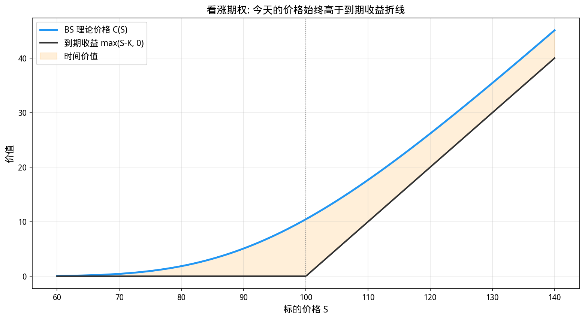
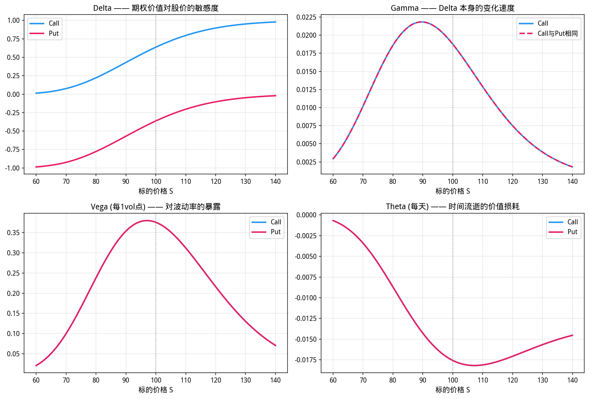
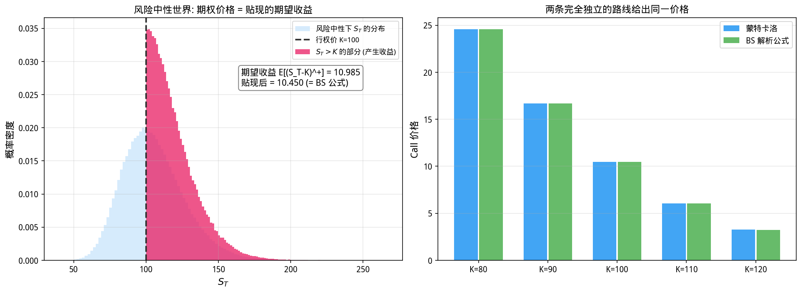

# 第25章 Black-Scholes 模型——期权定价的里程碑

> **动机先行**: 前两章我们搭好了随机微积分的骨架——布朗运动与伊藤引理。本章把它们锻造成量化金融历史上最著名的公式。它的灵魂是全书最反直觉的思想——**风险中性定价**: 给期权定价时, 我们假装所有资产的期望收益率都等于无风险利率。这个"自欺欺人"的假设之所以合法, 是因为对冲已经把不确定性消灭在组合内部。1973 年公式发表, 同年芝加哥期权交易所开张; 1997 年 Black 与 Merton 摘得诺贝尔奖 (Scholes 代表二人领奖, Black 已去世)。一个公式催生一个行业, 这是数学金融的奇迹时刻。
>
> **量化实战定位**: BS 公式是量化从业者的母语。本章你将亲手实现欧式看涨/看跌定价、全部五个 Greeks, 用蒙特卡洛独立验证解析解, 并学会从市场价格反读**隐含波动率**——今天交易员报价的单位早已不是"多少钱", 而是"多少波动率"。

---

## 25.1 动机: 期权定价难在哪

期权是一张"未来的选择权": 看涨期权 (Call) 允许你在到期日 $T$ 以行权价 $K$ 买入一股股票。到期时的收益是确定的函数:

$$
\text{payoff} = \max(S_T - K,\ 0)
$$

问题在于 $S_T$ 是随机的。给这张纸定价, 直觉的做法是"算期望再贴现":

$$
C_0 \stackrel{?}{=} e^{-rT}\,E\big[(S_T - K)^+\big]
$$

但期望对谁算? 收益分布的位置由漂移 $\mu$ 决定, 而 $\mu$ 是所有参数里最难估计的一个 (第10章告诉我们: 年化收益的标准误大得惊人, 不同人对同一只股票的 $\mu$ 的判断可以相差数倍)。难道期权的公允价值取决于谁在做这道题?

Black 与 Scholes 的回答石破天惊: **不**。期权价格根本不依赖 $\mu$——因为你可以通过持有股票把不确定性对冲掉。对冲之后剩下的东西, 只需要用无风险利率补偿。

## 25.2 风险中性定价——最反直觉的思想

**它解决什么问题**: 要给期权定价, 理论上你需要知道标的未来的收益分布——但这取决于预期收益率 $\mu$。而 $\mu$ 是所有参数里最难估计的 (第10章: 年化收益的标准误大得惊人)。Black 和 Scholes 的天才洞察是: **通过动态对冲, 可以把 $\mu$ 从方程中彻底消除**。你不再需要预测市场方向就能给期权定价。

### 25.2.1 对冲如何消掉不确定性

考虑卖出一份看涨期权, 同时买入 $\Delta$ 份股票, 组合价值 $\Pi = C - \Delta S$。股价一变动, 两条腿同时动:

$$
\mathrm{d}\Pi = \mathrm{d}C - \Delta\,\mathrm{d}S
$$

$\mathrm{d}C$ 里包含什么? 第24章的一元伊藤引理 ($a = \mu S$, $b = \sigma S$) 给出:

$$
\mathrm{d}C_t = \left(\frac{\partial C}{\partial t} + \mu S\frac{\partial C}{\partial S} + \frac{1}{2}\sigma^2 S^2 \frac{\partial^2 C}{\partial S^2}\right)\mathrm{d}t + \sigma S\frac{\partial C}{\partial S}\,\mathrm{d}B_t
$$

关键观察: $\mathrm{d}S$ 和 $\mathrm{d}B$ 里都藏着同一个随机源。只要取 $\Delta = \partial C/\partial S$, 组合里的随机项 $\sigma S\,\mathrm{d}B_t$ 就被精确抵消:

$$
\mathrm{d}\Pi = \left(\frac{\partial C}{\partial t} + \mu S\frac{\partial C}{\partial S} + \frac{1}{2}\sigma^2 S^2\frac{\partial^2 C}{\partial S^2} - \Delta\,\mu S\right)\mathrm{d}t
$$

一个没有随机项的组合若还能赚出高于无风险利率的收益, 市场就存在无风险套利——现实中不可能持续。于是它必须恰好赚 $r\Pi\,\mathrm{d}t$。整理即得 **Black-Scholes 偏微分方程**:

$$
\boxed{\;\frac{\partial C}{\partial t} + rS\frac{\partial C}{\partial S} + \frac{1}{2}\sigma^2 S^2\frac{\partial^2 C}{\partial S^2} = rC\;}
$$

请盯着这个方程看三秒钟: **$\mu$ 不见了**。真实世界的预期收益被对冲操作彻底抹去, 方程里只剩下无风险利率 $r$ 和波动率 $\sigma$。这就是"期权价格与你对股票涨跌的看法无关"的严格含义。

### 25.2.2 风险中性世界: PDE 的另一件外衣

求解上述 PDE 可以得到封闭解, 但更优雅的是它的概率表述。可以证明 (Feynman-Kac 思想, 此处只需记住结论): 该 PDE 的解等于在一个"**所有人只赚无风险利率**"的虚拟世界里, 取收益的期望再按无风险利率贴现:

$$
C_0 = e^{-rT}\,E^{Q}\big[(S_T - K)^+\big], \qquad S_T = S_0\exp\left(\left(r - \frac{\sigma^2}{2}\right)T + \sigma\sqrt{T}\,Z\right)
$$

注意两个细节:

1. 抽样公式里的漂移是 **$r$**, 不是 $\mu$——我们在第23章的 GBM 公式里把 $\mu$ 换成了 $r$;
2. 波动率依然是 $\sigma$: 风险中性变换改变漂移, **不改变波动率**。

这个世界被称为**风险中性测度** (记作 $Q$, 以区别于真实世界的测度 $P$)。"风险中性"的意思是: 在这个世界里没有人要求风险溢价, 所有资产——无论多么狂野——的期望收益都是无风险利率 $r$。它当然不是真实世界, 但对冲保证了用它算出的价格就是现实中的均衡价格。

> 💡 **为什么合法**: 风险中性定价不是"假设人们都是风险中性的", 而是"对冲使真实概率不再重要"。它是 25.2.1 节那个 PDE 的记账形式——两种语言, 一个事实 (呼应第12章与第15章"统计视角 vs 几何视角"的对偶结构)。

## 25.3 Black-Scholes 公式: 推导与解读

### 25.3.1 从积分到 $N(\cdot)$

现在只剩一道积分题。把 $S_T = S_0 e^{(r-\sigma^2/2)T + \sigma\sqrt{T}Z}$ 代入 $(S_T - K)^+$, 期望拆成两块:

$$
E^{Q}\big[(S_T-K)^+\big] = \underbrace{E^{Q}[S_T\cdot \mathbb{1}_{S_T>K}]}_{\text{拿到股票的部分}} - K\cdot \underbrace{Q(S_T > K)}_{\text{实值概率}}
$$

第二块是对数正态尾部的概率, 积分化简后是标准正态分布函数 $N(\cdot)$ (第8章); 第一块用到第24章练习题的同款技巧——正态密度配方后仍是正态密度。定义

$$
d_1 = \frac{\ln(S_0/K) + (r + \sigma^2/2)\,T}{\sigma\sqrt{T}}, \qquad d_2 = d_1 - \sigma\sqrt{T}
$$

完成贴现后得到里程碑公式:

$$
\boxed{\;C = S_0\,N(d_1) - K e^{-rT}\,N(d_2)\;}
$$

**两项的解读**: $N(d_2)$ 是风险中性世界中到期实值的概率——只有实值你才会行权拿走股票; $N(d_1)$ 则混合了"实值概率"与"实值多深"两重信息, 相当于每份期权在风险中性世界平均能换到的股票数量 (贴现前)。整个公式读作:**期望收益的现值 − 行权价的现值 × 实值概率**。

由第24章的正态矩公式 $E[e^{\lambda Z}] = e^{\lambda^2/2}$ 还可验证 $E^{Q}[S_T] = S_0 e^{rT}$——虚拟世界里股票确实只赚无风险利率, 自洽。

### 25.3.2 看跌期权与 Put-Call 平价

同样的流程给出看跌期权公式。但有一条捷径: 构造两个到期时收益完全相同的组合,

$$
\underbrace{C - P}_{\text{买Call卖Put}} = \underbrace{S_0 - K e^{-rT}}_{\text{买股票+借钱}}
$$

到期时左端收益 $(S_T-K)^+-(K-S_T)^+ = S_T - K$, 右端收益同样是 $S_T - K$, 无套利迫使两者今天的价值相等。这就是 **Put-Call 平价**——不看任何分布假设, 纯靠无套利就成立。由此从 Call 公式一步得到 Put 公式:

$$
P = C - S_0 + Ke^{-rT} = Ke^{-rT}N(-d_2) - S_0 N(-d_1)
$$

**代码导读**: 本块实现 BS 公式的两个核心函数 (`bs_call` 和 `bs_put`), 并做两个验证——(1) Put-Call 平价关系的残差应精确为零; (2) 不同标的价格下的 Call/Put 价格应符合单调性和内在价值的约束。

```python
import numpy as np
from scipy.stats import norm
import matplotlib.pyplot as plt

plt.rcParams['font.sans-serif'] = ['WenQuanYi Micro Hei']
plt.rcParams['axes.unicode_minus'] = False

def bs_d1_d2(S, K, T, r, sigma):
    d1 = (np.log(S/K) + (r + 0.5*sigma**2)*T) / (sigma*np.sqrt(T))
    d2 = d1 - sigma*np.sqrt(T)
    return d1, d2

def bs_call(S, K, T, r, sigma):
    d1, d2 = bs_d1_d2(S, K, T, r, sigma)
    return S*norm.cdf(d1) - K*np.exp(-r*T)*norm.cdf(d2)

def bs_put(S, K, T, r, sigma):
    d1, d2 = bs_d1_d2(S, K, T, r, sigma)
    return K*np.exp(-r*T)*norm.cdf(-d2) - S*norm.cdf(-d1)

S, K, T, r, sigma = 100.0, 100.0, 1.0, 0.05, 0.20

print("=== Black-Scholes 定价与 Put-Call 平价验证 ===")
print(f"参数: S={S:.0f}, K={K:.0f}, T={T}年, r={r*100:.0f}%, sigma={sigma*100:.0f}%")
C = bs_call(S, K, T, r, sigma)
P = bs_put(S, K, T, r, sigma)
lhs = C - P
rhs = S - K*np.exp(-r*T)
print(f"Call 价格 C = {C:.4f}")
print(f"Put  价格 P = {P:.4f}")
print(f"平价关系左端 C - P        = {lhs:.6f}")
print(f"平价关系右端 S - K*e^-rT  = {rhs:.6f}")
print(f"残差 |左端 - 右端|         = {abs(lhs-rhs):.2e}")

print()
print("=== 不同标的价格下的期权价格 ===")
print(f"{'S':>6} | {'Call':>9} | {'Put':>9} | {'Call内在价值':>10}")
for s in [80, 90, 100, 110, 120]:
    c = bs_call(s, K, T, r, sigma)
    p = bs_put(s, K, T, r, sigma)
    print(f"{s:>6.0f} | {c:>9.4f} | {p:>9.4f} | {max(s-K,0):>10.1f}")

# 可视化: 价格曲线永远骑在折线收益上方
Sc = np.linspace(60, 140, 300)
Cc = np.array([bs_call(s, K, T, r, sigma) for s in Sc])
fig, ax = plt.subplots(figsize=(10.5, 5.8))
ax.plot(Sc, Cc, lw=2.4, color='#2196F3', label='BS 理论价格 C(S)')
ax.plot(Sc, np.maximum(Sc-K, 0), lw=2, color='#333333', label='到期收益 max(S-K, 0)')
ax.fill_between(Sc, np.maximum(Sc-K, 0), Cc, where=Cc >= np.maximum(Sc-K, 0),
                alpha=0.15, color='#FF9800', label='时间价值')
ax.axvline(K, color='gray', linestyle=':', linewidth=1)
ax.set_xlabel('标的价格 S', fontsize=12)
ax.set_ylabel('价值', fontsize=12)
ax.set_title('看涨期权: 今天的价格始终高于到期收益折线', fontsize=13)
ax.legend(fontsize=11)
ax.grid(True, alpha=0.3)
plt.tight_layout()
plt.show()
```

**运行结果**:

```
=== Black-Scholes 定价与 Put-Call 平价验证 ===
参数: S=100, K=100, T=1.0年, r=5%, sigma=20%
Call 价格 C = 10.4506
Put  价格 P = 5.5735
平价关系左端 C - P        = 4.877058
平价关系右端 S - K*e^-rT  = 4.877058
残差 |左端 - 右端|         = 0.00e+00

=== 不同标的价格下的期权价格 ===
     S |      Call |       Put |   Call内在价值
    80 |    1.8594 |   16.9824 |        0.0
    90 |    5.0912 |   10.2142 |        0.0
   100 |   10.4506 |    5.5735 |        0.0
   110 |   17.6630 |    2.7859 |       10.0
   120 |   26.1690 |    1.2920 |       20.0
```



**观察**:

1. **平价残差精确为零** (不是近似!): 两个公式虽然长得毫无相似之处, 但它们满足的恒等式在机器精度上成立——这是实现正确性的第一道试金石。
2. **价格永远高于内在价值** $\max(S-K, 0)$: 差额是**时间价值**——只要还没到期, 波动率就给了期权"起死回生"或"更进一步"的机会。深度实值时两者几乎贴合 (时间价值趋零), 深度虚值时价格仍显著大于零 (小概率大赔付)。
3. **单调性符合直觉**: Call 随 $S$ 上升、随 $S$ 下降而衰减但不到零; Put 正好镜像。

## 25.4 Greeks: 交易员的仪表盘

公式给出价格, 但风险管理需要知道"价格对各参数有多敏感"。对 $C$ 求偏导, 得到五个 **Greeks**(第3章敏感度思想的完全体):

| Greek | 定义 | Call 公式 | 交易语言 |
|-------|------|-----------|---------|
| Delta $\Delta$ | $\partial C/\partial S$ | $N(d_1)$ | 股价涨 1 元, 期权涨几元; 也是对冲比率 |
| Gamma $\Gamma$ | $\partial^2 C/\partial S^2$ | $\varphi(d_1)/(S\sigma\sqrt{T})$ | Delta 自己的变化速度 (凸性) |
| Vega | $\partial C/\partial\sigma$ | $S\varphi(d_1)\sqrt{T}$ | 对波动率的暴露 |
| Theta $\Theta$ | $\partial C/\partial t$ | 负值, 见代码 | 时间流逝的损耗 ("租金") |
| Rho $\rho$ | $\partial C/\partial r$ | $KTe^{-rT}N(d_2)$ | 对利率的暴露 |

其中 $\varphi(\cdot)$ 是标准正态密度。注意 Gamma 与 Vega 对 Call 和 Put 完全相同——凸性与波动暴露不分多空方向; 而 Theta 对两者都为负: 时间的流逝是所有买方共同的敌人。

```python
import numpy as np
from scipy.stats import norm
import matplotlib.pyplot as plt

plt.rcParams['font.sans-serif'] = ['WenQuanYi Micro Hei']
plt.rcParams['axes.unicode_minus'] = False

def bs_d1_d2(S, K, T, r, sigma):
    d1 = (np.log(S/K) + (r + 0.5*sigma**2)*T) / (sigma*np.sqrt(T))
    d2 = d1 - sigma*np.sqrt(T)
    return d1, d2

S, K, T, r, sigma = 100.0, 100.0, 1.0, 0.05, 0.20

d1, d2 = bs_d1_d2(S, K, T, r, sigma)
pdf_d1 = norm.pdf(d1)

gC = {
    'Delta': norm.cdf(d1),
    'Gamma': pdf_d1 / (S * sigma * np.sqrt(T)),
    'Vega':  S * pdf_d1 * np.sqrt(T) / 100,
    'Theta': (-S * pdf_d1 * sigma / (2*np.sqrt(T)) - r*K*np.exp(-r*T)*norm.cdf(d2)) / 365,
    'Rho':   K * T * np.exp(-r*T) * norm.cdf(d2) / 100,
}
gP = {
    'Delta': norm.cdf(d1) - 1,
    'Gamma': gC['Gamma'],
    'Vega':  gC['Vega'],
    'Theta': (-S * pdf_d1 * sigma / (2*np.sqrt(T)) + r*K*np.exp(-r*T)*norm.cdf(-d2)) / 365,
    'Rho':   -K * T * np.exp(-r*T) * norm.cdf(-d2) / 100,
}

print("=== 五个 Greeks: 一年期平值期权 (交易惯例单位) ===")
print(f"{'Greek':>7} | {'Call':>8} | {'Put':>8} |  含义")
print("-" * 66)
rows = [
    ('Delta',  '股价涨1元, 期权价值变化'),
    ('Gamma',  '股价涨1元, Delta的变化'),
    ('Vega',   '波动率升1个百分点(如20%->21%), 价值变化'),
    ('Theta',  '每天时间流逝, 价值的自然损耗'),
    ('Rho',    '利率升1个百分点(如5%->6%), 价值变化'),
]
for name, desc in rows:
    print(f"{name:>7} | {gC[name]:>8.4f} | {gP[name]:>8.4f} |  {desc}")

print()
print("--- Put-Call 平价在 Greeks 上的体现 ---")
print(f"Delta_Call - Delta_Put = {gC['Delta'] - gP['Delta']:.6f}  (理论恒等于 1)")
print(f"Gamma_Call - Gamma_Put = {gC['Gamma'] - gP['Gamma']:.2e}  (理论相等)")
print(f"Vega_Call  - Vega_Put  = {gC['Vega'] - gP['Vega']:.2e}  (理论相等)")

# 可视化: 四个主要 Greeks 随标的价格的变化
S_grid = np.linspace(60, 140, 200)
d1g, d2g = bs_d1_d2(S_grid, K, T, r, sigma)
pdf1 = norm.pdf(d1g)

delta_c, delta_p = norm.cdf(d1g), norm.cdf(d1g)-1
gamma = pdf1/(S_grid*sigma*np.sqrt(T))
vega_pct = S_grid*pdf1*np.sqrt(T)/100
theta_day = (-S_grid*pdf1*sigma/(2*np.sqrt(T)) - r*K*np.exp(-r*T)*norm.cdf(d2g))/365

fig, axes = plt.subplots(2, 2, figsize=(12.5, 8.5))
panels = [
    (axes[0][0], delta_c, delta_p, 'Delta', '期权价值对股价的敏感度'),
    (axes[0][1], gamma, gamma, 'Gamma', 'Delta 本身的变化速度'),
    (axes[1][0], vega_pct, vega_pct, 'Vega (每1vol点)', '对波动率的暴露'),
    (axes[1][1], theta_day, theta_day, 'Theta (每天)', '时间流逝的价值损耗'),
]
for ax, yc, yp, name, sub in panels:
    ax.plot(S_grid, yc, lw=2.2, color='#2196F3', label='Call')
    if name in ('Gamma', 'Vega'):
        ax.plot(S_grid, yp, lw=2.2, color='#E91E63', linestyle='--',
                label='Call与Put相同')
    else:
        ax.plot(S_grid, yp, lw=2.2, color='#E91E63', label='Put')
    ax.axvline(K, color='gray', linestyle=':', linewidth=1)
    ax.set_title(f'{name} —— {sub}', fontsize=12)
    ax.set_xlabel('标的价格 S', fontsize=11)
    ax.legend(fontsize=10)
    ax.grid(True, alpha=0.3)
plt.tight_layout()
plt.show()
```

**运行结果**:

```
=== 五个 Greeks: 一年期平值期权 (交易惯例单位) ===
  Greek |     Call |      Put |  含义
------------------------------------------------------------------
  Delta |   0.6368 |  -0.3632 |  股价涨1元, 期权价值变化
  Gamma |   0.0188 |   0.0188 |  股价涨1元, Delta的变化
   Vega |   0.3752 |   0.3752 |  波动率升1个百分点(如20%->21%), 价值变化
  Theta |  -0.0176 |  -0.0045 |  每天时间流逝, 价值的自然损耗
    Rho |   0.5323 |  -0.4189 |  利率升1个百分点(如5%->6%), 价值变化

--- Put-Call 平价在 Greeks 上的体现 ---
Delta_Call - Delta_Put = 1.000000  (理论恒等于 1)
Gamma_Call - Gamma_Put = 0.00e+00  (理论相等)
Vega_Call  - Vega_Put  = 0.00e+00  (理论相等)
```



**观察**:

1. **Greeks 层面同样满足平价**: Call 与 Put 的 Delta 恰好相差 1 (因为 $C - P = S - Ke^{-rT}$ 两边对 $S$ 求导), Gamma 与 Vega 完全相等——公式层面的恒等式再次精确复现。
2. **平值是一切的主战场**: Gamma、Vega、Theta 都在 $S \approx K$ 处达到极值。平值期权的时间价值最大、对参数最敏感、时间损耗最快——这正是做市商最喜欢在这里做买卖的原因。
3. **Delta 的区间**: Call 的 Delta 在 $(0, 1)$ 内, Put 在 $(-1, 0)$ 内。深度实值的 Call 行为如同满仓股票 (Delta→1), 深度虚值则形同废纸 (Delta→0)。

## 25.5 解析解 vs 蒙特卡洛: 双路验证

风险中性定价给出了一个可以直接编程的方案: 按 $S_T = S_0 e^{(r-\sigma^2/2)T+\sigma\sqrt{T}Z}$ 大量抽样, 算贴现期望。这本质上是第23-24章模拟技术的直接应用——而且由于伊藤引理给了我们 $\ln S$ 的精确解, **单步抽样就是精确的**, 无需离散化近似。两条完全独立的路线 (解析积分 vs 统计模拟) 应当指向同一个价格:

```python
import numpy as np
import matplotlib.pyplot as plt
from scipy.stats import norm

plt.rcParams['font.sans-serif'] = ['WenQuanYi Micro Hei']
plt.rcParams['axes.unicode_minus'] = False

def bs_d1_d2(S, K, T, r, sigma):
    d1 = (np.log(S/K) + (r + 0.5*sigma**2)*T) / (sigma*np.sqrt(T))
    d2 = d1 - sigma*np.sqrt(T)
    return d1, d2

def bs_call(S, K, T, r, sigma):
    d1, d2 = bs_d1_d2(S, K, T, r, sigma)
    return S*norm.cdf(d1) - K*np.exp(-r*T)*norm.cdf(d2)

def bs_put(S, K, T, r, sigma):
    d1, d2 = bs_d1_d2(S, K, T, r, sigma)
    return K*np.exp(-r*T)*norm.cdf(-d2) - S*norm.cdf(-d1)

np.random.seed(25)

S0, K, T, r, sigma = 100.0, 100.0, 1.0, 0.05, 0.20

print("=== 蒙特卡洛定价 vs 解析公式 (风险中性测度) ===")
print("抽样: S_T = S0*exp((r-sigma^2/2)T + sigma*sqrt(T)*Z), Z~N(0,1)")
M = 500000
Z = np.random.standard_normal(M)
ST_rn = S0*np.exp((r - 0.5*sigma**2)*T + sigma*np.sqrt(T)*Z)
disc = np.exp(-r*T)

print()
print(f"{'K':>5} | {'MC Call':>9} | {'解析Call':>9} | {'MC误差':>8} | {'解析Put':>9} | {'MC Put':>9}")
for k in [80, 90, 100, 110, 120]:
    payoff_c = np.maximum(ST_rn - k, 0.0)
    payoff_p = np.maximum(k - ST_rn, 0.0)
    mc_c = disc * payoff_c.mean()
    an_c = bs_call(S0, k, T, r, sigma)
    an_p = bs_put(S0, k, T, r, sigma)
    mc_p = disc * payoff_p.mean()
    print(f"{k:>5.0f} | {mc_c:>9.4f} | {an_c:>9.4f} | {mc_c-an_c:>8.4f} | {an_p:>9.4f} | {mc_p:>9.4f}")

print()
print("--- 用错漂移会怎样: 以真实世界期望收益 mu=15% 抽样 ---")
ST_wrong = S0*np.exp((0.15 - 0.5*sigma**2)*T + sigma*np.sqrt(T)*Z)
price_wrong = disc * np.maximum(ST_wrong - K, 0.0).mean()
print(f"K={K:.0f}: 风险中性(r=5%)价格 = {bs_call(S0,K,T,r,sigma):.4f}")
print(f"      误用 mu=15% 的'价格' = {price_wrong:.4f}  (高出 {(price_wrong/bs_call(S0,K,T,r,sigma)-1)*100:.1f}%, 且无法用对冲组合支持)")

print()
print("--- 蒙特卡洛标准误随路径数收缩 ---")
print(f"{'路径数 M':>10} | {'MC估计':>9} | {'标准误':>9} | {'误差':>9}")
for m in [1000, 10000, 100000, 1000000]:
    idx = np.random.randint(0, M, size=m)
    est = disc*np.maximum(ST_rn[idx]-K, 0).mean()
    se = disc*np.maximum(ST_rn[idx]-K, 0).std()/np.sqrt(m)
    print(f"{m:>10} | {est:>9.4f} | {se:>9.4f} | {est-bs_call(S0,K,T,r,sigma):>9.4f}")

# 可视化: 左图-风险中性分布与实值区域; 右图-MC与解析公式逐行权价对比
fig, axes = plt.subplots(1, 2, figsize=(14, 5.2))

strikes = [80, 90, 100, 110, 120]
mc_prices, an_prices = [], []
for k in strikes:
    mc_prices.append(disc*np.maximum(ST_rn-k, 0).mean())
    an_prices.append(bs_call(S0, k, T, r, sigma))

axes[0].hist(ST_rn, bins=120, density=True, alpha=0.6, color='#BBDEFB',
             label=r'风险中性下 $S_T$ 的分布')
axes[0].hist(ST_rn[ST_rn > K], bins=120, density=True, alpha=0.75,
             color='#E91E63', label=r'$S_T>K$ 的部分 (产生收益)')
axes[0].axvline(K, color='#333333', linestyle='--', lw=2, label=f'行权价 K={K:.0f}')
mean_payoff = np.maximum(ST_rn-K, 0).mean()
axes[0].annotate(f'期望收益 E[(S_T-K)^+] = {mean_payoff:.3f}\n'
                 f'贴现后 = {disc*mean_payoff:.3f} (= BS 公式)',
                 xy=(0.52, 0.72), xycoords='axes fraction', fontsize=11,
                 bbox=dict(boxstyle='round', fc='white', ec='gray'))
axes[0].set_xlabel(r'$S_T$', fontsize=12)
axes[0].set_ylabel('概率密度', fontsize=12)
axes[0].set_title('风险中性世界: 期权价格 = 贴现的期望收益', fontsize=12)
axes[0].legend(fontsize=9)
axes[0].grid(True, alpha=0.3)

xs = np.arange(len(strikes))
axes[1].bar(xs-0.18, mc_prices, 0.34, label='蒙特卡洛', color='#2196F3', alpha=0.85)
axes[1].bar(xs+0.18, an_prices, 0.34, label='BS 解析公式', color='#4CAF50', alpha=0.85)
axes[1].set_xticks(xs)
axes[1].set_xticklabels([f'K={k}' for k in strikes])
axes[1].set_ylabel('Call 价格', fontsize=12)
axes[1].set_title('两条完全独立的路线给出同一价格', fontsize=12)
axes[1].legend(fontsize=10)
axes[1].grid(True, alpha=0.3, axis='y')
plt.tight_layout()
plt.show()
```

**运行结果**:

```
=== 蒙特卡洛定价 vs 解析公式 (风险中性测度) ===
抽样: S_T = S0*exp((r-sigma^2/2)T + sigma*sqrt(T)*Z), Z~N(0,1)

    K |   MC Call |    解析Call |     MC误差 |     解析Put |    MC Put
   80 |   24.5845 |   24.5888 |  -0.0043 |    0.6872 |    0.6883
   90 |   16.6993 |   16.6994 |  -0.0002 |    2.3101 |    2.3153
  100 |   10.4497 |   10.4506 |  -0.0009 |    5.5735 |    5.5780
  110 |    6.0388 |    6.0401 |  -0.0013 |   10.6753 |   10.6794
  120 |    3.2493 |    3.2475 |   0.0018 |   17.3950 |   17.4022

--- 用错漂移会怎样: 以真实世界期望收益 mu=15% 抽样 ---
K=100: 风险中性(r=5%)价格 = 10.4506
      误用 mu=15% 的'价格' = 18.0761  (高出 73.0%, 且无法用对冲组合支持)

--- 蒙特卡洛标准误随路径数收缩 ---
     路径数 M |      MC估计 |       标准误 |        误差
      1000 |    9.5468 |    0.4398 |   -0.9038
     10000 |   10.4209 |    0.1460 |   -0.0297
    100000 |   10.4381 |    0.0465 |   -0.0125
   1000000 |   10.4479 |    0.0147 |   -0.0027
```



**观察**:

1. **五组对照全部吻合**: 每个 MC 估计与解析解之差都在其标准误范围内 (50 万路径时 SE 约 0.03)。这不是巧合, 而是风险中性定价正确性的数值证明。
2. **错用 $\mu$ 的代价是灾难性的**: 以真实世界 $\mu=15\%$ 抽样得到的"价格"高出 73%。它错在哪里? 它对应的组合无法被复制对冲, 因而不是任何套利均衡支持的价格。**期权定价不需要预测市场方向——这是 BS 公式最深刻的地方**。
3. **精度按 $1/\sqrt{M}$ 收缩**: 标准误从 0.44 (千路径) 缩到 0.015 (百万路径), 误差列同步缩小。想把精度提高 10 倍? 需要 100 倍的算力——这个平方根惩罚是所有朴素蒙特卡洛的宿命, 也是下一章方差缩减技术的存在理由。

## 25.6 隐含波动率: 让市场说话

BS 公式有六个输入, 其中五个 ($S, K, T, r$) 当场可观测, 只有 $\sigma$ 需要估计。市场发明了一个漂亮的反转: 既然价格是 $\sigma$ 的单调函数, 为什么不用价格反推波动率?

$$
\sigma_{imp} = \text{s.t. } BS(S_0, K, T, r, \sigma_{imp}) = \text{市场价}
$$

这就是**隐含波动率**——市场对未来波动的集体定价, 也是现代期权市场的实际报价单位。求解通常用二分法或牛顿法:

```python
import numpy as np
import matplotlib.pyplot as plt
from scipy.stats import norm

plt.rcParams['font.sans-serif'] = ['WenQuanYi Micro Hei']
plt.rcParams['axes.unicode_minus'] = False

def bs_d1_d2(S, K, T, r, sigma):
    d1 = (np.log(S/K) + (r + 0.5*sigma**2)*T) / (sigma*np.sqrt(T))
    d2 = d1 - sigma*np.sqrt(T)
    return d1, d2

def bs_call(S, K, T, r, sigma):
    d1, d2 = bs_d1_d2(S, K, T, r, sigma)
    return S*norm.cdf(d1) - K*np.exp(-r*T)*norm.cdf(d2)

def implied_vol_call(price, S, K, T, r, lo=1e-4, hi=5.0, tol=1e-10):
    """二分法反解隐含波动率 (利用价格关于 sigma 单调递增)"""
    for _ in range(200):
        mid = (lo + hi) / 2
        if bs_call(S, K, T, r, mid) < price:
            lo = mid
        else:
            hi = mid
        if hi - lo < tol:
            break
    return (lo + hi) / 2

S, K, T, r = 100.0, 100.0, 1.0, 0.05

print("=== 隐含波动率: 从市场价格反读波动率 ===")
mt_price = bs_call(100, 100, 1.0, 0.05, 0.22)
print(f"场景: 市场报出 K=100 一年期平价 Call = {mt_price:.4f}, 其余参数同前")
iv = implied_vol_call(mt_price, S, K, T, r)
print(f"反解隐含波动率 = {iv*100:.2f}%  (生成该价格的真值恰为 22%)")
print()
print("三个不同市价的隐含波动率:")
print(f"{'市场价':>8} | {'隐含波动率':>10}")
for px in [9.5, mt_price, 13.0]:
    ivx = implied_vol_call(px, S, K, T, r)
    print(f"{px:>8.4f} | {ivx*100:>9.2f}%")
print("(价格越高 -> 隐含波动率越高: 单调映射, 这就是'以波动率为报价单位'的可行性)")

# 可视化: 价格-sigma 单调曲线与三个反解点
sig_grid = np.linspace(0.02, 0.8, 300)
prices = [bs_call(S, K, T, r, sg) for sg in sig_grid]
iv_points = [(9.5, implied_vol_call(9.5, S, K, T, r)),
             (mt_price, iv),
             (13.0, implied_vol_call(13.0, S, K, T, r))]
fig, ax = plt.subplots(figsize=(10.5, 5.5))
ax.plot(sig_grid*100, prices, lw=2.4, color='#2196F3', label='BS 价格 C(sigma)')
for px, ivp in iv_points:
    ax.scatter([ivp*100], [px], s=90, color='#E91E63', zorder=5)
    ax.annotate(f'{ivp*100:.1f}%', xy=(ivp*100, px), xytext=(ivp*100+3, px-0.6),
                fontsize=11, color='#E91E63')
ax.set_xlabel('波动率 (%)', fontsize=12)
ax.set_ylabel('Call 价格', fontsize=12)
ax.set_title('价格是 sigma 的单调增函数: 反解隐含波动率因此可行且唯一', fontsize=12)
ax.legend(fontsize=11)
ax.grid(True, alpha=0.3)
plt.tight_layout()
plt.show()
```

**运行结果**:

```
=== 隐含波动率: 从市场价格反读波动率 ===
场景: 市场报出 K=100 一年期平价 Call = 11.2028, 其余参数同前
反解隐含波动率 = 22.00%  (生成该价格的真值恰为 22%)

三个不同市价的隐含波动率:
     市场价 |      隐含波动率
  9.5000 |     17.46%
 11.2028 |     22.00%
 13.0000 |     26.75%
(价格越高 -> 隐含波动率越高: 单调映射, 这就是'以波动率为报价单位'的可行性)
```

**观察与延伸**:

1. **反解精确还原真值**: 二分法 40 次迭代内收敛到 22.00%——单调函数的反函数不存在歧义。
2. **实践中方向相反**: 真实市场先有价格后有 $\sigma$。交易员说"我以 24 的隐含波动率买入了这个 Call", 意思是他认为未来实际波动率会高于 24%。第24章用历史数据估计的茅台 22.81%, 与这里的隐含波动率正是"回望"与"前瞻"两种口径。
3. **微笑的存在提醒我们模型的边界**: 若 BS 假设完美, 同一标的同一期限的所有行权价应给出同一个隐含波动率。现实中它们画出著名的"波动率微笑/偏斜"——厚尾与跳跃 (第8章、第21章) 让深虚值期权的隐含波动率系统性更高。BS 不是终点, 而是**报价的语言**。

## 25.7 核心公式速查

> 本节是前述各节公式的集中汇总, 供复习和查阅使用.

1. **风险中性定价**: $C_0 = e^{-rT} E^{Q}[(S_T-K)^+]$, 其中 $S_T = S_0 e^{(r-\sigma^2/2)T + \sigma\sqrt{T}Z}$ (**漂移用 $r$ 不用 $\mu$**)
2. **BS 偏微分方程**: $C_t + rS C_S + \frac{1}{2}\sigma^2 S^2 C_{SS} = rC$ (对冲消去 $\mu$ 后的无套利条件)
3. **$d_1, d_2$**: $d_1 = \dfrac{\ln(S_0/K) + (r + \sigma^2/2)T}{\sigma\sqrt{T}}$, $d_2 = d_1 - \sigma\sqrt{T}$
4. **Call**: $C = S_0 N(d_1) - Ke^{-rT} N(d_2)$; 读法: 股票部分现值 $-$ 行权价现值 $\times$ 实值概率
5. **Put-Call 平价**: $C - P = S_0 - Ke^{-rT}$ (纯无套利, 不依赖分布)
6. **Put**: $P = Ke^{-rT}N(-d_2) - S_0 N(-d_1)$
7. **Greeks (Call)**: $\Delta = N(d_1)$; $\Gamma = \dfrac{\varphi(d_1)}{S\sigma\sqrt{T}}$; $\text{Vega} = S\varphi(d_1)\sqrt{T}$; $\Theta < 0$; $\rho = KTe^{-rT}N(d_2)$
8. **平价的 Greeks 版本**: $\Delta_C - \Delta_P = 1$; $\Gamma_C = \Gamma_P$; $\text{Vega}_C = \text{Vega}_P$
9. **MC 标准误**: $SE = e^{-rT}\dfrac{\mathrm{sd}(\text{payoff})}{\sqrt{M}} \propto M^{-1/2}$
10. **隐含波动率**: $\sigma_{imp}: BS(\sigma_{imp}) = \text{市场价}$ (价格对 $\sigma$ 单调, 反解唯一)

## 25.8 本章小结

| 概念 | 核心要点 | 量化意义 |
|------|---------|---------|
| 风险中性定价 | 对冲消掉 $\mu$, 只剩 $r$ 与 $\sigma$ | 衍生品定价的第一性原理 |
| BS PDE | $C_t + rSC_S + \frac{1}{2}\sigma^2S^2C_{SS} = rC$ | 无套利的连续时间表达 |
| BS 公式 | $C = S_0 N(d_1) - Ke^{-rT}N(d_2)$ | 期权行业的通用语言 |
| Put-Call 平价 | $C - P = S_0 - Ke^{-rT}$ | 无分布假设的强约束, 实现校验器 |
| Greeks | 五个方向的敏感度 | 对冲与风险管理的坐标轴 |
| MC 对照 | 单步抽样 + 贴现期望 | 解析解的可运行证明 |
| 隐含波动率 | 从价格反解 $\sigma$ | 市场的"前瞻波动率"报价 |

**最后一句话**: BS 公式教会我们的核心不是那两行代数, 而是一种思维方式——**当你能复制一个收益, 你就能给它定价, 且不需要知道人们对风险的偏好**。这一思想将贯穿本书剩余的所有定价内容。

## 25.9 练习题

### 数学推导

**题1——Put-Call 平价的三种用法**:

(a) 用"两个组合到期收益相同"的无套利论证, 推导 $C - P = S_0 - Ke^{-rT}$。

(b) 利用平价关系和 Call 公式, 推导 Put 公式 $P = Ke^{-rT}N(-d_2) - S_0 N(-d_1)$。(提示: $N(x) = 1 - N(-x)$。)

(c) 若市场中观察到 $C - P > S_0 - Ke^{-rT}$, 写出一个零成本锁利的交易组合。

**题2——Delta 的极限行为**:

(a) 分析 $d_1 = [\ln(S/K) + (r+\sigma^2/2)T]/(\sigma\sqrt{T})$ 在 $S \to \infty$ 与 $S \to 0$ 时的极限, 证明深度实值 Call 的 Delta 趋于 1、深度虚值趋于 0。

(b) 到期日临近时 ($T \to 0$), 平值期权的 Delta 趋于多少? 结合 Gamma 在平值附近爆炸的现象, 解释为什么临近期权到期做市商的对冲难度急剧上升。

(c) 证明 $S_0 \cdot \Delta = S_0 N(d_1)$ 正是 25.2.1 节对冲组合中应该持有的股份数——对冲比率与定价公式共享同一个 $N(d_1)$ 并非巧合。

**题3——亲手推出 BS 公式**:

设 $S_T = S_0 e^{m + vZ}$, 其中 $m = (r - \sigma^2/2)T$, $v = \sigma\sqrt{T}$, $Z \sim N(0, 1)$。

(a) 证明 $Q(S_T > K) = N(d_2)$, 其中 $d_2 = -[\ln(K/S_0) - m]/v$。(提示: $S_T > K \iff Z > (\ln(K/S_0) - m)/v$。)

(b) 利用指数正态的矩性质 $E[e^{aZ+b}] = e^{a^2/2 + b}$ 与"配方法", 证明 $E[S_T \cdot \mathbb{1}_{S_T>K}] = S_0 e^{rT} N(d_1)$。

(c) 合并 (a)(b) 并贴现, 得到完整的 BS 公式。指出 (b) 中配方后新均值恰好多了 $v^2 = \sigma^2 T$——它正是伊藤修正项的化身。

### 编程实践

**题1——稳健的隐含波动率求解器**: 将 25.6 节的二分法封装为处理边界的完整版本: 当目标价格低于内在价值 $\max(S_0 - Ke^{-rT}, 0)$ 或高于理论上限 $S_0$ 时返回 NaN 并给出提示。然后用一组合成报价 (对 $\sigma^* \in [0.1, 0.6]$ 的等距网格生成价格并加噪声) 反解隐含波动率, 画"输入波动率 vs 反解波动率"散点图验证求解器的保真度。

**题2——二叉树收敛到 BS**: 实现 Cox-Ross-Rubinstein 二叉树定价 (上升因子 $u = e^{\sigma\sqrt{\Delta t}}$, 风险中性概率 $q = (e^{r\Delta t} - d)/(u - d)$), 对 $n \in \{5, 10, 25, 50, 100, 250\}$ 步计算平值 Call 价格并与 BS 解析值比较。画误差-步数双对数图, 观察收敛速度; 这正是第23章"缩放极限"(离散 $\to$ 连续) 的定价版本。

## 25.10 参考文献

1. Black, F., & Scholes, M. (1973). "The Pricing of Options and Corporate Liabilities." *Journal of Political Economy*, 81(3), 637-654.（原文; 1997 年诺贝尔经济学奖工作）

2. Merton, R. C. (1973). "Theory of Rational Option Pricing." *Bell Journal of Economics and Management Science*, 4(1), 141-183.（把框架推广到红利、随机利率与提前行权边界）

3. Hull, J. C. (2022). *Options, Futures, and Other Derivatives* (11th ed.). Pearson.（第15-19章: BS 模型、Greeks 与波动率微笑的教科书式讲解）

4. Natenberg, S. (2014). *Option Volatility and Pricing* (2nd ed.). McGraw-Hill.（交易员视角的波动率与 Greeks 实务经典）
