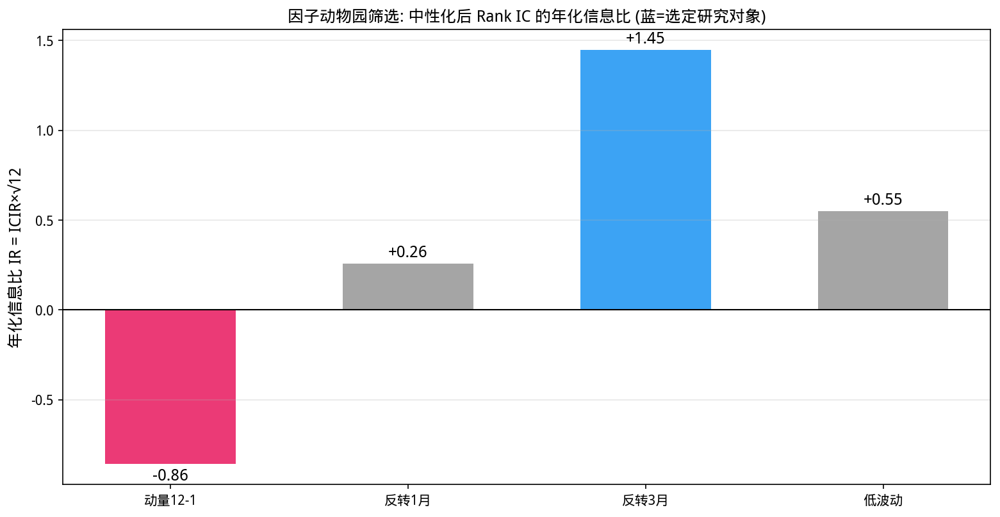
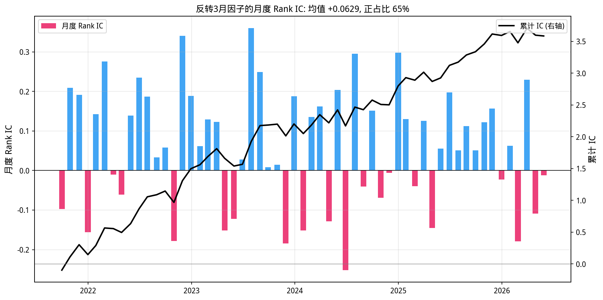
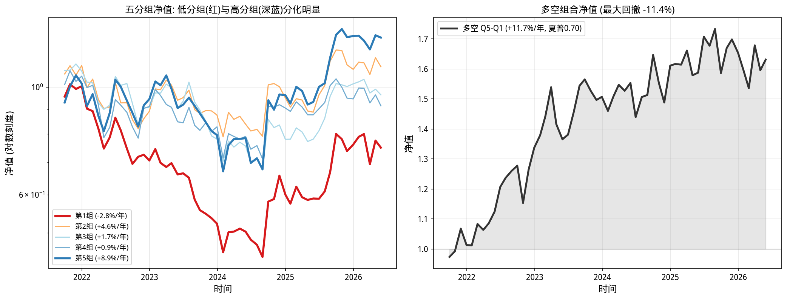

# 第27章 多因子模型——从因子构造到组合构建

> **动机先行**: CAPM 告诉我们"承担市场风险才能获得超额收益", 但现实是大量异象无法用单一贝塔解释: 小市值长期跑赢、过去输家会反弹、低波动股票反而收益更高……把无数个这样的规律整合成一个统一框架, 就是**多因子模型**——买方量化研究的工业标准。本章还有一个隐藏任务: 兑现第9章埋下的伏笔, 主动管理基本定律 $IR = IC \times \sqrt{Breadth}$。更重要的是, 我们将诚实地展示一次**失败**: 教科书里的动量因子在 A 股数据上并不有效。
>
> **量化实战定位**: 本章用 50 只真实 A 股走完一条完整的因子研究流水线: 构造候选因子 -> 中性化清洗 -> IC 筛选 -> 分层回测 -> Fama-MacBeth 检验 -> 绩效归因。这条流水线就是每一家买方机构研究员的日常。

---

## 27.1 动机: 从单一贝塔到因子星系

第12章的 CAPM 用一个 $\beta$ 解释所有股票: 预期超额收益 = $\beta \times$ 市场溢价。但第14章做 PCA 时你已经隐约看到: 股票收益的相关结构远不止一个公共因子。学术与实务界在过去五十年里积累了庞大的**因子动物园**:

| 因子类别 | 代表因子 | 直觉 |
|---------|---------|------|
| 规模 | 小市值 | 小盘股流动性补偿 / 壳价值 (A 股特色) |
| 价值 | 低市净率、低市盈率 | 市场对坏消息过度悲观 |
| 动量/反转 | 过去涨幅的方向 | 行为金融: 反应不足 vs 过度反应 |
| 波动率 | 低波动 | 彩票偏好让高波动股被高估 |
| 质量 | 高 ROE、低负债 | 复利机器值得溢价 |

多因子模型回答两个问题: **哪些变量能预测截面收益?**(Alpha 模型) 以及 **收益的共同风险来自哪里?**(风险模型)。前者找钱, 后者管风险——Grinold & Kahn 的基本定律把两者连在一起:

$$
IR = IC \times \sqrt{Breadth}
$$

信息比率 = 预测能力 (IC) × 独立下注次数的平方根。本章结束时你会亲手算出这个公式里的每一个量。

## 27.2 因子构造: 从想法到可检验的信号

一个原始想法要变成可检验的因子, 需要过三道预处理:

1. **排序打分**: 把原始值转成截面可比的信号。最常用的是 z-score 标准化:
   $$z_i = \frac{f_i - \bar{f}}{\mathrm{sd}(f)}$$
   对方向性明确的因子, 先取负号保证"高分 = 更看好"(如反转因子取负的过去收益)。
2. **去极值与缺失处理**: 截面极值会污染均值和标准差; 停牌造成的缺失沿用前收盘价。
3. **中性化 (Neutralization)**: 因子常常与行业、市值纠缠不清——比如小市值股票恰好波动更大。"反转因子的收益"到底是反转带来的, 还是它隐含的小市值暴露带来的? 中性化给出干净答案: 每月做一次截面回归
   $$f_i = a + b \cdot \ln(\text{size}_i) + \sum_k c_k\,\mathbb{1}_{\text{行业}_k} + e_i$$
   只保留残差 $e_i$ 作为新因子。用第15章的语言: 把因子向量投影掉行业/市值张成的子空间, 残差与之正交——从此因子在各个行业组内、各市值组内的均值都近似为零。

## 27.3 因子动物园筛选: 让数据说话

构造四个候选因子 (全部调整为"高分 = 更看好"): 经典的 12-1 动量 (剔除最近一月)、三个期限的反转、以及低波动。全部经过同样的中性化流程, 然后用 Rank IC (下一节的正式定义) 初筛:

```python
import numpy as np
import pandas as pd
from scipy import stats

# ========== 数据准备 ==========
df = pd.read_csv('data/stock_data_50_20210601_20260531.csv')
df['time'] = pd.to_datetime(df['time'])
px = df.pivot(index='time', columns='thscode', values='close').sort_index().ffill()
size = df.pivot(index='time', columns='thscode', values='market_cap').sort_index().ffill()
industry = df.groupby('thscode')['industry'].first()
ind_dummy = pd.get_dummies(industry.fillna('其他'), dtype=float)

s_idx = pd.Series(px.index)
mon_end = s_idx.groupby(pd.to_datetime(s_idx).dt.to_period('M')).max().values
pm = px.loc[mon_end]                       # 月末收盘价矩阵
sm_log = np.log(size.loc[mon_end])         # 月末对数市值
ret_fwd = pm.pct_change().shift(-1)        # 下月收益 (检验目标)

# ========== 候选因子 (高分 = 更看好) ==========
cands = {
    '动量12-1': px.shift(21)/px.shift(252) - 1,
    '反转1月':  -(px/px.shift(21) - 1),
    '反转3月':  -(px/px.shift(63) - 1),
    '低波动':   -(px.pct_change().rolling(60).std()*np.sqrt(252)),
}

def zscore_monthly(daily):
    """日频因子 -> 月末截面 z-score"""
    return daily.loc[mon_end].apply(lambda s: (s-s.mean())/s.std(), axis=1)

def neutralize(z_raw):
    """每月截面回归: 因子 ~ 行业哑变量 + 对数市值, 取残差"""
    out, r2s = {}, []
    for dt in z_raw.index:
        y = z_raw.loc[dt].dropna()
        if len(y) < 30:
            continue
        X = pd.concat([sm_log.loc[dt].reindex(y.index).rename('lnsize'),
                       ind_dummy.reindex(y.index).fillna(0)], axis=1)
        X['const'] = 1.0
        b, *_ = np.linalg.lstsq(X.values, y.values, rcond=None)
        fit = X.values @ b
        r2s.append(1 - ((y.values-fit)**2).sum()/((y.values-y.values.mean())**2).sum())
        out[dt] = pd.Series(y.values - fit, index=y.index)
    return pd.DataFrame(out).T.sort_index(), np.mean(r2s)

def ic_series(zn):
    """Rank IC 序列: 本月末因子得分 vs 下月收益的 Spearman 相关"""
    res = []
    for i in range(len(zn)-1):
        f = zn.iloc[i]
        r = ret_fwd.loc[zn.index[i]].reindex(f.index)
        m = f.notna() & r.notna()
        if m.sum() < 20:
            continue
        ic, _ = stats.spearmanr(f[m], r[m])
        res.append((zn.index[i+1], ic))
    return pd.Series(dict(res)).sort_index()

print("=== 因子动物园: 中性化后的 Rank IC 筛选 ===")
print(f"{'因子':<10} | {'样本':>4} | {'IC均值':>8} | {'t值':>6} | {'IC>0':>6} | {'年化IR':>7}")
print('-'*52)
for name, daily in cands.items():
    zn, r2avg = neutralize(zscore_monthly(daily))
    s = ic_series(zn)
    n = len(s); t = s.mean()/s.std()*np.sqrt(n); icir = s.mean()/s.std()
    print(f"{name:<11} | {n:>4} | {s.mean():+8.4f} | {t:+6.2f} | {(s>0).mean()*100:>5.0f}% | {icir*np.sqrt(12):+7.2f}")

z_rev3, r2_avg = neutralize(zscore_monthly(cands['反转3月']))
print(f"\n选定 [反转3月] 深入研究; 中性化回归平均 R^2 = {r2_avg:.3f}")
last = z_rev3.iloc[-1].sort_values()
print(f"最近一期做多端 Top5 : {'  '.join(last.index[-5:])}")
print(f"最近一期做空端 Bot5 : {'  '.join(last.index[:5])}")

# 可视化: 四个因子的年化 IR 对比
irs = {}
for name, daily in cands.items():
    zn, _ = neutralize(zscore_monthly(daily))
    s = ic_series(zn)
    irs[name] = s.mean()/s.std()*np.sqrt(12)

import matplotlib.pyplot as plt
plt.rcParams['font.sans-serif'] = ['WenQuanYi Micro Hei']
plt.rcParams['axes.unicode_minus'] = False

fig, ax = plt.subplots(figsize=(10.5, 5.5))
names = list(irs.keys())
vals = [irs[n] for n in names]
cols = ['#E91E63' if v < 0 else '#999999' for v in vals]
cols[names.index('反转3月')] = '#2196F3'
bars = ax.bar(names, vals, width=0.55, color=cols, alpha=0.88)
for b_, v in zip(bars, vals):
    ax.text(b_.get_x()+b_.get_width()/2, v + (0.04 if v >= 0 else -0.09),
            f'{v:+.2f}', ha='center', fontsize=12)
ax.axhline(0, color='black', lw=1)
ax.set_ylabel('年化信息比 IR = ICIR×√12', fontsize=12)
ax.set_title('因子动物园筛选: 中性化后 Rank IC 的年化信息比 (蓝=选定研究对象)', fontsize=12)
ax.grid(True, alpha=0.3, axis='y')
plt.tight_layout()
plt.show()
```

**运行结果**:

```
=== 因子动物园: 中性化后的 Rank IC 筛选 ===
因子         |   样本 |     IC均值 |     t值 |   IC>0 |    年化IR
----------------------------------------------------
动量12-1      |   47 |  -0.0374 |  -1.70 |    43% |   -0.86
反转1月        |   58 |  +0.0100 |  +0.56 |    59% |   +0.26
反转3月        |   57 |  +0.0629 |  +3.15 |    65% |   +1.45
低波动         |   57 |  +0.0260 |  +1.20 |    58% |   +0.55

选定 [反转3月] 深入研究; 中性化回归平均 R^2 = 0.493
最近一期做多端 Top5 : 600031.SH  300347.SZ  002049.SZ  688599.SH  601012.SH
最近一期做空端 Bot5 : 688006.SH  603986.SH  002460.SZ  600887.SH  300568.SZ
```



**观察——第一个假设阵亡了**:

1. **教科书动量在 A 股失效**: 12-1 动量的 IC 为 $-0.037$, t 值 $-1.70$, 多空方向甚至是反的。这不是 bug, 而是 A 股的著名特征——散户主导的市场中短期反转效应强、中期动量弱, 与美股文献几乎相反。如果直接照搬美股因子库, 回测会给你一记闷棍。**这就是为什么因子必须先检验再使用**。
2. **反转族内部也有分化**: 1 个月反转太短 (t 仅 +0.56), 3 个月反转才显出真身 ($t=+3.15$, 年化 IR $+1.45$)。信号的"保质期"本身就是需要研究的参数。
3. **中性化的工作量可见一斑**: 平均 $R^2 = 0.493$——原始反转信号中约一半的信息可以被行业和市值解释, 不洗掉它们, 后续归因将是一笔糊涂账。

## 27.4 因子有效性检验: Rank IC 分析

**定义**: 第 $t$ 期的 Rank IC 是因子得分与下期收益的 Spearman 秩相关:

$$
IC_t = \mathrm{corr}\big(\mathrm{rank}(z_{i,t}),\ \mathrm{rank}(r_{i,t \to t+1})\big)
$$

用秩而不用原始值有两个好处: 对极端值稳健 (一只翻倍股不会扭曲整期 IC), 且不预设线性关系。一个有效的因子应该有一串稳定为正的 $IC_t$。

检验工具全是老朋友: IC 序列的均值是否显著非零, 用第11章的 t 统计量 $t = \bar{IC}/\sigma_{IC} \cdot \sqrt{n}$; 均值与标准差之比就是 **ICIR**, 年化后正是基本定律里的 IR (月频调仓时年化因子为 $\sqrt{12}$):

```python
import numpy as np
import pandas as pd
from scipy import stats
import matplotlib.pyplot as plt

plt.rcParams['font.sans-serif'] = ['WenQuanYi Micro Hei']
plt.rcParams['axes.unicode_minus'] = False

df = pd.read_csv('data/stock_data_50_20210601_20260531.csv')
df['time'] = pd.to_datetime(df['time'])
px = df.pivot(index='time', columns='thscode', values='close').sort_index().ffill()
size = df.pivot(index='time', columns='thscode', values='market_cap').sort_index().ffill()
industry = df.groupby('thscode')['industry'].first()
ind_dummy = pd.get_dummies(industry.fillna('其他'), dtype=float)

s_idx = pd.Series(px.index)
mon_end = s_idx.groupby(pd.to_datetime(s_idx).dt.to_period('M')).max().values
pm = px.loc[mon_end]
sm_log = np.log(size.loc[mon_end])
ret_fwd = pm.pct_change().shift(-1)

rev3_daily = -(px/px.shift(63) - 1)
z_raw = rev3_daily.loc[mon_end].apply(lambda s: (s-s.mean())/s.std(), axis=1)
out = {}
for dt in z_raw.index:
    y = z_raw.loc[dt].dropna()
    if len(y) < 30:
        continue
    X = pd.concat([sm_log.loc[dt].reindex(y.index).rename('lnsize'),
                   ind_dummy.reindex(y.index).fillna(0)], axis=1)
    X['const'] = 1.0
    b, *_ = np.linalg.lstsq(X.values, y.values, rcond=None)
    out[dt] = pd.Series(y.values - X.values@b, index=y.index)
z_rev3 = pd.DataFrame(out).T.sort_index()

ic_list = []
for i in range(len(z_rev3)-1):
    f = z_rev3.iloc[i]
    r = ret_fwd.loc[z_rev3.index[i]].reindex(f.index)
    m = f.notna() & r.notna()
    if m.sum() < 20:
        continue
    ic, _ = stats.spearmanr(f[m], r[m])
    ic_list.append((z_rev3.index[i+1], ic))
ic_s = pd.Series(dict(ic_list)).sort_index()

n_ic = len(ic_s)
t_stat = ic_s.mean()/ic_s.std()*np.sqrt(n_ic)
icir = ic_s.mean()/ic_s.std()

print("=== 反转3月因子的 Rank IC 深度分析 ===")
print(f"样本期数      = {n_ic}  ({ic_s.index[0].date()} ~ {ic_s.index[-1].date()})")
print(f"IC 均值       = {ic_s.mean():+.4f}")
print(f"IC 标准差     = {ic_s.std():.4f}")
print(f"IC > 0 占比   = {(ic_s>0).mean()*100:.1f}%")
print(f"t 统计量      = {t_stat:+.2f}")
print(f"ICIR          = {icir:+.3f}")
print(f"年化信息比 IR = ICIR * sqrt(12) = {icir*np.sqrt(12):+.2f}")

best = ic_s.idxmax(); worst = ic_s.idxmin()
print(f"最强一个月 IC = {ic_s.max():+.3f} ({best.date()}), 最弱 = {ic_s.min():+.3f} ({worst.date()})")

fig, ax = plt.subplots(figsize=(11.5, 5.8))
colors = ['#E91E63' if v < 0 else '#2196F3' for v in ic_s.values]
ax.bar(ic_s.index, ic_s.values, width=20, color=colors, alpha=0.85,
       label='月度 Rank IC')
ax2 = ax.twinx()
ax2.plot(ic_s.index, ic_s.cumsum(), 'k-', lw=2, label='累计 IC (右轴)')
ax2.axhline(0, color='gray', lw=0.6)
ax.axhline(0, color='black', lw=0.8)
ax.set_ylabel('月度 Rank IC', fontsize=12)
ax2.set_ylabel('累计 IC', fontsize=12)
ax.set_title(f'反转3月因子的月度 Rank IC: 均值 {ic_s.mean():+.4f}, 正占比 {(ic_s>0).mean()*100:.0f}%', fontsize=12)
ax.legend(fontsize=10, loc='upper left')
ax2.legend(fontsize=10, loc='upper right')
ax.grid(True, alpha=0.3)
plt.tight_layout()
plt.show()
```

**运行结果**:

```
=== 反转3月因子的 Rank IC 深度分析 ===
样本期数      = 57  (2021-09-30 ~ 2026-05-29)
IC 均值       = +0.0629
IC 标准差     = 0.1507
IC > 0 占比   = 64.9%
t 统计量      = +3.15
ICIR          = +0.417
年化信息比 IR = ICIR * sqrt(12) = +1.45
最强一个月 IC = +0.360 (2023-07-31), 最弱 = -0.252 (2024-06-28)
```



**观察**:

1. **预测能力不大, 但稳定**: 月均 IC 只有 0.063——离"精准预测"相距甚远。但 65% 的月份方向正确、t 值超过 3, 累计 IC 曲线近乎单调爬升。**量化选股从来不靠单次神预言, 而靠微弱优势的大量重复**。
2. **基本定律兑现**: ICIR $=0.42$, 年化 IR $=1.45$。对照第9章的公式 $IR = IC\times\sqrt{Breadth}$: 单次预测能力 IC $\approx 0.06$, 一年 50 只股票 × 12 个月的独立下注把微弱的 IC 放大成了可观的组合信息比率。定律的两个零件在这里都摸到了实物。
3. **失效月份也值得看**: 最差的一个月 (2024-06, IC=$-0.25$) 正是小盘股流动性危机前后——极端行情中反转因子一度失灵, 这提示因子风险不是常数 (呼应第21章波动率聚集的思想)。

## 27.5 分层回测: 把信号变成组合

IC 衡量的是"相关性", 投资者更关心"按这个信号真的能赚钱吗"。分层回测是最直观的答案: 每月末按因子得分把股票分成五组, 组内等权买入持有一个月, 观察各组净值分化。

```python
import numpy as np
import pandas as pd
import matplotlib.pyplot as plt

plt.rcParams['font.sans-serif'] = ['WenQuanYi Micro Hei']
plt.rcParams['axes.unicode_minus'] = False

df = pd.read_csv('data/stock_data_50_20210601_20260531.csv')
df['time'] = pd.to_datetime(df['time'])
px = df.pivot(index='time', columns='thscode', values='close').sort_index().ffill()
size = df.pivot(index='time', columns='thscode', values='market_cap').sort_index().ffill()
industry = df.groupby('thscode')['industry'].first()
ind_dummy = pd.get_dummies(industry.fillna('其他'), dtype=float)

s_idx = pd.Series(px.index)
mon_end = s_idx.groupby(pd.to_datetime(s_idx).dt.to_period('M')).max().values
pm = px.loc[mon_end]
sm_log = np.log(size.loc[mon_end])
ret_fwd = pm.pct_change().shift(-1)

rev3_daily = -(px/px.shift(63) - 1)
z_raw = rev3_daily.loc[mon_end].apply(lambda s: (s-s.mean())/s.std(), axis=1)
out = {}
for dt in z_raw.index:
    y = z_raw.loc[dt].dropna()
    if len(y) < 30:
        continue
    X = pd.concat([sm_log.loc[dt].reindex(y.index).rename('lnsize'),
                   ind_dummy.reindex(y.index).fillna(0)], axis=1)
    X['const'] = 1.0
    b, *_ = np.linalg.lstsq(X.values, y.values, rcond=None)
    out[dt] = pd.Series(y.values - X.values@b, index=y.index)
z_rev3 = pd.DataFrame(out).T.sort_index()

q_ret = {q: [] for q in range(1, 6)}
dates_q = []
for i in range(len(z_rev3)-1):
    dt, nxt_dt = z_rev3.index[i], z_rev3.index[i+1]
    f = z_rev3.loc[dt]
    r = ret_fwd.loc[dt].reindex(f.index)
    mask = f.notna() & r.notna()
    if mask.sum() < 20:
        continue
    order = f[mask].rank()                 # 用秩分组, 与 Rank IC 口径一致
    dates_q.append(nxt_dt)
    for q in range(1, 6):
        lo, hi = order.quantile([(q-1)/5, q/5])
        members = order[(order >= lo) & (order <= hi)].index
        q_ret[q].append(r[members].mean())  # 组内等权

q_df = pd.DataFrame(q_ret, index=pd.DatetimeIndex(dates_q))
ls_ret = q_df[5] - q_df[1]                  # 多空: 多Q5空Q1

def perf(r):
    ann, vol = r.mean()*12, r.std()*np.sqrt(12)
    nav = (1+r).cumprod()
    dd = (nav/nav.cummax()-1).min()
    return ann, vol, ann/vol, dd

print(f"分层回测: {q_df.index[0].date()} ~ {q_df.index[-1].date()}, 共 {len(q_df)} 个月, 月末调仓")
print(f"{'组合':<14} | {'年化收益':>8} | {'年化波动':>8} | {'夏普':>6} | {'最大回撤':>8}")
print("-" * 58)
for q in range(1, 6):
    a, v, s, d = perf(q_df[q])
    print(f"{f'第{q}组 (低->高)':<13} | {a*100:>7.2f}% | {v*100:>7.2f}% | {s:>6.2f} | {d*100:>7.1f}%")
a, v, s, d = perf(ls_ret)
print(f"{'多空 (Q5-Q1)':<13} | {a*100:>7.2f}% | {v*100:>7.2f}% | {s:>6.2f} | {d*100:>7.1f}%")
mono = all(q_df[q].mean() <= q_df[q+1].mean() + 1e-12 for q in range(1, 5))
print(f"单调性检验 (收益随分组递增): {'通过' if mono else '未通过'}")

navs = (1+q_df).cumprod()
fig, axes = plt.subplots(1, 2, figsize=(14, 5.4))
cmap = ['#d7191c', '#fdae61', '#abd9e9', '#74add1', '#2c7bb6']
for q in range(1, 6):
    lab = f'第{q}组 ({q_df[q].mean()*12*100:+.1f}%/年)'
    axes[0].plot(q_df.index, navs[q], lw=(2.6 if q in (1, 5) else 1.4),
                 color=cmap[q-1], label=lab)
axes[0].set_yscale('log')
axes[0].set_xlabel('时间', fontsize=12)
axes[0].set_ylabel('净值 (对数刻度)', fontsize=12)
axes[0].set_title('五分组净值: 低分组(红)与高分组(深蓝)分化明显', fontsize=12)
axes[0].legend(fontsize=9)
axes[0].grid(True, alpha=0.3)

ls_nav = (1+ls_ret).cumprod()
axes[1].plot(ls_ret.index, ls_nav, lw=2.4, color='#333333',
             label=f'多空 Q5-Q1 ({ls_ret.mean()*12*100:+.1f}%/年, '
                   f'夏普{ls_ret.mean()/ls_ret.std()*np.sqrt(12):.2f})')
axes[1].fill_between(ls_ret.index, 1, ls_nav, alpha=0.12, color='#333333')
axes[1].axhline(1, color='gray', lw=0.8)
dd = ((ls_nav/ls_nav.cummax())-1).min()
axes[1].set_xlabel('时间', fontsize=12)
axes[1].set_ylabel('净值', fontsize=12)
axes[1].set_title(f'多空组合净值 (最大回撤 {dd*100:.1f}%)', fontsize=12)
axes[1].legend(fontsize=10)
axes[1].grid(True, alpha=0.3)
plt.tight_layout()
plt.show()
```

**运行结果**:

```
分层回测: 2021-09-30 ~ 2026-05-29, 共 57 个月, 月末调仓
组合             |     年化收益 |     年化波动 |     夏普 |     最大回撤
----------------------------------------------------------
第1组 (低->高)    |   -2.76% |   26.58% |  -0.10 |   -56.0%
第2组 (低->高)    |    4.62% |   23.46% |   0.20 |   -28.7%
第3组 (低->高)    |    1.74% |   23.14% |   0.08 |   -39.3%
第4组 (低->高)    |    0.93% |   24.41% |   0.04 |   -34.2%
第5组 (低->高)    |    8.94% |   29.57% |   0.30 |   -36.6%
多空 (Q5-Q1)    |   11.70% |   16.61% |   0.70 |   -11.4%
单调性检验 (收益随分组递增): 未通过
```



**观察**:

1. **两端承载信号**: 做空端 (跌得最少的 Q1) 年化 $-2.76\%$ 且回撤深达 56%, 做多端 (超跌最多的 Q5) 年化 $+8.94\%$; 多空组合年化 $+11.7\%$, 夏普 0.70, 回撤只有 $-11.4\%$——市场中性结构的风险特征确实优于单边持仓。
2. **单调性未通过是诚实的提醒**: 中间三组 (Q2/Q3/Q4) 收益无序排列。因子信号集中在分布的两端, 中间分位的股票彼此差异太小, 排名噪声淹没信号。实务解读: 分层回测主要看 Q1 vs Q5 的两端对比, 中间组的乱序不代表因子无效。
3. **别忘了成本**: 以上未计交易费用。反转策略月月调仓、换手率高, 双边千三的费用足以吃掉相当一部分收益——练习题将请你量化这一点。

## 27.6 Fama-MacBeth 两步法与时序归因

分层回测只用了两端 40% 的股票, 且等权分组丢掉了得分的强弱信息。学术界的标准工具是 **Fama-MacBeth 两步法**:

- **第一步 (截面上)**: 每个月做一次回归 $r_{i,t\to t+1} = \gamma_{0,t} + \gamma_t z_{i,t} + \delta_t \ln(\text{size}_i) + \epsilon_i$, 得到该月每单位因子暴露的收益补偿 $\gamma_t$;
- **第二步 (时间序列上)**: 检验 $\bar{\gamma} = \frac{1}{T}\sum_t \gamma_t$ 是否显著非零。

它回答的问题比分层回测更精细: "控制市值之后, 每 1 个标准差的反转暴露, 市场平均支付多少月薪?"

最后给多空组合做一次时序归因: 把它的月收益对市场指数回归, 分离出 $\alpha$ (真本事) 与 $\beta$ (市场暴露):

```python
import numpy as np
import pandas as pd

df = pd.read_csv('data/stock_data_50_20210601_20260531.csv')
df['time'] = pd.to_datetime(df['time'])
px = df.pivot(index='time', columns='thscode', values='close').sort_index().ffill()
size = df.pivot(index='time', columns='thscode', values='market_cap').sort_index().ffill()
industry = df.groupby('thscode')['industry'].first()
ind_dummy = pd.get_dummies(industry.fillna('其他'), dtype=float)

s_idx = pd.Series(px.index)
mon_end = s_idx.groupby(pd.to_datetime(s_idx).dt.to_period('M')).max().values
pm = px.loc[mon_end]
sm_log = np.log(size.loc[mon_end])
ret_fwd = pm.pct_change().shift(-1)

rev3_daily = -(px/px.shift(63) - 1)
z_raw = rev3_daily.loc[mon_end].apply(lambda s: (s-s.mean())/s.std(), axis=1)
out = {}
for dt in z_raw.index:
    y = z_raw.loc[dt].dropna()
    if len(y) < 30:
        continue
    X = pd.concat([sm_log.loc[dt].reindex(y.index).rename('lnsize'),
                   ind_dummy.reindex(y.index).fillna(0)], axis=1)
    X['const'] = 1.0
    b, *_ = np.linalg.lstsq(X.values, y.values, rcond=None)
    out[dt] = pd.Series(y.values - X.values@b, index=y.index)
z_rev3 = pd.DataFrame(out).T.sort_index()

fm_betas, fm_dates = [], []
for i in range(len(z_rev3)-1):
    dt, nxt_dt = z_rev3.index[i], z_rev3.index[i+1]
    f = z_rev3.loc[dt]
    r = ret_fwd.loc[dt].reindex(f.index)
    sz = sm_log.loc[dt].reindex(f.index)
    m = f.notna() & r.notna() & sz.notna()
    if m.sum() < 20:
        continue
    Xm = np.column_stack([np.ones(int(m.sum())), f[m].values, sz[m].values])
    bm, *_ = np.linalg.lstsq(Xm, r[m].values, rcond=None)
    fm_betas.append(bm[1]); fm_dates.append(nxt_dt)

fb = pd.Series(fm_betas, index=pd.DatetimeIndex(fm_dates))
t_fm = fb.mean()/fb.std()*np.sqrt(len(fb))
print("=== Fama-MacBeth 两步法 (控制市值后的反转溢价) ===")
print(f"第二步: 每月截面回归 r_next ~ const + z_rev3m + ln_size, 共 {len(fb)} 期")
print(f"lambda (反转溢价/月) = {fb.mean()*100:+.3f}%")
print(f"t(FM) = {t_fm:+.2f}")
print(f"年化溢价 ≈ {fb.mean()*12*100:+.1f}%")

# 多空组合的时序归因: r_LS = alpha + beta * 沪深300 + eps
bench = pd.read_csv('data/index_data_7_20210601_20260531.csv')
bench['time'] = pd.to_datetime(bench['time'])
hs300 = bench[bench['thscode'] == '000300.SH'].set_index('time')['close'].sort_index()
hs300_m = hs300.reindex(pm.index).pct_change().reindex(ls_ret.index if 'ls_ret' in dir() else None)

# 重构多空序列 (与本节口径一致)
q_ret = {q: [] for q in range(1, 6)}
dates_q = []
for i in range(len(z_rev3)-1):
    dt, nxt_dt = z_rev3.index[i], z_rev3.index[i+1]
    f = z_rev3.loc[dt]
    r = ret_fwd.loc[dt].reindex(f.index)
    mask = f.notna() & r.notna()
    if mask.sum() < 20:
        continue
    order = f[mask].rank()
    dates_q.append(nxt_dt)
    for q in range(1, 6):
        lo, hi = order.quantile([(q-1)/5, q/5])
        q_ret[q].append(r[order[(order >= lo) & (order <= hi)].index].mean())
q_df = pd.DataFrame(q_ret, index=pd.DatetimeIndex(dates_q))
ls2 = q_df[5] - q_df[1]

hs300_m = hs300.reindex(pm.index).pct_change().reindex(ls2.index)
ok = np.isfinite(hs300_m.values) & np.isfinite(ls2.values)

Xa = np.column_stack([np.ones(int(ok.sum())), hs300_m.values[ok]])
ba, *_ = np.linalg.lstsq(Xa, ls2.values[ok], rcond=None)
resid = ls2.values[ok] - Xa @ ba
t_alpha = ba[0]/(resid.std(ddof=Xa.shape[1])/np.sqrt(ok.sum()))

print()
print("=== 多空组合的时序归因 (r_LS ~ alpha + beta*沪深300) ===")
print(f"有效月份   = {ok.sum()}/{len(ls2)}")
print(f"市场 Beta  = {ba[1]:+.3f}")
print(f"月度 Alpha = {ba[0]*100:+.2f}%  (t = {t_alpha:+.2f})")
print(f"年化 Alpha = {ba[0]*12*100:+.1f}%")
```

**运行结果**:

```
=== Fama-MacBeth 两步法 (控制市值后的反转溢价) ===
第二步: 每月截面回归 r_next ~ const + z_rev3m + ln_size, 共 57 期
lambda (反转溢价/月) = +0.334%
t(FM) = +0.96
年化溢价 ≈ +4.0%

=== 多空组合的时序归因 (r_LS ~ alpha + beta*沪深300) ===
有效月份   = 57/57
市场 Beta  = +0.274
月度 Alpha = +0.93%  (t = +1.52)
年化 Alpha = +11.2%
```

**观察——三种检验口径的分歧恰恰最有教育意义**:

1. **Rank IC 显著 ($t=+3.15$) 但 FM 溢价不显著 ($t=+0.96$)**: Rank IC 用秩, 对极端收益稳健; FM 用原始收益回归, 单月异常值会大幅扰动 $\gamma_t$。此外 FM 显式控制了市值, 分走的解释力让剩余的反转溢价缩水。**同一份数据、不同检验框架, 结论强度可以不同**——读研报时务必问一句"用的是哪种检验"。
2. **FM 溢价的经济含义仍然可观**: 每月 $+0.334\%$ 折合年化 $+4\%$, 方向与分层回测一致, 只是置信度不够高。样本仅 57 个月, 检验功效天然有限 (第11章: 功效不足时"没测出显著"不等于"不存在")。
3. **归因显示策略接近市场中性**: 多空组合对沪深300 的 $\beta$ 只有 $+0.274$ (中性化功不可没), 年化 $\alpha \approx +11.2\%$ 但 $t=1.52$。$\alpha$ 为正且经济上可观, 统计上尚需更长样本确认。

## 27.7 核心公式速查

> 本节是前述各节公式的集中汇总, 供复习和查阅使用.

1. **因子标准化**: $z_i = (f_i - \bar{f})/\mathrm{sd}(f)$; 方向约定"高分 = 更看好"
2. **中性化**: $f^{neu} = f - X(X^\top X)^{-1}X^\top f$, 其中 $X$ = [对数市值, 行业哑变量]; 残差与 $X$ 正交 (第15章投影语言)
3. **Rank IC**: $IC_t = \mathrm{corr}(\mathrm{rank}(z_t), \mathrm{rank}(r_{t\to t+1}))$
4. **IC 显著性**: $t = \bar{IC}/\sigma_{IC}\cdot\sqrt{n}$
5. **ICIR 与基本定律**: $ICIR = \bar{IC}/\sigma_{IC}$; 年化 $IR = ICIR\times\sqrt{12}$; 一般形式 $IR = IC\times\sqrt{Breadth}$
6. **分层回测**: 第 $q$ 组收益 = 组内等权平均; 多空 = $Q_5 - Q_1$; 关注两端对比与单调性
7. **Fama-MacBeth**: 第一步逐月截面回归得 $\gamma_t$; 第二步 $\bar{\gamma}$, $t = \bar{\gamma}/(\sigma_\gamma/\sqrt{T})$
8. **时序归因**: $r_{LS} = \alpha + \beta\, MKT + \epsilon$; $\alpha$ 是剥离市场后的"真本事"

## 27.8 本章小结

| 概念 | 核心要点 | 量化意义 |
|------|---------|---------|
| 因子预处理 | 打分、去极值、中性化 | 剥离风格暴露, 让信号"纯净化" |
| 因子动物园 | 同一流程筛选多个候选 | 因子必须先检验再用; A股动量失效即例证 |
| Rank IC | 秩相关的预测能力度量 | 对极端值稳健的行业标准 |
| 基本定律 | $IR = IC\times\sqrt{Breadth}$ | 微弱优势 × 大量重复 = 可观绩效 |
| 分层回测 | 五分组两端对比 | 最直观的"能否赚钱"检验 |
| Fama-MacBeth | 逐月截面 + 时序检验 | 学术界金标准, 控制混杂变量 |
| 时序归因 | $\alpha/\beta$ 分解 | 区分真本事与市场暴露 |

**最后一句话**: 本章最重要的收获可能不是那个年化 $11.7\%$ 的多空组合, 而是研究姿态本身——先提出假设、再用数据审判、接受动量失效的事实、警惕中间分位的噪声、对不显著的溢价保持诚实。这套流程比任何单一因子都更接近"量化"二字的本质。

## 27.9 练习题

### 数学推导

**题1——基本定律的计算**:

(a) 某策略月度 Rank IC 序列的均值为 0.04, 标准差为 0.18。计算 ICIR 与年化 IR。

(b) 若把调仓频率从月频提高到周频, 假设单次 IC 不变, Breadth 扩大到约 4 倍, 用 $IR = IC\times\sqrt{Breadth}$ 估算新的年化 IR。(提示: 注意频率换算与 $\sqrt{Breadth}$ 的双重效应, 并讨论"周频 IC 通常低于月频 IC"的现实修正。)

(c) 结合 (a)(b), 说明"提高胜率"与"提高下注次数"两条路径的边际成本差异。

**题2——中性化的投影解释**:

(a) 记中性化矩阵 $X$ (含常数项), 证明残差 $f^{neu} = (I - P)f$ (其中 $P = X(X^\top X)^{-1}X^\top$) 满足 $X^\top f^{neu} = 0$。

(b) 由 (a) 推出: 中性化后的因子在每个行业哑变量组内、以及在对数市值上的加权均值均为零。这对"因子收益归因"有什么好处?

(c) 若某因子的原始版本与市值的相关系数为 0.6, 中性化后变为 0。用方差分解的语言估计: 该因子方差中至少有多少比例来自市值暴露?

**题3——Fama-MacBeth 的方差**:

(a) 设第一步得到的 $\gamma_t$ 序列相互独立, 证明 $\mathrm{Var}(\bar{\gamma}) = \mathrm{Var}(\gamma_t)/T$, 从而 $t(\bar{\gamma}) = \bar{\gamma}\sqrt{T}/\sigma_\gamma$。

(b) 若 $\gamma_t$ 存在一阶自相关 (系数 $\phi > 0$), 说明 (a) 的标准误被低估还是高估, 方向如何修正 (Newey-West 的直觉)。

(c) 结合本章实测: Rank IC 的 $t = 3.15$ 而 FM 溢价的 $t = 0.96$。列举至少两个可能造成这种分歧的技术原因。

### 编程实践

**题1——扩充因子动物园**: 在本章流水线上新增四个候选因子 (换手率变化、60日波动率的变化率、距离52周最高价的接近度、振幅均值), 全部经同样中性化后输出同款筛选表。找出 IR 最高的两个因子, 计算它们中性化得分的月度相关矩阵 (呼应第14章), 并讨论两者是否提供增量信息。

**题2——加入交易成本的分层回测**: 假设双边交易成本为成交额的 0.3%。每月调仓时, 组合换手部分 = 上月成员中本月被替换的比例。重算五分组与多空组合的费后净值、年化收益与夏普, 并回答: 成本吞掉了多空收益的百分之多少? 反转类因子对成本的敏感度给你的策略设计什么启示?

## 27.10 参考文献

1. Grinold, R. C., & Kahn, R. N. (1999). *Active Portfolio Management* (2nd ed.). McGraw-Hill.（主动管理基本定律 $IR = IC\sqrt{BR}$ 与因子投资框架的圣经）

2. Fama, E. F., & MacBeth, J. D. (1973). "Risk, Return, and Equilibrium: Empirical Tests." *Journal of Political Economy*, 81(3), 607-636.（两步法检验的原创论文）

3. Jegadeesh, N. (1990). "Evidence of Predictable Behavior of Security Returns." *Journal of Finance*, 45(3), 881-898.（月度反转效应的经典证据）

4. 石川, 刘洋溢, 连祥斌. (2020). 《因子投资：方法与实践》. 电子工业出版社.（中文世界最好的因子方法论综述, 含 A 股本土化实证）
