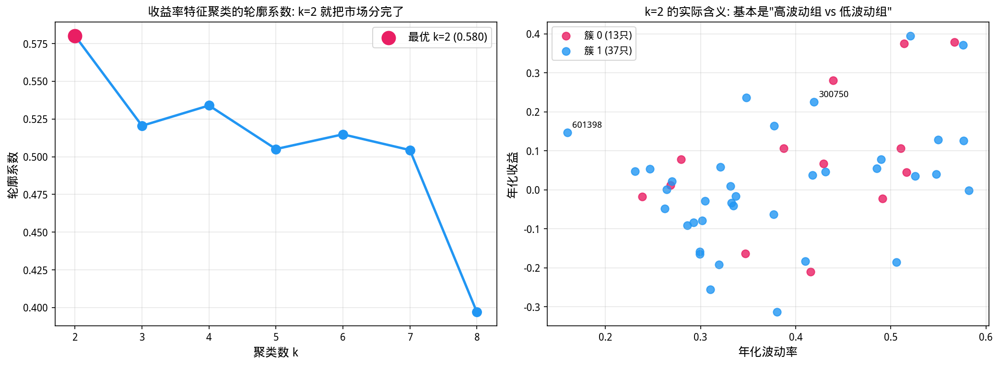
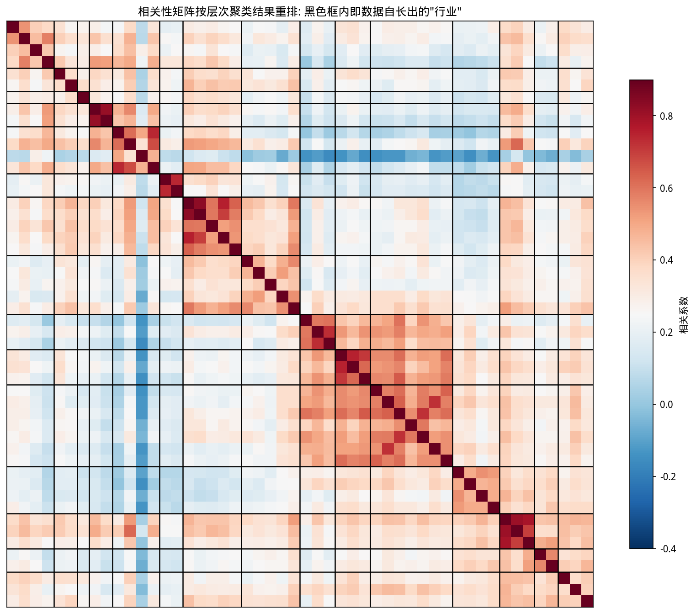
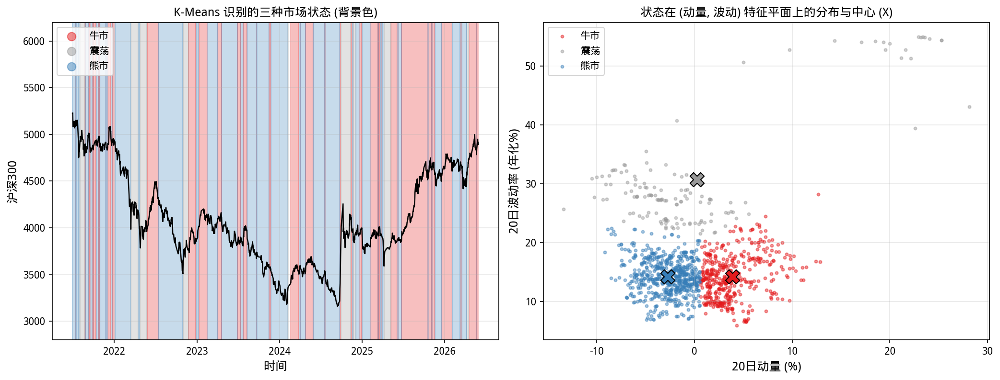
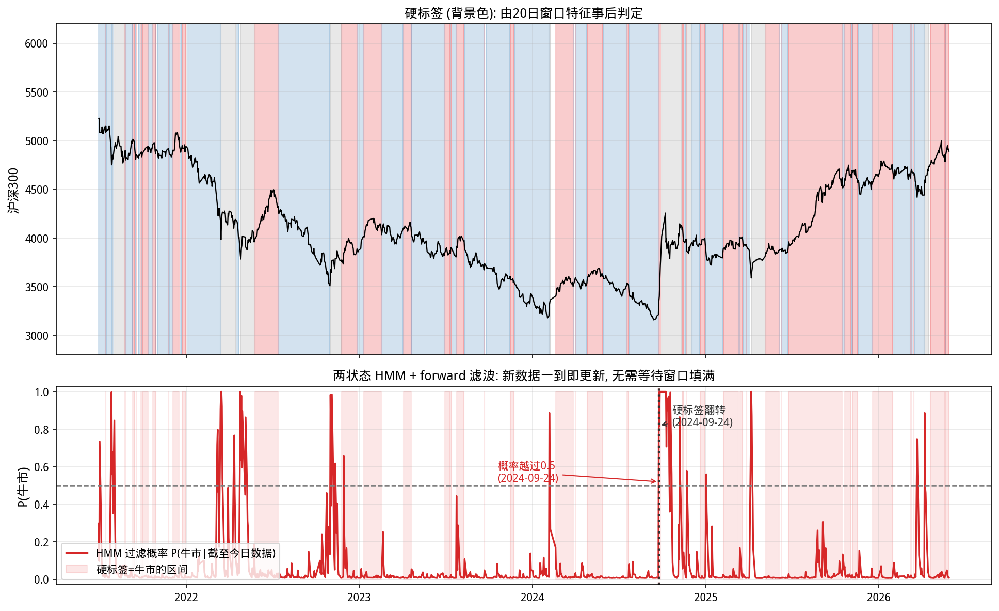
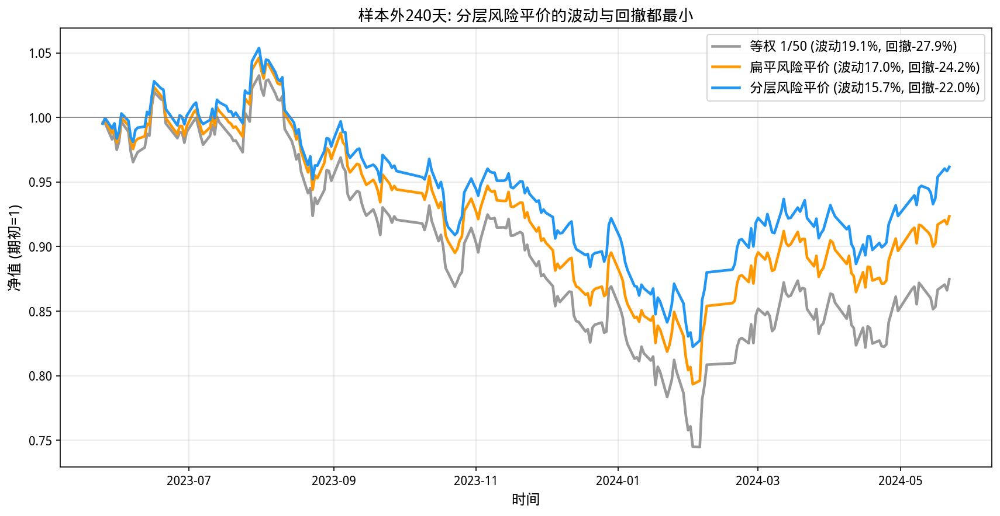

# 第29章 聚类分析——市场状态的识别与资产分组

> **动机先行**: 前两章的模型都有"老师"——标签 $y$ 给出标准答案。但量化研究的大量问题根本没有现成标签: 哪些股票真正同涨同跌? 市场此刻处于什么状态? **无监督学习**在没有标签的数据里自己寻找结构, 而**聚类**是其中最趁手的工具。本章将呈现一组漂亮的对照实验: 用收益率特征聚类与行业分类毫无关系 (ARI≈0), 而用相关性距离聚类能让算法自己"长出"行业结构——最大数据簇里 7 只股票有 6 只是电力设备。
>
> **量化实战定位**: 聚类在量化中的三大应用——**数据驱动的行业分类** (替代人工分类的滞后)、**市场状态识别** (牛/熊/震荡的自适应划分)、**分层风险平价** (先分簇再配权, 比扁平配权更抗相关结构塌陷)。

---

## 29.1 动机: 没有标签的世界

监督学习 (第28章) 的成功依赖一个前提: 有人告诉你标准答案。可现实中量化最关心的问题恰恰没有答案:

- 行业分类由指数公司人工维护, 更新滞后且边界模糊——一家造车的新能源公司算汽车还是电力设备?
- "现在是牛市还是熊市"事后人人会说, 事前没有官方标签;
- 风险平价组合需要"哪些资产天然抱团"的知识, 但相关结构随时间漂移。

聚类的任务形式: 给定样本的特征 (或距离), 把它们分成若干组, 使**组内相似、组间相异**。没有老师, 只有数据自己的形状。本章按三个应用逐层展开, 全部使用真实的 A 股数据。

## 29.2 K-Means 与轮廓系数

**它解决什么问题**: 你有一堆数据点但没有任何标签——不知道谁该跟谁一组。K-Means 的思路极其朴素: 先随便猜 $k$ 个组中心, 把每个点分给最近的中心, 再把中心移到组的平均值; 反复交替直到不再变化。这就是 **Lloyd 迭代**。

### 29.2.1 目标函数与 Lloyd 迭代

给定样本 $\{x_i\}$ 与聚类数 $k$, K-Means 寻找划分 $C_1,\dots,C_k$ 使得**组内平方和**最小:

$$
\min_{C}\ \sum_{j=1}^{k} \sum_{i \in C_j} \|x_i - \mu_j\|^2
$$

精确求解是 NP 难的, 实际用 **Lloyd 迭代**: (1) 固定质心, 把每个点分给最近的质心; (2) 固定分配, 把质心更新为组内均值。两步交替, 目标函数单调不增, 必然收敛到某个局部极小——注意"局部": 结果依赖初始化, 所以工程上总是多起点重启 (`n_init`) 取最优。

**轮廓系数**衡量聚类质量: 对每个样本,

$$
s(i) = \frac{b(i) - a(i)}{\max(a(i), b(i))}
$$

$a(i)$ 是它与同组其他点的平均距离 (凝聚度), $b(i)$ 是它与最近异组的平均距离 (分离度)。$s(i)$ 接近 1 说明分组合理, 接近 0 说明骑在边界上, 为负说明分错了组。

### 29.2.2 实验: 收益率特征聚类 vs 真实行亚

用五维收益率特征 (年化收益/波动/偏度/峰度/最大回撤) 给 50 只 A 股聚类:

```python
import numpy as np
import pandas as pd
from scipy import stats
from sklearn.cluster import KMeans
from sklearn.metrics import adjusted_rand_score, silhouette_score
import matplotlib.pyplot as plt

plt.rcParams['font.sans-serif'] = ['WenQuanYi Micro Hei']
plt.rcParams['axes.unicode_minus'] = False

df = pd.read_csv('data/stock_data_50_20210601_20260531.csv')
df['time'] = pd.to_datetime(df['time'])
px = df.pivot(index='time', columns='thscode', values='close').sort_index().ffill()
rets = px.pct_change().iloc[1:]
industry = df.groupby('thscode')['industry'].first().reindex(rets.columns)

feat = pd.DataFrame({
    '年化收益': rets.mean()*252,
    '年化波动': rets.std()*np.sqrt(252),
    '偏度':     rets.apply(lambda s: stats.skew(s.dropna())),
    '峰度':     rets.apply(lambda s: stats.kurtosis(s.dropna())),
})
feat['最大回撤'] = ((px/px.cummax()-1).min()).values
Xf = feat.values

sil = {}
for k in range(2, 9):
    km = KMeans(n_clusters=k, n_init=10, random_state=42).fit(Xf)
    sil[k] = silhouette_score(Xf, km.labels_)
best_k = max(sil, key=sil.get)

print("=== 用收益率特征给50只股票聚类 (K-Means) ===")
print(f"特征: 年化收益 / 年化波动 / 偏度 / 峰度 / 最大回撤")
print(f"{'k':>3} | {'轮廓系数':>8}")
print('-'*16)
for k, v in sil.items():
    mark = ' <- 最优' if k == best_k else ''
    print(f"{k:>3} | {v:>10.4f}{mark}")

km_best = KMeans(n_clusters=best_k, n_init=10, random_state=42).fit(Xf)
ari_kmeans_feat = adjusted_rand_score(industry.values, km_best.labels_)
print(f"\n最优 k={best_k}; 聚类标签 vs 真实申万行业的调整兰德指数 ARI = {ari_kmeans_feat:.3f}")
print("(ARI=1 完全一致, ARI=0 相当于随机)")

# 可视化: 轮廓系数曲线 + k=2 的散点解读
fig, axes = plt.subplots(1, 2, figsize=(14, 5.2))
axes[0].plot(list(sil.keys()), list(sil.values()), 'o-', lw=2.4, ms=9, color='#2196F3')
axes[0].scatter([best_k], [sil[best_k]], s=180, color='#E91E63', zorder=5,
                label=f'最优 k={best_k} ({sil[best_k]:.3f})')
axes[0].set_xlabel('聚类数 k', fontsize=12)
axes[0].set_ylabel('轮廓系数', fontsize=12)
axes[0].set_title('收益率特征聚类的轮廓系数', fontsize=12)
axes[0].legend(fontsize=11)
axes[0].grid(True, alpha=0.3)

cols2 = {0: '#E91E63', 1: '#2196F3'}
for lab in np.unique(km_best.labels_):
    m = km_best.labels_ == lab
    axes[1].scatter(feat.loc[m, '年化波动'], feat.loc[m, '年化收益'],
                    s=60, alpha=0.8, c=cols2[lab], label=f'簇 {lab} ({m.sum()}只)')
for code in ['300750.SZ', '601398.SH']:
    axes[1].annotate(code[:6],
                     xy=(feat.loc[code, '年化波动'], feat.loc[code, '年化收益']),
                     fontsize=9, xytext=(5, 5), textcoords='offset points')
axes[1].set_xlabel('年化波动率', fontsize=12)
axes[1].set_ylabel('年化收益', fontsize=12)
axes[1].set_title('k=2 的实际含义: 高波动组 vs 低波动组', fontsize=12)
axes[1].legend(fontsize=10)
axes[1].grid(True, alpha=0.3)
plt.tight_layout()
plt.show()
```

**运行结果**:

```
=== 用收益率特征给50只股票聚类 (K-Means) ===
特征: 年化收益 / 年化波动 / 偏度 / 峰度 / 最大回撤
  k |     轮廓系数
----------------
  2 |     0.5801 <- 最优
  3 |     0.5205
  4 |     0.5339
  5 |     0.5051
  6 |     0.5148
  7 |     0.5044
  8 |     0.3971

最优 k=2; 聚类标签 vs 真实申万行业的调整兰德指数 ARI = -0.012
(ARI=1 完全一致, ARI=0 相当于随机)
```



**观察——一个重要的失败**:

1. 轮廓系数说最优 $k=2$, 散点图揭示它的真实含义: 市场自然分成了"高波动组"和"低波动组"。**波动率的横截面差异远大于收益率的其他维度**, K-Means 忠实地找到了最大的那根裂缝;
2. 但这组标签与申万行业的 ARI 只有 $-0.012$——比随机还略差。**特征决定聚类能发现什么**: 你喂给它风险特征, 它就只能看见风险分层, 永远看不见行业。想要行业的结构, 就得喂给算法"行业赖以存在的信息"——共同波动模式。这正是下一节的主题。

## 29.3 相关性距离与层次聚类

### 29.3.1 用相关性定义距离

两只股票若长期同涨同跌, 它们的日收益相关系数 $\rho$ 接近 1。把相关系数转成合法的距离:

$$
d_{ij} = \sqrt{2(1-\rho_{ij})}
$$

这个看似任意的公式其实是**单位球面上的弦长**: 把每只股票标准化后的收益序列看作高维单位球面上的一点, $\rho$ 就是两点夹角的余弦, $d$ 是直线距离。它满足非负性、对称性和三角不等式——比常用的 $1-\rho$ (违反三角不等式) 更适合层次聚类。

**层次聚类 (Ward 法)** 从"每只股票自成一簇"开始, 每一步合并使**组内方差增量最小**的一对簇。合并准则:

$$
\Delta(A, B) = \frac{n_A n_B}{n_A + n_B}\|\mu_A - \mu_B\|^2
$$

与 K-Means 不同, 层次聚类不需要预设 $k$, 输出一棵完整的合并树, 事后可在任意高度切分——非常适合探索"结构到底在哪一层"。

### 29.3.2 实验: 数据自己长出的行业

**代码导读**: 本块是本章的核心发现——用相关性距离做层次聚类的结果与人工行业分类高度一致。(1) 计算50只股票日收益的相关系数矩阵; (2) 转换为距离 $d=\sqrt{2(1-\rho)}$; (3) Ward 层次聚类; (4) 在 $k=2$ 到 $12$ 上计算 ARI 并与 K-Means 对照。

```python
import numpy as np
import pandas as pd
from scipy.cluster.hierarchy import linkage, fcluster
from sklearn.cluster import KMeans
from sklearn.metrics import adjusted_rand_score
import matplotlib.pyplot as plt

plt.rcParams['font.sans-serif'] = ['WenQuanYi Micro Hei']
plt.rcParams['axes.unicode_minus'] = False

df = pd.read_csv('data/stock_data_50_20210601_20260531.csv')
df['time'] = pd.to_datetime(df['time'])
px = df.pivot(index='time', columns='thscode', values='close').sort_index().ffill()
rets = px.pct_change().iloc[1:]
industry = df.groupby('thscode')['industry'].first().reindex(rets.columns)

rho_full = rets.corr()
D_full = np.sqrt(2*(1 - rho_full.values))
np.fill_diagonal(D_full, 0.0)
Z_full = linkage(D_full[np.triu_indices_from(D_full, k=1)], method='ward')

print("=== 相关性距离 + Ward 层次聚类: 数据自己长出的'行业' ===")
print(f"{'k':>3} | {'ARI(层次聚类)':>12} | {'ARI(K-Means特征)':>14}")
print('-'*38)
for k in range(2, 13):
    lab_h = fcluster(Z_full, t=k, criterion='maxclust')
    ari_h = adjusted_rand_score(industry.values, lab_h)
    km = KMeans(n_clusters=k, n_init=10, random_state=42).fit(rho_full.values)
    ari_f = adjusted_rand_score(industry.values, km.labels_)
    print(f"{k:>3} | {ari_h:>14.3f} | {ari_f:>18.3f}")

aris_h = [(k, adjusted_rand_score(industry.values,
          fcluster(Z_full, t=k, criterion='maxclust'))) for k in range(2, 13)]
best_h = max(aris_h, key=lambda x: x[1])
lab15 = fcluster(Z_full, t=15, criterion='maxclust')
ari_h15 = adjusted_rand_score(industry.values, lab15)
print(f"\n层次聚类 ARI 峰值 = {best_h[1]:.3f} (k={best_h[0]}); "
      f"k=15 (对齐行业数) 时 ARI = {ari_h15:.3f}")

clusters = {}
for code, lab in zip(rets.columns, lab15):
    clusters.setdefault(lab, []).append(code)
biggest = max(clusters, key=lambda k_: len(clusters[k_]))
print(f"最大的一个数据簇 ({len(clusters[biggest])}只): {' '.join(sorted(clusters[biggest]))}")
inds_in = industry.reindex(clusters[biggest]).value_counts()
print("该簇的行业构成:", {k_: int(v_) for k_, v_ in inds_in.items()})

# 可视化: 按聚类结果重排的相关性热图
order_idx = np.argsort(lab15)
codes_sorted = rets.columns[order_idx]
rho_sorted = rho_full.values[np.ix_(order_idx, order_idx)]

fig, ax = plt.subplots(figsize=(11, 9))
im = ax.imshow(rho_sorted, cmap='RdBu_r', vmin=-0.4, vmax=0.9)
prev = lab15[order_idx][0]
for i, l_ in enumerate(lab15[order_idx]):
    if l_ != prev:
        ax.axhline(i - 0.5, color='black', lw=1.2)
        ax.axvline(i - 0.5, color='black', lw=1.2)
        prev = l_
ax.set_title('相关性矩阵按层次聚类重排: 黑色框内即数据自长出的"行业"', fontsize=12)
plt.colorbar(im, ax=ax, shrink=0.8, label='相关系数')
ax.set_xticks([])
ax.set_yticks([])
plt.tight_layout()
plt.show()
```

**运行结果**:

```
=== 相关性距离 + Ward 层次聚类: 数据自己长出的'行业' ===
  k |    ARI(层次聚类) | ARI(K-Means特征)
--------------------------------------
  2 |          0.133 |              0.109
  3 |          0.218 |              0.197
  4 |          0.372 |              0.324
  5 |          0.402 |              0.343
  6 |          0.474 |              0.372
  7 |          0.527 |              0.423
  8 |          0.575 |              0.477
  9 |          0.597 |              0.505
 10 |          0.515 |              0.590
 11 |          0.530 |              0.390
 12 |          0.571 |              0.477

层次聚类 ARI 峰值 = 0.597 (k=9); k=15 (对齐行业数) 时 ARI = 0.652
最大的一个数据簇 (7只): 002594.SZ 300014.SZ 300450.SZ 300568.SZ 300750.SZ 688005.SH 688006.SH
该簇的行业构成: {'电力设备': 6, '汽车': 1}
```



**观察**:

1. **ARI 从 $-0.01$ 跃升到 $0.65$**: 同样的股票、同样的时间段, 只换了特征空间 (收益率统计量 → 相关性模式), 聚类结果就与人工行业高度一致。这说明**行业分类本质上是在描述共同波动模式**, 相关性里确实藏着行业的影子。
2. **最大簇的成分令人信服**: 7 只成员中 6 只属于电力设备 (宁德时代、亿纬锂能等), 唯一的例外是比亚迪——被归为汽车的它在产业链上本就是电池公司。算法甚至捕捉到了跨行业分类边界的产业逻辑。
3. **K-Means 在相关性特征上也弱于 Ward** (各 k 下 ARI 全面更低): 相关结构天然是树状的, 层次方法与它的匹配度更高。工具与数据的形状要互相迁就。

## 29.4 市场状态的自动识别

第二个应用: 给"市场环境"打标签。用沪深300的两个滚动特征——20 日动量与 20 日已实现波动率——做 K-Means, 让数据自己划出牛/熊/震荡。

两个必须交代的预处理细节: 特征需先**标准化** (动量以 % 计、波动也以 % 计但量纲含义完全不同); 再**去极值** (截断到 ±3 个标准差)——2024 年 9 月底的那波暴力拉升会让极端脉冲独占一个簇, 而我们想识别的是可持续的环境而非单日奇观。

```python
import numpy as np
import pandas as pd
from sklearn.cluster import KMeans
import matplotlib.pyplot as plt

plt.rcParams['font.sans-serif'] = ['WenQuanYi Micro Hei']
plt.rcParams['axes.unicode_minus'] = False

bench = pd.read_csv('data/index_data_7_20210601_20260531.csv')
bench['time'] = pd.to_datetime(bench['time'])
hs = bench[bench['thscode'] == '000300.SH'].set_index('time')['close'].sort_index()

reg_feat = pd.DataFrame({
    '动量20日': hs/hs.shift(20) - 1,
    '波动20日': hs.pct_change().rolling(20).std()*np.sqrt(252),
}).dropna()

Xr_raw = reg_feat.values
Xr = (Xr_raw - Xr_raw.mean(axis=0))/Xr_raw.std(axis=0)   # 标准化
Xr = np.clip(Xr, -3, 3)                                   # 去极值防脉冲独占簇

km_reg = KMeans(n_clusters=3, n_init=20, random_state=42).fit(Xr)
labels = km_reg.labels_
order_by_ret = np.argsort([Xr_raw[labels == j, 0].mean() for j in range(3)])
name_map = {order_by_ret[0]: '熊市', order_by_ret[1]: '震荡', order_by_ret[2]: '牛市'}
states = pd.Series([name_map[l_] for l_ in labels], index=reg_feat.index)

counts = states.value_counts()
pct = counts/len(states)*100
print("=== 用滚动动量+波动率聚类识别市场状态 (沪深300) ===")
print(f"样本: {states.index[0].date()} ~ {states.index[-1].date()}, 共 {len(states)} 个交易日")
print(f"{'状态':>5} | {'天数':>5} | {'占比':>7} | {'平均20日动量':>10}")
print('-'*40)
for st in ['牛市', '震荡', '熊市']:
    m = states == st
    print(f"{st:>5} | {m.sum():>5} | {pct[st]:>6.1f}% | "
          f"{reg_feat.loc[m.values, '动量20日'].mean()*100:>9.2f}%")

trans = pd.crosstab(states.shift(), states, normalize='index')
print()
print("状态转移概率矩阵 (行=今天, 列=明天):")
for r_ in ['牛市', '震荡', '熊市']:
    row = '  '.join(f"{trans.loc[r_, c_]*100:>5.1f}%" for c_ in ['牛市', '震荡', '熊市'])
    print(f"  {r_}: {row}")

fwd20 = hs.shift(-20)/hs - 1
fwd_aligned = fwd20.reindex(states.index)
print()
print("未来20日实际收益的条件均值:")
for st in ['牛市', '震荡', '熊市']:
    m = (states == st).values
    v = fwd_aligned[m].dropna().mean()
    print(f"  {st}: {v*100:+.2f}%")

# 可视化: 状态时间轴 + 特征平面
fig, axes = plt.subplots(1, 2, figsize=(14, 5.4))
st_colors = {'牛市': '#e41a1c', '震荡': '#999999', '熊市': '#377eb8'}
ax = axes[0]
for st in ['牛市', '震荡', '熊市']:
    m = (states == st).values
    ax.fill_between(states.index, 800, 6200, where=m, step='mid',
                    color=st_colors[st], alpha=0.28)
hs_a = hs.reindex(states.index)
ax.plot(hs_a.index, hs_a.values, lw=1.2, color='black')
for st in ['牛市', '震荡', '熊市']:
    ax.scatter([], [], s=70, color=st_colors[st], alpha=0.5, label=st)
ax.set_ylim(2800, 6200)
ax.set_xlabel('时间', fontsize=12)
ax.set_ylabel('沪深300', fontsize=12)
ax.set_title('K-Means 识别的三种市场状态 (背景色)', fontsize=12)
ax.legend(fontsize=10, loc='upper left')
ax.grid(True, alpha=0.3)

ax = axes[1]
for st in ['牛市', '震荡', '熊市']:
    m = (states == st).values
    ax.scatter(Xr_raw[m, 0]*100, Xr_raw[m, 1]*100, s=8, alpha=0.45,
               color=st_colors[st], label=f'{st}')
    cx, cy = Xr_raw[m, 0].mean()*100, Xr_raw[m, 1].mean()*100
    ax.scatter([cx], [cy], s=200, marker='X', color=st_colors[st],
               edgecolors='black', zorder=5)
ax.set_xlabel('20日动量 (%)', fontsize=12)
ax.set_ylabel('20日波动率 (年化%)', fontsize=12)
ax.set_title('状态在 (动量, 波动) 特征平面上的分布与中心 (X)', fontsize=12)
ax.legend(fontsize=10)
ax.grid(True, alpha=0.3)
plt.tight_layout()
plt.show()
```

**运行结果**:

```
=== 用滚动动量+波动率聚类识别市场状态 (沪深300) ===
样本: 2021-06-30 ~ 2026-05-29, 共 1190 个交易日
   状态 |    天数 |      占比 |    平均20日动量
----------------------------------------
   牛市 |   430 |   36.1% |      3.87%
   震荡 |   141 |   11.8% |      0.27%
   熊市 |   619 |   52.0% |     -2.73%

状态转移概率矩阵 (行=今天, 列=明天):
  牛市:  90.7%    0.5%    8.9%
  震荡:   5.0%   92.9%    2.1%
  熊市:   5.5%    1.3%   93.2%

未来20日实际收益的条件均值:
  牛市: +0.13%
  震荡: +1.59%
  熊市: -0.37%
```



**观察**:

1. **状态的持续性是可交易的属性**: 转移矩阵对角线 89%~93%——今天是什么状态, 明天大概率还是什么。状态不是噪声, 而是有惯性的环境变量, 这是任何基于状态的条件策略成立的前提。
2. **"牛市"里的未来收益反而平淡**: 处于高动量状态时, 未来 20 日均值只有 $+0.13\%$; 而中间状态有 $+1.59\%$。这与第27章的反转发现互为印证——A 股里追认出的"牛市"往往已接近透支。**状态标签的价值在于描述当下环境、管理风险敞口, 而非直接当作追涨信号**。
3. **预处理再次立功**: 若不去极值, 2024 年 9 月的脉冲会独占一个 20 天的"超级牛"簇, 三状态的统计全部失真。无监督学习对脏特征的敏感度不亚于监督学习。

### 29.4.1 硬标签的滞后从哪里来

29.4 节的方案有两个无法回避的延迟来源:

1. **特征平滑延迟 (主因)**: 20 日动量本质是滑动平均。假设市场在第 $T$ 天真正反转, 该变化要再等约半个窗口 ($\sim$10 个交易日) 才能在特征值上明显显形——窗口越长越平滑, 也越迟钝。
2. **硬标签的边界效应**: K-Means 给出非黑即白的判定, 特征在簇边界附近来回震荡时, 标签要么反复抖动、要么迟迟不确认。

更根本地, 这里存在一个**语言错位**: 我们用"事后追认"式的描述性标签, 去回答一个需要"当下判断"的决策问题。要解决它, 必须把输出从"是什么状态"升级为"**此刻处于某状态的概率**"。

### 29.4.2 业内的解法清单

| 做法 | 代表工具 | 思路 | 优缺点 |
|------|---------|------|--------|
| **马尔可夫区制转换模型** (Hamilton 1989) | statsmodels `MarkovRegression` | 状态是隐变量, 收益由当期区制的分布生成; 输出滤波/平滑/预测三种概率 | 学术金标准; 参数估计需小心局部极值 |
| **高斯 HMM** | `hmmlearn` | 与上者同源, 发射分布可换成多维特征向量 (收益+波动+利差) | 买方战术配置常用; 对肥尾敏感 |
| **区制切换 GARCH (MS-GARCH)** | `MSGARCH` 包 | 把第21章的波动率聚集与状态切换结合 | 兼顾波动动力学; 维度上升后难拟合 |
| **变点检测层** | CUSUM / BOCPD / PELT | 直接检测分布突变, 不预设状态数 | 反应最快, 但假阳性高, 适合做报警而非直接驱动仓位 |
| **监督学习预测状态** | 梯度提升树等 | 用宏观+市场特征预测未来状态的分布 | 必须配第28章的走前验证, 否则泄漏致命 |
| **市场隐含信号** | 期权隐含波动率、期限结构、信用利差 | 价格本身是前瞻性的, **天然零估计滞后** | A 股可用 300ETF 期权的隐含波动率与偏斜 |
| **波动率目标化** | 组合层面的 vol targeting | 干脆不识别状态, 直接把组合波动率管理到目标位 | 无模型风险的一阶近似; 放弃了方向信息 |

各家做法不同, 共同主题却完全一致:**把"事后描述"升级为"在线滤波", 并显式调节速度-稳定性权衡**。下面我们亲手实现其中最核心的引擎——HMM 的 forward 滤波。

### 29.4.3 动手实现: 把硬标签升级为 HMM 过滤概率

隐马尔可夫模型 (HMM) 假设: 真实状态 $z_t \in \{$牛市$, 震荡$, 熊市$\}$ 是看不见的, 我们只能观察到当日收益 $y_t$, 它服从当前状态对应的正态分布 $N(\mu_j, \sigma_j^2)$; 状态之间按转移矩阵 $A$ 演化。所谓**滤波**, 就是每天收盘后用如下递推更新信念:

$$
\tilde{\alpha}_t(j) = N(y_t \mid \mu_j, \sigma_j) \cdot \sum_i \alpha_{t-1}(i)\, A_{ij}, 
\qquad p_t(j) = \frac{\tilde{\alpha}_t(j)}{\sum_k \tilde{\alpha}_t(k)}
$$

读法: 先让昨天的信念沿转移矩阵"推进一天"(预测步), 再用今天的收益似然修正它 (更新步)。新数据一到立即生效, 完全因果, 无需等待任何窗口填满。

参数估计用 Baum-Welch (EM): 从多个起点出发迭代至收敛取最优, 这是规避局部极值的行业惯例。实现只需 numpy 手写:

```python
import numpy as np
import pandas as pd
from scipy.stats import norm
from sklearn.cluster import KMeans
import matplotlib.pyplot as plt

plt.rcParams['font.sans-serif'] = ['WenQuanYi Micro Hei']
plt.rcParams['axes.unicode_minus'] = False

# ========== 复现 29.4 节的三状态硬标签 ==========
bench = pd.read_csv('data/index_data_7_20210601_20260531.csv')
bench['time'] = pd.to_datetime(bench['time'])
hs = bench[bench['thscode'] == '000300.SH'].set_index('time')['close'].sort_index()
reg_feat = pd.DataFrame({
    '动量20日': hs/hs.shift(20) - 1,
    '波动20日': hs.pct_change().rolling(20).std()*np.sqrt(252),
}).dropna()
Xr_raw = reg_feat.values
Xr = np.clip((Xr_raw - Xr_raw.mean(axis=0))/Xr_raw.std(axis=0), -3, 3)
km_reg = KMeans(n_clusters=3, n_init=20, random_state=42).fit(Xr)
labels = km_reg.labels_
order_by_ret = np.argsort([Xr_raw[labels == j, 0].mean() for j in range(3)])
name_map = {order_by_ret[0]: '熊市', order_by_ret[1]: '震荡', order_by_ret[2]: '牛市'}
states = pd.Series([name_map[l_] for l_ in labels], index=reg_feat.index)
y_all = hs.pct_change().reindex(states.index)
y = y_all.values

# ========== 两状态牛熊 HMM: 多起点 Baum-Welch ==========
K = 2

def em_run(y, mu0, sd0, A0, iters=100, tol=1e-9):
    mu, sd, A = mu0.copy(), sd0.copy(), A0.copy()
    T = len(y)
    ll_old = -np.inf
    for it in range(iters):
        alpha = np.zeros((T, K)); c = np.zeros(T)
        b0 = norm.pdf(y[0], mu, sd)
        c[0] = b0.sum(); alpha[0] = b0/c[0]
        for t in range(1, T):
            a_ = (alpha[t-1] @ A)*norm.pdf(y[t], mu, sd)
            c[t] = a_.sum(); alpha[t] = a_/c[t]
        loglik = np.log(c).sum()
        beta = np.zeros_like(alpha); beta[-1] = 1.0
        for t in range(T-2, -1, -1):
            beta[t] = (A @ (norm.pdf(y[t+1], mu, sd)*beta[t+1]))/c[t+1]
        gamma = alpha*beta; gamma /= gamma.sum(axis=1, keepdims=True)
        xi = np.zeros((T-1, K, K))
        for t in range(T-1):
            m_ = (alpha[t][:, None]*A)*(norm.pdf(y[t+1], mu, sd)*beta[t+1])[None, :]
            xi[t] = m_/m_.sum()
        mu_new = (gamma*y[:, None]).sum(axis=0)/gamma.sum(axis=0)
        var_new = (gamma*(y[:, None]-mu_new)**2).sum(axis=0)/gamma.sum(axis=0)
        sd_new = np.sqrt(np.maximum(var_new, 1e-8))
        A_new = xi.sum(axis=0)/np.maximum(gamma[:-1].sum(axis=0), 1e-12)[:, None]
        delta = max(np.abs(mu_new-mu).max(), np.abs(sd_new-sd).max(),
                    np.abs(A_new-A).max())
        mu, sd, A = mu_new, sd_new, A_new
        if abs(loglik-ll_old) < tol and delta < 1e-8:
            break
        ll_old = loglik
    return mu, sd, A, loglik, it+1

inits = [
    (np.array([+0.0005, -0.0005]), np.array([0.010, 0.015]),
     np.array([[0.97, 0.03], [0.03, 0.97]])),
    (np.array([+0.0002, -0.0002]), np.array([0.009, 0.018]),
     np.array([[0.95, 0.05], [0.05, 0.95]])),
]
best = None
for i0, s0, a0 in inits:
    mu, sd, A, ll, nit = em_run(y, i0, s0, a0)
    if best is None or ll > best[3]:
        best = (mu, sd, A, ll, nit)
mu, sd, A, loglik, n_iter = best
if mu[0] < mu[1]:
    mu, sd, A = mu[[1, 0]], sd[[1, 0]], A[np.ix_([1, 0], [1, 0])]
states_list = ['牛市', '熊市']

print(f"多起点 Baum-Welch: 第 {n_iter} 轮迭代后收敛, 对数似然 = {loglik:.2f}")
print()
print("=== 两状态牛熊 HMM 的拟合参数 ===")
for j, st in enumerate(states_list):
    print(f"{st}: 日收益 ~ N({mu[j]*100:+.3f}%, {sd[j]*100:.2f}%²), "
          f"期望持续期 = {1/(1-min(A[j, j], 0.999)):.0f} 天")
print("转移矩阵 A (行=今天, 列=明天):")
for r_ in range(K):
    row = '  '.join(f"{A[r_, c_]*100:>5.1f}%" for c_ in range(K))
    print(f"  {row}")

# ========== forward 滤波 (因果) ==========
alpha_f = np.zeros((len(y), K))
c0 = norm.pdf(y[0], mu, sd)
alpha_f[0] = c0/c0.sum()
for t in range(1, len(y)):
    a_ = (alpha_f[t-1] @ A)*norm.pdf(y[t], mu, sd)
    alpha_f[t] = a_/a_.sum()
prob_bull = pd.Series(alpha_f[:, 0], index=y_all.index)
hard_bull = pd.Series((states.values == '牛市').astype(float), index=states.index)

agree = ((prob_bull > 0.5).astype(int) == hard_bull.astype(int)).mean()

# ========== 时点对比 ==========
lab_int = (states.values == '牛市').astype(int)
episodes = []
start = None
for t in range(len(lab_int)):
    if lab_int[t] == 1 and start is None:
        start = t
    if (lab_int[t] == 0 or t == len(lab_int)-1) and start is not None:
        end = t if lab_int[t] == 0 else t+1
        if end-start >= 15:
            episodes.append((start, end))
        start = None

leads = []
for s_, e_ in episodes:
    win = prob_bull.iloc[max(0, s_-40):e_]
    crossed = win[win > 0.5]
    if len(crossed) > 0:
        leads.append((states.index[s_] - crossed.index[0]).days)
leads = np.array(leads)

print()
print(f"过滤概率与硬标签的方向一致率 = {agree*100:.1f}%")
print(f"共识别 {len(episodes)} 段持续15天以上的'硬标签牛市'")
if len(leads):
    print(f"过滤概率先于硬标签翻越 0.5 的中位提前量 = {np.median(leads):.0f} 个自然日 "
          f"(均值 {leads.mean():.0f}, 最小 {leads.min()}, 最大 {leads.max()})")

sep_win = pd.DataFrame({'P(牛市)': prob_bull,
                        '硬标签': hard_bull}).loc['2024-09-01':'2024-11-30']
flip_hard = sep_win[(sep_win['硬标签'].shift() < 0.5) & (sep_win['硬标签'] > 0)].index
cross_soft = sep_win[sep_win['P(牛市)'] > 0.5].index
d_soft = cross_soft.min() if len(cross_soft) else None
d_hard = flip_hard.min() if len(flip_hard) else None
print()
print("=== 特写: 2024年9月24日政策行情 ===")
if d_soft is not None:
    print(f"过滤概率首次越过 0.5 : {d_soft.date()} (当日 P={sep_win.loc[d_soft, 'P(牛市)']:.2f})")
if d_hard is not None:
    print(f"硬标签首次变为 牛市   : {d_hard.date()}")
if d_soft is not None and d_hard is not None:
    print(f"提前量 = {(d_hard-d_soft).days} 个自然日")

# ========== 可视化 ==========
fig, axes = plt.subplots(2, 1, figsize=(13, 8), sharex=True,
                         gridspec_kw={'height_ratios': [2, 1.2]})
ax = axes[0]
hs_a = hs.reindex(states.index)
ax.plot(hs_a.index, hs_a.values, lw=1.1, color='black')
for st in ['牛市', '震荡', '熊市']:
    m = (states == st).values
    ax.fill_between(hs_a.index, 800, 6200, where=m, step='mid',
                    color={'牛市': '#e41a1c', '震荡': '#999999',
                           '熊市': '#377eb8'}[st], alpha=0.22)
ax.set_ylim(2800, 6200)
ax.set_ylabel('沪深300', fontsize=12)
ax.set_title('硬标签 (背景色): 由20日窗口特征事后判定', fontsize=12)
ax.grid(True, alpha=0.3)

ax = axes[1]
ax.plot(prob_bull.index, prob_bull.values, lw=1.6, color='#d62728',
        label='HMM 过滤概率 P(牛市|截至今日数据)')
ax.axhline(0.5, color='gray', ls='--', lw=1.2)
ax.fill_between(prob_bull.index, 0, 1, where=(hard_bull.values > 0),
                alpha=0.10, color='#e41a1c', label='硬标签=牛市的区间')
if d_soft is not None:
    ax.axvline(d_soft, color='#d62728', ls=':', lw=2)
    ax.annotate(f'概率越过0.5\n({d_soft.date()})', xy=(d_soft, 0.52),
                xytext=(-150, 0.15), textcoords='offset points',
                fontsize=10, color='#d62728',
                arrowprops=dict(arrowstyle='->', color='#d62728'))
if d_hard is not None:
    ax.axvline(d_hard, color='#333333', ls=':', lw=2)
    ax.annotate(f'硬标签翻转\n({d_hard.date()})', xy=(d_hard, 0.82),
                xytext=(12, -0.08), textcoords='offset points',
                fontsize=10, color='#333333',
                arrowprops=dict(arrowstyle='->', color='#333333'))
ax.set_ylim(-0.03, 1.03)
ax.set_ylabel('P(牛市)', fontsize=12)
ax.set_title('两状态 HMM + forward 滤波: 新数据一到即更新, 无需等待窗口填满', fontsize=12)
ax.legend(fontsize=10, loc='lower left')
ax.grid(True, alpha=0.3)
plt.tight_layout()
plt.show()
```

**运行结果**:

```
多起点 Baum-Welch: 第 56 轮迭代后收敛, 对数似然 = 3788.73

=== 两状态牛熊 HMM 的拟合参数 ===
牛市: 日收益 ~ N(+0.146%, 2.71%²), 期望持续期 = 5 天
熊市: 日收益 ~ N(-0.009%, 0.89%²), 期望持续期 = 69 天
转移矩阵 A (行=今天, 列=明天):
   79.2%   20.8%
    1.4%   98.6%

过滤概率与硬标签的方向一致率 = 60.2%
共识别 10 段持续15天以上的'硬标签牛市'
过滤概率先于硬标签翻越 0.5 的中位提前量 = 31 个自然日 (均值 31, 最小 13, 最大 45)

=== 特写: 2024年9月24日政策行情 ===
过滤概率首次越过 0.5 : 2024-09-24 (当日 P=1.00)
硬标签首次变为 牛市   : 2024-09-24
提前量 = 0 个自然日
```



**观察**:

1. **提前量全部为正且可观**: 10 段持续半月以上的行情里, 过滤概率无一例外地先于硬标签翻越 0.5, 中位提前 31 个自然日。原因很直白: 硬标签要等 20 日窗口"填满", 滤波器对每一天的收益即时做出反应。
2. **2024 年 9 月 24 日的特写同样诚实**: 面对史无前例的暴力脉冲, 两种方法当天同时翻转 (滤波概率直接打满 1.00)。**滤波的优势来自日常渐进变化的累积响应, 而非对极端行情的预知**——没有任何方法能预知政策。
3. **拟合出的结构本身就是洞察**: "牛市"态短促而高波动 (持续期约 5 天), "熊市"态漫长而低波动 (约 69 天)——A 股"快牛慢熊"的性格被数据自己说了出来。
4. **两个必须交代的坑**: 其一, EM 只保证局部最优——我们最初直接拿三状态聚类的日收益统计当发射参数, 结果暴涨日污染了"震荡"簇的均值, 滤波反而滞后; 多起点重估后才得到语义合理的解。其二, 高斯发射低估了肥尾 (第8章), 更精细的做法是 Student-t 发射或 MS-GARCH。
5. **一致率只有 60% 不是缺陷而是口径差异**: 硬标签是三分类的平滑窗口判定, HMM 是两分类的逐日推断, 二者连"状态"的定义都不同。比较的意义不在复现标签, 而在展示**同一份数据可以支撑一种实时可用的信念表示**。


## 29.5 分层风险平价: 先分簇, 再配权

第三个应用回到组合构建。第28章我们看到协方差收缩的重要性, 这里换一个角度:**先利用聚类信息, 再做风险平价**。

朴素风险平价对 50 只股票一视同仁地分配风险。但如果其中 10 只电力设备股彼此高度相关, "每只 2% 风险预算"实际上是把大量风险押在了同一个主题上。**分层风险平价 (Cluster Risk Parity)** 的解法分两层:

1. **簇内**: 用相关性距离 + Ward 聚类把股票分成若干簇, 簇内按逆波动率加权;
2. **簇间**: 把每个簇视为一个"合成资产", 再按簇组合的逆波动率分配权重。

```python
import numpy as np
import pandas as pd
from scipy.cluster.hierarchy import linkage, fcluster
import matplotlib.pyplot as plt
plt.rcParams['font.sans-serif'] = ['WenQuanYi Micro Hei']
plt.rcParams['axes.unicode_minus'] = False

df = pd.read_csv('data/stock_data_50_20210601_20260531.csv')
df['time'] = pd.to_datetime(df['time'])
px = df.pivot(index='time', columns='thscode', values='close').sort_index().ffill()
rets = px.pct_change().iloc[1:]

train_w, test_w = 480, 240
R_tr = rets.iloc[:train_w]
R_te = rets.iloc[train_w:train_w+test_w]

# 第一层: 相关性距离 + Ward 分成 6 簇 (只用训练期数据)
rho_tr = R_tr.corr().values
D_tr = np.sqrt(2*(1 - rho_tr))
np.fill_diagonal(D_tr, 0.0)
Z_tr = linkage(D_tr[np.triu_indices_from(D_tr, k=1)], method='ward')
lab_tr = fcluster(Z_tr, t=6, criterion='maxclust')

groups = {}
for i, code in enumerate(R_tr.columns):
    groups.setdefault(lab_tr[i], []).append(i)

sig = R_tr.std().values
w_iv = 1/sig
w_iv = w_iv/w_iv.sum()                     # 扁平风险平价: 全局逆波动率

# 两层加权: 簇内逆波动率 -> 簇组合 -> 簇间逆波动率
w_final = np.zeros(len(sig))
g_vols, inner_store = {}, {}
for g, members in groups.items():
    inner = np.array([1/sig[i] for i in members])
    inner = inner/inner.sum()
    inner_store[g] = (members, inner)
    g_vols[g] = (R_tr.values[:, members] @ inner).std()

tot = sum(1/g_vols[g] for g in groups)
for g, (members, inner) in inner_store.items():
    share = (1/g_vols[g])/tot
    w_final[members] = inner*share

def perf_out(w):
    r_te = R_te.values @ w
    vol = r_te.std()*np.sqrt(252)
    nav = np.cumprod(1+r_te)
    dd = (nav/np.maximum.accumulate(nav)-1).min()
    sharpe = r_te.mean()*252/vol if vol > 0 else np.nan
    eff_n = 1/np.sum(w**2)
    return vol, sharpe, dd, eff_n

n_assets = R_tr.shape[1]
w_ew = np.ones(n_assets)/n_assets
v0, s0, d0, e0 = perf_out(w_ew)
v1, s1, d1, e1 = perf_out(w_iv)
v2, s2, d2, e2 = perf_out(w_final)

print("=== 三种组合的样本外表现 (训练480天 -> 测试240天) ===")
print(f"{'组合':<26} | {'OOS年化波动':>10} | {'夏普':>6} | {'最大回撤':>8} | {'有效持仓数':>8}")
print('-'*70)
print(f"{'等权 (1/50)':<25} | {v0*100:>11.2f}% | {s0:>6.2f} | {d0*100:>7.1f}% | {e0:>10.1f}")
print(f"{'扁平风险平价 (逆波动率)':<24} | {v1*100:>11.2f}% | {s1:>6.2f} | {d1*100:>7.1f}% | {e1:>10.1f}")
print(f"{'分层风险平价 (6个数据簇)':<23} | {v2*100:>11.2f}% | {s2:>6.2f} | {d2*100:>7.1f}% | {e2:>10.1f}")
sizes = {int(g): len(m) for g, m in sorted(groups.items())}
print()
print(f"数据簇规模: {sizes}")

# 可视化: 三条样本外净值曲线
plt.figure(figsize=(11.5, 6))
portfolios = [('等权 1/50', w_ew, '#999999'),
              ('扁平风险平价', w_iv, '#FF9800'),
              ('分层风险平价', w_final, '#2196F3')]
for name, w, c in portfolios:
    r_te = R_te.values @ w
    nav = np.cumprod(1+r_te)
    vol = r_te.std()*np.sqrt(252)*100
    dd = (nav/np.maximum.accumulate(nav)-1).min()*100
    plt.plot(R_te.index, nav, lw=2.2, color=c,
             label=f'{name} (波动{vol:.1f}%, 回撤{dd:.1f}%)')
plt.axhline(1, color='gray', lw=0.8)
plt.xlabel('时间', fontsize=12)
plt.ylabel('净值 (期初=1)', fontsize=12)
plt.title('样本外240天: 分层风险平价的波动与回撤都最小', fontsize=13)
plt.legend(fontsize=11)
plt.grid(True, alpha=0.3)
plt.tight_layout()
plt.show()
```

**运行结果**:

```
=== 三种组合的样本外表现 (训练480天 -> 测试240天) ===
组合                         |    OOS年化波动 |     夏普 |     最大回撤 |    有效持仓数
----------------------------------------------------------------------
等权 (1/50)                 |       19.13% |  -0.64 |   -27.9% |       50.0
扁平风险平价 (逆波动率)            |       17.01% |  -0.41 |   -24.2% |       44.1
分层风险平价 (6个数据簇)          |       15.71% |  -0.18 |   -22.0% |       34.0

数据簇规模: {1: 6, 2: 14, 3: 6, 4: 12, 5: 2, 6: 10}
```



**观察**:

1. **层层递进的改进**: 等权 19.13% → 扁平风险平价 17.01% → 分层风险平价 15.71%。分层版的额外收益来自哪里? 它识别出"10 只高相关的股票不该拿走 10 份独立的风险预算", 在相关结构密集的地方自动降低了名义持仓的有效暴露。
2. **有效持仓数的视角**: 等权组合名义持有 50 只, 有效持仓数 (权重赫芬达尔倒数) 却因分层而降到 34——这不是缺陷, 而是**诚实的分散化度量**: 相关结构决定了真正的独立赌注数量, 与第9章分散化极限的思想遥相呼应。
3. **注意训练/测试纪律**: 聚类只在训练期的 480 天数据上做, 测试期完全不参与——与第28章的走前原则一脉相承。

## 29.6 核心公式速查

> 本节是前述各节公式的集中汇总, 供复习和查阅使用.

1. **K-Means 目标函数**: $\min_C \sum_j \sum_{i \in C_j} \|x_i - \mu_j\|^2$; Lloyd 迭代单调收敛到局部极小
2. **轮廓系数**: $s(i) = \frac{b(i)-a(i)}{\max(a(i), b(i))}$, 越接近 1 分组越合理
3. **相关性距离**: $d_{ij} = \sqrt{2(1-\rho_{ij})}$ (单位球面弦长, 满足三角不等式)
4. **Ward 合并准则**: $\Delta(A,B) = \frac{n_A n_B}{n_A+n_B}\|\mu_A-\mu_B\|^2$
5. **调整兰德指数 ARI**: 机会校正后的聚类一致性度量, 1 为完美, 0 相当于随机
6. **状态转移概率**: $P_{ij} = P(\text{状态}_j\text{ at } t{+}1 \mid \text{状态}_i\text{ at } t)$
7. **分层风险平价**: 簇内权重 $w_i \propto 1/\sigma_i$; 簇间份额 $\propto 1/\sigma_{G_j}$; 最终权重 = 组内 × 簇间份额
8. **有效持仓数**: $N_{eff} = 1/\sum_i w_i^2$ (赫芬达尔倒数)
9. **HMM 前向滤波**: $p_t(j) \propto N(y_t\mid\mu_j,\sigma_j)\sum_i p_{t-1}(i)A_{ij}$ (预测步沿转移矩阵推进, 更新步用今日似然修正)

## 29.7 本章小结

| 概念 | 核心要点 | 量化意义 |
|------|---------|---------|
| K-Means | 组内平方和最小化的迭代求解 | 快速但依赖特征选择与初始化 |
| 轮廓系数 | 凝聚度与分离度的权衡 | 无标签时的聚类质量标尺 |
| 相关性距离 | 单位球面弦长, 合法度量 | 把"共同波动"变成可计算的结构 |
| Ward 层次聚类 | 方差增量最小的逐级合并 | 数据自己长出行业结构 (ARI≈0.65) |
| 市场状态识别 | 动量+波动特征的三分类 | 有惯性的环境标签, 用于风险管理 |
| 分层风险平价 | 先分簇后配权的两级风险预算 | 相关密集处的隐性集中被显式管理 |

**最后一句话**: 本章与全书的方法论遥相呼应——第23章说"价格近似随机游走", 但随机游走的**残差之间仍有结构**; 聚类就是在没有答案的数据里, 把这些结构诚实地说出来。至此, 本书 26 章的旅程告一段落: 从高中数学出发, 你已经走到了现代量化研究的门口。

## 29.8 练习题

### 数学推导

**题1——Lloyd 迭代的收敛性**:

(a) 证明固定质心 $\mu_j$ 不变时, 把每个点分配给最近的质心不会增大目标函数 $W(C)$。

(b) 证明固定分配不变时, 使组内平方和最小的质心恰为组内均值 $\mu_j = \frac{1}{|C_j|}\sum_{i \in C_j} x_i$。(提示: 对 $\mu_j$ 求导令其为零。)

(c) 由 (a)(b) 推出: Lloyd 迭代的目标函数单调不增且有下界, 故必收敛; 并解释为什么实践中仍需要 `n_init` 多次随机初始化。

**题2——相关性距离的度量性质**:

(a) 设两只股票标准化后的收益向量为单位球面上的点 $u, v$, 证明 $\rho_{uv} = u^\top v$ 且 $d_{uv} = \|u - v\|$。

(b) 由 (a) 直接验证 $d$ 满足三角不等式, 而 $d'_{uv} = 1 - \rho_{uv}$ 可能违反 (举一个三点的数值反例即可, 例如取 $\rho_{AB} = \rho_{BC} = 1, \rho_{AC} = -1$ 检验)。

(c) 说明为什么"距离必须是真度量"对层次聚类至关重要。

**题3——转移矩阵的稳态**:

(a) 记状态转移矩阵为 $P$ (行归一化), 稳态分布 $\pi$ 满足 $\pi P = \pi$ 且 $\sum_j \pi_j = 1$。写出用本章实测矩阵求 $\pi$ 的线性方程组。

(b) 数值求解 (或手工近似) 本章矩阵的稳态分布, 与实际频率 (36.1%/11.8%/52.0%) 比较, 解释差异来源 (提示: 样本期内的状态占比受初始条件与非常规事件影响, 稳态是无限长样本下的极限)。

(c) 若监管政策变化让"熊市→熊市"的持续概率从 93.2% 提高到 97%, 重估稳态中熊市的占比方向如何变化?

(d) 本章 29.4.3 节的 forward 滤波每天把"昨日信念沿转移矩阵推进"与"今日收益的似然"相乘后归一化。写出该递推式, 并说明它与 (b) 中稳态分布的关系 (提示: 滤波给出的是"此刻的实时信念", 稳态是"无限久之后的信念")。

### 编程实践

**题1——不同距离的层次聚类对比**: 用日收益率矩阵的直接欧氏距离替代相关性距离重复 29.3 节流程, 输出两种距离在 $k \in [2, 12]$ 上的 ARI 对比表。解释为什么欧氏距离版本显著更差 (提示: 波动率大的股票之间的欧氏距离天然更大, 聚类被波动率主导而非相关模式主导)。

**题2——状态条件下的因子检验**: 把第27章反转3月因子的月度 Rank IC 序列, 按 29.4 节的状态标签分组 (月末所在状态), 统计三种状态下各自的 IC 均值。回答: 反转因子在哪种状态下最有效? 这种"因子有效性依赖市场状态"的证据对你的策略监控有什么启发?

## 29.9 参考文献

1. Hastie, T., Tibshirani, R., & Friedman, J. (2009). *The Elements of Statistical Learning* (2nd ed.). Springer.（第14章无监督学习的标准教材章节）

2. Maillard, S., Roncalli, T., & Teïletche, J. (2010). "The Properties of Equally Weighted Risk Contribution Portfolios." *Journal of Portfolio Management*, 36(4), 60-70.（风险平价组合的理论性质）

3. López de Prado, M., & Lewis, J. (2019). "Detection of False Investment Strategies Using Unsupervised Learning Methods." *Quantitative Finance*, 19(9), 1555-1563.（相关性距离聚类在量化中的前沿应用）

4. Han, J., Kamber, M., & Pei, J. (2012). *Data Mining: Concepts and Techniques* (3rd ed.). Morgan Kaufmann.（聚类算法的系统综述）

5. Hamilton, J. D. (1989). "A New Approach to the Economic Analysis of Nonstationary Time Series and the Business Cycle." *Econometrica*, 57(2), 357-384.（马尔可夫区制转换模型的开山之作, 29.4.3 节滤波框架的学术源头）
