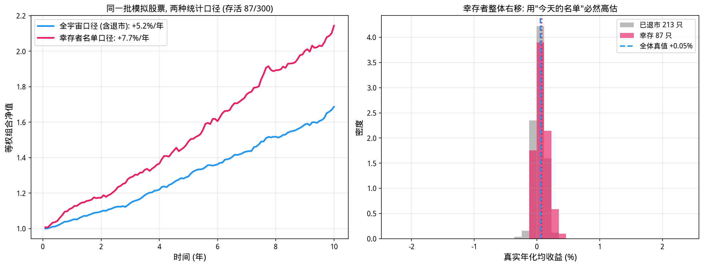
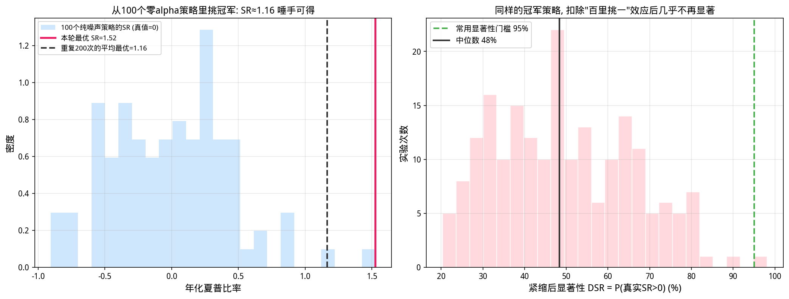
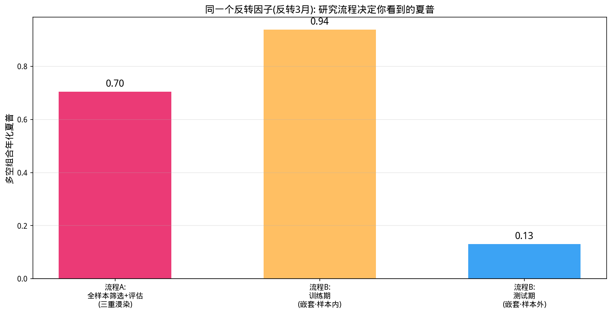

# 第30章 回测的科学——偏差分类学与诚实评估

> **动机先行**: 本章开篇不是理论, 而是一次刚刚发生的真实事故复盘——在写作本书的过程中, 我们审计了自己的数据集, 发现两个 CSV 文件的复权状态**完全相反**, 并顺藤摸瓜修复了茅台与宁德时代共 10 处隐形除息跳空。这个案例揭示了一个不舒服的事实: **回测最大的敌人不是数学, 而是数据与研究流程里那些看不见的假设**。本章系统性地整理这些"回测撒谎的方式", 并给出一套可操作的防御工事。
>
> **量化实战定位**: 业内流传一句话——"给我一条历史净值曲线, 我能给你编出十种它造假的解释"。学完本章你将拥有反向能力: 对任何一个回测结果 (包括自己的) 快速完成六项偏差体检, 并用紧缩夏普比率 (Deflated Sharpe Ratio) 给报告里的夏普打上应有的折扣。

---

## 30.1 开篇案例: 我们审计了自己的数据

第27-29章的全部实证都建立在两个 CSV 文件上。写作本书时我们产生了一个朴素的疑问: 这些价格到底复权了没有? 整个审计过程分三步, 每一步都是一个可复用的方法论零件。

**第一步: 涨跌停越界筛查 (找灾难级错误)。** A 股有涨跌停板, 主板单日涨跌幅不可能超过 ±10% (四舍五入误差内)、创业板/科创板不超过 ±20%。任何远超限幅的价格变动必然是未复权的除权跳空或数据错误。扫描结果: 102 个越界标记——但逐一核查后发现它们几乎全是**真实的涨停日** (尤其集中在 2024 年 9 月末的政策行情), 微小的越界量来自涨停价按分取整的效应。结论: 数据中不存在送转股级别的灾难性跳空。

**第二步: 高分红股票残差检验 (找隐蔽的除息缺口)。** 除息缺口只有 1%~6%, 会淹没在日常波动里, 第一步查不出来。换思路: 银行股股息率高达 4%~8%, 除息日的真实缺口清晰可辨。对工商银行与兴业银行在样本期内共 12 次除息事件逐日核对相对沪深300的超额收益——**12 次全部零缺口**, 说明 `stock_data_50` 是复权过的价格。

**第三步: 外部真值对照 (一锤定音)。** 同样的检验用在 `ifind_price_data` 的贵州茅台身上, 结果相反: 对照 akshare 拉取的真实除息记录, 5 次除息事件**全部出现与股息率匹配的负超额** (累计 −6.71%, 理论应有 −8.68%)。结论: 该文件是不复权价格。

**事故定级与修复**: 两个文件复权状态相反。`stock_data_50` 无恙, 第27-29章结论可靠; `ifind_price_data` 中茅台年化收益被系统性低估约 1.6 个百分点、宁德时代有 5 处跳空。已用 tushare 后复权数据替换并重新生成了第7-10章、第23-24章的全部受影响输出。

这个案例的三条元教训贯穿全章: (1) **没有外部真值的价格自检必然产生大量假阳性**——我们第一版检测器把真实涨停误报成"必为除权"; (2) **同一机构不同导出可以口径不同**——不能因为"用过没问题"就信任数据; (3) **审计方法本身是资产**——它将成为本章每一节的原型。

## 30.2 偏差动物园: 回测撒谎的六种方式

| # | 偏差 | 一句话描述 | 本章处理 |
|---|------|-----------|---------|
| 1 | 幸存者偏差 | 用"今天的名单"回溯历史, 死者缺席 | 30.3 蒙特卡洛实验 |
| 2 | 多重检验 | 试得越多, 越容易撞出假阳性 | 30.5 紧缩夏普比率 |
| 3 | 流程性泄漏 | 筛选、调参、评估反复用同一份数据 | 30.6 三重浸染对照 |
| 4 | 数据质量缺陷 | 复权、缺失、点位错误 | 30.1 开篇案例 |
| 5 | 前视偏差 | 决策时点用了当时不可能知道的信息 | 30.7 自查清单 |
| 6 | 可交易性假设 | 收盘价成交、无限流动性、忽略涨跌停/T+1 | 30.7 自查清单 |

它们有一个共同的狡猾之处: **单独看每一条, 回测都"逻辑自洽"**——代码没有 bug, 公式没有推导错, 只是前提悄悄错了。因此防御不能靠"检查代码", 而要靠一张体检表逐项过堂。

## 30.3 数据质量偏差: 除息缺口的注入-检测实验

30.1 节的第二步值得做成一个可复现的实验: 既然真实数据的除息缺口无法直接肉眼识别, 我们就**人为注入一个缺口, 再看检测器能否抓回来**。这既是检测器的单元测试, 也顺便量化了缺口对下游指标的污染程度。

```python
import numpy as np
import pandas as pd

df = pd.read_csv('data/stock_data_50_20210601_20260531.csv')
df['time'] = pd.to_datetime(df['time'])
px = df.pivot(index='time', columns='thscode', values='close').sort_index().ffill()
rets = px.pct_change().iloc[1:]
idf = pd.read_csv('data/index_data_7_20210601_20260531.csv')
idf['time'] = pd.to_datetime(idf['time'])
hs = idf[idf['thscode'] == '000300.SH'].set_index('time')['close'].sort_index()
mkt = hs.pct_change().reindex(rets.index)

np.random.seed(30)

r_mt = rets['600519.SH'].dropna()
idx_mt = r_mt.index
inject_pos = 380                      # 人为选一个大致位置
div_gap = -0.016                      # 模拟约1.6%的股息缺口

# 注入点选取: 对齐到指数交易日, 且前后一日的超额收益较平静
# (真实除息日通常如此; 若落在连续暴跌中, 检测器会被行情噪声淹没)
exc_raw = r_mt - mkt.reindex(idx_mt)
while True:
    if idx_mt[inject_pos] not in mkt.index:
        inject_pos += 1; continue
    i_ = exc_raw.index.get_loc(idx_mt[inject_pos])
    cur_e = exc_raw.iloc[i_]
    prev_e = exc_raw.iloc[i_-1] if i_ > 0 else 0.0
    nxt_e = exc_raw.iloc[i_+1] if i_ < len(exc_raw)-1 else 0.0
    if abs(cur_e) < 0.003 and prev_e > -0.005 and nxt_e > -0.005:
        break
    inject_pos += 1

r_inj = r_mt.copy()
r_inj.iloc[inject_pos] = r_inj.iloc[inject_pos] + div_gap

# 检测器: 超额收益(相对沪深300) < -1% 且前后一日无连续暴跌 => 候选除息日
excess = (r_inj - mkt.reindex(idx_mt)).dropna()
cands = []
for dt_, v_ in excess.items():
    i_ = excess.index.get_loc(dt_)
    prev = excess.iloc[i_-1] if i_ > 0 else 0.0
    nxt = excess.iloc[i_+1] if i_ < len(excess)-1 else 0.0
    if v_ < -0.01 and prev > v_/2 and nxt > v_/2:
        cands.append((dt_, v_))

inj_date = idx_mt[inject_pos]
exact_hit = any(d_ == inj_date for d_, _ in cands)
print("=== 注入-检测实验: 给后复权茅台人为制造一个除息缺口 ===")
print(f"注入日期: {inj_date.date()}, 缺口幅度 {div_gap*100:.1f}%")
print(f"检测器候选事件数: {len(cands)} (真实市场本就有暴跌日, 候选含大量假阳性)")
print(f"注入事件被精确检出: {'是' if exact_hit else '否'}")

# 缺口对动量的影响: 取缺口后约10个月的时点, 计算252日动量(窗口必跨越缺口)
p_clean = (1+r_mt).cumprod()
p_inj = (1+r_inj).cumprod()
mom_win = 252
pos = min(inject_pos + 200, len(r_mt)-1)
mom_clean = p_clean.iloc[pos]/p_clean.iloc[pos-mom_win] - 1
mom_inj = p_inj.iloc[pos]/p_inj.iloc[pos-mom_win] - 1
print(f"\n动量污染演示: 252日动量窗口跨越缺口时被低估 "
      f"{abs(mom_clean-mom_inj)*100:.2f} 个百分点")
```

**运行结果**:

```
=== 注入-检测实验: 给后复权茅台人为制造一个除息缺口 ===
注入日期: 2022-12-30, 缺口幅度 -1.6%
检测器候选事件数: 130 (真实市场本就有暴跌日, 候选含大量假阳性)
注入事件被精确检出: 是

动量污染演示: 252日动量窗口跨越缺口时被低估 1.77 个百分点
```

**观察**:

1. **注入即检出**: 在平静日期注入 −1.6% 缺口后, 检测器精确命中该日。方法有效性得到单元测试级的确认。
2. **130 个候选里绝大多数是假阳性**: 检测器只能给出"候选清单", 最终定性必须依靠外部真值 (如 30.1 节的分红记录)。**检测器负责缩小包围圈, 真值负责定罪**。
3. **污染量级触目惊心**: 一个 1.6% 的缺口让跨越它的 252 日动量直接低估 1.77 个百分点——而第27章实测的反转因子 IC 才 0.06 量级。**数据缺陷的量纲完全可以碾压信号本身**。

## 30.4 幸存者偏差: 看不见的死者

幸存者偏差的机制一句话就能说完: 差表现者更容易退市, 所以"活到今天的名单"天然是赢家名单; 用这份名单回溯历史, 哪怕策略纯属随机, 绩效也会虚高。难的是量化"虚高多少"。构造一个可控的模拟市场:

```python
import numpy as np

np.random.seed(300)

N, T = 300, 120                       # 300只股票, 120个月(10年)
mu_true = np.random.normal(0.004, 0.005, N)   # 真实月均收益: 均值0.4%, 截面离散
sd_true = np.random.uniform(0.04, 0.09, N)

alive = np.ones(N, dtype=bool)
nav = np.ones(N)
paths = np.zeros((T, N))

for t in range(T):
    r_t = mu_true + sd_true*np.random.standard_normal(N)
    nav *= (1+r_t)
    paths[t] = r_t
    # 退市机制: 小的基础退市率 + 深度回撤者加速退市 (逆向选择)
    peak = np.maximum.accumulate(nav)
    drawdown = nav/peak - 1
    hazard = np.where(drawdown < -0.55, 0.015, 0.0012)
    alive &= ~(np.random.rand(N) < hazard)

n_surv = int(alive.sum())
full_mean = paths.mean(axis=0)                    # 各股全期平均月收益
surv_mean = full_mean[alive].mean()*12
dead_mean = full_mean[~alive].mean()*12 if (~alive).sum() > 0 else np.nan
all_mean = full_mean.mean()*12

print("=== 幸存者偏差蒙特卡洛 (300只 x 10年, 差表现者更易退市) ===")
print(f"期末存活: {n_surv}/{N} 只")
print(f"真实全体年化均收益   = {all_mean*100:+.2f}%")
print(f"幸存者名单的全期均值 = {surv_mean*100:+.2f}%  <- 用'今天的名单'回溯会看到这个")
print(f"已退市股票的全期均值 = {dead_mean*100:+.2f}%")
print(f"幸存者偏差(名单视角 - 全体真值) = {(surv_mean-all_mean)*100:+.2f} 个百分点/年")

# 组合层面: 幸存者名单回测 vs 含退市的全宇宙回测
ew_surv_backtest = paths[:, alive].mean(axis=1)           # 用'今天的名单'回溯全程

# 全宇宙口径: 重放同一路径, 死者在死亡当月退出组合
alive_now = np.ones(N, dtype=bool)
ew_full = []
cum = np.cumprod(1+paths, axis=0)
for t in range(T):
    ew_full.append(paths[t][alive_now].mean())
    if t < T-1:
        peak_t = cum[:t+1].max(axis=0)
        dd_t = cum[t]/peak_t - 1
        hz = np.where(dd_t < -0.55, 0.015, 0.0012)
        alive_now = alive_now & ~(np.random.rand(N) < hz)
ew_full = np.array(ew_full)
ann_s = ew_surv_backtest.mean()*12
ann_f = ew_full.mean()*12
print(f"等权组合年化: 幸存者口径 {ann_s*100:+.2f}% vs 全宇宙口径 {ann_f*100:+.2f}% "
      f"(虚高 {(ann_s-ann_f)*100:+.2f} 个百分点)")

# 可视化
import matplotlib.pyplot as plt
plt.rcParams['font.sans-serif'] = ['WenQuanYi Micro Hei']
plt.rcParams['axes.unicode_minus'] = False

fig, axes = plt.subplots(1, 2, figsize=(14, 5.4))
ax = axes[0]
nav_surv = np.cumprod(1+paths[:, alive].mean(axis=1))
t_axis = np.arange(1, T+1)/12
ax.plot(t_axis, np.cumprod(1+ew_full), lw=2.4, color='#2196F3',
        label=f'全宇宙口径 (含退市): {ew_full.mean()*12*100:+.1f}%/年')
ax.plot(t_axis, nav_surv, lw=2.4, color='#E91E63',
        label=f"幸存者名单口径: {paths[:, alive].mean(axis=1).mean()*12*100:+.1f}%/年")
ax.set_xlabel('时间 (年)', fontsize=12)
ax.set_ylabel('等权组合净值', fontsize=12)
ax.set_title(f'同一批模拟股票, 两种统计口径 (存活 {n_surv}/{N})', fontsize=12)
ax.legend(fontsize=11)
ax.grid(True, alpha=0.3)

ax = axes[1]
bins = np.linspace(full_mean.min()*12-2, full_mean.max()*12+2, 40)
ax.hist(full_mean[~alive]*12, bins=bins, density=True, alpha=0.65,
        color='#999999', label=f'已退市 {int((~alive).sum())} 只')
ax.hist(full_mean[alive]*12, bins=bins, density=True, alpha=0.65,
        color='#E91E63', label=f'幸存 {int(alive.sum())} 只')
ax.axvline(all_mean*12, color='#2196F3', ls='--', lw=2,
           label=f'全体真值 {all_mean*12:+.2f}%')
ax.axvline(surv_mean*12, color='#E91E63', ls=':', lw=2)
ax.set_xlabel('真实年化均收益 (%)', fontsize=12)
ax.set_ylabel('密度', fontsize=12)
ax.set_title('幸存者整体右移: 用"今天的名单"必然高估', fontsize=12)
ax.legend(fontsize=10)
ax.grid(True, alpha=0.3)
plt.tight_layout()
plt.show()
```

**运行结果**:

```
=== 幸存者偏差蒙特卡洛 (300只 x 10年, 差表现者更易退市) ===
期末存活: 87/300 只
真实全体年化均收益   = +5.12%
幸存者名单的全期均值 = +7.68%  <- 用'今天的名单'回溯会看到这个
已退市股票的全期均值 = +4.08%
幸存者偏差(名单视角 - 全体真值) = +2.55 个百分点/年
等权组合年化: 幸存者口径 +7.68% vs 全宇宙口径 +5.25% (虚高 +2.43 个百分点)
```



**观察**:

1. **+2.43 个百分点/年的免费午餐**: 完全不改变任何一只股票的真实收益, 仅切换统计口径 (用今天的名单 vs 含退市的全宇宙), 年化收益就凭空多出 2.43 个百分点。
2. **逆向选择是放大器**: 退市并非随机——深亏者更易退市 (本章设定回撤超 55% 后加速退市), 因此死者的平均真实收益 (+4.08%) 显著低于幸存者 (+7.68%)。**名单视角等于把输家的成绩单从档案里抽走了**。
3. **回到我们的数据集**: `stock_data_50` 是 2026 年 5 月视角挑选的 50 只股票——严格说它就是一个幸存者名单。本书用它教授方法论尚可, 但读者应清楚: 任何基于它的绝对收益水平都带着这一层滤镜, 这也是真实研究必须采购含退市股票的全历史数据库的原因。

## 30.5 多重检验与紧缩夏普比率

第11章讲过多重检验的 Bonferroni 修正, 但那是对 p 值的粗调。绩效评估场景需要一个更贴身的工具: 你试了 $M$ 个策略, 报告其中夏普最高的那个——这个"冠军"的夏普有多虚?

先做实验再给公式。生成 100 个纯噪声策略 (真实夏普为零), 各有 5 年月度记录:

```python
import numpy as np
from scipy.stats import norm

np.random.seed(30)
M, T_yrs = 100, 5
T_m = T_yrs*12

srs = []
for m_ in range(M):
    r = np.random.normal(0.0, 0.04, T_m)          # 纯噪声: 真实SR=0
    srs.append(r.mean()/r.std()*np.sqrt(12))
srs = np.array(srs)

best_sr = srs.max()

def deflated_sharpe(sr_annual, T_m, M_trials, skew=0.0, kurt=3.0):
    """紧缩夏普比率 (Bailey & Lopez de Prado 2014): P(真实SR>0 | 选了M个中的最优)"""
    emc = 0.5772156649
    e = np.e
    sr = sr_annual/np.sqrt(12)                    # 转为月度SR
    # 单次试验SR估计量的方差 (含高阶矩修正)
    var_sr = (1 - skew*sr + (kurt-1)/4*sr**2)/T_m
    se_sr = np.sqrt(var_sr)
    # 零假设下 M 次试验最优SR的期望值 (极值理论近似)
    z1 = norm.ppf(1 - 1.0/M_trials)
    z2 = norm.ppf(1 - 1.0/(M_trials*e))
    sr0 = se_sr*((1-emc)*z1 + emc*z2)
    # PSR 公式给出 DSR
    denom = np.sqrt(max(1 - skew*sr + (kurt-1)/4*sr**2, 1e-8))
    dsr = norm.cdf((sr - sr0)*np.sqrt(T_m - 1)/denom)
    return sr0, dsr

sr0_exp, dsr_best = deflated_sharpe(best_sr, T_m, M)
print("=== 一百个纯噪声策略里挑最好的: 夏普有多虚? ===")
print(f"策略数 M={M}, 每个样本期 {T_yrs} 年 ({T_m}个月), 真实SR全部为0")
print(f"模拟SR(年化): 均值={srs.mean():+.3f}, 标准差={srs.std():.3f}, "
      f"最大={best_sr:.3f}, 最小={srs.min():+.3f}")
rep = 200
maxes = []
rng = np.random.default_rng(31)
for _ in range(rep):
    rr = rng.normal(0, 0.04, (M, T_m))
    maxes.append((rr.mean(axis=1)/rr.std(axis=1)*np.sqrt(12)).max())
print(f"重复{rep}次实验: 最优SR的均值 = {np.mean(maxes):.3f} "
      f"(即'百里挑一'的噪声策略平均能做出 SR≈{np.mean(maxes):.2f})")
print()
print(f"Deflated Sharpe 口径: 零假设下期望的最优月度SR = {sr0_exp:.4f} (年化约 {sr0_exp*np.sqrt(12):.2f})")
print(f"观测最优年化SR = {best_sr:.3f} -> 紧缩后 DSR = P(真实SR>0) = {dsr_best*100:.1f}%")
print("结论: 未紧缩时它看起来像明星策略; 紧缩后连'真实SR>0'都无法断言")

# 可视化
import matplotlib.pyplot as plt
plt.rcParams['font.sans-serif'] = ['WenQuanYi Micro Hei']
plt.rcParams['axes.unicode_minus'] = False

rng2 = np.random.default_rng(31)
rr_all = rng2.normal(0, 0.04, (200, M, T_m))
sr_all = (rr_all.mean(axis=2)/rr_all.std(axis=2)*np.sqrt(12))
best_each = sr_all.max(axis=1)

fig, axes = plt.subplots(1, 2, figsize=(14, 5.4))
ax = axes[0]
one = sr_all[0]
ax.hist(one, bins=24, alpha=0.7, color='#BBDEFB',
        label='100个纯噪声策略的SR (真值=0)')
ax.axvline(one.max(), color='#E91E63', ls='-', lw=2.5,
           label=f'本轮最优 SR={one.max():.2f}')
ax.axvline(best_each.mean(), color='#333333', ls='--', lw=2,
           label=f'重复200次的平均最优={best_each.mean():.2f}')
ax.set_xlabel('年化夏普比率', fontsize=12)
ax.set_ylabel('策略个数', fontsize=12)
ax.set_title('从100个零alpha策略里挑冠军: SR≈1.16 唾手可得', fontsize=12)
ax.legend(fontsize=9)
ax.grid(True, alpha=0.3)

ax = axes[1]
dsrs = []
for b_ in best_each:
    _, d_ = deflated_sharpe(b_, T_m, M)
    dsrs.append(d_*100)
dsrs = np.array(dsrs)
ax.hist(dsrs, bins=24, alpha=0.75, color='#FFCDD2', edgecolor='white')
ax.axvline(95, color='#4CAF50', ls='--', lw=2, label='常用显著性门槛 95%')
ax.axvline(np.median(dsrs), color='#333333', ls='-', lw=2,
           label=f'中位数 {np.median(dsrs):.0f}%')
ax.set_xlabel('紧缩后显著性 DSR = P(真实SR>0) (%)', fontsize=12)
ax.set_ylabel('实验次数', fontsize=12)
ax.set_title('同样的冠军策略, 扣除"百里挑一"效应后几乎不再显著', fontsize=12)
ax.legend(fontsize=10)
ax.grid(True, alpha=0.3)
plt.tight_layout()
plt.show()
```

**运行结果**:

```
=== 一百个纯噪声策略里挑最好的: 夏普有多虚? ===
策略数 M=100, 每个样本期 5 年 (60个月), 真实SR全部为0
模拟SR(年化): 均值=+0.046, 标准差=0.507, 最大=1.177, 最小=-1.130
重复200次实验: 最优SR的均值 = 1.163 (即'百里挑一'的噪声策略平均能做出 SR≈1.16)

Deflated Sharpe 口径: 零假设下期望的最优月度SR = 0.3360 (年化约 1.16)
观测最优年化SR = 1.177 -> 紧缩后 DSR = P(真实SR>0) = 51.1%
结论: 未紧缩时它看起来像明星策略; 紧缩后连'真实SR>0'都无法断言
```



**观察**:

1. **"百里挑一"的标价是 SR≈1.16**: 100 个零 alpha 策略中最幸运的那个, 年化夏普通常高达 1.16。如果你试了 100 组参数然后汇报最好的回测, 这就是你的起点——**还没赚一分钱, 先欠市场 1.16 个夏普**。
2. **紧缩公式的直觉**: DSR 回答"考虑到我试了 $M$ 次, 观测到的这个夏普还能让我确信真实夏普大于零吗"。它把基准从 0 抬高到"纯运气下的期望最优" $SR_0$, 再问观测值是否显著超过它。
3. **DSR=51% 的读法**: 冠军的观测 SR (1.177) 几乎恰好等于纯运气期望 (1.16), 于是"真实夏普>0"的后验概率只剩五五开。**这不是说策略一定没用, 而是说这份数据不足以证明它有用**。

## 30.6 流程性泄漏: 三重浸染案例

前两节的偏差发生在"数据层"和"统计层", 最隐蔽的一种发生在**研究流程层**。回顾第27章的流水线: 因子动物园筛选 -> Lasso 精选 (第28章) -> 分层回测评估。如果这三步都用**同一份全样本**数据, 就是三重浸染——每一步都在向后续步骤泄漏信息。

用真实数据对比正确与错误的流程:

```python
import numpy as np
import pandas as pd

df = pd.read_csv('data/stock_data_50_20210601_20260531.csv')
df['time'] = pd.to_datetime(df['time'])
px = df.pivot(index='time', columns='thscode', values='close').sort_index().ffill()
rets = px.pct_change().iloc[1:]

industry = df.groupby('thscode')['industry'].first()
ind_dummy = pd.get_dummies(industry.fillna('其他'), dtype=float)
size = df.pivot(index='time', columns='thscode', values='market_cap').sort_index().ffill()
s_idx = pd.Series(px.index)
mon_end = s_idx.groupby(pd.to_datetime(s_idx).dt.to_period('M')).max().values
pm = px.loc[mon_end]
sm_log = np.log(size.loc[mon_end])
ret_fwd = pm.pct_change().shift(-1)

def zscore_monthly(daily):
    return daily.loc[mon_end].apply(lambda s:(s-s.mean())/s.std(), axis=1)

def neutralize(z_raw):
    out = {}
    for dt in z_raw.index:
        y = z_raw.loc[dt].dropna()
        if len(y) < 30: continue
        X = pd.concat([sm_log.loc[dt].reindex(y.index).rename('l'),
                       ind_dummy.reindex(y.index).fillna(0)], axis=1)
        X['const'] = 1.0
        b,*_ = np.linalg.lstsq(X.values, y.values, rcond=None)
        out[dt] = pd.Series(y.values-X.values@b, index=y.index)
    return pd.DataFrame(out).T.sort_index()

def ls_sharpe(zn, months):
    q5, q1, dates = [], [], []
    for i in range(len(zn)-1):
        if zn.index[i] not in months:
            continue
        f = zn.iloc[i]; r = ret_fwd.loc[zn.index[i]].reindex(f.index)
        msk = f.notna()&r.notna()
        if msk.sum() < 20: continue
        order = f[msk].rank()
        lo5, hi5 = order.quantile([0.8, 1.0])
        lo1, hi1 = order.quantile([0.0, 0.2])
        q5.append(r[order[(order>=lo5)&(order<=hi5)].index].mean())
        q1.append(r[order[(order>=lo1)&(order<=hi1)].index].mean())
        dates.append(zn.index[i+1])
    ls = pd.Series(np.array(q5)-np.array(q1), index=pd.DatetimeIndex(dates))
    return ls.mean()/ls.std()*np.sqrt(12), len(ls)

cands = {
    '反转3月': -(px/px.shift(63)-1),
    '动量12-1': px.shift(21)/px.shift(252)-1,
    '低波动': -(px.pct_change().rolling(60).std()*np.sqrt(252)),
}
zn_dict = {k: neutralize(zscore_monthly(v)) for k, v in cands.items()}
all_months = set(zn_dict['反转3月'].index)

cut = sorted(all_months)[int(len(all_months)*0.7)]
train_months = [d for d in all_months if d < cut]
test_months = [d for d in all_months if d >= cut]

def ic_mean(zn, months):
    from scipy import stats as _st
    vals = []
    for i in range(len(zn)-1):
        if zn.index[i] not in months: continue
        f = zn.iloc[i]; r = ret_fwd.loc[zn.index[i]].reindex(f.index)
        msk = f.notna()&r.notna()
        if msk.sum() < 20: continue
        vals.append(_st.spearmanr(f[msk], r[msk])[0])
    return np.mean(vals)

# 路径A(错误): 全样本筛选 -> 全样本评估
ic_full = {k: ic_mean(v, all_months) for k, v in zn_dict.items()}
winner_A = max(ic_full, key=ic_full.get)
sharpe_A, nA = ls_sharpe(zn_dict[winner_A], all_months)

# 路径B(正确): 仅训练期筛选 -> 测试期评估同一因子
ic_train = {k: ic_mean(v, train_months) for k, v in zn_dict.items()}
winner_B = max(ic_train, key=ic_train.get)
sharpe_B_is, _ = ls_sharpe(zn_dict[winner_B], train_months)
sharpe_B_oos, nB = ls_sharpe(zn_dict[winner_B], test_months)

print("=== 同一份因子数据, 两种研究流程 ===")
print(f"月份切分: 训练 {min(train_months).date()} ~ {max(train_months).date()} "
      f"({len(train_months)}期) | 测试 {min(test_months).date()} ~ {max(test_months).date()} "
      f"({len(test_months)}期)")
print()
print(f"[流程A: 全样本筛选 -> 全样本评估]  (三重浸染)")
print(f"  全样本IC冠军 = {winner_A} (IC={ic_full[winner_A]:+.4f}), "
      f"多空夏普(IS) = {sharpe_A:.2f}")
print(f"[流程B: 训练期筛选 -> 测试期评估]  (嵌套验证)")
print(f"  训练期IC冠军 = {winner_B} (IC={ic_train[winner_B]:+.4f})")
print(f"  该因子训练期夏普 = {sharpe_B_is:.2f}, 测试期夏普 = {sharpe_B_oos:.2f} "
      f"(OOS衰减 {(sharpe_B_oos/sharpe_B_is-1)*100:+.0f}%)")
same = '相同' if winner_A == winner_B else '不同!'
print(f"  两流程选出的冠军: {same}; 流程A报告的夏普天然包含选择偏差")

# 可视化
import matplotlib.pyplot as plt
plt.rcParams['font.sans-serif'] = ['WenQuanYi Micro Hei']
plt.rcParams['axes.unicode_minus'] = False

fig, ax = plt.subplots(figsize=(11.5, 6))
labels = ['流程A:\n全样本筛选+评估\n(三重浸染)',
          '流程B:\n训练期\n(嵌套·样本内)',
          '流程B:\n测试期\n(嵌套·样本外)']
vals = [sharpe_A, sharpe_B_is, sharpe_B_oos]
cols = ['#E91E63', '#FFB74D', '#2196F3']
bars = ax.bar(labels, vals, width=0.55, color=cols, alpha=0.88)
for b_, v_ in zip(bars, vals):
    ax.text(b_.get_x()+b_.get_width()/2, v_+0.02, f'{v_:.2f}',
            ha='center', fontsize=13, fontweight='bold')
ax.axhline(0, color='black', lw=1)
ax.set_ylabel('多空组合年化夏普', fontsize=12)
ax.set_title(f'同一个反转因子({winner_B}): 研究流程决定你看到的夏普', fontsize=13)
ax.grid(True, alpha=0.3, axis='y')
plt.tight_layout()
plt.show()
```

**运行结果**:

```
=== 同一份因子数据, 两种研究流程 ===
月份切分: 训练 2021-08-31 ~ 2024-11-29 (40期) | 测试 2024-12-31 ~ 2026-05-29 (18期)

[流程A: 全样本筛选 -> 全样本评估]  (三重浸染)
  全样本IC冠军 = 反转3月 (IC=+0.0629), 多空夏普(IS) = 0.70
[流程B: 训练期筛选 -> 测试期评估]  (嵌套验证)
  训练期IC冠军 = 反转3月 (IC=+0.0700)
  该因子训练期夏普 = 0.94, 测试期夏普 = 0.13 (OOS衰减 -86%)
  两流程选出的冠军: 相同; 流程A报告的夏普天然包含选择偏差
```



**观察**:

1. **OOS 衰减 −86%**: 训练期夏普 0.94, 测试期只剩 0.13。这不是模型坏了, 而是**样本内的 0.94 本来就有一部分属于选择红利**——嵌套流程把它剥出来还给了真相。
2. **两流程冠军相同反而值得警惕**: 这次运气好, 全样本冠军与训练期冠军一致, 于是流程A的 0.70 恰好介于 0.94 与 0.13 之间。若两者不一致, 流程A会汇报一个从未在"未来"验证过的因子的全样本成绩——**数字好看与否不重要, 数字的可信结构才重要**。
3. **正确的流程结构只有一句话**: 把"做选择的所有环节" (筛因子、调参数、选模型) 锁进训练段, 把"报告的所有数字"留给测试段; 二者之间只允许单向穿越。

## 30.7 前视偏差与可交易性: 一张自查清单

前视偏差很少以"故意作弊"的形式出现, 它藏在时间戳的细节里。逐条自查:

| 检查项 | 典型踩坑 | 正确姿势 |
|--------|---------|---------|
| 报告期 ≠ 披露期 | 用年报数据做 3 月信号, 但年报 4 月才披露 | 所有基本面数据按**披露日**对齐 (point-in-time) |
| 决策与成交同价 | 用 $t$ 日收盘价算信号, 又按 $t$ 日收盘价成交 | 信号用 $t$ 收盘, 成交按 $t{+}1$ 价格 (或加滑点) |
| 涨跌停可成交 | 回测在涨停价买入、跌停价卖出 | 触板订单视为未成交或部分成交 |
| 停牌可交易 | `ffill` 后照常发出调仓 | 停牌期间冻结持仓, 复牌后才可交易 |
| T+1 制度 | 当日买入当日卖出 | A 股现货当日买入次日方可卖出 |
| 指数成分穿越 | 用当前成分股回测指数历史 | 使用历史时点的实际成分 (point-in-time universe) |

这张清单与 30.1 节的审计、30.3 节的注入实验合起来构成本书的立场: **数据质量的验证是一个工程流程, 而不是一个善意假设**。

## 30.8 核心公式速查

> 本节是前述各节公式的集中汇总, 供复习和查阅使用.

1. **幸存者偏差分解**: 全体均值 $\mu = p\,\mu_S + (1-p)\,\mu_D$ ($p$ 为存活比例); 名单视角的高估 $= (1-p)(\mu_S - \mu_D)$
2. **SR 估计量的方差**: $\mathrm{Var}(\widehat{SR}) \approx \dfrac{1 - \gamma_3 SR + \frac{\gamma_4-1}{4}SR^2}{T}$ ($\gamma_3$偏度, $\gamma_4$峰度)
3. **纯运气下的期望最优 SR**: $SR_0 = \hat{\sigma}_{SR}\left[(1-\gamma)\Phi^{-1}(1-\tfrac{1}{M}) + \gamma\Phi^{-1}(1-\tfrac{1}{Me})\right]$, 其中 $\gamma \approx 0.5772$
4. **紧缩夏普比率**: $DSR = \Phi\!\left(\dfrac{(SR - SR_0)\sqrt{T-1}}{\sqrt{1 - \gamma_3 SR + \frac{\gamma_4-1}{4}SR^2}}\right)$
5. **前视判据**: 时刻 $t$ 的决策只允许使用信息集 $\mathcal{I}_t$ (不含任何 $>t$ 的信息)
6. **嵌套原则**: 一切选择 (因子/参数/模型) 仅使用训练段; 测试段仅用于报告

## 30.9 本章小结

| 概念 | 核心要点 | 量化意义 |
|------|---------|---------|
| 数据审计三步法 | 越界筛查 -> 残差定位 -> 外部真值 | 数据质量验证的工程流程 |
| 幸存者偏差 | 名单视角天然高估 (示例 +2.4pp/年) | 回测宇宙必须含退市标的 |
| 百里挑一效应 | 100 个零alpha策略的最优 SR≈1.16 | 汇报前先扣选择红利 |
| Deflated Sharpe | 相对"运气基准"的显著性 | 给回测夏普打折的标准工具 |
| 三重浸染 | 筛选/调参/评估共用一份样本 | OOS 衰减 −86% 的现场教学 |
| 可交易性清单 | 时间戳/涨跌停/T+1/停牌 | 从"纸面收益"到"可实现收益" |

**最后一句话**: 本章没有教任何新模型, 却可能是全书最实用的一章。回测是一门测量科学——测量者的偏见决定了读数。**先假设回测在撒谎, 再逐条排除它在怎么撒谎**, 这是每个量化研究者对自己起码的诚实。

## 30.10 练习题

### 数学推导

**题1——幸存者偏差的分解验证**:

(a) 设存活比例 $p$, 幸存者真实均收益 $\mu_S$, 已退市者 $\mu_D$。证明全体真值 $\mu = p\mu_S + (1-p)\mu_D$, 从而名单视角的高估恰为 $(1-p)(\mu_S - \mu_D)$。

(b) 用本章蒙特卡洛的实测值 ($p = 87/300$, $\mu_S = 7.68\%$, $\mu_D = 4.08\%$) 代入, 检验是否复现 +2.55pp 的总偏差。

(c) 若把退市参数调得更温和 (存活比例升到 95%), 高估如何变化? 由此讨论"偏差大小"与"数据可见性"之间的反直觉关系 (提示: 偏差变小了, 但你也更难察觉它的存在)。

**题2——DSR 对试验次数的单调性**:

(a) 由 $SR_0$ 的表达式证明: 固定其他条件, 试验次数 $M$ 增大时 $\Phi^{-1}(1-\frac{1}{M})$ 单调增大, 故 $SR_0$ 增大、DSR 减小。

(b) 取单次试验 SR 标准误 $\hat{\sigma}_{SR} = 0.13$ (月度), 分别计算 $M = 10$ 与 $M = 10000$ 时的 $SR_0$ (年化), 并解释相差多少倍。

(c) 结合本章实验: 若某团队声称"我们只试了 10 个策略", 你需要向他们索要什么记录来核实?

**题3——涨停价取整的假阳性机制**:

(a) 主板涨停价为 $P_1 = \mathrm{round}(P_0 \times 1.1, 2)$ (四舍五入到分)。证明当 $P_0$ 足够小时, 表观涨幅 $P_1/P_0 - 1$ 可以严格大于 10%。

(b) 找出使表观涨幅达到最大的价格 $P_0^*$ (在一元人民币以内以分为步长枚举即可), 并给出最大表观涨幅。

(c) 用本章 `stock_data_50` 的数据验证: 所有"越界"标记的超额幅度是否都不超过 (b) 中理论上界, 从而确认它们均为取整效应而非数据错误。

### 编程实践

**题1——注入-检测实验的功效曲线**: 参考 30.3 节代码, 将注入-检测实验在不同随机日期重复 200 次, 对检测阈值 $\theta \in \{-1\%, -2\%, -3\%\}$ 分别统计"检出率"与"平均假阳性数/年"。画出检出率-假阳性的权衡曲线, 并回答: 若要求每年假阳性不超过 1 次, 最高能用的灵敏度是多少? 对应多大缺口的检出率仍在 80% 以上?

**题2——预注册实验**: 重跑第27章的因子动物园, 但给自己立规矩: 只允许使用 2021-06 ~ 2023-12 的数据进行筛选与设计, 并在纸上**预先写下**你选定的因子、权重方案与预期 IC 区间; 然后"封存", 用 2024-01 ~ 2026-05 的数据一次性完成评估。对比预注册报告与第27章的全样本报告, 列出所有超出预期的项目, 并判断哪些最可能属于数据窥探残余。

## 30.11 参考文献

1. Bailey, D. H., & López de Prado, M. (2014). "The Deflated Sharpe Ratio: Correcting for Selection Bias, Backtest Overfitting, and Non-Normality." *Journal of Portfolio Management*, 40(5), 94-107.（紧缩夏普比率的原始文献）

2. Harvey, C. R., Liu, Y., & Zhu, H. (2016). "...and the Cross-Section of Expected Returns." *Review of Financial Studies*, 29(1), 5-68.（对学术界多重检验的系统清点: 316 个已发表因子背后的 t 统计量门槛）

3. McLean, R. D., & Pontiff, J. (2016). "Does Academic Research Destroy Stock Return Predictability?" *Journal of Finance*, 71(1), 5-32.（因子发表后收益平均衰减约 32%——发表效应的实证度量）

4. López de Prado, M. (2018). *Advances in Financial Machine Learning*. Wiley.（第11-14章: 回测过拟合的概率化诊断与 CSCV/PBO 框架）
