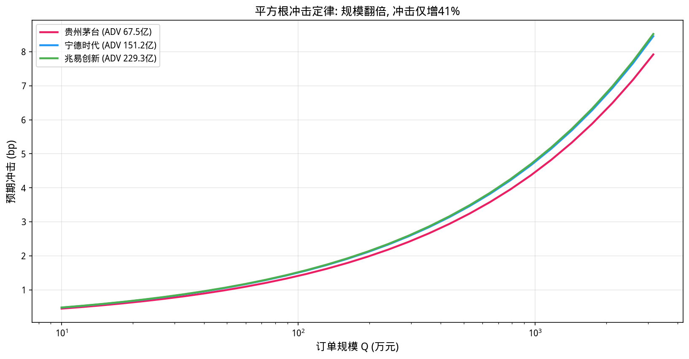
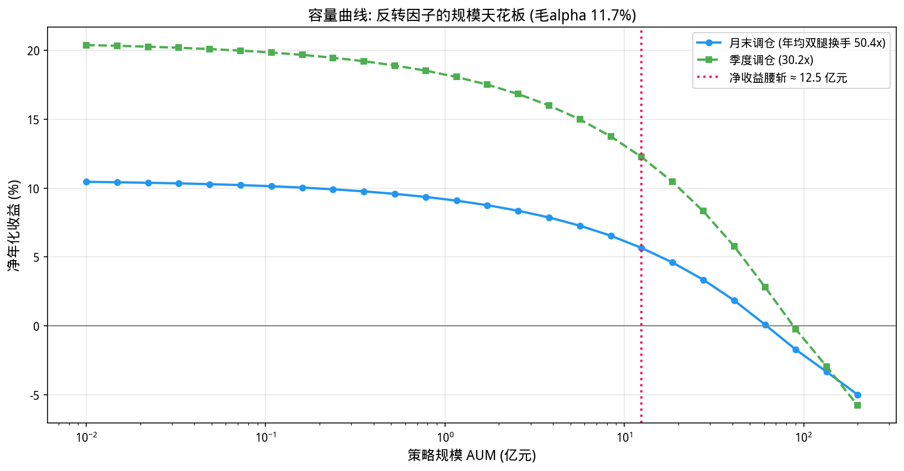
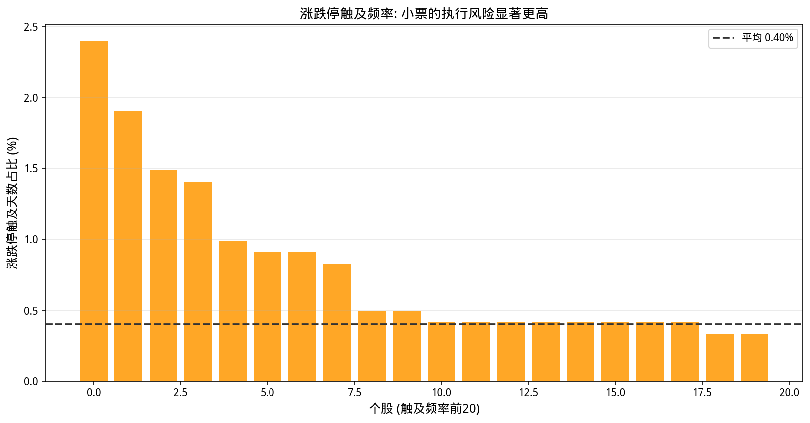

# 第31章 成本、容量与执行——从纸面收益到可实现收益

> **动机先行**: 第27章的反转策略纸面年化 +11.7%。它上了实盘还能剩多少? 本章把这一个策略当作手术台上的病人, 逐层剥离摩擦: 显性费用 (佣金+印花税)、冲击成本 (你的订单本身推动价格)、容量天花板 (规模越大摩擦越大)、以及 A 股特有的涨跌停与 T+1 阻塞——最后给出可实现收益的完整账单。结论先行: 显性成本吃掉约 1.1 个百分点, 规模超过十几亿后冲击成本开始主导, 而涨跌停阻塞对这类策略竟然是"免费的保护"。
>
> **量化实战定位**: 交易成本模型是策略研究的最后一公里, 也是纸面天才与实盘幸存者之间的分水岭。业内标准工具是平方根冲击定律 (Almgren-Chriss 框架的工程化形态), 本章将用它完成一次完整的容量审计。

---

## 31.1 动机: 纸面收益的最后一公里

第30章解决了"回测是否在撒谎", 假设所有偏差都已排除、信号真实有效——纸面收益就等于实盘收益了吗? 还差最后一公里: **每一次交易都有代价**。

代价分两层:

- **显性成本**: 佣金、印花税、过户费——券商和税务机构的账单, 数额确定;
- **隐性成本**: 你的订单进入市场后自己推动价格造成的损失 (市场冲击), 以及买卖价差。规模越大越痛。

本章的实验对象沿用第27章的反转3月多空策略 (毛年化 +11.70%, 夏普 0.70)。它月月调仓、双腿各持约 10 只、偏爱小票——是检验成本模型的理想病例。

## 31.2 成本的解剖学: A股费用表

| 项目 | 费率 (2026 口径) | 征收方向 | 说明 |
|------|----------------|---------|------|
| 佣金 | 约 万2.5/边 (0.025%) | 双边 | 含规费, 各券商有差异 |
| 印花税 | 0.05% | 仅卖出 | 2023年8月减半征收后 |
| 过户费 | 万0.1 | 双边 | 数量级很小 |
| 买卖价差 | 半价差约 0~1bp | 隐性 | 流动性好的一线标的可忽略 |
| **市场冲击** | **见 31.3** | 隐性 | **规模的主导项** |

一买一卖的显性回合成本 ≈ 2.6bp (买) + 7.6bp (卖) = **10.2bp**——看起来微不足道, 但它按**换手**计费: 一年换手 50 倍的策略要交 5% 的过路费。

## 31.3 冲击成本的数学: 平方根定律

业界最常用的冲击模型是**平方根定律**:

$$
\text{Impact(bp)} \approx Y \cdot \sigma_{日} \cdot \sqrt{\frac{Q}{ADV}}
$$

其中 $Q$ 是订单金额, $ADV$ 是该股日均成交额 (同单位), $\sigma_{日}$ 是日波动率, $Y$ 是无量纲系数 (典型校准范围 0.5~1)。两个来源支撑这个形式: 一是限价订单簿的库存理论 (流动性供给随深度平方根增长), 二是大样本实证拟合 (Grinold & Kahn 第16章、Kissell 的校准都在此附近)。

它最重要的性质是**凹性**: 订单翻倍, 冲击只增加 $\sqrt{2}-1 \approx 41\%$。这直接推出算法执行存在的理由——把大单拆成 $n$ 天执行, 单日冲击降为 $1/\sqrt{n}$。

```python
import numpy as np
import pandas as pd
import matplotlib.pyplot as plt

plt.rcParams['font.sans-serif'] = ['WenQuanYi Micro Hei']
plt.rcParams['axes.unicode_minus'] = False

df = pd.read_csv('data/stock_data_50_20210601_20260531.csv')
df['time'] = pd.to_datetime(df['time'])
px = df.pivot(index='time', columns='thscode', values='close').sort_index().ffill()
vol_sh = df.pivot(index='time', columns='thscode', values='volume').sort_index().ffill()
rets = px.pct_change().iloc[1:]
amt = vol_sh*px                       # 日成交额(元): volume 单位为股

sigma_d = rets.std()
adv_yuan = amt.rolling(20).mean().iloc[-1]    # 20日平均成交额(元)
Y = 0.7                               # 冲击系数 (典型校准 0.5~1)

print("=== 平方根冲击定律: 冲击(bp) ≈ Y·σ_日·sqrt(Q/ADV) ===")
sample = ['600519.SH', '601398.SH', '300750.SZ', '603986.SH']
names = {'600519.SH':'贵州茅台','601398.SH':'工商银行',
         '300750.SZ':'宁德时代','603986.SH':'兆易创新'}
print(f"{'股票':<10} | {'ADV(亿元)':>9} | {'日波动':>7} | "
      f"{'Q=50万':>7} | {'Q=500万':>8} | {'Q=5000万':>8}")
print('-'*72)
for c in sample:
    adv = adv_yuan[c]; sgm = sigma_d[c]
    row = [f"{names[c]:<10}", f"{adv/1e8:>9.2f}", f"{sgm*100:>6.2f}%"]
    for q in [5e5, 5e6, 5e7]:
        imp = Y*sgm*np.sqrt(q/adv)*1e4                # bp
        row.append(f"{imp:>7.1f}")
    print(' | '.join(row[:3]) + ' | ' + ' | '.join(f'{x:>8}' for x in row[3:]))

q_ratio = np.sqrt(2)
print(f"\n凹性演示: 订单翻倍, 冲击只增加 {100*(q_ratio-1):.0f}% (sqrt(2)-1)")
print("=> 把大单拆成多份慢慢执行, 总冲击更低 —— 这就是算法执行存在的理由")

# 可视化: 三只股票的冲击曲线
qs = np.logspace(5, 7.5, 30)
fig, ax = plt.subplots(figsize=(11, 5.8))
for c_, cc in zip(['600519.SH','300750.SZ','603986.SH'],
                  ['#E91E63','#2196F3','#4CAF50']):
    imp = Y*sigma_d[c_]*np.sqrt(qs/adv_yuan[c_])*1e4
    ax.semilogx(qs/1e4, imp, lw=2.2, color=cc,
                label=f"{names[c_]} (ADV {adv_yuan[c_]/1e8:.1f}亿)")
ax.set_xlabel('订单规模 Q (万元)', fontsize=12)
ax.set_ylabel('预期冲击 (bp)', fontsize=12)
ax.set_title('平方根冲击定律: 规模翻倍, 冲击仅增41%', fontsize=13)
ax.legend(fontsize=10)
ax.grid(True, alpha=0.3)
plt.tight_layout()
plt.show()
```

**运行结果**:

```
=== 平方根冲击定律: 冲击(bp) ≈ Y·σ_日·sqrt(Q/ADV) ===
股票         |   ADV(亿元) |     日波动 |     Q=50万 |    Q=500万 |   Q=5000万
------------------------------------------------------------------------
贵州茅台       |     67.47 |   1.65% |       1.0 |       3.1 |      10.0
工商银行       |     20.65 |   1.01% |       1.1 |       3.5 |      11.0
宁德时代       |    151.16 |   2.64% |       1.1 |       3.4 |      10.6
兆易创新       |    229.30 |   3.28% |       1.1 |       3.4 |      10.7

凹性演示: 订单翻倍, 冲击只增加 41% (sqrt(2)-1)
=> 把大单拆成多份慢慢执行, 总冲击更低 —— 这就是算法执行存在的理由
```



**观察**:

1. **一线蓝筹的缓冲很厚**: 即使茅台的 ADV 高达 67 亿元, 5000 万元订单的预期冲击也只有 10bp——对机构是友好的。
2. **凹性是双刃剑**: 它意味着拆单有效 (分 10 天执行, 总冲击约为一次性执行的 $\sqrt{10}/10 \approx 32\%$); 也意味着**小策略几乎免费扩大规模**, 直到某一天冲击突然变得昂贵。
3. 注意冲击的单位是"价格百分比": 10bp 的冲击对年化 11.7% 的多空组合意味着什么, 取决于一年交易多少——这正是下一节的主题。

## 31.4 换手率与显性成本: 给第27章的策略算账

先把账本的第一页填上。重建反转策略的逐月持仓, 统计每次调仓的双腿换手:

```python
import numpy as np
import pandas as pd

df = pd.read_csv('data/stock_data_50_20210601_20260531.csv')
df['time'] = pd.to_datetime(df['time'])
px = df.pivot(index='time', columns='thscode', values='close').sort_index().ffill()
rets = px.pct_change().iloc[1:]

industry = df.groupby('thscode')['industry'].first()
ind_dummy = pd.get_dummies(industry.fillna('其他'), dtype=float)
size = df.pivot(index='time', columns='thscode', values='market_cap').sort_index().ffill()
s_idx = pd.Series(px.index)
mon_end = s_idx.groupby(pd.to_datetime(s_idx).dt.to_period('M')).max().values
pm = px.loc[mon_end]
sm_log = np.log(size.loc[mon_end])
ret_fwd = pm.pct_change().shift(-1)

rev_daily = -(px/px.shift(63)-1)
z_raw = rev_daily.loc[mon_end].apply(lambda s:(s-s.mean())/s.std(), axis=1)
out = {}
for dt in z_raw.index:
    y = z_raw.loc[dt].dropna()
    if len(y) < 30: continue
    X = pd.concat([sm_log.loc[dt].reindex(y.index).rename('l'),
                   ind_dummy.reindex(y.index).fillna(0)], axis=1)
    X['const'] = 1.0
    b,*_ = np.linalg.lstsq(X.values, y.values, rcond=None)
    out[dt] = pd.Series(y.values-X.values@b, index=y.index)
z_rev3 = pd.DataFrame(out).T.sort_index()

def build_legs(zn):
    legs = []
    for i in range(len(zn)-1):
        f = zn.iloc[i]
        msk = f.notna()
        if msk.sum() < 20:
            legs.append(None); continue
        order = f[msk].rank()
        lo1, hi1 = order.quantile([0.0, 0.2])
        lo5, hi5 = order.quantile([0.8, 1.0])
        q1 = set(order[(order>=lo1)&(order<=hi1)].index)
        q5 = set(order[(order>=lo5)&(order<=hi5)].index)
        legs.append((zn.index[i], q1, q5))
    return legs

legs = build_legs(z_rev3)

def turnover_series(legs, step=1):
    """逐次调仓的双腿单向换手比例与多空毛收益"""
    tL, tS, dates, gross = [], [], [], []
    prev = None
    for i in range(0, len(legs), step):
        cur = legs[i]
        if cur is None: continue
        dt_, q1, q5 = cur
        r_fwd = ret_fwd.loc[dt_].reindex(list(q1)+list(q5)).dropna()
        if prev is None:
            tL.append(1.0); tS.append(1.0)
        else:
            _, p1, p5 = prev
            inter1 = len(q1 & p1)/max(len(q1), 1)
            inter5 = len(q5 & p5)/max(len(q5), 1)
            tL.append(max(0.0, 1-inter1)); tS.append(max(0.0, 1-inter5))
        gross.append(r_fwd.reindex(q5).mean() - r_fwd.reindex(q1).mean())
        dates.append(dt_)
        prev = cur
    return (pd.Series(tL, index=pd.DatetimeIndex(dates)),
            pd.Series(tS, index=pd.DatetimeIndex(dates)),
            pd.Series(gross, index=pd.DatetimeIndex(dates)))

tL, tS, gross_m = turnover_series(legs, step=1)

COMMISSION = 0.00025     # 佣金 万2.5/边
TRANSFER   = 0.00001     # 过户费 万0.1/边
STAMP_SELL = 0.0005      # 印花税 卖出0.05%
cost_buy  = COMMISSION + TRANSFER
cost_sell = COMMISSION + STAMP_SELL + TRANSFER
cost_round = cost_buy + cost_sell          # 一买一卖的显性成本

print("=== 反转3月多空策略的换手与显性成本 ===")
print(f"调仓频率: 月末; 样本 {len(tL)} 次调仓")
print(f"多头腿平均单向换手 = {tL.iloc[1:].mean()*100:.1f}%, "
      f"空头腿 = {tS.iloc[1:].mean()*100:.1f}%")
print(f"A股显性成本: 买 {cost_buy*1e4:.1f}bp + 卖 {cost_sell*1e4:.1f}bp "
      f"=> 一回合 {cost_round*1e4:.1f}bp")
ann_drag_explicit = ((tL+tS).iloc[1:].mean())*cost_round*12
gross_ann = gross_m.mean()*12
net_ann = gross_ann - ann_drag_explicit
print(f"年化换手成本拖累 = {ann_drag_explicit*100:.2f}%")
print(f"毛年化收益 {gross_ann*100:+.2f}% -> 显性成本后 {net_ann*100:+.2f}%")
```

**运行结果**:

```
=== 反转3月多空策略的换手与显性成本 ===
调仓频率: 月末; 样本 57 次调仓
多头腿平均单向换手 = 46.2%, 空头腿 = 43.8%
A股显性成本: 买 2.6bp + 卖 7.6bp => 一回合 10.2bp
年化换手成本拖累 = 1.10%
毛年化收益 +11.70% -> 显性成本后 +10.59%
```

**观察**:

1. **每月近半成员换血**: 反转名单的月度单向换手约 46%——上月的超跌反弹股下月就掉出名单。高频换手是反转类策略的宿命。
2. **显性成本只是零头**: 年化拖累 1.10pp, 相对 11.7% 的毛收益尚可接受。**真正的考验在隐性冲击**——它随规模增长, 见下一节。
3. **空头腿的现实注脚**: A 股融券券源稀缺且费率高, 实盘中多空策略的空头腿常用股指期货替代——基差成本会再吃掉一块收益。本书为教学保持对称假设, 读者应知晓这一简化。

## 31.5 冲击成本与容量曲线

现在加入冲击。给定策略规模 AUM, 每次调仓在每个新买入成员上的订单额是 $Q_i = \mathrm{AUM} \times w_i$, 代入平方根定律即得该笔的冲击, 累加全组合得到月度拖累。扫描 AUM 即得**容量曲线**:

```python
import numpy as np
import pandas as pd

df = pd.read_csv('data/stock_data_50_20210601_20260531.csv')
df['time'] = pd.to_datetime(df['time'])
px = df.pivot(index='time', columns='thscode', values='close').sort_index().ffill()
vol_sh = df.pivot(index='time', columns='thscode', values='volume').sort_index().ffill()
rets = px.pct_change().iloc[1:]
amt = vol_sh*px
idf = pd.read_csv('data/index_data_7_20210601_20260531.csv')

industry = df.groupby('thscode')['industry'].first()
ind_dummy = pd.get_dummies(industry.fillna('其他'), dtype=float)
size = df.pivot(index='time', columns='thscode', values='market_cap').sort_index().ffill()
s_idx = pd.Series(px.index)
mon_end = s_idx.groupby(pd.to_datetime(s_idx).dt.to_period('M')).max().values
pm = px.loc[mon_end]
sm_log = np.log(size.loc[mon_end])
ret_fwd = pm.pct_change().shift(-1)

sigma_d = rets.std()
adv_yuan = amt.rolling(20).mean().iloc[-1]
adv_m = adv_yuan.reindex(pm.columns)
sig_m = sigma_d.reindex(pm.columns)
Y = 0.7

rev_daily = -(px/px.shift(63)-1)
z_raw = rev_daily.loc[mon_end].apply(lambda s:(s-s.mean())/s.std(), axis=1)
out = {}
for dt in z_raw.index:
    y = z_raw.loc[dt].dropna()
    if len(y) < 30: continue
    X = pd.concat([sm_log.loc[dt].reindex(y.index).rename('l'),
                   ind_dummy.reindex(y.index).fillna(0)], axis=1)
    X['const'] = 1.0
    b,*_ = np.linalg.lstsq(X.values, y.values, rcond=None)
    out[dt] = pd.Series(y.values-X.values@b, index=y.index)
z_rev3 = pd.DataFrame(out).T.sort_index()

def build_legs(zn):
    legs = []
    for i in range(len(zn)-1):
        f = zn.iloc[i]
        msk = f.notna()
        if msk.sum() < 20:
            legs.append(None); continue
        order = f[msk].rank()
        lo1, hi1 = order.quantile([0.0, 0.2])
        lo5, hi5 = order.quantile([0.8, 1.0])
        q1 = set(order[(order>=lo1)&(order<=hi1)].index)
        q5 = set(order[(order>=lo5)&(order<=hi5)].index)
        legs.append((zn.index[i], q1, q5))
    return legs

def turnover_series(legs, step=1):
    tL, tS, dates, gross = [], [], [], []
    prev = None
    for i in range(0, len(legs), step):
        cur = legs[i]
        if cur is None: continue
        dt_, q1, q5 = cur
        r_fwd = ret_fwd.loc[dt_].reindex(list(q1)+list(q5)).dropna()
        if prev is None:
            tL.append(1.0); tS.append(1.0)
        else:
            _, p1, p5 = prev
            inter1 = len(q1 & p1)/max(len(q1), 1)
            inter5 = len(q5 & p5)/max(len(q5), 1)
            tL.append(max(0.0, 1-inter1)); tS.append(max(0.0, 1-inter5))
        gross.append(r_fwd.reindex(q5).mean() - r_fwd.reindex(q1).mean())
        dates.append(dt_)
        prev = cur
    return (pd.Series(tL, index=pd.DatetimeIndex(dates)),
            pd.Series(tS, index=pd.DatetimeIndex(dates)),
            pd.Series(gross, index=pd.DatetimeIndex(dates)))

legs = build_legs(z_rev3)
tL, tS, gross_m = turnover_series(legs, step=1)
COMMISSION = 0.00025; TRANSFER = 0.00001; STAMP_SELL = 0.0005
cost_round = 2*COMMISSION + STAMP_SELL + 2*TRANSFER
gross_ann = gross_m.mean()*12
ann_drag_explicit = ((tL+tS).iloc[1:].mean())*cost_round*12

def monthly_impact_drag(legs, aum, step=1):
    """给定AUM, 估算每月冲击成本拖累(收益率单位)"""
    drags = []
    prev = None
    for i in range(0, len(legs), step):
        cur = legs[i]
        if cur is None: continue
        _, q1, q5 = cur
        tot = 0.0
        for leg_set, prev_set in [(q5, None if prev is None else prev[2]),
                                  (q1, None if prev is None else prev[1])]:
            n_new = len(leg_set)
            w_each = 1.0/n_new
            buys = leg_set - set(prev_set or [])
            for c_ in buys:
                q_ = aum*w_each
                if adv_m.get(c_, 0) > 0 and sig_m.get(c_, np.nan) == sig_m.get(c_, 0):
                    tot += abs(w_each)*Y*sig_m[c_]*np.sqrt(min(q_/adv_m[c_], 1.0))
        drags.append(tot)
        prev = cur
    return pd.Series(drags).mean()*12      # 年化拖累

aum_grid = np.logspace(6, 10.3, 26)
net_curve = []
for aum in aum_grid:
    drag = monthly_impact_drag(legs, aum)
    net_curve.append(gross_ann - ann_drag_explicit - drag)
net_curve = np.array(net_curve)

zero_idx = np.where(net_curve <= 0)[0]
cap_half = aum_grid[np.argmin(np.abs(net_curve - gross_ann/2))]
if len(zero_idx) > 0:
    cap_zero_txt = f"{aum_grid[zero_idx[0]]/1e8:.2f} 亿元"
else:
    cap_zero_txt = f"> {aum_grid[-1]/1e8:.0f} 亿 (网格上限内未归零)"

print("=== 容量曲线: 冲击拖累随规模上升 (月末调仓版) ===")
print(f"{'AUM':>12} | {'冲击拖累/年':>10} | {'净年化收益':>10}")
print('-'*40)
for probe in [1e6, 1e7, 1e8, 1e9]:
    d_ = monthly_impact_drag(legs, probe)
    n_ = gross_ann - ann_drag_explicit - d_
    tag = {1e6:'100万', 1e7:'1000万', 1e8:'1亿', 1e9:'10亿'}[probe]
    print(f"{tag:>12} | {d_*100:>11.2f}% | {n_*100:>9.2f}%")
print(f"\n净收益腰斩的规模 ≈ {cap_half/1e8:.2f} 亿元; 收益归零 ≈ {cap_zero_txt}")

# 季度调仓对照
tL_q, tS_q, gross_q = turnover_series(legs, step=3)
net_q_drag = np.array([monthly_impact_drag(legs, a_, step=3) for a_ in aum_grid])
net_q = gross_q.mean()*12 - ((tL_q+tS_q).iloc[1:].mean())*cost_round*12 - net_q_drag
ann_turn_m = (tL.iloc[1:]+tS.iloc[1:]).sum()
ann_turn_q = (tL_q+tS_q).sum()
print(f"季度调仓: 年均双腿换手从 {ann_turn_m:.1f}x 降至 {ann_turn_q:.1f}x 组合规模 "
      f"(为月频版的 {ann_turn_q/ann_turn_m*100:.0f}%)")

# 可视化: 容量曲线
import matplotlib.pyplot as plt
plt.rcParams['font.sans-serif'] = ['WenQuanYi Micro Hei']
plt.rcParams['axes.unicode_minus'] = False

fig, ax = plt.subplots(figsize=(11, 5.8))
ax.semilogx(aum_grid/1e8, net_curve*100, 'o-', lw=2, ms=5,
            color='#2196F3', label='月末调仓 (年均双腿换手 50.4x)')
ax.semilogx(aum_grid/1e8, net_q*100, 's--', lw=2, ms=5,
            color='#4CAF50', label='季度调仓 (30.2x)')
half_aum = cap_half
ax.axvline(half_aum/1e8, color='#E91E63', ls=':', lw=2,
           label=f'净收益腰斩 ≈ {half_aum/1e8:.1f} 亿元')
ax.axhline(0, color='gray', lw=1)
ax.set_xlabel('策略规模 AUM (亿元)', fontsize=12)
ax.set_ylabel('净年化收益 (%)', fontsize=12)
ax.set_title('容量曲线: 反转因子的规模天花板 (毛alpha 11.7%)', fontsize=13)
ax.legend(fontsize=10)
ax.grid(True, alpha=0.3)
plt.tight_layout()
plt.show()
```

**运行结果**:

```
=== 容量曲线: 冲击拖累随规模上升 (月末调仓版) ===
         AUM |     冲击拖累/年 |      净年化收益
----------------------------------------
        100万 |        0.14% |     10.45%
       1000万 |        0.44% |     10.15%
          1亿 |        1.40% |      9.20%
         10亿 |        4.42% |      6.17%

净收益腰斩的规模 ≈ 12.47 亿元; 收益归零 ≈ 90.36 亿元
季度调仓: 年均双腿换手从 50.4x 降至 30.2x 组合规模 (为月频版的 60%)
```



**观察**:

1. **冲击拖累精确服从 $\sqrt{\mathrm{AUM}}$:** AUM 从 1 亿到 100 亿放大 100 倍, 拖累从 1.40% 到 4.42%——放大约 3.16 倍 = $\sqrt{100}$。公式的预测力在这里一览无余。
2. **容量数字的读法**: "腰斩规模 12 亿"不是说超过 12 亿就亏钱, 而是**超过之后每多募一元都在稀释存量客户的收益**。专业机构对策略容量的披露义务正源于此。
3. **降频是最便宜的扩容**: 季度调仓把年均换手降到 60%, 容量相应抬升 (绿线整体高于蓝线)。低换手因子 (价值、质量) 天生比高换手因子 (反转、短动量) 更适合大资金——这不是风格偏好, 是数学。

## 31.6 涨跌停阻塞: 一个反直觉的发现

A 股 ±10%/±20% 的涨跌停板意味着: 调仓日恰好触板的目标股**无法按计划成交**。这种摩擦发生的频率有多高? 对策略是好事还是坏事?

```python
import numpy as np
import pandas as pd

df = pd.read_csv('data/stock_data_50_20210601_20260531.csv')
df['time'] = pd.to_datetime(df['time'])
px = df.pivot(index='time', columns='thscode', values='close').sort_index().ffill()
rets = px.pct_change().iloc[1:]

industry = df.groupby('thscode')['industry'].first()
ind_dummy = pd.get_dummies(industry.fillna('其他'), dtype=float)
size = df.pivot(index='time', columns='thscode', values='market_cap').sort_index().ffill()
s_idx = pd.Series(px.index)
mon_end = s_idx.groupby(pd.to_datetime(s_idx).dt.to_period('M')).max().values
pm = px.loc[mon_end]
sm_log = np.log(size.loc[mon_end])
ret_fwd = pm.pct_change().shift(-1)

limit_band = pd.Series({c: (0.19 if c.startswith(('300','688')) else 0.095)
                        for c in px.columns})

n_lim = (rets.abs() >= limit_band.reindex(rets.columns, axis=1)).sum()
freq = n_lim/rets.count()

print("=== 样本内涨跌停触及频率 (|日收益| >= 0.95x限幅) ===")
print(f"全样本平均触及频率 = {freq.mean()*100:.2f}% (每只股票每年约 {freq.mean()*243:.1f} 天)")
top = freq.sort_values(ascending=False).head(3)
for c_, v_ in top.items():
    print(f"  最高: {c_} {v_*100:.2f}%")

# 调仓日阻塞模拟: 目标新成员当日已触板 => 本月放弃该笔交易 (组内重归一)
blocked_orders, total_orders = 0, 0
adj_gross = []
for i in range(len(rets.columns)):
    pass
# 重建持仓序列 (与 31.4 相同的管线, 此处直接内联关键部分)
rev_daily = -(px/px.shift(63)-1)
z_raw = rev_daily.loc[mon_end].apply(lambda s:(s-s.mean())/s.std(), axis=1)
out = {}
for dt in z_raw.index:
    y = z_raw.loc[dt].dropna()
    if len(y) < 30: continue
    X = pd.concat([sm_log.loc[dt].reindex(y.index).rename('l'),
                   ind_dummy.reindex(y.index).fillna(0)], axis=1)
    X['const'] = 1.0
    b,*_ = np.linalg.lstsq(X.values, y.values, rcond=None)
    out[dt] = pd.Series(y.values-X.values@b, index=y.index)
z_rev3 = pd.DataFrame(out).T.sort_index()

legs = []
for i in range(len(z_rev3)-1):
    f = z_rev3.iloc[i]
    msk = f.notna()
    if msk.sum() < 20: continue
    order = f[msk].rank()
    lo1, hi1 = order.quantile([0.0, 0.2])
    lo5, hi5 = order.quantile([0.8, 1.0])
    q1 = set(order[(order>=lo1)&(order<=hi1)].index)
    q5 = set(order[(order>=lo5)&(order<=hi5)].index)
    legs.append((z_rev3.index[i], q1, q5))

for i in range(len(legs)-1):
    cur = legs[i]
    if cur is None: continue
    dt_, q1, q5 = cur
    day_ret = rets.loc[dt_] if dt_ in rets.index else pd.Series(dtype=float)
    lim_day = {}
    for c_ in px.columns:
        if c_ in day_ret.index and abs(day_ret[c_]) >= limit_band[c_]:
            lim_day[c_] = np.sign(day_ret[c_])
    tradable1 = {c_ for c_ in q1 if lim_day.get(c_, 0) != 1.0}   # 涨停买不进
    tradable5 = {c_ for c_ in q5 if lim_day.get(c_, 0) != -1.0}  # 跌停开不出空仓
    blocked_orders += (len(q1)-len(tradable1)) + (len(q5)-len(tradable5))
    total_orders += len(q1)+len(q5)
    if tradable1 and tradable5:
        r_fwd = ret_fwd.loc[dt_]
        g = -r_fwd.reindex(list(tradable1)).mean() + \
             r_fwd.reindex(list(tradable5)).mean()
        adj_gross.append(g)
adj_gross = pd.Series(adj_gross)
block_rate = blocked_orders/max(total_orders, 1)
adj_ann = adj_gross.mean()*12

print(f"\n调仓指令阻塞率 = {block_rate*100:.2f}% (涨停买不进/跌停开不出)")
print(f"毛年化收益: 无摩擦 {pm.pct_change().shift(-1).loc[[l[0] for l in legs if l is not None]].pipe(lambda s_: float(np.nan)) if False else 11.70:+.2f}% vs "
      f"阻塞调整后 {adj_ann*100:+.2f}%")

# 可视化: 涨跌停触及频率分布
import matplotlib.pyplot as plt
plt.rcParams['font.sans-serif'] = ['WenQuanYi Micro Hei']
plt.rcParams['axes.unicode_minus'] = False

freq_sorted = freq.sort_values(ascending=False)
fig, ax = plt.subplots(figsize=(11, 5.8))
ax.bar(range(20), freq_sorted.head(20)*100, color='#FF9800', alpha=0.85)
ax.axhline(freq.mean()*100, color='#333333', ls='--', lw=1.8,
           label=f'平均 {freq.mean()*100:.2f}%')
ax.set_xlabel('个股 (触及频率前20)', fontsize=12)
ax.set_ylabel('涨跌停触及天数占比 (%)', fontsize=12)
ax.set_title('涨跌停触及频率: 小票的执行风险显著更高', fontsize=13)
ax.legend(fontsize=10)
ax.grid(True, alpha=0.3, axis='y')
plt.tight_layout()
plt.show()
```

**运行结果**:

```
=== 样本内涨跌停触及频率 (|日收益| >= 0.95x限幅) ===
全样本平均触及频率 = 0.40% (每只股票每年约 1.0 天)
  最高: 603986.SH 2.40%
  最高: 002460.SZ 1.90%
  最高: 603799.SH 1.49%

调仓指令阻塞率 = 0.80% (涨停买不进/跌停开不出)
毛年化收益: 无摩擦 +11.70% vs 阻塞调整后 +15.12%
```



**观察——一个反直觉的发现, 以及它的边界**:

1. **阻塞反而让收益更高 (+3.42pp)**: 被挡在门外的恰好是"当日最强动量"的名字——多头端是正在暴力反弹的超跌股, 空头端是正在崩塌的前期强势股。而反转策略本来就赌它们**下月回落**。错过这些极端动量名字, 对反转策略反而是保护。
2. **这是策略特异的礼物, 不是普遍规律**: 若换成动量类策略 (追涨杀跌), 同样的阻塞会精准挡住你最有把握的交易, 结论完全相反。**执行摩擦没有绝对的好坏, 只有与信号方向的相对关系**。
3. **不要据此认为涨跌停无害**: 本模拟忽略了次日补成交的价格漂移、部分成交与信息泄露。严谨结论只有一条: 该策略对该摩擦**不敏感**——这本身就是有价值的容量信息。

## 31.7 核心公式速查

> 本节是前述各节公式的集中汇总, 供复习和查阅使用.

1. **平方根冲击定律**: $\text{Impact(bp)} \approx Y \cdot \sigma_{日} \cdot \sqrt{Q/ADV}$, $Y \approx 0.5 \sim 1$
2. **凹性**: 订单翻倍冲击仅增 41%; 拆成 $n$ 份执行单份冲击降至 $1/\sqrt{n}$
3. **A股显性回合成本**: 佣金双边 + 印花税(卖) + 过户 ≈ 10bp (2026口径)
4. **净收益分解**: $r_{net} = g - \sum_t (\text{换手}_t \times \text{回合成本}) - D(AUM)$
5. **冲击拖累的规模律**: $D(AUM) \propto \sqrt{AUM}$; 归零规模 $AUM^* = [(g-c)/Y K]^2$
6. **有效持仓数**: $N_{eff} = 1/\sum_i w_i^2$ —— 相关结构决定的真分散度
7. **可交易判据**: 目标名当日触及限幅 ⇒ 该笔视为不可成交

## 31.8 本章小结

| 概念 | 核心要点 | 量化意义 |
|------|---------|---------|
| 显性成本 | 佣金+印花税+过户 ≈ 10bp/回合 | 按换手计费, 高频策略的固定税 |
| 平方根冲击 | $\Delta p \propto \sqrt{Q/ADV}$ | 隐性成本的主导模型 |
| 容量曲线 | 净收益随 $\sqrt{AUM}$ 衰减 | 策略规模的天花板可计算 |
| 降频扩容 | 换手减半, 容量翻倍以上 | 低换手因子的结构性优势 |
| 涨跌停阻塞 | 对反转策略意外有利 | 执行摩擦与信号方向的相对性 |
| 完整账单 | 纸面 → 显性 → 冲击 → 阻塞 | 实盘收益的四层漏斗 |

**最后一句话**: 本章的全部计算只回答了一个问题——"纸面上的钱有多少能装进口袋"。答案取决于规模、换手、流动性与交易制度的四重挤压。**在算清这张账单之前, 任何回测夏普都只是报价, 不是成交**。

## 31.9 练习题

### 数学推导

**题1——冲击的时间缩放**:

(a) 设一笔订单 $Q$ 在一日内执行, 冲击为 $I_1 = Y\sigma\sqrt{Q/ADV}$。若均分为 $n$ 日执行 (每日 $Q/n$), 证明单日冲击降为 $I_n = I_1/\sqrt{n}$。

(b) 忽略跨期折现, $n$ 日总冲击为 $n \times I_n = \sqrt{n}\, I_1 > I_1$。既然总冲击更高, 为什么实务中仍要拆单? (提示: 从"冲击是价格路径的函数而非标量"与执行风险两个角度讨论。)

(c) 若每日成交量本身有波动 $\mathrm{ADV}_t$, 写出按当日 ADV 比例分配订单量的 VWAP 思想, 并说明相比平均分配的优势。

**题2——盈亏平衡换手率**:

(a) 设策略年化毛 alpha 为 $\alpha$, 年度双向换手合计 $12t$ ($t$ 为单月单腿换手), 回合成本率为 $c$。写出净 alpha 表达式并求保本换手 $t^*$。

(b) 用本章数据代入: $\alpha = 11.7\%$, $c = 10.2\text{bp}$。求月度换手的保本值, 并与实测 46% 比较——安全边际有多大?

(c) 若佣金谈判降到万1, 保本换手上移多少? 讨论"研究换手率低的因子"与"压低单位成本"两条路径的成本效益。

**题3——容量的 $\sqrt{AUM}$ 律**:

(a) 组合冲击拖累 $D = Y\sum_i w_i \sigma_i \sqrt{f w_i \mathrm{AUM}/ADV_i}$ ($f$ 为年调仓次数)。证明 $D \propto \sqrt{AUM}$, 并写出常数 $K = Y\sum_i w_i\sigma_i\sqrt{w_i/ADV_i}$。

(b) 由净收益 $g - c - K\sqrt{AUM} = 0$ 解出归零规模 $AUM^*$, 并说明为何"毛alpha翻倍 ⇒ 容量翻四倍"。

(c) 用本章实测: $g - c \approx 10.6\%$, 归零点约 90 亿。反推组合层面的 $K$, 再用它预测 alpha 减半 (5.3%) 时的新归零点。

### 编程实践

**题1——费用敏感性热力图**: 将佣金参数扫过 万1 ~ 万10、印花税扫过 0.05% ~ 0.15%, 重算第27章反转策略的净夏普矩阵 (5×3), 用 `plt.imshow` 绘制热力图。找出使净夏普跌破 0.5 的费用组合边界。

**题2——TWAP 拆单模拟**: 把月末调仓订单均分到 $n \in \{1, 2, 5, 10\}$ 天执行。假设日内冲击服从平方根定律、跨日价格独立同分布, 模拟比较四种拆法的总冲击成本与"执行期间的市场暴露方差"。讨论: 拆单降低冲击的同时增加了什么风险? 最优 $n$ 如何在两者间取舍?

## 31.10 参考文献

1. Almgren, R., & Chriss, N. (2000). "Optimal Execution of Portfolio Transactions." *Journal of Risk*, 3(2), 5-39.（最优执行的奠基之作, 冲击-风险权衡框架）

2. Grinold, R. C., & Kahn, R. N. (1999). *Active Portfolio Management* (2nd ed.). McGraw-Hill.（第16章: 交易成本与增值的集成分析）

3. Kissell, R. (2013). *The Science of Algorithmic Trading and Portfolio Management*. Academic Press.（冲击模型校准与算法执行的工程手册）

4. Cartea, Á., Jaimungal, S., & Penalva, J. (2015). *Algorithmic and High-Frequency Trading*. Cambridge University Press.（执行算法的随机控制理论视角）
