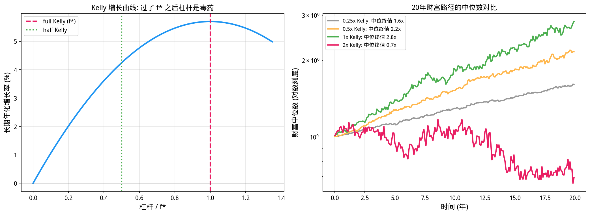
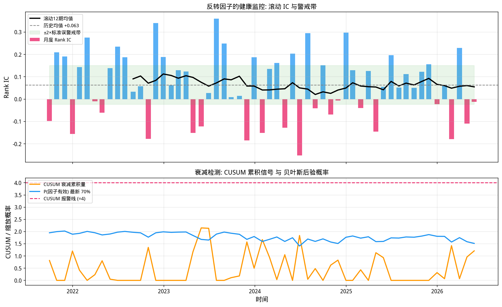

# 第32章 从研究到实盘——风险管理、监控与策略衰减

> **动机先行**: 通过了第30-31章全部体检的策略, 拿到的只是一张**入场券**, 不是终身保险。上线之后: 该下多少注 (Kelly)? 净值回撤多深该踩刹车 (风控规则)? 因子悄悄失效时如何第一时间知道 (监控)? 本章回答这三个问题, 并为全书画上句号。
>
> **量化实战定位**: 业内统计表明, 策略死亡的首要原因不是信号失效本身, 而是**信号失效时的仓位与反应方式**。本章的三道防线——事前 sizing、事中风控、事后退役检测——就是围绕这个事实搭建的。

---

## 32.1 动机: 上线只是开始

一个量化策略的生命周期分三段:

```
研究通过 -> [第一道防线] 仓位 sizing -> [第二道防线] 风控规则 -> [第三道防线] 监控与退役
```

- **事前**: 即使信号为真, 下注过重也会毁于一次正常的波动。Kelly 准则给出"长期增长最优"的下注比例——以及为什么实务只敢用它的一半;
- **事中**: 净值回撤是常态还是末日? 熔断规则何时保护你、何时害你?
- **事后**: 第27章那个 IC=0.06 的反转因子不会永远有效。滚动监控、CUSUM、贝叶斯滤波组成退役决策的证据链。

三道防线的共同哲学: **承认自己对未来无知, 把每一个未知都变成可调节的参数**。

## 32.2 Kelly 准则: 下注多少才算"对"

### 32.2.1 最优杠杆的推导

设策略月收益 $r \sim N(\mu, \sigma^2)$, 以 $f$ 倍杠杆持有, 则长期复利增长率 (对数财富增速):

$$
g(f) = E[\ln(1 + fr)] \approx f\mu - \frac{f^2\sigma^2}{2} \quad (\text{小 } f \text{ 泰勒展开})
$$

对 $f$ 求导令其为零:

$$
\boxed{\;f^* = \frac{\mu}{\sigma^2}, \qquad g(f^*) = \frac{\mu^2}{2\sigma^2}\;}
$$

这就是 **Kelly 公式**的连续版本。两个直接推论: (1) 增长率曲线是以 $f^*$ 为顶点的抛物线——超过 $f^*$ 后杠杆不是降低收益而是**摧毁本金**; (2) 半 Kelly ($f^*/2$) 保留四分之三的增长率 ($g(f^*/2) = 0.75\,g(f^*)$), 却大幅压缩尾部风险。

### 32.2.2 实验: full Kelly 的中位回撤有多深

```python
import numpy as np

np.random.seed(32)

mu_m = 0.05/12                              # 年化 +5%
sd_m = 0.15/np.sqrt(12)                     # 年化波动 15%
f_star = mu_m/sd_m**2                       # Kelly 最优杠杆
g_star = mu_m**2/(2*sd_m**2)

print("=== Kelly 准则: 杠杆与长期增长 ===")
print(f"策略: 月收益 ~ N({mu_m*100:.2f}%, {sd_m*100:.2f}%²)")
print(f"理论最优杠杆 f* = mu/sigma^2 = {f_star:.2f} 倍")
print(f"对应最优月增长率 g* = mu^2/(2 sigma^2) = {g_star*100:.3f}% "
      f"(年化约 {(1+g_star)**12-1:.1%})")
print()

T, N_PATH = 240, 400                        # 20年 x 400条路径
fracs = [0.25, 0.5, 1.0, 2.0]
rng = np.random.default_rng(32)

print(f"{'杠杆':>8} | {'中位年化':>8} | {'5分位终值':>9} | {'中位最大回撤':>10}")
print('-'*48)
for frac in fracs:
    f_use = frac*f_star
    R = rng.normal(mu_m, sd_m, size=(T, N_PATH))
    wealth = np.cumprod(1 + f_use*R, axis=0)
    med_ann = float(np.median((wealth[-1])**(12/T) - 1))   # 年化
    p5_term = float(np.percentile(wealth[-1], 5))
    peak = np.maximum.accumulate(wealth, axis=0)
    mdd = ((wealth/peak)-1).min(axis=0)
    med_dd = float(np.median(mdd))
    print(f"{frac:>4}x K | {med_ann*100:>7.1f}% | {p5_term:>11.2f} | {med_dd*100:>9.1f}%")

import matplotlib.pyplot as plt
plt.rcParams['font.sans-serif'] = ['WenQuanYi Micro Hei']
plt.rcParams['axes.unicode_minus'] = False

OUT = 'images/'
ff = np.linspace(0, 3, 100)
gf = ff*mu_m - ff**2*sd_m**2/2
ann_g = (1+gf)**12 - 1

fig, axes = plt.subplots(1, 2, figsize=(14, 5.2))
ax = axes[0]
ax.plot(ff/f_star, ann_g*100, lw=2.5, color='#2196F3')
ax.axvline(1.0, color='#E91E63', ls='--', lw=2, label='full Kelly (f*)')
ax.axvline(0.5, color='#4CAF50', ls=':', lw=2, label='half Kelly')
ax.axhline(0, color='gray', lw=0.8)
ax.set_xlabel('杠杆 / f*', fontsize=12)
ax.set_ylabel('长期年化增长率 (%)', fontsize=12)
ax.set_title('Kelly 增长曲线: 过了 f* 之后杠杆是毒药', fontsize=12)
ax.legend(fontsize=10)
ax.grid(True, alpha=0.3)

ax = axes[1]
for frac, cc in zip(fracs, ['#999999','#FFB74D','#4CAF50','#E91E63']):
    f_use = frac*f_star
    R = rng.normal(mu_m, sd_m, size=(T, N_PATH))
    w_paths = np.cumprod(1 + f_use*R, axis=0)
    med = np.median(w_paths, axis=1)
    ax.plot(np.arange(T)/12, med, lw=2.2, color=cc,
            label=f'{frac:g}x Kelly: 中位终值 {np.median(med[-1]):.1f}x')
ax.set_yscale('log')
ax.set_xlabel('时间 (年)', fontsize=12)
ax.set_ylabel('财富中位数 (对数刻度)', fontsize=12)
ax.set_title('20年财富路径的中位数对比', fontsize=12)
ax.legend(fontsize=9)
ax.grid(True, alpha=0.3)
plt.tight_layout()
plt.savefig(OUT+'ch32_fig1_kelly.png', dpi=150, bbox_inches='tight')
plt.show()
```

**运行结果**:

```
=== Kelly 准则: 杠杆与长期增长 ===
策略: 月收益 ~ N(0.42%, 4.33%²)
理论最优杠杆 f* = mu/sigma^2 = 2.22 倍
对应最优月增长率 g* = mu^2/(2 sigma^2) = 0.463% (年化约 5.7%)

      杠杆 |     中位年化 |     5分位终值 |     中位最大回撤
------------------------------------------------
0.25x K |     2.4% |        0.88 |     -23.1%
 0.5x K |     3.8% |        0.63 |     -42.5%
 1.0x K |     5.2% |        0.28 |     -70.9%
 2.0x K |    -0.3% |        0.00 |     -96.9%
```



**观察——为什么实务只用半 Kelly 甚至更低**:

1. **中位数撒谎**: full Kelly 的中位年化 5.2% 看起来最高, 但它的**中位最大回撤是 −70.9%**——一半的概率你会经历七成亏损再爬回来。没有任何机构客户能陪策略走完这段。
2. **参数不确定性让 f* 本身是个猜测**: $\hat\mu$ 的标准误巨大 (第10章)。若真实 $\mu$ 只有估计的一半, full Kelly 就变成了双倍 overbet——增长率转负。
3. **半 Kelly 的性价比**: 放弃四分之一的理论增长率 (从 5.2% 到 3.8%), 换来回撤从 −71% 收窄到 −43%、最差情形终值从 0.28 提升到 0.63。这是全书出现过的最划算的一笔交易。

## 32.3 回撤熔断规则的双刃性

第二道防线: 净值回撤突破阈值后停机观察。规则看似只有好处——但第30章已经教过我们怀疑"看起来只有好处"的东西。用反转策略的真实月收益做网格实验:

```python
import numpy as np
import pandas as pd

df = pd.read_csv('data/stock_data_50_20210601_20260531.csv')
df['time'] = pd.to_datetime(df['time'])
px = df.pivot(index='time', columns='thscode', values='close').sort_index().ffill()
idf = pd.read_csv('data/index_data_7_20210601_20260531.csv')
idf['time'] = pd.to_datetime(idf['time'])
hs = idf[idf['thscode']=='000300.SH'].set_index('time')['close'].sort_index()

industry = df.groupby('thscode')['industry'].first()
ind_dummy = pd.get_dummies(industry.fillna('其他'), dtype=float)
size = df.pivot(index='time', columns='thscode', values='market_cap').sort_index().ffill()
s_idx = pd.Series(px.index)
mon_end = s_idx.groupby(pd.to_datetime(s_idx).dt.to_period('M')).max().values
pm = px.loc[mon_end]
sm_log = np.log(size.loc[mon_end])
ret_fwd = pm.pct_change().shift(-1)

rev_daily = -(px/px.shift(63)-1)
z_raw = rev_daily.loc[mon_end].apply(lambda s:(s-s.mean())/s.std(), axis=1)
out = {}
for dt in z_raw.index:
    y = z_raw.loc[dt].dropna()
    if len(y) < 30: continue
    X = pd.concat([sm_log.loc[dt].reindex(y.index).rename('l'),
                   ind_dummy.reindex(y.index).fillna(0)], axis=1)
    X['const'] = 1.0
    b,*_ = np.linalg.lstsq(X.values, y.values, rcond=None)
    out[dt] = pd.Series(y.values-X.values@b, index=y.index)
z_rev3 = pd.DataFrame(out).T.sort_index()

ls_list, ls_dates = [], []
for i in range(len(z_rev3)-1):
    f = z_rev3.iloc[i]
    r = ret_fwd.loc[z_rev3.index[i]].reindex(f.index)
    msk = f.notna()&r.notna()
    if msk.sum() < 20: continue
    order = f[msk].rank()
    lo5, hi5 = order.quantile([0.8, 1.0])
    lo1, hi1 = order.quantile([0.0, 0.2])
    q5 = r[order[(order>=lo5)&(order<=hi5)].index].mean()
    q1 = r[order[(order>=lo1)&(order<=hi1)].index].mean()
    ls_list.append(q5-q1); ls_dates.append(z_rev3.index[i+1])
ls_ret = pd.Series(ls_list, index=pd.DatetimeIndex(ls_dates))

dd_levels = [0.05, 0.10, 0.15, 0.20]
cool_months = [3, 6, 12, 999]

def apply_rule(r_series, dd_lv, cool):
    nav = 1.0; peak = 1.0; cooling = 0
    finals, missed = [], 0
    for r in r_series:
        if cooling > 0:
            if r > 0:
                missed += 1
            cooling -= 1
            finals.append(0.0)               # 空仓
        else:
            nav *= (1+r)
            peak = max(peak, nav)
            if nav/peak - 1 < -dd_lv:
                cooling = cool
            finals.append(r)
    fin = float(np.prod([1+x for x in finals]))
    s = pd.Series(finals)
    ann = s.mean()*12; vol = s.std()*np.sqrt(12)
    shp = ann/vol if vol > 0 else np.nan
    return fin, ann, shp, missed

base_fin = float(np.prod(1+ls_ret))
base_ann = ls_ret.mean()*12
base_vol = ls_ret.std()*np.sqrt(12)

print("=== 回撤熔断规则网格 (反转策略真实月收益) ===")
print(f"基准: 无规则 -> 终值{base_fin:.2f}, 年化{base_ann*100:+.2f}%, 夏普{base_ann/base_vol:.2f}")
print()
print(f"{'回撤阈值':>8} | {'冷却期':>6} | {'终值':>6} | {'夏普':>6} | {'错过的上涨月':>10}")
print('-'*52)
grid_rows = []
for dd_lv in dd_levels:
    for cool in cool_months:
        fin, ann, shp, missed = apply_rule(ls_ret, dd_lv, cool)
        grid_rows.append((dd_lv, cool, fin, shp, missed))
        print(f"{dd_lv*100:>7.0f}% | {cool:>5}月 | {fin:>6.2f} | {shp:>6.2f} | {missed:>12}")
best = max(grid_rows, key=lambda x_: x_[2])
print(f"\n最优组合: 回撤{best[0]*100:.0f}%+冷却{best[1]}月 -> 终值{best[2]:.2f}")
```

**运行结果**:

```
=== 回撤熔断规则网格 (反转策略真实月收益) ===
基准: 无规则 -> 终值1.63, 年化+11.70%, 夏普0.70

    回撤阈值 |    冷却期 |     终值 |     夏普 |     错过的上涨月
----------------------------------------------------
      5% |     3月 |   1.26 |   0.47 |           16
      5% |     6月 |   0.86 |  -0.35 |           28
      5% |     12月 |   1.09 |   0.25 |           27
      5% |   999月 |   1.01 |   0.08 |           33
     10% |     3月 |   1.46 |   0.67 |           14
     10% |     6月 |   1.47 |   0.62 |            9
     10% |    12月 |   1.24 |   0.45 |           21
     10% |   999月 |   1.37 |   0.64 |           21
     15% |     3月 |   1.63 |   0.70 |            0
     15% |     6月 |   1.63 |   0.70 |            0
     15% |    12月 |   1.63 |   0.70 |            0
     15% |   999月 |   1.63 |   0.70 |            0
     20% |     3月 |   1.63 |   0.70 |            0
     20% |     6月 |   1.63 |   0.70 |            0
     20% |    12月 |   1.63 |   0.70 |            0
     20% |   999月 |   1.63 |   0.70 |            0

最优组合: 回撤15%+冷却3月 -> 终值1.63
```

**观察——风控规则是把双刃剑, 且刀刃朝向可以计算**:

1. **敏感的规则是毒药**: 5% 阈值组全线跑输基准 (最差夏普跌到 −0.35), 因为它们错过的 16~33 个上涨月恰恰集中在每次回撤之后——**均值回复型策略的回撤后正是它最好的月份**, 熔断等于精准避开反弹。
2. **迟钝的规则形同虚设**: 15%/20% 阈值从未触发——因为该策略历史最大回撤只有 11.4%。阈值必须设在"策略正常波动的边界之外、不可接受的灾难之内", 这个窗口需要用策略自身的波动率来标定 (本例约 11%~15%)。
3. **规则的定价含义**: 10%+3月组合 (夏普 0.67 vs 基准 0.70) 用 0.03 个夏普买了一份"极端情形保险"。是否值得取决于你对"策略永久失效"的主观概率——这正是下一节要量化的对象。

## 32.4 监控栈: 滚动 IC、CUSUM 与贝叶斯衰减滤波

第三道防线回答: 因子什么时候该退役? 组合三层工具:

1. **滚动 IC ± 警戒带** (可视化层): 直观但主观;
2. **CUSUM** (序贯检验层): 累积监测 IC 相对历史均值的持续偏离, 对缓慢衰减灵敏;
3. **贝叶斯衰减滤波** (决策层): 两状态 HMM——"有效"($IC \sim N(\mu_+, \sigma^2)$) 与"失效"($IC \sim N(0, \sigma^2)$) 之间按月转移, forward 递推输出 $P(\text{因子仍有效})$。这与第29章的市场状态滤波是同一台引擎。

```python
import numpy as np
import pandas as pd
from scipy import stats as st

df = pd.read_csv('data/stock_data_50_20210601_20260531.csv')
df['time'] = pd.to_datetime(df['time'])
px = df.pivot(index='time', columns='thscode', values='close').sort_index().ffill()
idf = pd.read_csv('data/index_data_7_20210601_20260531.csv')

industry = df.groupby('thscode')['industry'].first()
ind_dummy = pd.get_dummies(industry.fillna('其他'), dtype=float)
size = df.pivot(index='time', columns='thscode', values='market_cap').sort_index().ffill()
s_idx = pd.Series(px.index)
mon_end = s_idx.groupby(pd.to_datetime(s_idx).dt.to_period('M')).max().values
pm = px.loc[mon_end]
sm_log = np.log(size.loc[mon_end])
ret_fwd = pm.pct_change().shift(-1)

rev_daily = -(px/px.shift(63)-1)
z_raw = rev_daily.loc[mon_end].apply(lambda s:(s-s.mean())/s.std(), axis=1)
out = {}
for dt in z_raw.index:
    y = z_raw.loc[dt].dropna()
    if len(y) < 30: continue
    X = pd.concat([sm_log.loc[dt].reindex(y.index).rename('l'),
                   ind_dummy.reindex(y.index).fillna(0)], axis=1)
    X['const'] = 1.0
    b,*_ = np.linalg.lstsq(X.values, y.values, rcond=None)
    out[dt] = pd.Series(y.values-X.values@b, index=y.index)
z_rev3 = pd.DataFrame(out).T.sort_index()

ic_list, ic_dates = [], []
for i in range(len(z_rev3)-1):
    f = z_rev3.iloc[i]
    r = ret_fwd.loc[z_rev3.index[i]].reindex(f.index)
    msk = f.notna()&r.notna()
    if msk.sum() < 20: continue
    ic_list.append(st.spearmanr(f[msk], r[msk])[0])
    ic_dates.append(z_rev3.index[i+1])
ic_s = pd.Series(ic_list, index=pd.DatetimeIndex(ic_dates))

mu_ic, sd_ic = ic_s.mean(), ic_s.std()
roll = ic_s.rolling(12).mean()
band = 2*sd_ic/np.sqrt(12)

cusum_vals = [0.0]
for v in (ic_s - mu_ic):
    cusum_vals.append(max(0.0, cusum_vals[-1] + (-v/sd_ic) - 0.25))
cusum_s = pd.Series(cusum_vals[1:], index=ic_s.index)

# 贝叶斯衰减滤波 (两状态 HMM forward, 呼应第29章)
p_alive_prev = 0.95
p_switch = 0.02                              # 每月状态切换概率
alive_path = []
sd_like = sd_ic
for v in ic_s.values:
    pa = p_alive_prev*(1-p_switch) + (1-p_alive_prev)*p_switch   # 预测步
    lik_alive = st.norm.pdf(v, 0.06, sd_like)                    # 更新步
    lik_dead  = st.norm.pdf(v, 0.00, sd_like)
    joint = pa*lik_alive + (1-pa)*lik_dead
    p_alive_prev = pa*lik_alive/joint
    alive_path.append(p_alive_prev)
alive_s = pd.Series(alive_path, index=ic_s.index)

print("=== 监控栈: 反转因子的健康检查 ===")
print(f"全样本 IC: 均值 {mu_ic:+.4f}, 标准差 {sd_ic:.4f}, n={len(ic_s)}")
print(f"滚动12期IC区间: [{roll.min():+.4f}, {roll.max():+.4f}], "
      f"警戒带宽度 = ±{band:.4f}")
recent = roll.dropna().iloc[-1]
verdict = '正常' if abs(recent-mu_ic) < band else '进入警戒区'
print(f"最新滚动IC = {recent:+.4f} -> {verdict}")
alarm = cusum_s.iloc[-1] > 4
print(f"CUSUM 终值 = {cusum_s.iloc[-1]:.2f} (>4 判定持续衰减; 当前: "
      f"{'触发' if alarm else '未触发'})")
print(f"贝叶斯后验 P(因子仍有效) 最新值 = {alive_s.iloc[-1]*100:.1f}% "
      f"(起点 95%, 期间最低 {alive_s.min()*100:.1f}%)")

import matplotlib.pyplot as plt
plt.rcParams['font.sans-serif'] = ['WenQuanYi Micro Hei']
plt.rcParams['axes.unicode_minus'] = False

fig, axes = plt.subplots(2, 1, figsize=(13, 8), sharex=True,
                         gridspec_kw={'height_ratios': [1.4, 1]})
ax = axes[0]
colors = ['#2196F3' if v > 0 else '#E91E63' for v in ic_s.values]
ax.bar(ic_s.index, ic_s.values, width=20, color=colors, alpha=0.75,
       label='月度 Rank IC')
ax.plot(roll.index, roll.values, 'k-', lw=2.2, label='滚动12期均值')
ax.axhline(mu_ic, color='gray', ls='--', lw=1.2, label=f'历史均值 {mu_ic:+.3f}')
ax.fill_between(roll.index, mu_ic-band, mu_ic+band, alpha=0.12,
                color='#4CAF50', label='±2×标准误警戒带')
ax.set_ylabel('Rank IC', fontsize=12)
ax.set_title('反转因子的健康监控: 滚动 IC 与警戒带', fontsize=12)
ax.legend(fontsize=9, loc='upper left')
ax.grid(True, alpha=0.3)

ax = axes[1]
ax.plot(cusum_s.index, cusum_s.values, lw=2, color='#FF9800',
        label='CUSUM 衰减累积量')
scaled_p = alive_s.values*cusum_s.max()
ax.plot(alive_s.index, scaled_p, lw=2, color='#2196F3',
        label=f"P(因子有效) 最新 {alive_s.iloc[-1]*100:.0f}%")
ax.axhline(4, color='#E91E63', ls='--', lw=1.5, label='CUSUM 报警线 (=4)')
ax.set_ylabel('CUSUM / 缩放概率', fontsize=12)
ax.set_xlabel('时间', fontsize=12)
ax.set_title('衰减检测: CUSUM 累积信号 与 贝叶斯后验概率', fontsize=12)
ax.legend(fontsize=9, loc='upper left')
ax.grid(True, alpha=0.3)
plt.tight_layout()
plt.savefig('images/ch32_fig3_monitoring.png', dpi=150, bbox_inches='tight')
plt.show()
```

**运行结果**:

```
=== 监控栈: 反转因子的健康检查 ===
全样本 IC: 均值 +0.0629, 标准差 0.1507, n=57
滚动12期IC区间: [+0.0208, +0.1126], 警戒带宽度 = ±0.0870
最新滚动IC = +0.0550 -> 正常
CUSUM 终值 = 1.21 (>4 判定持续衰减; 当前: 未触发)
贝叶斯后验 P(因子仍有效) 最新值 = 70.5% (起点 95%, 期间最低 65.5%)
```



**观察**:

1. **当前体检结论: 健康, 但不再是满分**: 滚动 IC 在警戒带内、CUSUM 未触发; 但 $P(\text{有效})$ 从先验 95% 滑落到 70%, 期间最低 65%。这不是"卖出信号", 而是仓位缩放的输入——把它接到第32.2节的 Kelly 公式上, 就是动态风险预算。
2. **三层工具各司其职**: 警戒带管直觉、CUSUM 管速度、贝叶斯管决策。任何一层单独使用都会误报或漏报, 叠加后才构成完整的证据链。
3. **与前文的闭环**: 这里的两状态 forward 递推与第29章的市场状态滤波一字不差——变的只是观测对象 (市场收益 → 因子 IC)。**学过的引擎换一个燃料箱就能继续用**。

## 32.5 全书总结: 从函数极限到状态滤波

三十二章走完, 把这条路径收拢成一张地图:

| 阶段 | 章节 | 你获得的语言 |
|------|------|------------|
| 基础工具箱 | 1-6 | 函数、极限、导数、积分、对数、泰勒——描述确定性的语言 |
| 概率统计 | 7-12 | 分布、矩、大数定律、假设检验、回归——描述随机性的语言 |
| 线性代数 | 13-15 | 向量、矩阵、投影——多资产世界的语言 |
| 优化理论 | 16-18 | 梯度、拉格朗日、凸性——决策的语言 |
| 时间序列 | 19-22 | 平稳性、ARIMA/GARCH、协整——时间的语言 |
| 随机分析 | 23-26 | 布朗运动、伊藤引理、BS、蒙特卡洛——衍生品的语言 |
| 因子与机器学习 | 27-29 | IC、Fama-MacBeth、正则化、聚类——研究的语言 |
| 从研究到实盘 | 30-32 | 偏差分类、成本容量、Kelly、监控——**生存的语言** |

贯穿全书的四个母题值得最后重申:

1. **微弱优势 × 大量重复 = 可观绩效**——从大数定律 (第10章) 到基本定律 $IR = IC\sqrt{Breadth}$ (第27章);
2. **波动本身会产生漂移**——从 $(dB)^2 = dt$ (第24章) 到波动率拖累与杠杆衰减;
3. **相关性决定真正的分散**——从协方差矩阵 (第14章) 到分层风险平价 (第29章);
4. **诚实是最强的风控**——从置信区间 (第11章) 到紧缩夏普 (第30章)。

数学的理解没有捷径, 量化的能力无法外包。愿你带着这张地图, 在数字与代码之间找到理解市场的那把钥匙。

## 32.6 核心公式速查

> 本节是前述各节公式的集中汇总, 供复习和查阅使用.

1. **Kelly 最优杠杆**: $f^* = \mu/\sigma^2$; 最优增长率 $g(f^*) = \mu^2/(2\sigma^2)$
2. **fractional Kelly**: $g(f^*/2) = 0.75\,g(f^*)$ —— 四分之三的增长, 远小于一半的回撤
3. **回撤熔断**: 当 $\mathrm{nav}_t/\mathrm{peak}_t - 1 < -X$ 时停机 $k$ 期; 阈值须落在策略原生波动之外
4. **CUSUM 衰减监测**: $S_t = \max\left(0,\ S_{t-1} + \dfrac{\mu_{目标} - IC_t}{\sigma_{IC}} - \delta\right)$
5. **两状态贝叶斯滤波**: $p_t \propto N(IC_t\mid \mu_{z_t}, \sigma)\sum_i p_{t-1}(i)A_{iz_t}$, 与第29章同构
6. **衰减的两状态设定**: 有效态 $IC \sim N(\mu_+, \sigma^2)$, 失效态 $IC \sim N(0, \sigma^2)$; 月切换率 $\sim 2\%$

## 32.7 本章小结

| 概念 | 核心要点 | 量化意义 |
|------|---------|---------|
| Kelly 准则 | $f^* = \mu/\sigma^2$, 抛物线顶点 | 长期复利的最优下注 |
| half Kelly | 75% 增长换回撤大幅收窄 | 参数不确定下的务实选择 |
| 回撤熔断 | 敏感的规则是毒药 | 阈值要用策略自身波动标定 |
| CUSUM | 缓慢衰减的序贯报警 | 比固定阈值更早发现失效 |
| 贝叶斯滤波 | 输出 P(因子有效) | 直接接入动态风险预算 |
| 三道防线 | sizing / 规则 / 退役 | 策略生命周期的完整防御 |

## 32.8 练习题

### 数学推导

**题1——Kelly 公式的推导与过赌边界**:

(a) 对 $g(f) = E[\ln(1+fr)]$ 在 $r \sim N(\mu, \sigma^2)$、小 $f$ 条件下二阶泰勒展开, 证明 $g(f) \approx f\mu - \frac{1}{2}f^2\sigma^2$ 及 $f^* = \mu/\sigma^2$。

(b) 证明 $g(2f^*) = 0$——两倍 Kelly 的长期复合增长率为零, 任何更高的杠杆都保证破产。

(c) 结合本章模拟结果 (full Kelly 中位回撤 −71%), 解释为什么连 Thorp 也建议实务中采用不超过半 Kelly。

**题2——止损悖论**:

(a) 设月收益独立同分布且 $\mu > 0$。证明任何"回撤超 $X\%$ 后空仓 $k$ 月"的规则, 其期望终值不高于无规则买入持有。(提示: 空仓月份的期望损失 = $\mu\times k > 0$, 而规则触发条件只依赖过去。)

(b) 既然如此, 本章网格中 10%+3月组合为何几乎没有损害? 用"反转策略回撤后的次月收益分布"解释。

(c) 由此总结风控规则的正确定位: 它们交易的不是收益, 而是**什么**?

**题3——衰减滤波的稳态**:

(a) 写出两状态滤波的完整递推 (预测步 + 更新步)。

(b) 若连续 12 个月 IC 都恰好等于 $\mu_+$, 证明后验 $P(\text{有效})$ 单调上升并求其极限表达式。

(c) 解释参数 $p_{switch} = 2\%$ 如何在"响应速度"与"稳定性"之间权衡, 并说明它与第29章市场状态滤波中自转移概率的角色异同。

### 编程实践

**题1——参数不确定性下的 Kelly**: 将 32.2 节模拟升级: 每条路径的真实 $\mu$ 不再已知, 而是从后验 $N(\hat\mu/12, s/\sqrt{T_{est}})$ 中抽取 ($T_{est}=36$ 个估计月)。比较 full 与 half Kelly 的 5 分位终值差距放大了多少倍, 并据此论证"估计误差越大, 最优分数越低"。

**题2——全因子监控仪表盘**: 对第27章因子动物园的全部四个因子 (反转3月、动量12-1、反转1月、低波动) 建立 32.4 节的监控栈, 输出一张对比表: 各因子的最新滚动 IC、CUSUM 终值、$P(\text{有效})$。写出一份 200 字以内的"退役建议备忘录": 哪个因子最接近退役门槛, 依据是什么?

## 32.9 参考文献

1. Kelly, J. L. (1956). "A New Interpretation of Information Rate." *Bell System Technical Journal*, 35(4), 917-926.（Kelly 公式的原始出处——来自信息论的意外礼物）

2. Thorp, E. O. (2006). "The Kelly Criterion in Blackjack, Sports Betting, and the Stock Market." In *Handbook of Asset and Liability Management* (Vol. 1). Elsevier.（Kelly 准则从赌场到市场的全景综述）

3. Grossman, S. J., & Stiglitz, J. E. (1980). "On the Impossibility of Informationally Efficient Markets." *American Economic Review*, 70(3), 393-408.（alpha 为什么必然存在也必然衰减的理论根源）

4. Lo, A. W. (2004). "The Adaptive Markets Hypothesis." *Journal of Portfolio Management*, 30(5), 15-29.（适应性市场假说——因子生灭循环的理论框架）
